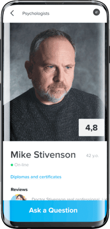
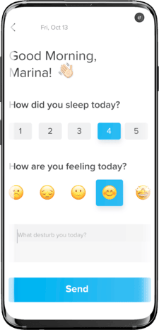

We all know that public health measures taken a couple years back, like self-isolation and quarantine, are necessary to protect the health of the population, but doctors warn they may have a profound and long-lasting effect on mental health. More than that, the COVID-19 has been proven to affect existing mental disorders by aggravating their manifestation! So what can be done to diminish the sense of fear and anxiety in the wake of another wave of the pandemic?

For those who are under quarantine and suffer from mental disorders, getting timely access to a psychologist or a psychiatrist may not always be easy. This is especially true when some people prefer to keep their suffering to themselves. That’s when mental health apps come vitally important, and a <a href="https://anadea.info/solutions/medical-app-development" target="_blank">medical software developer</a> plays a certain role here too.

No wonder the number of mobile health tracking apps has skyrocketed during the COVID-19 pandemic a while ago. Mental health apps do not replace psychiatric treatment. Instead, they help patients better manage their own symptoms, schedule a session with a therapist, or reach out for help in times of need. So if your mental health startup is determined to make a difference in the mental health niche, then it’s important to understand what mental health apps tick, both for the patient and for the therapist.

## The Importance and Place of Mental Health
Decades ago, the mental state of a person was frequently neglected. What could not be seen was often thought inexistent. It’s now a known thing that one’s psychological state affects all spheres of life, including somatic health, and still, even today people often turn down counseling out of fear of seeming sick. In diagnostics of various diseases, psychological state and recent changes in life of a person are considered by doctors among other factors adding to the clinical picture.

Speaking of such changes, an apparent example of a condition that affected many people is the COVID-19 outbreak. While the lockdown and all that it brings. While the lockdown is no longer in place in many countries, certain restrictions remain until now, and the aftermath of COVID-19 when it comes to mental health will remain for many if not years. By psychological impact of COVID-19, we mean depression, anger, stress, mood irritability and emotional disturbance. Does it sound familiar? We bet.

Even if mental health is not touching on physical wellbeing, it undoubtedly influences one’s performance, concentration, and decision making. So most medical specialists agree on the importance of mental health in life.

## Are Mental Health Apps Effective?
Studies<a href="https://www.ncbi.nlm.nih.gov/pmc/articles/PMC7461952/" target="_blank" rel="nofollow"> say</a> that mental health apps help access treatment and lessen the burden on primary health care. Over 5.2 billion people worldwide own a smartphone, so not surprising that when the COVID-19 situation rapidly worsened, downloads of mental health apps accelerated. Around the world, both authorities and people are turning to apps and other digital options to cope with the trauma of COVID-19.

## Types of Solutions for Mental Health
Most mental health app ideas can be divided into these categories.

### General Mental Health Apps
Embracing the widest possible audience, apps for general mental health control are designed to track mood, control emotions, and teach users relaxation techniques. Such apps may combine traits of the types of apps below in various proportions. These can be:
* Anxiety management apps
* Apps for meditation and breathing techniques
* Positive affirmations apps
* Therapy journals
* Sleep trackers
* Trigger checkers

### Education apps
Apps for educating in the field of mental health are all about providing information for students in medicine and psychology or simply enthusiasts. Materials provided in such apps can be written in many ways - from encyclopedic to entertaining with one common purpose: provide valuable information for everyone interested. A great many apps offering psychological tests and analyses also fall into this category.

### Dedicated Mental Health Apps
Apps tailored to people suffering from a particular disease: depression, schizophrenia, post-traumatic stress syndrome, attention deficit and hyperactivity disorder, eating disorder, obsessive-compulsive disorder, etc. They contain working exercises and best practices from psychotherapists, as well as allow people to learn more about their condition.

### Self-improvement Apps
Habit trackers are widely used, and self-improvement apps are pretty similar to them. Tools for setting useful behavior habits (behavior health app) and psychological hygiene give advice on emotional control, audio tracks for relaxation, and breathing techniques. In this kind of app, gamification features are frequently used to encourage users to continue their journey towards better selves.

### Peer Connection Apps
Peer connection tools are intended to build a community around certain conditions, in which people can share experiences and advice with each other. Sometimes, support from someone who shares one’s hard times is just as important as professional treatment.

### Treatment Monitoring Apps
Assistants to clinical treatment to mental conditions, treatment monitoring journals are not substitutes for the actual therapy but crutches that help patients stand firmly on the ground while changes in their life are happening. An app for therapy monitoring, or mental health tracker app, includes important milestones, making positive changes more evident for the patient. It’s always better to have the results of hard work in front of the eyes - otherwise, the patient may have their motivation diminished.

## What Do Mental Health Apps Do?

Bereavement, isolation, loss of income and fear are triggering mental health conditions or worsening existing ones. Many people are facing increased levels of alcohol and drug use, insomnia, and anxiety. So what a mental health care app does to help?

- Patients can self-manage and monitor their mental health condition
- Patients can use the app for cognition improvement, which is especially important for elderly
- Social and coping skills improvement for people who suffer alone
- <a href="https://anadea.info/projects/connect">Communication skills improvement and building relationships</a>
- Therapists can make treatment more efficient with symptom tracking
- Therapies use apps for secure health data collection and reporting
- <a href="https://anadea.info/projects/my-ne">For the use of mental health professionals </a>to help their patients

Unlike many app categories, planning mental health solution features requires a good deal of preparation. Many good-quality apps will showcase their research into the functionality featuring mental health practitioners and other medical professionals. Your responsible mental health app developer should be able to help you collect the evidence supporting your app features.

Depending on the direction you want to take with the development of your brand-new mental health app, you should prioritize certain functions. Below there are the most important ones you should consider.

## What the Patient Needs - Feature List

### Emergency Contact
During the lockdown, quick response from the healthcare provider can mean a difference between life and death. That’s why video calls between patients and therapists should also have an emergency option. Make sure that the video calling option is easy to find so that the user doesn’t undergo additional stress to get in touch with help.

### Ways to Monitor and Record Symptoms
Effortlessly tracking the treatment progress using charts or other metrics will be a great help for therapists. Besides, journaling has shown to have anxiety-relieving properties.

### Ways to Connect to the Community
Being isolated during the lockdown is tough for anyone, and especially for people with underlying mental health issues. When patients can share and connect with others, it helps them regain serenity.

### Immediate Communication
And this one is different from the previous point. In some mental help apps (Woebot is a live example), you can come across AI-driven chatbots that allow people in need of immediate connection to have a sense they are not alone. A well-trained algorithm can handle quite complex conversations even on sensitive topics. Imagine that minimum human involvement can save a real human life.

### Personal Data Protection
With the advent of telehealth and virtual care, patients are very concerned about the security of their data. Your app should clearly state how personal data is protected, even after the patient deletes the account.

When designing the patient-facing side of the mental health application, it’s important to keep it discreet. The mental health app design and user interface should be neutral in tone and free from annoying popups, bright colors, or push notifications.

## The Mental Health App Therapist Wants - Feature List
If your app idea covers a narrower audience of therapists, here are points to consider.

### Easy to Use Dashboard
Therapists have enough on their plates these days, and the last thing they want is to tap endless menus to complete urgent issues that require their attention.

### Timely Notifications
Session reminders, incoming messages, appointment changes make therapist’s life easier. As a health-related app developer, you should make sure that all patient communication is secured and all sensitive information has been safeguarded.

### Convenient Payment Options
Equally important for all parties involved, payments should be both easy to make and compliant with insurance policies and online payment regulations.

### Smooth Contact with the Patient
Effortless communication with patients, including live chat, video and audio calls is absolutely essential. Make sure to include the area where the practitioner can inform the users about their working hours and emergency contact.

In the future, you may consider adding tests and questionnaires, self-education sections for the patient, as well as a journal both for the therapist and the patient.

## Benefits of Mental Health App
### Saves Users’ Money
The cost of a 50 minute counseling session varies from $50 to… there’s frankly no upper limit. Although mental health apps can’t be compared with individual therapy, they are more than able to support people with no extra money for counseling sessions. If there are no clinical diagnoses or serious conditions, the right use of mental help apps can ease someone’s difficulties with no overwhelming spendings on psychologists.

### Provides Anonymity
The ability to stay anonymous is essentially one of the greatest benefits of mental health apps. Not many people are ready to address their personal struggles even to an experienced therapist - in other words, to anyone but themselves. Even though the effectiveness of personal counseling is much higher than that of using health mobile apps, the latter can be the first step to a user’s journey towards self-improvement. The senses of confidence and security that make this journey continue are granted by anonymity.

### Treatment Anywhere in the World
Although many specialists agree that therapy is the most fruitful upon visits in person, the COVID-19 has made alterations in the way people receive psychological and psychiatric help too. With online consultations that already became a new standard in treatment, effective counseling through apps is not questionable anymore. Whenever the user is, they can practice what they need and learn necessary info on the go.



## How to Develop a Mental Health App?
Before developing a health app for mental care, here are the four basic steps to consider.

### Step 1. User-centric Design
From the app’s logo to onboarding and main screens, design helps to establish trust and credibility. Try to answer the following questions: how smooth is the onboarding process? Does it become immediately evident what users can do in the app?

### Step 2. Security
Customers will wonder about how well your app is protected, since their personal data will be at stake. What can be done outside HIPAA compliance to resolve this pain point? Easy to understand privacy policy is a starting point.

### Step 3. Multi-platform Support
Nowadays, a customer typically switches between at least two devices throughout the day. Ideally, your product should follow customers through on both of those platforms. For seamless user experience, hire a web and <a href="https://anadea.info/services/mobile-development" target="_blank">mobile application development company</a> with similar projects in portfolio.

### Step 4. Doctor-centric Backend
Keep in mind that therapists will use an app for communication with patients and they need a different solution to be able to see patients’ data and review their progress.

## How Long Does it Take to Build a Mental Health Care App?

The timing depends on the number of features you have in mind as well as the collaboration type with your team of developers. If you are launching together with a mental health institution, you should take into consideration the longer time required to achieve full compliance.
The scope of features and the choice of the platform for your app can make a difference. A mental health app for Android will have a different list of features compared to the app for mental health designed with Apple Watch in mind. But on average, you can expect an app to be ready in __8-12 weeks__.

## What to Pay Extra Attention to When Building a Health App
Any psychology practitioner is guided by ethical principles common for the whole professional community. These principles are aimed at protecting patients’ confidentiality and personal information. With specialized apps, it’s not different. Anonymity, one of the key mental health apps perks, is ensured by following certain conditions and legal guidelines.

### GDPR (or Similar) Compliance
A solution for mental health has to comply with regulations and directives like General Data Protection Regulation. This particular one is relevant to the EU and can be formulated differently in other countries. Such regulation explains the main principles of data protection that have to be followed by countries’ or state’s businesses and organizations. Those not complying with GDPR or similar regulations can face a huge fine from authorities that in severe cases can reach €20 million! You can audit compliance yourself by thoroughly analyzing the principles of the regulations applied or hire a specialist to conduct an audit for you.

### HIPAA Compliance
While GDPR covers all kinds of organizations operating user data, HIPAA, or the Health Insurance Portability and Accountability Act, as follows from its title, is applied exclusively to data of patients. According to this act, every entity having patient data at disposal has to protect it and ensure its security. The three principles of HIPAA are built upon the administrative aspect, physical security, and technical security of patients. For them, this act grants security of health information and prohibits its undesired disclosure. Just like with GDPR, violation of HIPAA in the US can lead to significant fines or even lawsuits. To avoid it, choose a mental health app development firm with relevant expertise and proficiency in cybersecurity.

### Clinical Basis
A professional point of view would be a great addition to the treasury of any health app development, including apps for mental health. For mental health apps, an input from a therapist via consultation on the app's contents is not obligatory but highly recommended as one of ways to gain trust of users. Mental health is still health, and health is an exact science, so make sure everything stated in the app is verified and in compliance with current medical certifications, such as ICD-10. Fact checking is a must-have if you want to increase users’ credibility.

## How Much Does it Cost to Develop a Mental Health Care App?
If you choose to operate under the Time and Materials model, then you pay for the hours spent developing your mobile application. The hourly rate greatly depends on the location of the developers. For example:

* In the __US__, app developers charge from $100 to $250 an hour.
* In __Australia__, the rates are slightly lower and range from $50 to $150.
* Developers in __Western Europe__ and the __UK__ provide their services at $50 to $200 per hour.
* __Eastern European__ developers charge $25 to $150 per hour.
* __Indian__ companies charge from $20 to $80 an hour.
* __Anadea rates start at $50 per hour.__

With the Time and Materials model, you enjoy the flexibility to make improvements to your app along the way. You can prioritize certain tasks for your developers and decide which features to postpone so that your mental health app goes to market sooner. The composition of team members involved is usually as follows:

* __Business Analyst__ to collect your requirements and recommend optimal solutions.
* __UX/UI Designer__ to create prototypes of all the app screens.
* __Frontend Developer(s)__ to turn designer’s prototypes into a functional interface.
* __Backend Developer(s)__ if your product suggests user data entry and communication through the app.
* __QA Engineer(s)__ to assure the app is bug-free and performs well.

On average, the development of an app for mental health from start to finish will cost around $65,000. Very often, an <a href="https://anadea.info/guides/what-is-mvp" target="_blank">MVP</a> costs much lower.

Below, see the approximate __scope of a mental health project__ for online counseling Anadea developed for one of our clients. The project had been in development for __10 weeks__.

### Patient
* __Authentication__ - Registration; login; logout; password reset.
* __Profile management__ - View and edit personal data; change password; delete an account.
* __Visiting therapy sessions__ - Fill in questionnaires on current mood; give estimates to different areas of life.

### Therapist
* __Authentication__ - Registration; login; logout; password reset.
* __Profile management__ - View and edit personal data; change password; delete an account; create ‘Clients’ and manage ‘Sessions’.
* __Calendar__ - Create a session schedule; manage daily, weekly, and monthly workloads.
* __Interview building__ - Create a questionnaire for patients; add custom questions.
* __Statistics__ - View clients’ progress over graphs based on their estimations.

## How Mental Health Apps Generate Revenue
In 2021, the mental wellness apps market was valued at $38.2 billion and has grown by 11.2% by 2022. What do these numbers come from and how do mental health apps make money?

### Subscription
Premium user plans, or paid subscriptions, are the most common monetization strategy for mental health applications. In 2022, the average cost of subscription in apps we see on Google Play is around $5/month. For a sum that equals the cost of one counseling session, users get a year-long experience with a well-designed mental wellness app.

An app like the one which scope is described above can charge a monthly fee from therapists while being free for users. This way, the app can be a platform for psychologists to promote their services and generate revenue.

### Paid Download
If charging money on a monthly basis is not the approach of your choice, try offering users one-time payment for downloading the app. Most apps charge not more than $4 for installation. For users, this is more appealing than subscription, and for you, it will probably result in a bigger number of downloads as people won’t feel obligated to pay every month.

### In-app Ads
Most commonly, ads in a mobile application are represented as banners in the side or bottom parts of the screen. Advertising can also be a part of a win-win exchange between the app and the user, when the latter is offered to try some functionality only available upon subscription for watching a 30-second video. It’s important that the amount of ads is moderate in order to not annoy users. We all know the consequences of it.

## Conclusion
Good mental health is absolutely fundamental to overall health and well-being. COVID-19 has interrupted essential mental health services around the world, but it’s never been a better time to invest more in life-saving mental health applications. If you overcome the concerns about the lack of privacy, misuse of personal data, and providing inappropriate advice, then your app will rightfully enjoy great success.

Request app development quote
