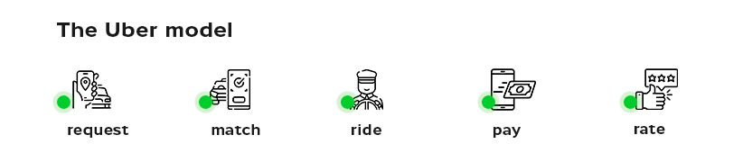
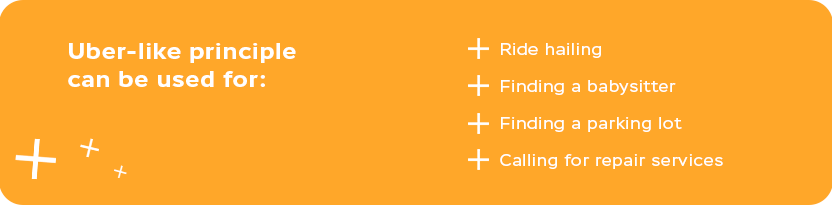

> How are all these people parking their cars in such crowded yards?.. They are practically over one another like sardines in a can.

This is not what we think, but is probably the way of thinking of many large cities’ residents. Over the years, people living fast-paced lives prefer using affordable taxis like Uber instead of buying their own car. For many citizens, it is simply more convenient than maintaining one and - horrors! - figuring out where to park it.

Launched in 2012, the Uber mobile app was a revolution in requesting rides out of the pocket. And in the past decade, people have gotten so used to the way it works that now we have what is called ‘Uber-like apps’, apps based on the __request-match-ride-pay-rate__ model. The app was such a breakthrough that the name Uber itself has become denominative: we say ‘call an Uber’ for going anywhere by taxi of any kind.

## How Much Does Uber App Make: Statistics
From 2012, the year born, Uber was steadily gathering pace in the market. Many competitors and apps alike emerged since then. Uber-like apps boomed like never before in 2019, right before the Coronavirus pandemic. That year, taxi app revenue in the US alone reached <a href="https://www.businessofapps.com/data/taxi-app-market/" rel="nofollow" target="_blank">$14.7 billion</a>. The subsequent year, the revenue was reduced by 3, and still, __the number of users has grown__ by several million. It suggests that the frequency of Uber-style apps use has declined but the demand for them remained high, meaning that you, with an idea to build your own app, have all chances to make an Uber-like app that will be competitive in the market.

## How Does the Uber App Work?
In a nutshell, the working principle of Uber and similar apps boils down to the above-mentioned request-match-ride-pay-rate model. To get from point A to point B, the rider (the user) takes these five steps:

1. __Request.__ The rider opens an app and specifies the location where the driver has to pick them up.

2. __Match.__ Out of all the nearby cars which drivers use the same app, the algorithm picks the nearest one and sends the user request to the driver who confirms it and goes where needed.

3. __Ride.__ When approval from the driver is granted, the rider sees the car description - model, color, license plate number - and the estimated time of arrival.

4. __Pay.__ The rider pays for the ride in cash or with a card. The latter is usually the one of choice as one of the main reasons people prefer Uber-like apps is to avoid cash-related fuss.

5. __Rate.__ Riders rate drivers and drivers rate riders in general or by several parameters: conversation, behavior, the safety of driving, cleanness of the interior.

No more phone calls or bumming a ride - apps like Uber require nothing but these quick steps.

Build an App Like Uber

## How to Make an App Like Uber: Features
There are two sides to every coin, so let’s assume Uber-like apps are coins too. There are different features to oversee in the course of your taxi booking app development.

### Features for Riders in Uber Like App Development
Essentially, the core features list for riders implies the five steps from above. In order to not repeat ourselves, here we list the ones not mentioned before.

#### Geolocation & Routing
Drivers accept or reject user requests based on their distance which is visible thanks to GPS. Once an order is confirmed by the driver, both parties can see the location of one another in real-time. For that, both have to allow sharing the information on their location by setting the necessary permission in the app.

Integrations of a side API like __Google Maps__ or __MapBox__ will provide accurate and up-to-date information on the fastest routes at the moment as well as road construction works in place. Uber and many similar apps use Google Maps’ one.

#### Payments
Give riders the opportunity to choose the convenient payment option - card or cash. Integrate your app with proven payment services for smooth transactions and ask QA engineers working on your Uber-like application to pay special attention to its financial aspect. Nothing is more irritating to users than money withdrawn twice or delayed returns, so make sure they won’t have such an experience with your app.

#### Registration & Profile
Most apps like Uber use the phone number and email for signing up. The first is mostly needed for security and connecting with riders if they are not online. The second is where receipts and promotions are sent. The original app, Uber, offers registration via Facebook and Google or email - with the phone number not going anywhere.

Once they sign up, allow users to fill in personal information like their name and default home and work addresses to choose from on the go. Some apps like Bolt allow uploading a profile picture.

#### Driver’s Profile
Driver’s name and profile picture are a must in any Uber-like app. The number of years of driving experience and driver’s rating indicating how other users were satisfied with their driving would be a plus. Finally, a picture will allow the rider to know the driver a bit better before getting in their car. This is particularly important for the rider's safety - we will get back to it later.

#### Safety Uber App Features
Taking measures to assure safe rides is not just a trend but a necessity, and we hope as few people as possible know it from experience. Rides with strangers, especially at night time, require extreme caution, and you, with an idea to build an app like Uber, need to provide users with maximum safety. For that, you can remind riders to send car data and trip details to their significant other. Uber has the __Trusted Contacts__ feature listing people to whom these data can be sent.

Next, what we’ve mentioned earlier, it is important that the rider gets to know the driver from their profile before they get in their car. That is where the driver’s name and profile information come in handy.

However, in the era of COVID-19 restrictions, masks complicate recognition in real life. For that, you can add a feature like in the original Uber that requests drivers to take selfies regularly to confirm their identity.

Last but not least is the __safety button__. To help riders receive immediate help in the case of emergency, implement an alert button with the number of local emergency services - these can be assigned automatically depending on the rider’s location.

#### Communication & Notifications
Provide sides with a chat to address immediate issues, like specifying the car location or notifying the driver about the rider being late. In the chat, it would be nice to have some standard answers like ‘Be there in a moment.’ When the driver is already waiting outside, there is really no need to take more of their time by typing those messages.

#### Ride Cost Estimation
Most taxi apps like Lyft and Uber have a ride cost estimation, a calculator that suggests the cost of the ride based on rush hours, demand, and the current weather before the rider gets in the car. And if there are multiple ride options like Standard, Premium, and Fastest, suggestions have to be provided for all. Building such an algorithm requires a team of experienced software developers.

#### Schedule a Ride in Advance
Users who manage their time thoroughly will appreciate the opportunity to schedule rides for a specific time, e.g. schedule a lift for 8 a.m., to save time in the morning when every second is worth gold.

#### Book a Ride for Other People
Enable users to order a taxi for other people with the ability to leave the number of those who take the car and pay for their ride (unless the ‘in cash’ payment option is selected). Make sure there is an option to leave the phone number of a person to be going by taxi.

#### Split a Fare
In case several people are taking the same car, simplify the payment procedure for them by enabling a fare split. For that, at the step of searching for available cars, the rider has to be asked whether they want to split the fare and indicate the number of people going together. All of the companions must have the same ride-hailing app installed on their devices to receive the fare split invitation and confirm it. Respectively, the rider has to receive notification if they are the ones to split the fare with.

#### Thoughtful Design
Make sure your app is usable and intuitive with all the necessary functions available at minimum taps. When you make an Uber ride app, it is essential that you make it as visual as it can be, with a graphic route display and accurate displacement animation.

Source: <a href="https://www.freepik.com/premium-vector/colored-city-map-digital-concept_5653192.htm#query=route%20map&position=28&from_view=search" rel="nofollow" target="_blank">freepik.com</a>

### Features for Drivers in an App Like Uber
From the drivers’ point of view, the list of features is getting less evident as most people only know driving services like Uber from the rider’s perspective. But still, there is something to talk about for drivers using the app.

#### Driver Report
For the safety of both riders and drivers, the original Uber app collects the driving information, including that of exceeding speed limits. If violations within a certain period of time - week, month, etc. - are way too frequent, the driver’s working position might be reviewed to minimize the risk of accidents.

#### Advanced Route Building
Enable the navigator used by drivers to indicate areas where the traffic is tight or construction works take place. Advanced route building suggests multiple routes to choose from and indicates the estimated ride duration depending on the above factors. Faster order completion allows you to earn more as drivers can take more orders.

#### Driver Destinations
Many people combine taxi driving with their primary full-time job, and you can simplify their work by giving them the opportunity to pick a direction and find passengers on the way over. This way, drivers will be able to pick up passengers on their way home or elsewhere with no need to go the opposite direction for every other rider.

#### Free Cancellation Within Set Time Limits
Your app is designed to make a profit, and there is nothing more harmful to making it than a waste of time. When passengers make drivers wait for them for too long, drivers miss other potential orders. That is why in most apps similar to Uber there is an option for free ride cancellation within a few minutes after the driver’s arrival. After these few minutes pass and the passenger still is not there, an additional fee is charged. This way, your business minimizes the risk of wasting time and profit.

#### Heat Maps
A heat map is a feature highlighting areas of specifically high demand on the driver’s map. Having activated the heat map, the driver will be able to approach the areas indicated and arrive to pick points faster. You can implement this feature by integrating an API showing the real-time taxi movement that is refreshed frequently.

Create an App for Uber Driver

### Admin Panel for an App Like Uber
Here are a few things that can be included in the Admin panel for the business owner to monitor. In the Admin dashboard, add the ability to view and edit drivers’ profile info, download their statistics for periods indicated, see their activity status, and monitor their balance. The Admin panel usually includes cars data and driver ratings, as well as a rate editor.

## What Factors Influence the Uber App Development Cost?
To answer the question of how much does it cost to build an app like Uber, several variables have to be clear from the off.

### Number & Complexity of Features
You certainly don’t have to implement the entire list of Uber-like app features above in your app, especially if you decide to start with MVP development or if you only want to use the Uber model but the entire ride-hailing app concept. Keep in mind that the more complex the functionality, the higher the final cost. Also, consider whether you want your own custom modules like chat or get along with __built-in third-party service integrations__ - the latter is much more affordable and you can always change it to a more desired option by the time your app starts making a profit.

### Your Company Type
You need to take a wide perspective to get the estimated cost of creating an app like Uber. The stage of business development you are at plays a significant role in cost estimation. In case you already run a taxi business and have drivers you partner with, that is one option. Another one is if you are just itching to start such a venture as a taxi business being at the very beginning of growing your company.

In the first case, it is pretty clear - you have an established business and want it to go bigger. In the second, consider that the app alone won’t meet all of the business needs: you will also need marketing, SEO, and ASO so that the first users learn about your new app like Uber. These are additional categories of spending you should be prepared for.

### App Platform
Decide on the platform(s) you want the app to be written for. Development of two native applications for Android and iOS will cost nearly twice as much as if you’d go with an app for one of them. On one hand, choosing one app for Android or iOS will save you money, however, on the other hand, designing two apps will allow you to embrace the widest possible audience and quickly cover the development costs.

### Technologies Used
If you are not a tech-savvy person, better address your concerns regarding technologies to someone who is. Specialists from a <a href="https://anadea.info/services/mobile-development" target="_blank">mobile application development company</a> will guide you through all of the possible options outlining the pros and cons of each. What we know for sure is that native applications are the most flexible option compared to hybrid or web apps.

### Vendor’s Location
The country where the company working on your app is located plays an important role in the final product cost. Most companies have hourly rates that geographically differ as follows:

* __North America__ – $150–250 per hour;
* __EU and UK__ – $50–200 per hour;
* __Eastern Europe__ – $25–150 per hour;
* __India__ – $20–80 per hour.

Apart from India, the most popular outsourcing destination as of 2023 is Poland, a rapidly growing hub accumulating engineers from the bordering countries that can’t boast of a stable economy. Speaking of Anadea, our offices are located in __Spain__ and __Georgia__, and here is why.

Although Poland is crowded with talented IT specialists at the moment, we suppose that for a fair share of them, this country is a transit point before going farther to the west. For a while now, Anadea has had an office in __Spain__ which we strongly believe to be a promising country to outsource to and a future destination for many programmers. Located in a Western-European country, we preserve the $50 hourly rate that is comparably low for the region.

__Georgia__, in its turn, is a fast-growing IT hub well-integrated in Europe’s economy and offering good conditions to international IT businesses. Outsourcing to Georgia guarantees high-quality services for reasonable prices.

## Anadea Experience
Out of a number of Uber-like solutions we developed at Anadea, there are two original ones that use the Uber concept. The first one is a mobile app for customers to easily park their cars using __an on-demand valet service__. Developing two native iOS and Android apps took 12 weeks and cost our client around $150,000 - divide this number by 2 for an approximate cost of each.

The second Uber-style application we created is __a service for calling a babysitter__ at a place and time convenient for the parent. It has two interfaces, for parents and for nannies, and the app fully exploits the logic of passenger ride apps like Uber or Lyft.

## How Much Does It Cost to Develop an App Like Uber?
See the scope and cost of one of the Uber-like projects we designed.

### User Interface (Mobile App)
__Authorization:__ onboarding; registration (by phone number); confirmation by SMS code; log in; log out; become a vendor; create a profile; view profile; edit profile.

__Vendor search:__ filter; the number of vendors active in the system; vendor search result (displaying 3-5 suitable ones); search results from favorites; view vendor’s profile; see the rating and reviews of the vendor; request accepted by the vendor.

__Orders:__ list of accepted requests; cancel the order; list of completed orders; rate and leave a review to the vendor.

__Information:__ rules for users; FAQ.

__Push notifications.__

### Vendor Interface (Mobile App)
__Authorization:__ onboarding; system navigation; registration (by phone number); confirmation by SMS code; log in; log out; become a vendor; create a profile; view profile; upload documents; edit profile.

__Requests:__ list of requests; view order information; see user profile; waiting for order acceptation; order accepted by the user.

__My orders:__ list of accepted requests; cancel the order; list of completed orders; rate and write a review to the user.

__Payments:__ commissions pending payment; pay; send a check; list of closed orders.

__Information:__ rules for vendors; FAQ.

__Push notifications.__

### Admin Interface (Web Platform)
__Authorization:__ email, password, reset password.

__Vendor acceptance into the system:__ see the list of vendors; view the vendor's profile with documents; confirm vendor; reject vendor; edit vendor profile.

__Vendor management:__ view profile, rating, reviews; remove the profile.

__User management:__ view profile, rating, reviews; remove the profile.

__Payment management:__ list of completed orders; vendor payment commission status; block vendor; unblock vendor.

#### Duration: 12 weeks.
#### Cost: $65,000.

## Final Thoughts
The extreme popularity of Uber-like apps is only due to the high demand for them, which means that despite the competition, you can conquer your share of users with your offer. Don’t hesitate to ask us any questions you have – we will be happy to help!

Get in touch
