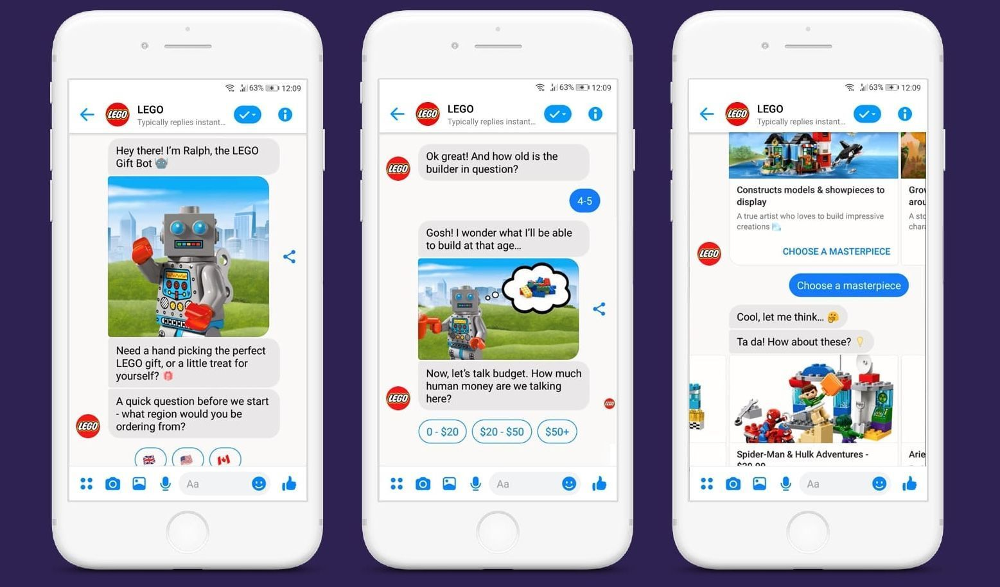
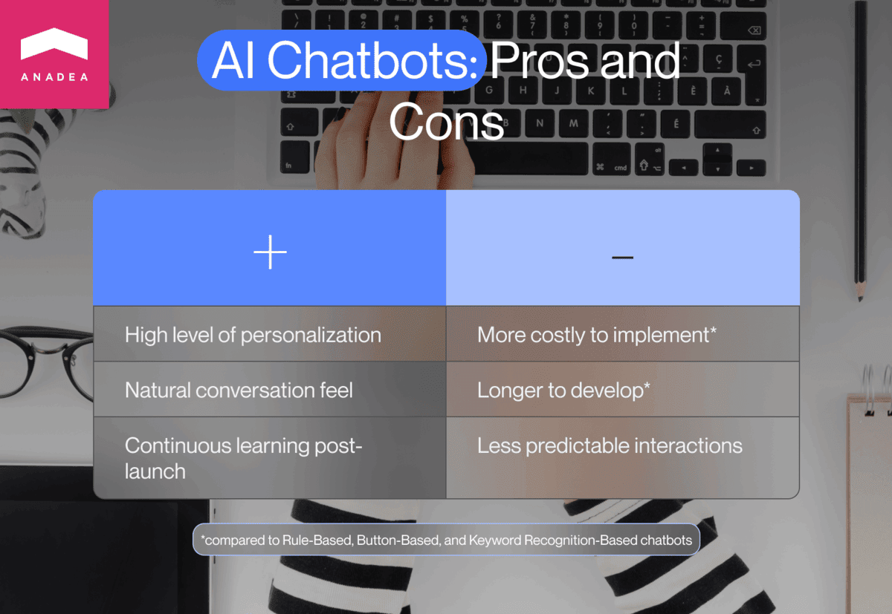
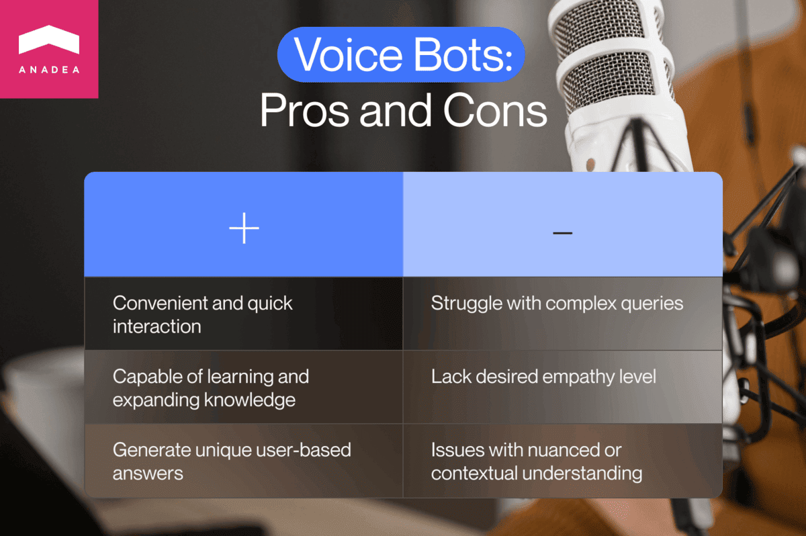
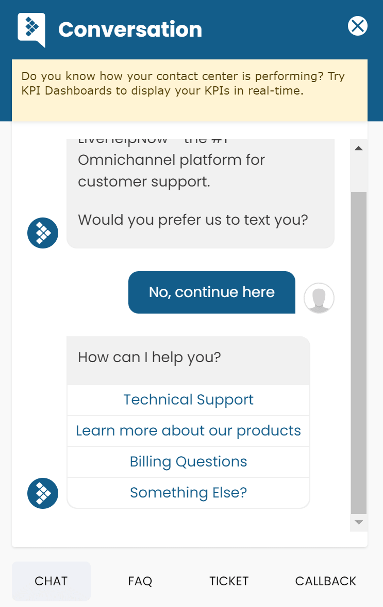
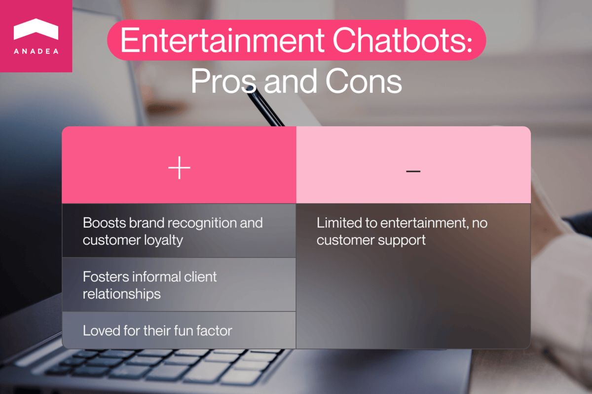

We're living in a year of AI and probably we wouldn't exaggerate if we said that right now we're in the era of Artificial Intelligence. The range of opportunities that developers have thanks to this technology is really breathtaking. And what is even more impressive is that we are just at the beginning of this AI journey. Solutions that are based on it are gradually becoming more and more sophisticated and the interaction with them is getting more and more human-like. One of the AI-powered software products that the majority of us have probably already interacted with is a chatbot.

Numerous businesses all over the world have applied such solutions to automate their communication with customers and increase their quality. But it is also important to understand that the first chatbots were introduced earlier than the mass adoption of AI began. And even today not all bots are AI-powered. A lot of them work based on other technologies and can demonstrate excellent efficiency in the set tasks.

Given the wide range of models, use cases, and goals of these apps, there are different types of chatbots. And that's exactly what we want to offer you to discuss in this article. We will consider different approaches to classifying these solutions. Spoiler: among others, we are also going to talk about Generative AI chatbots that are so widely discussed in the business community these days.

## Chatbots: Quick overview

Before diving deeper into chatbots types, let's consider this concept in general.

A chatbot is a computer program that can simulate and process conversation in a natural spoken or written language. Thanks to modern solutions, users have the possibility of interacting with a digital device as if it were a dialogue with a real person.

The history of chatbots started nearly 60 years ago with the introduction of **ELIZA** in the US. The chatbot relied on pattern-matching and substitution technologies and could simulate communication with people but in reality, it couldn't understand the speech.

Today chatbots can be much more advanced solutions than just programs that provide single-line answers in response to simple queries. Modern chatbots can function as excellent digital assistants, they continuously gather and process data. As a result, they learn new things, expand their area of knowledge, and are able to ensure highly personalized experiences for users.

All this is possible thanks to powering chatbots with **artificial intelligence** (AI) and **machine learning** (ML) models. Unlike traditional rule-based solutions, AI-powered chatbots can understand human language, analyze requests, and provide unique responses.

**Natural language processing** (NLP) is the core technology that enables computers to interpret what users want to tell them. It means that with it, the conversation can become really human-like. Now it is not just a simulation that is based on keywords that chatbots are looking for in each request received from a user.

The global chatbot market is actively expanding. In 2022, its size was around $4.7 billion, in 2023, it is [expected](https://www.marketsandmarkets.com/Market-Reports/chatbot-market-72302363.html) to reach $5.4 billion. According to analysts, the industry will continue its growth and in 2028, it will hit the mark of $15.5 billion. This figure demonstrates that a CAGR over the forecasted period will be over 23%.

In one of our previously published blog posts, we've talked about the evolution of chatbots and their development in more detail. Read our guide on [how to create a chatbot](https://anadea.info/blog/chatbot-development) to learn more.

## Chatbot types based on their functionality

As we've mentioned there are several approaches to defining different types of bots. We offer you to start with their classification in accordance with their functionality.

### Rule-based chatbots

Speaking about different types of chatbots, it will be reasonable to start with rule-based bots as they were the earliest form of such solutions. They function based on the set scripts or rules. Such bots can cope with simple requests and can't deal with those queries that are not included in the predefined scenarios.

Pluses of rule-based chatbots

- They can perfectly cope with requests within predefined scenarios.
- The experiences that they deliver to users are absolutely predictable.
- It will be rather fast to prepare them for implementation.

Minuses of rule-based chatbots

- They can't deal with those questions that are outside of the defined rules.
- They do not learn from the conversations and their knowledge base can be expanded only manually.

Very often chatbots of this type provide two tracks: a support track that is intended to offer some general information about a company's product or its services and a sales track that is designed to get contact details of a user and schedule a meeting or a call.

This group includes two subcategories that we are going to consider further: button-based and keyword recognition-based chatbots. Today, rule-based bots can combine the features of both types.

Make your own chatbot

### Button-based chatbots

As you can guess from the name of this group, such chatbots (they can be also called menu-based) offer users several options, or buttons, that they can choose from. It is a rather simple and cost-friendly type of software. They are built as a decision tree and users do not need to enter their own questions or answers.

Pros of button-based chatbots

- They are easy and quick to implement.
- They are a good option for lead qualification.
- They ensure full control of the conversation flow. Thanks to offering variants to users, there can't be a situation when a chatbot doesn't know how to react.
- They are a perfect solution for providing answers to standard questions (standard questions typically represent 80% of customer support queries).

Cons of button-based chatbots

- They have limited possibilities. Users can't ask their own questions.

When you open a chat with such a bot, you typically see a greeting message and a row of options like "I have a question", "Could you show me a demo", or "I do not need help, thanks". If you choose a variant that you have a question, a bot will ask you to specify the type/topic of your question. After you select it, you will get a list of standard questions to choose from.

### Keyword recognition-based chatbots

The responses that these chatbots offer are also predefined just like in the previous type. But in this case, they will work with chatbot keywords. It means that they will scan the received requests and will recognize these words in order to provide users with a response based on the written script.

Advantages of keyword recognition-based chatbots

- Users can input their own questions.
- The conversation feels much more natural than in those cases when you use button-based bots.
- It is possible to integrate a knowledge base to ensure a better search.

Disadvantages of keyword recognition-based chatbots

- It can happen that a chatbot won't be able to recognize any keywords and, consequently, it won't provide any valuable reply.

Very often chatbots of this type are used for automating questions and answers (Q&A). In response to frequently asked questions, a bot can offer users to read an article from the knowledge base.

Another popular case is building a bot on **Facebook Messenger**. Very often such bots are based on the keyword recognition model.

### AI chatbots

This group also unites several chatbots types that we are going to discuss further. The key peculiarity of such bots is that they rely on ML and AI. As they do not have any set scenarios and scripts to work with, they can generate replies on their own and provide unique solutions.

To launch such a bot, you will need to train it based on your previous interaction with your clients and publicly available databases that will be useful for understanding the context. Thanks to this training data, your bot will be able to understand what reaction and what answers are expected from it in different cases. After you launch your AI-powered bot, its training will be still going on. It can learn on its own based on the data accumulated during its communication with users.

Pros of AI chatbots

- They can ensure a high level of personalization.
- Conversations with them seem to be more natural than interaction with a rule-based bot.
- The training of AI bots continues after their launch.

Cons of AI chatbots

- They are rather expensive solutions.
- Their development is a time-consuming and challenging task.
- Their interaction with users is less predictable than in the case of relying on rule-based chatbots.

While usually we are talking about chatbots in the context of sales or custom care, AI can also provide great mental support. **Replika: My AI Friend** has won a reputation as one of the best virtual companion chatbots. This solution gathers information about you from communication with you and from analyzing your social media accounts. This chatbot acts as a therapist who can listen to you, support you, and provide advice based on your personality.

Get started with AI

### Goal-oriented bots (GoBots)

GoBots are one of the types of conversational AI systems that are created for a specific task or goal. While general-purpose chatbots can be applied for open-ended conversation on practically any topic you can think about, goal-oriented bots are focused on helping users solve a specific task or reach a particular objective. As a rule, such bots are designed for customer service and other business purposes. For example, they can be created for such tasks as flight booking, accommodation reservations, or addressing technical issues with a product.

Benefits of using GoBots

- They demonstrate high productivity and excellent results in solving the set tasks
- It is easier to train them than general-purpose bots.
- The launch of such a bot is considered to be a cost-efficient project as it helped to reduce labor costs and increase the quality of customer support services.

Drawbacks of using GoBots

- They can cope only with those requests that are related to the task that they were trained for.
- As they are trained with one specific task in mind, such bots may have rather limited creativity in problem-solving.
- It can be challenging for GoBots to handle complex and multi-step scenarios.

An example of such a solution can be an AI concierge app that addresses the needs of travelers such as buying tickets, calling taxis, finding different locations in different cities, etc.

### Generative AI bots

Such bots rely on generative models to create messages. In general, such models can be used not only for generating texts but also images, videos, etc. based on the data that was used for their training.

These bots are trained to recognize patterns in data and further they can rely on them to create their own responses. They are also trained to detect grammar rules and constructions in the chosen language in order to generate sentences that will look like those written by people.

Google's C4 dataset which includes nearly 750 GB of text data often becomes one of the basic resources for training **large language models** (LLMs). Is it a lot of information? Definitely yes. And for the majority of people, it will be practically impossible to imagine what these 805,306,368,000 bytes mean. Among this data, there are articles, books, forums, comments, different website sections, and other sources that contain useful information for training. It's important to utilize varied data as thanks to this you can achieve better performance and more advanced capabilities of your LLMs.

Such models usually have numerous parameters that help to increase the quality of the generated content and avoid biases, or wrong information. A well-known **GPT-3** by OpenAI works with 175 billion parameters. It was said that around 100 trillion parameters were used for **GPT-4** but later Sam Altman, the CEO of OpenAI, denied these rumors.

Pros of generative AI bots

- They can provide people with unique solutions to their problems.
- The interaction with them ensures highly natural experiences.
- They can boost users' creativity.

Cons of generative AI bots

- The generated content should be carefully inspected by users.
- By launching such a bot, you can't fully control the experiences that it will offer to users.
- The implementation of these bots requires a lot of time and significant financial investments.

Google's **Bard** or OpenAI's **ChatGPT** are among the most widely discussed examples of such solutions. The teams behind them are continuously working on the enhancement of their models. And the difference between GPT-3 and GPT-4 is bright proof of these words. [GPT-4](https://openai.com/research/gpt-4) can work not only with texts but also images and sounds. As a result, it is believed that the area of its application will be significantly wider than that of its predecessor.

When ChatGPT was introduced, we noticed the beginning of a new wave of concerns that AI would replace a lot of people and a lot of specialists would lose their jobs. Nevertheless, it is vital to understand that ChatGPT, for example, can become a splendid supportive tool for a lot of professionals. However, it will be too early to say that its content can be used without proper control and management from the side of people.



### Voice bots

Users can interact with such solutions by speaking without the necessity to type their requests. It is possible thanks to AI and **natural language understanding** (NLU) that help bots interpret what users expect from them. In general voice bots offer the same benefits as AI bots that we've already mentioned among other chatbot types but the main peculiarity is namely the format of interaction.

It's important to highlight that such chatbots also play an important social role as they can widen the group of users of this or that service or solution. Today they can be widely applied for making it possible for people with visual impairments to communicate with devices without the help of others.

Pluses of voice bots

- They provide a comfortable and quick way of interaction.
- Advanced voice bots can expand their knowledge by learning from their communication with users.
- They can generate unique answers based on users' needs.

Minuses of voice bots

- It is difficult for them to process complex queries.
- They can't offer the desired level of empathy that people expect to get. As a result, the communication may seriously differ from the natural dialogue.
- Though modern voice bots are powered by the most innovative technologies, they still may face issues with understanding some nuances or context. It can lead to serious problems with the correct interpretation.

Such popular solutions as **Google Assistant** , **Alexa** by Amazon, or Apple's **Siri** can be named among other voice bots used today. But not only tech giants offer such solutions. Today a lot of companies, organizations, and institutions have already implemented voice bots to increase the quality of their customer support services.

For example, **Bank of America** has built a voice solution that is intended to help people monitor their savings, make financial transactions, and control their expenses. **Marriott** has introduced a similar bot that can facilitate such processes as room booking, ordering room service, or getting access to information about hotel offers. It is also known that AI voice chatbots are already applied in other industries, like insurance, healthcare, retail, and others.

### Hybrid model chatbots

As it is possible to understand from the name of this category, such solutions combine features of several chatbots types. AI chatbots are a very promising option but not all companies have enough data and resources to train and further support them. That's why they can opt for hybrid solutions that unite the simplicity of rule-based solutions and the capabilities of AI.

Benefits of hybrid chatbots

- It is possible to control the flow as it is scripted but at the same time, it is enhanced by AI.
- They can be integrated with external servers and tools which will allow them to perform various actions like scheduling an appointment.

Drawbacks of hybrid chatbots

- Those users who expect to enjoy a human-like conversation with such a bot can be disappointed.
- The understanding of requests can be limited.

A lot of businesses today opt for such solutions to increase the quality of their customer service, reduce loads for their employees, and make sure that clients' requests can be processed 24/7.

Such bots are also popular in the healthcare industry and help users understand their possible diagnoses based on their symptoms. Users should write or voice their questions and bots offer them different options in a rule-based format (often button-based) to narrow down their symptoms and conditions.

Create a chatbot today

## What are the different types of chatbots based on application?

We've already considered types of chatbots in accordance with their functionality and the technologies that power them. And now we offer you to have a look at the classification that is based on the sphere of their application, or the tasks that they are intended to solve.

### Support bots

Probably that's a group of the most popular chatbots launched by businesses. They can be rule-based, AI-powered, or hybrid. However, they all are aimed at helping your business to provide high-quality support services at any time and on any day of the week.

We highly recommend you think about such a bot if:

- You need to ensure support services across several channels, including websites, social media accounts, etc.
- It is required to work with an international customer base which presupposes multi-lingual support.
- You want to reduce the size of your support team and find a more feasible way to enhance your customer care capacities.

So, what benefits do support chatbots have?

- They are available 24/7.
- It is cheaper to implement a chatbot than to expand your team.
- They can quickly provide answers to various simple questions.

What disadvantages do support chatbots have?

- They can't fully replace people as they can't cope with complex tasks.
- They have limited skills in understanding queries.

Today a lot of businesses rely on chatbots for dealing with standard requests while specialists join the conversation only in those cases when chatbots can't solve the task. Among the most prominent companies that have launched such bots for their clients in different regions, we can name **H&M, Flixbus, Sephora, Domino's Pizza**, and many others.

### Marketing and sales bots

Chatbots of this type also can provide some support services but they are mostly intended to process orders, answer some standard questions, gather valuable marketing data, and, in general, automate a lot of routine tasks and let sales and marketing teams focus more on other aspects of their work.

Pluses of using marketing and sales bots

- They can play an important role in lead generation. They gather crucial information about clients and can qualify leads before sending them to a sales department.
- They help to decrease the bounce rate by engaging customers while interacting with them.
- They help to enhance customer loyalty and satisfaction.

Minuses of using marketing and sales bots

- They can't handle complex processes and individual cases.
- The understanding of clients' needs is limited.

Drift is one of the chatbots that can be used to address the sales and marketing needs of a company. The chatbot is already being used by hundreds of businesses that have observed significant positive changes. For example, after the integration of Drift, **SalesRabbit** managed to increase its demo conversion rate by 40% while the number of qualified leads increased by 50%. And it's important to mention that such results were achieved without website redesign.

### Skills bots

The next category on the list of chatbots types includes skills chatbots. Such chatbots are created to address some special tasks without contextual awareness. For example, they can share traffic situation data, show weather forecasts, open an app for you, or make a call. Very often such bots are enriched with speech recognition functionality.

Pros of skills bots

- They are highly efficient in solving the tasks that they are trained for.

Cons of skills bots

- They are not flexible.
- Their functionality is limited.
- They don't understand complex commands.

Examples of such bots are very different. It can be a bot on **Facebook Messenger** or **Telegram** that will block some contacts after you ask it to do so or will help you re-order the same products at the supermarket as you did the previous time.

### Entertainment bots

Entertainment chatbots should be also named among different chatbot types. They are designed with the goal of engaging users by providing them with fun and absolutely unique experiences.

Advantages of entertainment chatbots

- They help to increase brand recognition and customer loyalty.
- They allow businesses to establish relations with clients outside a formal environment.
- They can be launched just for fun and people will love them.

Disadvantages of entertainment chatbots

- As a rule, their only function is to entertain users and they are not used for providing customer support services.

There are a lot of solutions that are built to entertain people. For example, have you ever used a chatbot that can generate custom Valentine's Day cards? If not, you should try it. It will be interesting to see how it works.

## The future of chatbots

Modern chatbots have already proven their efficiency in solving various business tasks. However, we should admit that different types of bots have their limitations. Given the benefits that they bring to businesses we can suppose that in the future, developers will introduce new tools, solutions, and technologies that will help to overcome the existing barriers.

What are the trends in chatbot development?

- **Emotional intelligence**. The problem of the modern bots is that they can understand a natural language but they can't interpret emotions and react to them. They can't feel when a person is sad and needs support. It is expected that in the future developers will make it possible for chatbots to "read" emotions by recognizing patterns in users' behavior. Such features will be of great use in such spheres as customer service, education, and mental health.

- **Multimodal bots**. Already today a lot of chatbots are able to communicate with users in different languages but working with different input formats is not always available. In the future, there will be more chatbots that will be able to process written texts, voice commands, and visual inputs simultaneously.

- **AR and VR integration**. The introduction of VR and AR tools to AI chatbots can fully change the experiences that users can get in such domains as gaming, tourism, or entertainment. Thanks to them users will be able not only to communicate with a "bot" via a chat but also interact with a virtual companion, get interactive guidance, and leverage other benefits.

- **Integration with IoT devices.** AI chatbots can be connected to different IoT devices, including wearables, various gadgets, smart home systems, etc. As a result, it will be possible to ensure higher automatization of everyday tasks for users.

For businesses, to stay strong in a highly competitive environment, it is crucial to be flexible and open to innovations. It is vital to monitor the trends and the changes in industry standards in order to avoid situations when the offered solutions do not meet customer expectations anymore.

## How to choose the right chatbot for your business needs?

The introduction of a chatbot can become a splendid competitive advantage for your company. But how can you make sure that you have chosen the right solution for your business given such a wide range of chatbot types?

Actually, the key thing to decide on will be whether your chatbot will be script-based or AI-powered. To do it, you will need to consider several factors and answer a row of important questions.

- **Business needs.** What exact tasks should your bot fulfill? Do you want it to deal only with standard questions or with more complex requests? Is it possible to build the flow of conversation in advance? What will users expect from it? By answering such questions, you will be able to understand what features your chatbot should have.

- **Budget and resources**. AI-powered solutions (both ready-made and those that are built for you from scratch) typically require bigger investments than solutions that work based on pre-defined rules. Moreover, it is necessary to allocate resources for training your AI bot. That's why it is required to think about your budget and potential investments in advance.

- **Customization, scalability, and security.** If you are going to use one of the ready-made solutions that are available in the market today, it is also necessary to understand whether it will be possible to customize it and adjust it to your needs. Though it is faster just to start using off-the-shelf software instead of building your own apps, if customization possibilities are limited, such a chatbot won't be able to cope with all of your tasks and your business goals won't be met.

Below you can find a short simplified questionnaire that will help to facilitate the decision-making process for you.

![A table presenting different types of chatbots based on specific needs. The table has two columns. The first column lists questions to consider, and the second column suggests the type of chatbot suitable for that need. Questions and their corresponding options are as follows: 'Is it possible to build the flow of conversation?' corresponds to 'Button-based chatbot'. 'Do you expect to receive standard, frequently asked questions?' corresponds to 'Keyword-based chatbot'. 'Do you want to provide personalized experiences to users?' corresponds to 'AI-powered chatbot'. 'Do you need to offer users unique solutions for their queries?' corresponds to 'Generative AI chatbot'. 'Will your bot have only one specific task without a necessity to build an open-ended conversation?' corresponds to 'Goal-oriented bot'. Lastly, 'Do you want to allow users to speak to your chatbot?' corresponds to 'Voice bot'.](Questions.png)

Ready for the chatbot revolution?

## Conclusion

With the progress in tech development, chatbots are becoming more and more advanced tools. As a result, their capacities are expanding as well as the row of tasks that they can fulfill.

They already help businesses streamline a lot of tasks in their interaction with clients and take the quality of customer care to a completely new level. Now clients can get the required information regardless of the availability of any specialists who can communicate with them. Of course, some complex tasks still should be handled by people but at least routine processes can be automated. And that's already a huge plus, especially given the fact that all the changes that chatbots can bring will also have a positive impact on profit growth and cost optimization.

If you are planning to introduce a chatbot and are looking for a reliable partner who will take responsibility for the technical part of this project, at Anadea, we are always at your disposal. With the strong practical skills of our experts and their deep understanding of business needs, you can be confident that we will offer the best solution.

Do not hesitate to contact us to discuss the details.

Request a free quote
