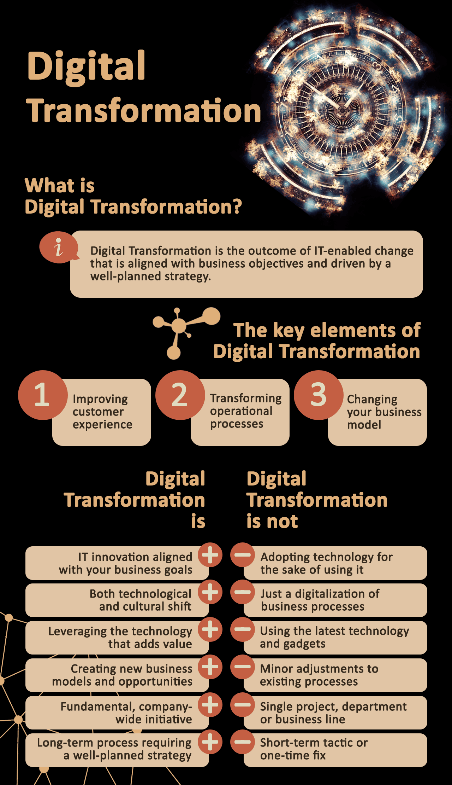

When it comes to running a business, the only thing that’s inevitable is change. Whether you’re targeting a new client base, striving to meet shareholder expectations, or competing with a new player in the market, evolution is the name of the game. As a software development company, we know that change can be hard, especially when you’re transitioning from brick-and-mortar operations to digital-first or digital-only. In this article, we describe the strategies that have helped us navigate an ever-changing digital landscape, and helped our clients achieve meaningful, sustainable digital transformations.

We’ll soon discuss the essential role [business analysts](https://anadea.info/services/business-analysis) play in creating and implementing successful digital transformation strategies, but before that, we have to address an important question.

## What is, and what is not, a digital transformation?

<a href="https://anadea.info/blog/digital-transformation" target="_blank">Digital transformation</a> is a loaded term that we tend to associate with a range of concepts and specific technologies like automation, big data, cloud services, or blockchain. The truth is, though, that applying one, or even all, of these ideas to your business will not necessarily transform it in a meaningful way.

What we mean when we use the term digital transformation is a paradigm shift. It’s a reimagination of your core business that takes into account consumer expectations in the modern technological landscape. To illustrate this point, let’s take a look at an example of a digital transformation success story.

After over 100 years as the paper of record for business and economic news, the <a href="https://www.ft.com" target="_blank">Financial Times</a>, like hundreds of other newspapers around the world, was in crisis. The Internet had disrupted media companies’ relationships with their readers, who were no longer interested in traditional subscription models. While this spelled disaster for many, FT thrived by reimagining themselves as a digital brand, developing new marketing strategies and payment experiences to suit the modern news consumer. Rather than going the way of the dodo, FT managed to position themselves in such a way as to yield <a href="https://www.forbes.com/sites/jasonbloomberg/2014/11/05/digital-transformation-in-action-at-the-financial-times/#1983ec9f170a" target="_blank">growing readership and subscriptions</a>.

Adapting to technological change means seeing things from a different point of view, whether you’re an individual, a startup, or a large company. Adopting new technologies just for the sake of saying you use them, though, can be counter-productive. Rather, the technologies you apply to grow your business should reflect your short and long-term goals, as well as an accurate understanding of where your company is today. That’s where business analysis comes in.

Let's have a closer look at business analyst roles and responsibilities in the digital transformation process.
Hire Business Analyst

## The role of business analyst in digital transformation

Making a successful pivot is impossible without an in-depth understanding of how your company works now, and a clear vision of where you want to be in the future. Companies that take on partners to help them execute a digital transformation should look for firms that have the capacity to give meaningful insights, especially if the partner is responsible for implementing core aspects of the digital transformation like IT services. In the case of IT companies, the business making the transition should see their partners as associates and consultants, rather than mere service providers.

At [Anadea](https://anadea.info/), we believe that business strategy and software development go hand in hand. That's why our business analysts work closely with our clients on every project.

One of the first ways a business analyst adds value to a digital transformation project is by **confirming the need for change**. In the same way a new company must develop a rationale for its entry into the marketplace, so must an existing firm justify major strategy changes. The business analyst role at this stage is to either confirm the company’s theory of the case, or identify alternative ways for the company to achieve its goals.

Having a high-level vision of the digital transformation your company will make is critical, but without a detailed plan you’ll find it hard to gain forward momentum. In such situations, business analysts help by **creating a digital strategy roadmap**, a description of your company’s goals and a step-by-step plan for how to achieve them.

In the context of digital transformations, business analysts are the people who create order from chaos. In an atmosphere of rapid change, it’s easy to lose sight of priorities or neglect a critical business requirement. Without a business analyst on board to keep things organized and focused, that is exactly what’s going to happen.

***The business analyst is the chief organizer of the project, and a resource for other team members when they need to know how something should work.***

At the business analyst’s disposal are a number of tools, methodologies, and frameworks to **document a project’s progress and structure the implementing team’s workflow**. Project documentation addresses broad questions like “what is this project about?” as well as narrower ones like “what are the steps necessary to introduce a customer loyalty feature?”

Given the business analysts comprehensive view of the project, they’re well-equipped to prioritize feature development, reducing costs and ensuring a product that is both usable at every step and open for iteration and expansion.

## Joining the dots

In times of digital transformation, business analyst plays a critical role in bridging the gap between business and technical team. This position requires someone with a fairly broad skill set, including strong analytical abilities, technical expertise and communication skills. Someone who understands the needs of business owners and can help developers transform those needs into viable technology solutions.

If you’re considering a digital transformation for your company, it’s important to remember that business analyst can be just as vital to your project as software engineers. Keep this in mind when choosing a software development company to partner with and make sure that it possesses the experience in business analysis, digital transformation and strategy. When you sit down to discuss your company’s requirements with a potential partner, be on the lookout for a business analyst on their team - it’s a good sign they’re taking your requirements, your goals, and your future, seriously.
Contact Us

 

*Give your business a digital boost! Our business analysts and digital transformation consultants are here to help you, just [drop us a line](https://anadea.info/contacts).*
