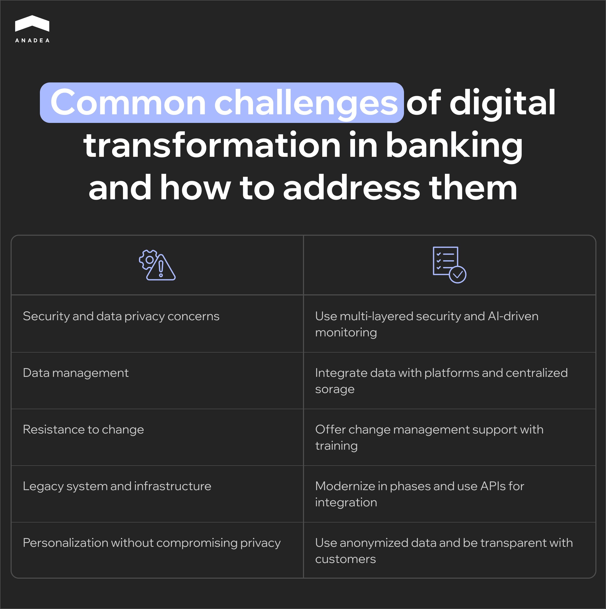

Banking is one of the most traditional industries where the introduction of changes may be associated with a range of challenges. Nevertheless, to remain competitive, secure, and client-centric, banking institutions need to adapt to the modern fast-evolving financial landscape. Tech advancements have a strong influence on the world around us. In this context, new technologies, regulatory requirements, and customer expectations shape how banks should deliver their services. In this article, we are going to talk about digital transformation in banking.

## What is digital transformation in banking? Basic info

Digital transformation in banking is a term that can be used to describe the integration of digital technologies into all aspects of banking operations.

The process of digital transformation for banking institutions can reshape how they deliver services, engage with customers, manage operations, and respond to industry demands.

In general, this process goes beyond simply digitizing services. It also should involve rethinking banking operations, products, and experiences. All the efforts should be aimed at making them more agile, customer-centric, and data-driven.

Let’s consider the main aspects of digital transformation for banks in more detail.

### Process automation

Banks can efficiently automate routine processes like loan applications, account management, and customer onboarding. Thanks to this, it is possible to streamline and reduce manual tasks, cut down operating costs, and minimize risks of human error.

### New financial products and services

Digital transformation in banking sector creates a favorable environment for introducing innovative financial products, such as instant loans, robo-advisors, and embedded finance services. Moreover, by using APIs and open banking frameworks, banks can establish seamless cooperation with fintech companies. And this is one more opportunity for them to expand their offerings beyond traditional banking services.

### Customer-centric experiences

Banks can use various digital tools to provide personalized, real-time experiences across all touchpoints, including mobile apps, websites, and ATMs. Digital transformation for banking enables financial institutions to offer 24/7 access to their services, faster transactions, and more personalized financial products based on customer behavior.

### Data-driven decision making

Big data analytics and AI help banks collect and analyze vast amounts of customer data to gain insights and predict trends. With such data at hand, banks can tailor products and services to meet individual customer needs and manage risk more effectively.

### Enhanced compliance and security

Digital transformation in banking also includes advanced cybersecurity measures. For example, it can presuppose the introduction of biometrics tools, multi-factor authentication, and real-time fraud detection. With digital solutions, compliance with regulatory standards becomes more manageable and result-oriented.

The size of the global digital transformation in BFSI (banking, financial services, and insurance) is [projected](https://www.kbvresearch.com/digital-transformation-in-bfsi-market/) to hit the mark of $215 billion by 2030. Just for comparison: in 2022, it was valued at $67.5 billion.

## Key drivers of banking digital transformation

Given the ongoing tendencies in the banking segment, digital transformation has become a must for banks all around the globe. Let’s have a look at the main boosters of such changes and the most important advantages that banks and their customers can leverage.

### Customer expectations

Modern customers are quite spoilt with good service. And that is definitely a good tendency. Today they value speed, personalization, and user-friendly mobile interfaces. To meet their expectations, banks need to offer seamless, 24/7 digital experiences.

### Competitive pressures

Neobanks and fintech startups offer innovative, low-cost, and convenient alternatives to traditional banking services. In order to stay afloat, traditional banks have to adopt digital solutions as quickly as possible.

### Regulatory requirements

Regulatory bodies increasingly emphasize such aspects as data protection, cybersecurity, and transparency. This drives the need for robust digital infrastructure.

### Need for cost efficiency

The use of digital solutions can greatly reduce operational costs through automation and improved resource management.

### Risk mitigation

Digital transformation in banking and financial services ensures better data and predictive analytics. Thanks to this, banks can anticipate and manage risks much more effectively.

## Benefits of digital transformation in banking

To understand whether you should invest in digital transformation, it is necessary to find out what it can bring to you and why such changes really matter for financial institutions. The benefits of digital transformation in banking are vast. Given this, they impact absolutely all aspects of banks’ operations.

### Enhanced customer experience

Personalized services, round-the-clock accessibility, and seamless omnichannel interaction with banking institutions play a crucial role in shaping customers’ impressions.

### Improved operational efficiency

Automation of back-office functions helps to minimize errors and save time. Moreover, it reduces the need for physical branches and manual labor. This not only lowers costs but also allows employees to focus more on complex processes.

### Innovation and agility

Digital transformation lets banks quickly develop and launch new products. As a result, they can faster adapt to changes in customer needs and market conditions. By staying at the forefront of technology, banks can compete not only with other traditional financial institutions but also with fintechs and digital-only banks. As a result, they can successfully retain their existing customers and attract new ones.

### Increased financial inclusion

With digital solutions, banks can reach customers even in remote or underserved areas. As a result, they can bring financial services to individuals who previously didn’t have access to them. Moreover, with reduced operating costs, banks can offer lower-cost services. It means that banking can become more affordable even for customers with low incomes.

### Better scalability and flexibility

A bank digital transformation strategy traditionally includes the implementation of cloud-based solutions. They allow financial organizations to scale operations up or down based on demand. The digital infrastructure itself also provides banks with greater flexibility to integrate new technologies as they grow and evolve.

### Environmental benefits

Digital banking systems help to minimize paper use. This enables banks to follow sustainable practices and reduce their carbon footprint. Another factor that contributes to banks’ sustainability goals is the application of cloud infrastructure. This option is often more energy-efficient than traditional data centers.

### Advanced cybersecurity and better data protection

Digital transformation allows for stronger data privacy controls and security. The introduced measures like biometrics, multi-factor authentication, and AI-driven fraud detection help banks protect sensitive information in line with global standards like GDPR.



## Process of digital transformation in banking

To achieve the best results of the introduced changes, it will be important to create a well-planned transformation process. It should include multiple steps. And the value of each of them shouldn’t be underestimated.

### Step 1. Access the current state of digital maturity

Start by assessing the bank’s existing technology infrastructure, digital capabilities, customer engagement methods, and workforce readiness. It will also help to identify pain points in legacy systems and areas where digital processes can bring improvement.

### Step 2. Set goals and create a roadmap

Define your precise goals such as improving customer experience, increasing operational efficiency, enhancing security, or expanding product offerings. Prioritize them by importance and develop a phased plan. Specify timelines, required resources, and KPIs. It’s also vital to take into account all the costs associated with transformation projects and allocate the necessary budget.

### Step 3. Choose the required technology

You should determine what technologies and solutions are necessary for achieving your goals. At this step, it will be sensible to find a team that will be responsible for your technology project. If you do not have such specialists in-house or if your internal resources are not enough, you can establish cooperation with an outsourcing company like Anadea. It’s necessary to make sure that developers have relevant expertise and can fully understand your needs and expectations.

### Step 4. Map a customer journey

It is necessary to understand key touchpoints and pain points in interaction with customers. Focusing on how digital tools can improve these experiences. You can use surveys to gain insights into customer expectations and preferences.

### Step 5. Upgrade your technology infrastructure

Gradually upgrade or replace legacy systems, integrate them with new digital systems, and introduce new tools following your plan.

### Step 6. Upskill employees and encourage digital culture

You will need to provide training on digital tools, customer engagement in a digital environment, and cybersecurity practices. Employees should be fully ready for the introduction of new solutions and approaches.

### Step 7. Continuously monitor and improve your tools

Track various KPIs, like customer satisfaction, cost savings, and revenue growth, to evaluate the effectiveness of transformation efforts. Gather employees’ and customers’ feedback to refine your digital strategies and optimize processes.

## Technologies used in digital transformation in banking

Digital transformation in banking and financial services leverages a range of advanced technologies. The exact set of tools and solutions that will be used in your project should be defined by your exact goals, expectations, and current state of digital infrastructure.

For example, the survey published by Cornerstone Advisors in 2023 [revealed](https://166442.fs1.hubspotusercontent-na1.net/hubfs/166442/2023R3_Whats-Going-On-In-Banking_Cornerstone-Advisors.pdf) that APIs, cloud computing, and robotic process automation are the top 3 most popularly deployed technologies.

Let’s consider some of the most promising emerging technologies that can be included in your bank digital transformation strategy.

### Artificial intelligence and machine learning models

AI-powered predictive models can be used to analyze customer data, forecast behavior, personalize offerings, and assess risks. At the same time, ML algorithms are good at identifying patterns in transactions. It means that they can be applied to flag potential fraud and allow banks to respond in real time.

### AI chatbots and virtual assistants

Such solutions greatly enhance customer service. They can provide instant support, answer FAQs, and provide personalized financial advice.

### Robotic process automation (RPA)

These tools can handle repetitive, rule-based tasks like data entry, report generation, and document verification. Moreover, they can automate compliance checks and ensure better accuracy.

### Cloud computing

Cloud platforms enable financial institutions to scale their infrastructure based on demand and optimize the use of resources. Another huge benefit of cloud solutions is improved collaboration between departments.

### APIs

Application programming interfaces let banks securely share customer data with third-party providers following [open banking](https://anadea.info/blog/open-finance-vs-open-banking/) principles. With APIs, banks can also seamlessly integrate with fintech companies and expand service offerings.

### Embedded finance and embedded banking

These approaches presuppose integrating banking services directly within non-banking platforms, like retail or travel apps. This helps banks reach new customer bases and create additional revenue streams.

### Blockchain

Blockchain ensures the security and immutability of transactions, which is crucial for transparency and trust in banking operations. At the same time, self-executing smart contracts can streamline such processes as loan issuance, settlements, and payments. This can minimize delays and reduce administrative costs.

### Internet of Things

IoT helps to connect ATMs, point-of-sale systems, and other banking devices for remote monitoring and maintenance. Moreover, wearable technology can allow users to get access to banking services on the go from such devices as smartwatches.

## Digital transformation examples in banking

Here are a couple of examples of real-life solutions in the framework of digital transformation banking strategies.

* **Mobile banking**. Nowadays, [mobile banking apps](https://anadea.info/blog/mobile-banking-app-development/) can offer much more than just P2P transactions or payments for online purchases. Such applications can also provide full access to bank accounts and practically a full list of services that are traditionally available at bank branches.
* **Biometric authentication**. To ensure a high level of security, a lot of banks today have already introduced biometric authentication methods. For example, they apply such methods as fingerprint scanning, facial recognition, and voice recognition.
* **Roboadvisors**. Such AI solutions can provide personalized investment advice and portfolio management to customers with different needs. These services can be available at a lower price in comparison to the cost of services offered by traditional wealth managers.

Today quite a lot of banking institutions are going through the stage of digital transformation. Some of the existing examples can be rather inspiring for those who are just starting this journey.

### BBVA

This Spanish multinational banking institution is known for its commitment to digital transformation and customer-centric approach. It started its transformation in 2007 and since then, the bank has been successfully changing. In recent years, its efforts have concentrated on cloud computing, data, and AI.

BBVA has chosen Amazon Web Services to build a global data platform. This platform can be used by the bank’s business units to get a unified view of their data. Moreover, it represents a new approach to more efficient data processing and analysis.

This strategy has already brought its fruits. In 2023, the bank [posted](https://www.bbva.com/en/economy-and-finance/results-4q23/) an annual profit of €8.02 billion. It was a record high since its foundation. Apart from this, BBVA has achieved significant results in the expansion of its customer base.

### Wells Fargo

Wells Fargo is an American multinational financial services company with a rich history that started in 1852. Since then, the company has won a reputation as one of the most stable traditional banking institutions. Nevertheless, now, it’s high time for big changes.

Currently, Wells Fargo is heavily investing in emerging technology and services. For example, it focuses on delivering a new digital account opening experience, which can be beneficial for both employees and customers. Moreover, according to the [information](https://www.pymnts.com/earnings/2024/wells-fargo-turns-to-digital-ai-as-inflation-batters-deposits/) provided by the bank, they can observe a stable growth in the number of mobile users. In comparison to the previous year, now, the total number of active users is 6% higher.

Moreover, the bank’s AI-powered virtual assistants boast great popularity. Nearly a year after the launch of this solution, the number of users reached 15,000,000, while the total number of interactions is over 117,000,000.

Now in the framework of the bank digital transformation, the company is actively working on the implementation of generative AI and traditional AI tools across its departments.

## 5 effective strategies for digital transformation in banking

Successful digital transformation in banking requires a comprehensive strategy that will cover all aspects of banking operations. Here are some key approaches that you can apply in practice.

### Digital culture

You need to foster a culture of innovation by upskilling employees and encouraging experimentation.

**Action plan:**

* Offer comprehensive training programs on digital tools and technologies;
* Allow experimentation without fear of failure.

### Customer-centric approach

You should place customers at the center of transformation efforts. That’s why you have to understand their needs, preferences, and expectations. Use data analytics tools to gain insights into customer behavior and provide personalized experiences across all touchpoints.

**Action plan:**

* Conduct regular customer feedback sessions;
* Use customer journey mapping to identify pain points;
* Offer personalized products and recommendations tailored to individual needs.

### Omnichannel experience

We recommend you focus on delivering seamless banking experiences across all channels (online, mobile, and in-branch). This will give your customers consistent access to services, regardless of the platform.

**Action plan:**

* Use APIs to connect channels and create a unified customer profile accessible across all touchpoints;
* Optimize each channel for its unique advantages;
* Continuously refine channels based on user feedback and emerging technology.

### Digital-first solutions

You can introduce digital solutions to reduce operational costs, streamline processes, and free up resources for customer-focused activities.

**Action plan:**

* Shift back-office processes to digital platforms;
* Use AI to optimize resources;
* Continuously assess the cost-benefit ratio of digital initiatives to ensure sustainable transformation.

### KPIs and transformation impact

KPIs are a popular method to evaluate the impact of digital transformation in banking. It is recommended to track the progress of all transformation initiatives with key performance indicators. This helps to assess the effectiveness and profitability of all new tools and processes.

**Action plan:**

* Define KPIs based on your goals;
* Monitor KPIs regularly and adjust strategies based on performance insights;
* Use customer feedback and satisfaction metrics to refine transformation initiatives.

## Common challenges of digital transformation in banking

The process of banking and digital transformation is often associated with some difficulties and pitfalls. To ensure smooth changes at your institution, it will be useful to consider them in advance. This will help you be well-prepared. And all your digitalization efforts will turn out to be more efficient.

### Challenge 1. Security and data privacy concerns

Digital banking is related to increased cybersecurity risks, including data breaches and fraud.

**How to address it**: You can introduce multi-layered security with firewalls, encryption, and multi-factor authentication. Such measures in combination with regular vulnerability assessments will allow you to achieve excellent results. Moreover, you can apply ML and AI tools for real-time monitoring and anomaly detection.

### Challenge 2. Data management

Data in banks often exists in silos across departments. This leads to inconsistencies and makes it challenging to provide a unified view of the customer.

**How to address it**: Banks can rely on data integration platforms to bring information together from multiple sources into a unified system. It is also possible to create data lakes and warehouses to store data centrally. This enables better data access, analysis, and reporting.

### Challenge 3. Resistance to change

Digital transformation often requires a shift in company culture. However, employees (and often even C-level managers) may resist changes.

**How to address it**: It will be sensible to introduce a structured change management program to support employees throughout the transformation. This program may include workshops, training, and educational materials.

### Challenge 4. Legacy system and infrastructure

Many banks still rely on legacy systems that are difficult to integrate with new digital technologies.

**How to address it**: Modernization of the entire ecosystem can be a very time-consuming and expensive project. You can use a phased approach to upgrade legacy systems, starting with the most critical areas. In many cases, it can be a good idea to migrate systems to cloud platforms. This will offer scalability and flexibility for further transformation. To connect new technologies with your existing systems, you can use APIs. They will facilitate data exchange without overhauling the entire infrastructure.

### Challenge 5. Personalization without compromising privacy

Banks aim to provide personalized services by leveraging customer data. Nevertheless, it can be challenging to balance personalization with privacy.

**How to address it**: You should adopt privacy-first strategies. For example, you need to use anonymized data and ensure that personalization does not compromise customer confidentiality. It is also required to openly explain to customers how their data will be used to enhance services.

## Wrapping up: Digital transformation in banking with Anadea

Given the current state of the banking landscape, it is obvious that digital transformation is inevitable for those institutions that want to stay competitive. As banks continue to innovate, the emphasis on security, convenience, and personalized experiences will grow. This will introduce increased standards for digital tools and systems.

If you do not want to lag behind, you need to start your transformation journey already now. And at Anadea, we will be always ready to support you at any stage of such initiatives. With our solid experience in [fintech software development](https://anadea.info/solutions/fintech-software-development), we are confident that we will be able to find the best solutions for you. Want to find out how much your project will cost? Just share your requirements with us and get a quote for free.

Get in touch
