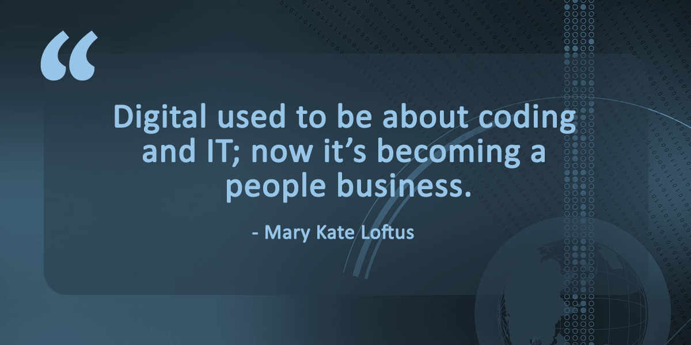
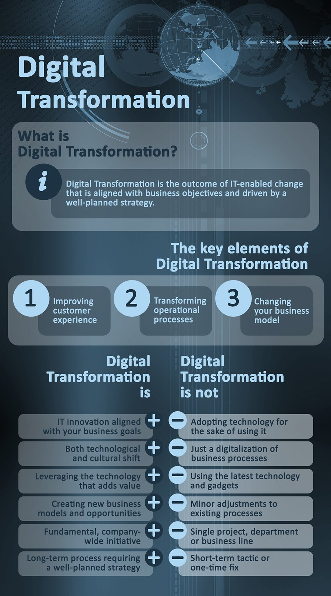

Digital transformation is an often misunderstood phrase that is overused in the global business community. It isn't about getting the latest shiny piece of technology. Nor is it about switching to a new software solution or platform for the sake of it.

Digital transformation, as the name suggests, is about making a profound change in an organization using technology. It is focused on creating real operational transformation. It could be for internal purposes, to improve efficiencies and workloads. [Digital transformation solutions](https://anadea.info/solutions) are designed to save companies time, money, and unlock new value and potential.

Or it could be a customer-facing change. Customers everywhere, across almost every demographic, prefer digital platforms.

Investments in the customer journey and experience generate top and bottom line ROIs. Customer retention and revenue rates often improve as a consequence of a digital transformation project.

## What is Digital Transformation?

Before we dive into what this means, why business analysts should play a key role, and why corporate CIOs are relying on IT partners to deliver, we need to understand what digital transformation isn’t.

It isn’t one-size-fits all. What works for one company won’t necessarily work for another. It doesn't come out of a box, nor is the cloud a universal answer to every digital challenge.

Every digital transformation journey is unique.

## Creating technology for people and processes

When projects fail, either because of time and budgetary overruns, the problem is rarely about the technology. People, training and culture play an enormous role in every digital transformation project. Although that might sound surprising, the reason for this is quite simple:

Ultimately, technology is a tool for people to use. Digital transformation is about improving the tools, then making sure your staff or customers can use these new tools more effectively.

To understand why a new tool is needed, companies first need to analyze customer or workflow journey pain points. Only then they can create a digital transformation strategy and implement a technical solution to solve those pain points effectively.

## Global spending on digital transformation

As a category of IT/digital spending, transformation projects are a huge area of investment. IDC estimated that $2 trillion was invested during 2019, the equivalent of 40 percent of IT spending. Forrester suggests that this includes everything from “a disruptive approach to transformation that includes everything from incremental improvements to moonshot approaches.”

Evidently, digital transformation is a broad category within IT. Next, we look at the role of business analysts and IT providers. Why should companies work with them, and how do they help ensure the success of a project?

## Why you need Business Analysts for digital transformation projects?

Largely thanks to misconceptions pushed around in the media and with how some companies represent the concept, we tend to associate digital transformation with specific technologies. Solutions such as automation, big data, cloud apps or platforms (everything from SaaS to PaaS, and everything in between), or blockchain, as one of the latest crazes of the last couple of years.

Companies can adopt one or more of these solutions. Adoption alone doesn't involve transformation.

Digital transformation is an entirely different, and more involved process than adopting a new technology solution. What we mean when we use the term digital transformation is a paradigm shift. It’s a re-imagination of your core business that takes into account consumer expectations in the modern technological landscape.

In order to achieve this, companies need to engage the services of [business analysts and digital transformation consultants](https://anadea.info/services/consulting-and-audit).

## What role does an analyst play in a digital transformation journey?

Analysts often work with internal stakeholders and project leaders, such as CIOs and product managers, IT directors and departmental heads. Business analysts are usually technically trained, with extensive business experience. So they can speak both business and tech. Translate between all parties and stakeholders.

Business analysts are able to clearly identify and understand the pain points. Often, this involves customer or staff (user) interviews. An analysis of the journey’s, workflows and understand the rationale behind a transformation from a high-level, as well as at the granular level.

The first task business analysts will undertake is to confirm a businesses case for a transformation project. If that is confirmed, then an analyst will play a key role in creating a high-level vision of the digital transformation. Turning that into a workable, and detailed, strategy is the next step. This in turn is made into a digital transformation roadmap.

In the context of digital transformations, the [role of business analyst](https://anadea.info/guides/business-analyst-role) is to create order from chaos. In an atmosphere of rapid change, it’s easy to lose sight of priorities or neglect a critical business requirement.

### How does a business analyst play this role?

A business analyst is the chief organizer of the project, and a resource for other team members when they need to know how something should work. One of the roles they undertake during a project is documenting a project’s progress and structure the implementing team’s workflow.

A number of tools are used to ensure everything is organized within the context of the project roadmap. This includes communication and project management tools, to ensure timely and transparent workflows between the external IT team and internal team members. Communication is a key part of these projects, especially when they get to the stage when training and cultural shifts are being undertaken.

To ensure these projects are delivered successfully, many large companies trust IT providers to support them from start to finish, and often after completion. Let’s look into why this is, and what the benefits are?

## Role of IT providers in digital transformation

Time and resources are one of the main reasons companies work with an external [digital transformation service provider](https://anadea.info/). To get where you need to go with a project such as this, you need an IT partner with experience delivering transformative IT solutions for enterprise and mid-size companies.

Businesses that are large enough often have an in-house IT team. CIOs and team leaders often play a key role in keeping everything running and managing IT projects. So why not task them with a digital transformation project and keep everything internal?

Quite simply, too many companies that have tried that have failed. Internal IT teams either don't have that kind of expertise, don't see the challenges the same way an impartial outside team would, and often, don't have the time. Undertaking any kind of digital transformation project at scale is a long-term investment of time and resources.

Although an internal IT team might start a project with enthusiasm, what happens when the next urgent task enters the workflow? Depending on the size and configuration of your IT team, internal workloads are often focused on the urgent needs.

Digital transformation is important, for the long-term success of any company in a competitive market. However, in a fast paced business environment, important tasks can fall victim to urgent ones. When internal IT teams are managing digital transformation, it’s often such a big and challenging project that it is the first at the bottom of any list of tasks, compared to more urgent ones, such as email going down.

Instead, savvy business leaders are entrusting IT partners with a proven expertise in the field of [digital transformation services](https://anadea.info/services) to assess what needs to happen, then implement. Internal stakeholders are appointed at the client-side to manage everything, usually working closely with the business analyst.

### Benefits of working with IT providers:

* **Broader range of skills and expertise.** Depending on what needs to be built, not every company is going to have the relevant coding and tech skills on-staff.
* **Access to the right tools.** Again, this is something an IT partner can be sure to provide. Otherwise companies need to subscribe to dozens of tools and apps that are only going to be needed during a project, thereby increasing expenses and complexity.
* **Objective analysis.** Internal teams can’t always see the challenges and pain points. Stakeholders can also be too invested either in how things have been done, or a particular goal they have. With external partners, there is a much greater chance that the right systems and processes will be developed to achieve the goals of the company, staff, and customers, without the impact of office politics and egos.
* **Achieving a successful outcome.** Internally managed projects rarely succeed, or if they do, it takes far longer than it should and no one is truly happy. With an external partner, you can be assured they are invested in a successful outcome, and will do everything they can to deliver what you need.

Not every provider is equal, of course. Some have a better reputation than others. Next, we will look at the role digital transformation is playing across a range of sectors, such as real estate and healthcare.

## Digital transformation in different sectors

Digital transformation is transforming sectors across the world. Even those many wouldn't imagine, such as industrial, logistics and shipping. Between big data, new cloud and app-based ways of working, AI and machine learning, whether through wholesale transformation or creeping adoption, new ways are replacing outdated methods and processes.

In this next section of our digital transformation guide we look at the impact of digital transformation on the real estate, healthcare and education sectors.

### 1. Digital transformation in Real Estate

Since the early 2000s, the real estate sector has been transformed by digital technology, apps, and websites. Realtors may have more competition than ever, but at the same time, many have thrived. Consumers and businesses buying and renting still need a realtor or broker (for commercial deals) to help them find the right house, apartment, or workspace.

Real estate is still the most important purchase many people, and businesses, will ever make. We need to engage someone who can help with the complexity of that. However, the way real estate has ultimately been transformed is through how people start the search. As figures from 2018 show, 48% of Boomers look online for real estate, and 99% of millennials use websites and apps when searching for a home or place to rent.

New platforms have emerged to make this easier for buyers, tenants, and those putting property on the market. However, this isn't the only way that digital has had such a profound impact on the sector. Real estate companies in the commercial and consumer sectors are using new technology to transform and streamline internal workflows and processes. Everything from CRMs to data driven analytics apps and tools are now playing a role in the way realtors and brokers manage properties, clients, finances, staffing, marketing and sales.

No area of the real estate world has been left untouched by digital. And for those keen to take things to the next level, a digital transformation solution can connect multiple systems and overhaul a reliance on legacy technology. It has never been more important to improve competitiveness and stand out in a crowded market.

Based on our extensive experience in the digital transformation of real estate businesses, we can credibly say that the ability to learn and translate that new knowledge into effective digital products rapidly, gives companies the ultimate competitive advantage in this sector. With a forward-thinking [real estate IT solution](https://anadea.info/solutions/real-estate-software), you can explore new growth opportunities and generate more value from multiple data streams and sources.

### 2. Healthcare digital transformation

Healthcare is going digital, and this is good news for patients and healthcare providers.

From [telemedicine](https://anadea.info/solutions/medical-app-development/telemedicine-development) to genomics, [digital transformation in healthcare](https://anadea.info/blog/digital-healthcare-a-new-approach-to-care-coordination) has the potential to improve patient outcomes, make healthcare as much about prevention as curative treatments, and reduce the overall cost of medical treatment.

Alongside aging and ever expanding populations, lifestyle choices, particularly in Western countries, also have a negative impact on the provision of healthcare. All of this is making healthcare more expensive, which ultimately is increasing death rates, whether or not healthcare is socially funded.

Lifestyle-related health issues that cause non-communicable diseases contribute to 75% of deaths worldwide, according to the World Health Organization. Economically, non-communicable diseases and poor lifestyle choices could cost the global economy $47 trillion by 2030, according to World Economic Forum data.

Digital transformation and [digital healthcare solutions](https://anadea.info/solutions/medical-app-development) have the chance to reduce the impact of non-communicable diseases. The healthcare sector is also investing heavily in digital transformation to reduce costs and unlock new innovations that will help patients, whether through preventative cures or data driven insights.

A few of the ways this is already happening is through:

**1. Data powered lifestyle apps.** Helping consumers make better choices, through simple metrics, tracking and monitoring lifestyle choices.

**2. Treatment apps.** Some diseases and conditions require close monitoring. Digital healthcare services, usually ones that are connected directly to a medical team can closely monitor the health of a patient. With this real-time data, a doctor or healthcare team can take action whenever needed. This way, preventative cures can be administered before a patient required more serious medical treatment, with better outcomes and lower costs for everyone.

**3. Genomics.** With AI and quantum computing on the horizon (and big data already playing a key role), we have the capabilities to truly personalized testing and treatment that could transform our relationship with the worst diseases we face as humans.

Other innovations include telemedicine services, and the way big data is shaping the creation of drugs and pharmaceuticals. Alongside many other impacts, big and small across the sector, constantly shaping how patients are looked after, drugs sold and promoted, and healthcare professionals manage ever increasing workloads.

We have extensive experience in this sector, so [talk to us](https://anadea.info/contacts) about how we can give your company a digital injection and transform outdated processes and systems.

### 3. Impact of digital transformation in Education

[Higher education and the nature of universities is changing](https://anadea.info/blog/digital-transformation-in-higher-education) and will continue to change for the next decade. Twenty years ago, 'digital' was not a major concern for universities. In K-12 schools too, digital is an area where billions is going to be invested over the next ten years.

Globally, the education sector as a whole is undergoing massive growth. In America alone, spending on education technology now exceeds $13 billion.

As populations increase in developing countries and regions, the number of K-12 and university age students is going to dramatically increase. Population estimates indicate there could be 500 million more students by 2025, with the size of the education market worth around $8 trillion, up from $5tn in 2019.

Within these seemingly massive figures is the $250 billion market cap for EdTech. In the context of other sectors, such as healthcare, this seems a relatively small overall tech fund. Education, for the most part, is a publicly-funded sector. It’s capital poor, and governments with debts and deficits are still struggling to fund it at pre-recession (2007-10) levels.

With this in mind, schools and universities need to do as much as they can with the resources and funds they have. Digital transformation is one of the ways to achieve the goal of doing more with less.

Digital has already had a massive impact on the sector. Using tablets and [eLearning solutions](https://anadea.info/solutions/e-learning-software-development) has replaced pen and paper. Research is usually online, instead of using print textbooks. Younger generations grow up as "digital natives", spending up to 53 hours online - usually on a smartphone - every week. In many ways, traditional academic institutions are competing in some way against everything from Wikipedia and YouTube to massive open online courses (MOOCs), Open Educational Resources (OERs), podcasts, videos, blogs, and webinars.

Despite these changes, digital transformation doesn't come easily to this sector. PwC has found that, universities in particular “invest heavily in IT systems that don't deliver the anticipated benefits and outcomes. These universities fail to appreciate that they don't need a digital strategy – just a business strategy that is fit for the digital age.”

How can this be improved, with better outcomes for universities, schools, students, teachers and other stakeholders?

* ‘Digital’ is not a standalone strategy;
* Transformation should be about making a successful paradigm shift, thereby improving processes, systems, and how technology is integrated with the work of an academic institution or school;
* Understanding that learnings from other sectors could be applied in an increasingly business-focused sector.

## Key Takeaways

* Digital transformation is about making a profound change in an organization using technology.
* It isn't about using technology for its own sake, or adopting a new app or system: digital transformation is broader and deeper than that.
* A strategy and complete assessment is required to get the value a company needs from a digital transformation project.
* [Working with business analysts](https://anadea.info/services/business-analysis) and external IT providers is the most effective way to get the value and ROI a company needs.
* We have extensive experience in the healthcare, real estate and education sectors implementing digital transformation projects.
