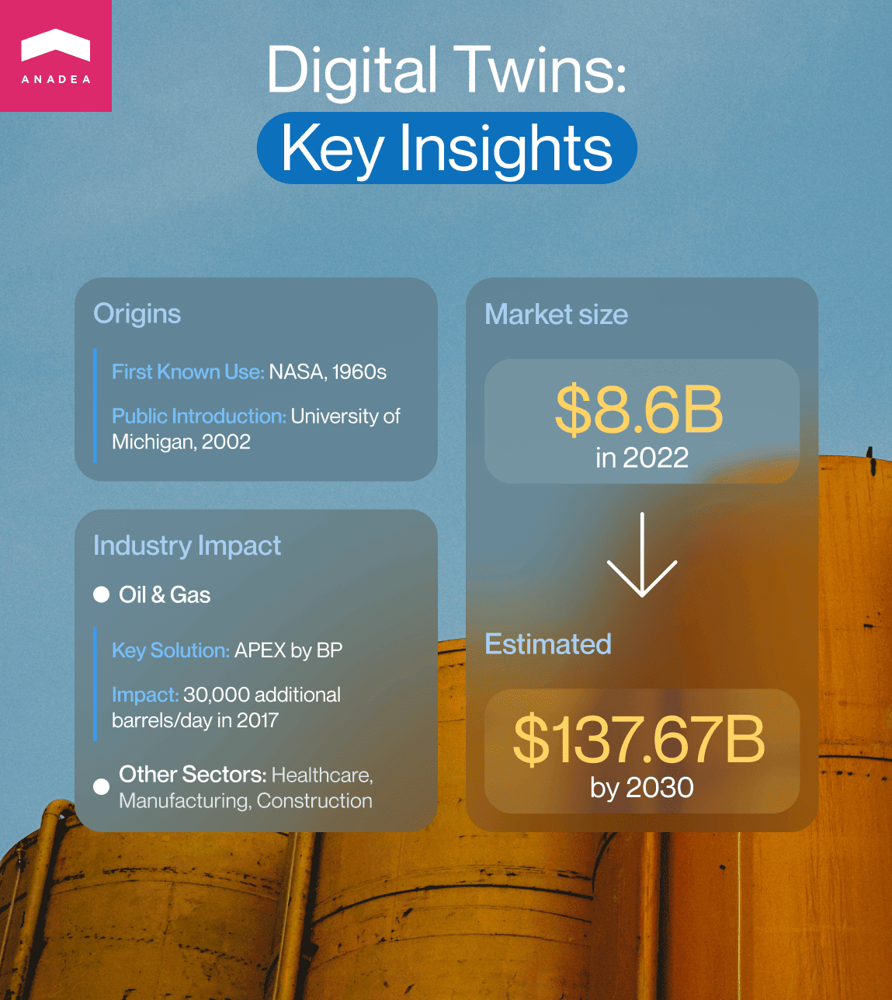
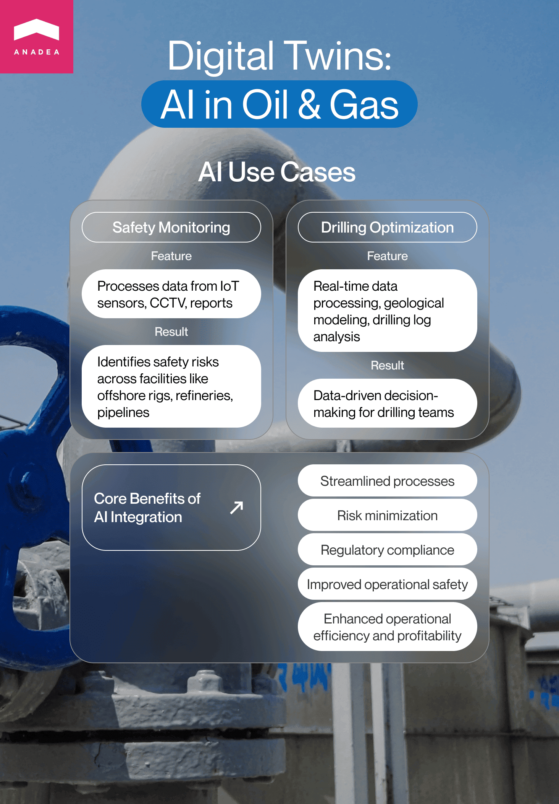

Modern technologies can greatly change the way different enterprises carry out their processes and manage their assets. One of these types of solutions that have the greatest potential to help companies make better-informed decisions and, consequently achieve better results, is digital twins. Let's put it as simply as possible. Digital twins can be explained as digital representations of physical objects, processes, or even people that are placed in a digital version of their real-time environment. It means that such simulations help businesses see what outcomes they can get in different situations and be better prepared for possible negative impacts of their decisions.

Today digital twins can be created for companies of different types but in this article, we'd like to focus on those solutions that are applied by oil and gas enterprises. This industry has been the backbone of the economy for many years and any operational inefficiency or wrongly taken decision can cause serious consequences for many markets. Oil and gas companies are among the richest and the most valuable in the world. However, they suffer from market volatility, environmental concerns, and other challenges that are pushing them to look for new ways to operate their assets and build their market strategy. Digital twins in oil and gas industry are among those solutions that can help enterprises to transform their operations and innovate their approaches to business.

In our blog post, we are going to talk about the benefits of such solutions, real-time oil and gas digital twin applications, and possible challenges that companies can face.

## Digital twins in oil and gas: Brief overview

The concept of digital twins [became](https://en.wikipedia.org/wiki/Digital_twin) publicly known in 2002 after a presentation on this technology conducted at the University of Michigan. It was a conceptual model of product lifecycle management. However, it would be wrong to say that it was the birth of this concept in general. Already in the 1960s, NASA relied on some prototypes of this technology for simulating their systems in space.

The adoption of digital twins in oil and gas industry began at the beginning of the 21st century with the progress made in such technologies as the [Internet of Things](https://anadea.info/blog/the-future-of-sustainable-smart-iot-technology) (Industrial IoT to be more precise), AI, and ML. Of course, the first solutions were not as powerful and advanced as they are now.

Among the examples of simulation systems, we should name [APEX](https://www.bp.com/en/global/corporate/news-and-insights/reimagining-energy/apex-digital-system.html) introduced by BP. The solution can create digital models of all the production systems at BP. As a result, thanks to such capacities, the company can better plan and test all the changes and updates before implementing them in real life. Though even today it may sound really innovative to non-tech experts, we should admit that this system was launched more than 6 years ago. In 2017 only, BP managed to reach 30,000 barrels of additional oil and gas per day across its global portfolio thanks to APEX.

Apart from oil and gas, today digital twins are used in a wide range of industries, including but not limited to healthcare, manufacturing, construction, supply chain, architecture, and others. The global digital twin market volume is actively growing. In 2022, it was valued at $8.6 billion. According to [forecasts](https://www.fortunebusinessinsights.com/digital-twin-market-106246), in 2023, it will reach $11.51 billion and by 2030, it will hit an impressive $137.67 billion. And the oil and gas industry also contributes to this growth. In general, since 2020, there have been 534K+ IoT patents filed and granted in this industry. Of course, it is important to note that not all patents are further transformed into real products but these figures still brightly demonstrate the interest of energy companies in this technology.

Source: <a href="https://www.researchdive.com/5951/digital-twin-market" target="_blank">ResearchDive</a>

The Automotive & transportation industry holds the dominant share in the digital twin market but oil and gas companies are stably among the top 8 segments in this ranking.

## Oil and gas digital twin real-life applications

To better understand why so many enterprises are interested in implementing digital twins in their processes, it is necessary to have a look at the most important use cases of this type of <a href="https://anadea.info/solutions/oil-and-gas-software" target="_blank">oil & gas software</a>.

### Predictive maintenance

One of the most popular digital twin applications is predictive maintenance. A maintenance team can create digital twins of different parts of machinery or equipment. These simulations can gather real-time data from physical assets and then, based on this data, ML (machine learning) algorithms can help to predict how this or that machinery will perform in the future.

By having the possibility to continuously track the performance of equipment and compare the received data with digital counterparts, operators can foresee possible downtimes and failures. As a result, they can be better prepared for all the potential tech issues. Moreover, it is possible to reduce the number of incidents at the facilities caused by malfunctioning of machinery and equipment.

The introduction of predictive maintenance solutions can help to reduce maintenance costs by 25% which is possible thanks to the elimination of unplanned repairs. Another crucial benefit is the reduction of equipment downtime by 20% and even 50%.

### Reservoir management

Modern technologies also allow companies to create virtual simulations of their oil reservoirs. Thanks to this possibility they can not only have a bigger picture of the reservoir performance but also maximize productivity and optimize the applied drilling strategies. As a result, companies can benefit from such solutions not only in the near future but also in the long run. With digital twins, they can change their approaches to working with reservoirs and prolong their lifecycle.

Such solutions can ensure the improvement of oil recovery rates by over 5% while water production can be decreased by 20%.

### Asset optimization

Digital twin asset management and optimization presuppose collecting data from numerous resources, including but not limited to sensors, devices for remote control, tools for subsurface surveillance and monitoring, etc. As a result, all these data types are integrated and specialists can get a comprehensive understanding of both internal and external operations.

With digital twins, it is possible not just to gather and process this data but also to estimate how assets will perform in different scenarios that are typically tested under the "what-if" model. As all the checking procedures can be carried out in a remote format, companies can avoid expenses associated with the necessity to travel to the field.

As a result, asset utilization can be improved by 15% while the consumption of energy can be decreased by 10-15%%.

Speaking about the examples of digital twin asset management solutions, enter the system used by Rockwell in partnership with Microsoft IoT services. In this solution, IoT is used as a key technology for managing oil and gas assets by tracking the performance of the pump's variable speed motors. Thanks to the implementation of this system, it is possible to save up to $300K of operational costs.

All in all, as you can see the introduction of digital twins in oil and gas is aimed at reaching the following goals:

- Increased performance and productivity;
- Reduced operational costs;
- Enhanced safety;
- Optimization of all the business processes;
- Asset use optimization;
- Higher profits.

With the correct application of well-thought-out digital twin solutions, oil and gas companies can achieve all the set goals and greatly boost the growth of their business.

However, the key point here is to use the right technologies in the right way. And one of the technologies that make this progress possible is AI.

### AI-powered digital twins in oil and gas

It wouldn't be an exaggeration if we said that AI makes digital twins "smarter". Artificial intelligence allows solutions not only to process data in various formats in a human-like manner but also to learn continuously from interactions with users and different information. In our article on [AI in Oil and Gas](https://anadea.info/blog/artificial-intelligence-in-oil-and-gas), we've already explained what benefits AI can bring to the industry in general and now let's concentrate on new opportunities in building digital twins in oil and gas.

How can AI help oil and gas companies?

- AI-powered solutions can streamline a lot of processes.
- Companies can better understand all potential risks and minimize them.
- Operational efficiency and overall profitability can be enhanced.
- Operations can become fully compliant with continuously updated regulations.
- The level of operational safety will be higher.

### Safety monitoring

One of the strengths of AI is its capability to process data in different formats, including images and videos that can be received from IoT sensors, CCTV cameras, and different reports. Thanks to this, AI-powered digital twins can define safety risks across various facilities, locations, and assets, including but not limited to offshore rigs, refineries, and pipelines.

As statistics show, the number of safety incidents at companies that rely on AI-powered digital twins has decreased by up to 50%. The incident response time has been decreased by 40% while safety-related costs are now 15% lower.

### Optimization of drilling and other processes

AI-powered solutions efficiently cope with a row of tasks simultaneously. To better demonstrate what it means, we can take drilling processes. Digital twins can process real-time drilling data, apply geological models, and analyze drilling logs. All together these types of data help to create a comprehensive virtual simulation of what is happening. Based on this, drilling teams can greatly enhance the quality of their data-driven decisions and achieve higher efficiency in all operations.

The experience of enterprises that use digital twins has proven that thanks to these solutions, drilling time can be reduced by 10-20%. At the same time, operating drilling costs are lower by up to 15% while the number of drilling-related accidents can be decreased by 50%.

Given all the benefits that AI brings to the industry, it is absolutely clear why developers pay a lot of attention to the ways to efficiently integrate this technology into digital twins and other solutions for gas and oil companies. And in this case, it is important to rely on a development partner, like Anadea, that has relevant expertise in [AI and ML services](https://anadea.info/services/machine-learning-software-development) to achieve the best results.



## Challenges in the implementation of digital twins in oil and gas

As well as the introduction of other tech innovations, the implementation of oil and gas digital twin software can be associated with a row of pitfalls. Before building and launching such solutions, it will be useful to be aware of them as well as to elaborate approaches to address them correctly.

- **Data integration.** To demonstrate the highest efficiency and accuracy of their operations digital twins should be continuously fed up with relevant data from various sources. However, the problem is that all the data should be integrated in real time. Nevertheless, there can be such issues as data transmission delays, low processing speed, and network congestion. Among the best practices that help to overcome these problems, we should mention prioritizing data sources, using standardized protocols and data formats, as well as utilizing the power of edge computing for decentralized data processing.

- **Compatibility**. If digital twins are not compatible with other systems, they can't process enough data for a realistic process or object simulation. This issue should be addressed at the stage of development. It is required to carefully study the existing software infrastructure to make sure that your newly introduced solution can seamlessly interact with it.

- **High costs.** IoT and AI-powered solutions really require significant investments in their development and integration. Moreover, it is necessary to acquire and install smart devices and sensors that will ensure real-time data exchange. Some other aspects that are associated with investments are infrastructure development and maintenance. In order to make sure that all the investments will bring the desired results, you need to devote enough time to planning and market research. Another good idea that will help you to reduce financial risks is to launch an MVP first.

## Future of digital twins in oil and gas industry

The energy industry in general is experiencing a phase of active digitalization and while it is going on we can expect that the role and significance of digital twins will be growing. The progress made in the fields of AI, ML, and IoT will further boost the adoption of digital twins and help to enhance their power and functionality.

What are the trends in the development of digital twins?

- **Automated solutions**. Digital twins are expected to lead the process of further automation within the industry. One of the trends in creating such solutions covers the integration of digital twins with robotics and systems that can function autonomously. As a result, it is possible to achieve full automation of drilling processes.

- **Sustainability**. One of the most serious concerns that are related to gas and oil companies is the impact of their operations on the environment. Digital twins can be used to adopt sustainable environmental practices and introduce cleaner energy sources. Thanks to using digital twins of solar panels or wind turbines, companies can improve the overall performance of such energy sources and make them fully competitive with traditional fossil fuels.

- **Blockchain**. This emerging technology has already introduced changes to the ways companies work with data and now it can be also used to power digital twins solutions. Blockchain can ensure the accuracy of transmitted data and its speed of transmission which are crucial for efficient functioning of digital twins.

All the mentioned trends look quite promising for the industry. It means that we can expect that with the growing capabilities of such software, we will be able to see the increased interest and demand from the side of businesses. As a result, it will happen that digital twins will become an industry standard, not just an innovation that gives you a competitive advantage.

## How to build a digital twin solution

If you are interested in using digital twins in oil and gas, it will be useful to consider a step-by-step plan for its implementation.

- **Step 1. Estimating the needs of your company and the ROI of such a project.** First of all, you should understand what exactly you want to achieve with the introduction of digital twins, what processes or objects they should simulate, and how your company will use them. It is also required to estimate when you will be able to return the investments and start getting profits from the introduced software.

- **Step 2. Establishing cooperation with a reliable IT partner.** It is vital to have a professional team by your side that definitely knows what and how should be done. The experts that you will be cooperating with should have excellent practical skills in working with such technologies as IoT, ML, and AI, as well as an excellent understanding of the required business domain. If you are looking for such professionals, please bear in mind that at Anadea, we are always open to new projects. Just let us know!

- **Step 3. Launching a pilot project.** To begin with, it will be sensible to launch a pilot test. This approach will let you test the viability of your idea, estimate its real value, and analyze whether you need to introduce any changes in your full-scale solution that will require higher investments than pilot testing.

- **Step 4. Implementing a full-scale solution**. When you are satisfied with your solution and it fully meets your business needs and requirements, developers can start preparing the software product for its launch and integration into your existing software infrastructure.

- **Step 5. Monitoring performance and introducing updates**. After the implementation of your digital twin software, we recommend you continuously track its performance in order to detect vulnerabilities and areas for improvement.

## Conclusion

The introduction of digital twins in oil and gas can become a real game-changer for the entire industry. Such solutions are crucial for increasing the efficiency of operations, decreasing expenses and risks, as well as maximizing profits and implementing sustainable practices.

Digital twins unite the power of a row of cutting-edge technologies like IoT, AI, and ML. And the further progress made in their development and adoption will drive the enhancement of digital twins' functionality, accuracy, security, and reliability.

If you already have an idea for creating such a solution and you are looking for a development team, at Anadea, we are always at your disposal. Just leave your inquiry!

Get a free quote
