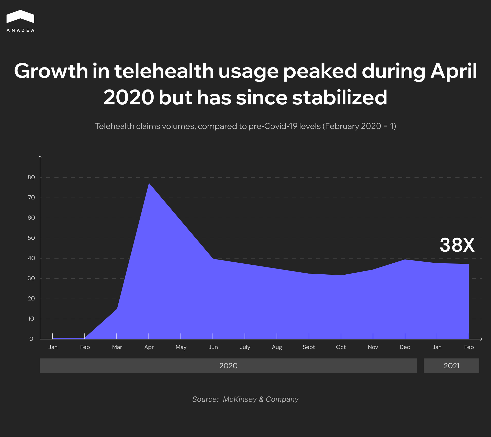
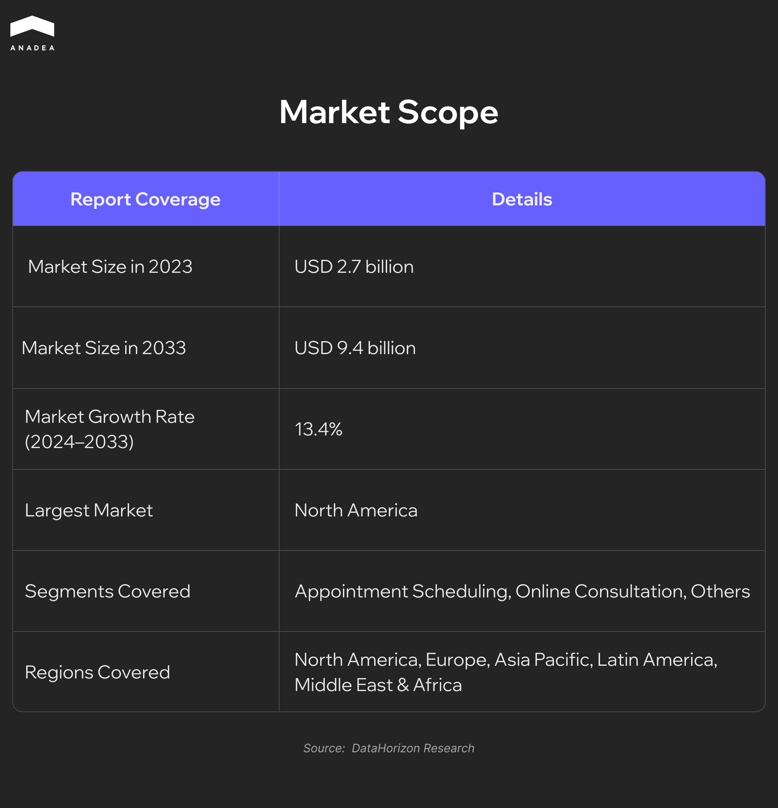
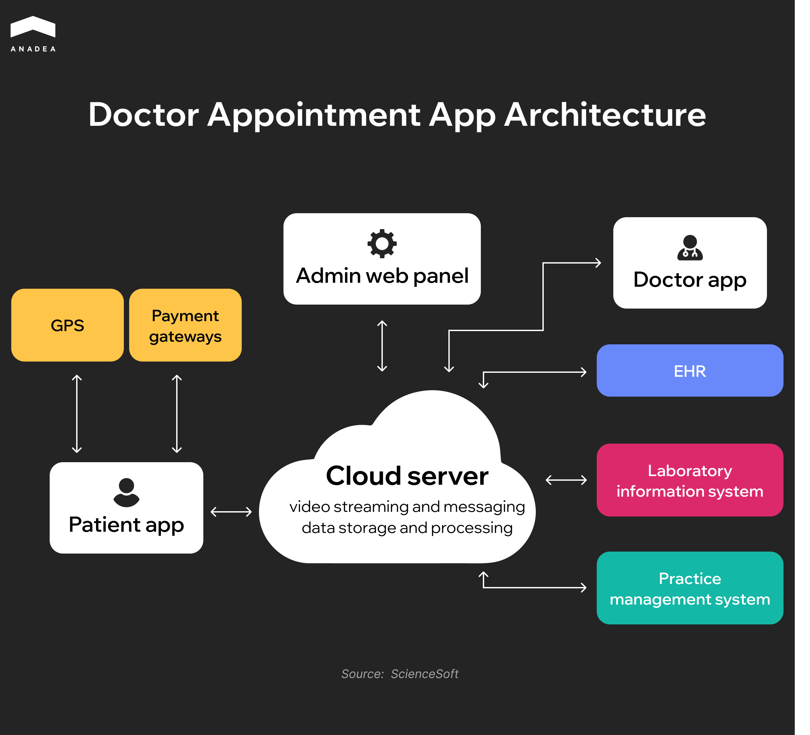

Some years ago, when you wanted to get an appointment at a medical center or clinic, you had to be ready to listen to the short beeps of a busy line for hours. The global healthcare system underwent rapid digital transformation in the wake of the COVID-19 pandemic. At its peak in 2020, telehealth visits in the U.S. surged to 32%, and even after restrictions were lifted, usage stabilized at 13-17%. That’s 38 times higher than before the pandemic ([McKinsey & Company](https://www.mckinsey.com/industries/healthcare/our-insights/telehealth-a-quarter-trillion-dollar-post-covid-19-reality)).

This shift proved far more than a short-term crisis response. In the US, physicians offering telemedicine services jumped [from 15% in 2019 to 86.5% by 2021](https://www.cdc.gov/nchs/products/databriefs/db493.htm). Concurrently, [43% of US adults ](https://jamanetwork.com/journals/jamanetworkopen/fullarticle/2816685)have now used virtual consultations, with 70% of those conducted via video calls.

In this landscape, medical booking apps have become indispensable tools for the modern healthcare industry. They streamline patient-clinic interactions, enable users to quickly find available doctors, choose appointment formats (in-person or online), receive visit reminders, maintain health records, and much more.

So how do you create a doctor appointment booking system – one that’s effective, secure, and user-friendly? This article explores the entire development process: key features, technology stacks, UX best practices, security requirements, and monetization strategies.

## Why Invest in a Doctor Appointment App in 2025?

Demand for healthcare services isn't decreasing—but how patients want to access them has fundamentally changed. In the US, nearly every other clinic is either testing or implementing a doctor appointment booking system. Mobile scheduling, automated reminders, digital health records. It’s about what impacts revenue, staff workload, and service quality.

We've assembled powerful facts demonstrating why investing in doctor appointment app development is a strategic move for 2025.

### The Market Is Growing Rapidly and Steadily

According to [DataHorizon Research](https://datahorizzonresearch.com/doctor-appointment-app-market-44556), the global doctor booking app market reached $2.7 billion in 2023 – and is projected to hit $9.4 billion by 2033. With an annual growth rate exceeding 13%, this is a compelling case for investing in products that solve specific challenges for medical businesses.

### Patients Expect Self-Service Capabilities

Modern users expect healthcare to be as accessible as Uber or a banking app. They don’t want to call, wait on hold, or manually coordinate appointments. If your clinic doesn’t offer online booking, potential patients will simply go elsewhere.

### It’s Profitable For Clinics

Digital scheduling reduces errors, optimizes doctor workload planning, and cuts down on no-show visits. This directly impacts clinic management efficiency, especially for large healthcare networks.

### Hybrid Care Is Becoming Standard

Telemedicine hasn’t replaced in-person visits. It’s become a permanent part of the patient journey. Businesses win when they can seamlessly offer both. An app that lets users choose their preferred appointment format and adapts to their habits? That boosts repeat visits and builds trust.



## How to Develop a Doctor Appointment Booking App

Now that the strategic value of developing a doctor appointment booking app is clear, we’ll outline a detailed, step-by-step implementation roadmap. This will enable you to better align with your doctor appointment app development partner (or internal team) and integrate industry best practices.

### Step #1. Plan Core Features for Each User Role 

Before diving into design or development, clearly map out your users and their expectations. Typically, this involves three key groups: patients, doctors, and clinic administrators. Each has distinct tasks, interaction scenarios, and pain points your digital solution must address. This step is especially critical in doctor appointment booking app development, where aligning features with real-world needs ensures better adoption and satisfaction across all user types.

#### Patients

For patients, efficiency is paramount. They want to avoid calling reception desks or explaining symptoms over the phone. They expect an app where they can: find a doctor, book instantly, and get reminders. Period.

Recommended patient features:

* Quick sign-up/login via email, phone, or social media – no complex passwords.
* Doctor search with filters for specialty, ratings, location, price, experience, and insurance coverage.
* Online booking/canceling with real-time availability.
* Calendar sync (Google/iCal).
* Automated reminders via push/SMS for appointments, changes, or cancellations.
* Pre-visit notes to share symptoms/questions in advance.
* Video consultations for telehealth needs.
* Medical history access (past visits, prescriptions, notes).
* Digital prescriptions for easy management.
* In-app payments (cards, Apple/Google Pay, e-wallets).
* Doctor reviews/ratings post-visit.

#### Doctors

For doctors, digital tools should reduce burden – not add to it. Less admin means more time for diagnosis and patient care.

Essential doctor features:

* Customizable profiles (photo, qualifications, services, languages).
* Smart scheduling (availability settings, urgent slots).
* Integrated calendar with patient details.
* Patient history access (records, allergies, lab results).
* E-prescribing tools with templates.
* Real-time notifications for bookings/changes.
* Secure video calls directly from the calendar.

#### Administrators

Admin tools may be "behind the scenes," but they’re the backbone of operations. Admins need full oversight to maintain efficiency and compliance.

Critical admin features:

* User management (add/edit/block doctors/patients).
* Scheduling logic (conflict rules, daily limits, priorities).
* Analytics and reports (bookings, no-shows, visit-to-payment conversion).
* Financial tools (payment reconciliation, accounting integrations).
* Support system (ticketing, complaint resolution).
* Security (access controls, 2FA, data consent management).
* Compliance (HIPAA, HITECH, GDPR, MACRA, CEHRT, SAFER).

**Pro tip from our team**. Define MVP features for each user role during planning. This focuses resources on core functionality, accelerates launch, and avoids building unused features.

### Step #2. Choose a Monetization Model: How a Doctor Booking App Earns Money

Investing in development is only the first step. The next is understanding how the platform will generate profit. The monetization model needs to be planned before doctor appointment app development starts, as it determines how you’ll scale, which users to attract, and your financial expectations.

Below are the most popular ways[ medical apps ](https://anadea.info/solutions/medical-app-development)earn revenue:

#### Subscription for Clinics or Doctors

The simplest and most transparent option: doctors or medical centers pay monthly or annually for the right to be listed on your platform.

This works if you have a strong user base or offer unique tools.

#### Commission per Booking

When planning doctor appointment booking app development, one of the most effective monetization strategies to consider is commission per booking.

Charge a fixed percentage or fee for each confirmed appointment. This is a profitable model since your income grows alongside user activity.

Works especially well when combined with online consultations or paid services.

#### Freemium Model

Some features are free, while users pay for advanced functionality. For example:

* Patients can book appointments for free,
* But pay to activate chat with doctors or AI symptom-checking bots.

This attracts a broad audience while monetizing only the most engaged users.

#### Paid Promotion for Doctors

Doctors can pay to appear higher in search results, get featured placements, or display banners on the homepage. This works if you have a large base of doctors and patients—competition stimulates visibility investments.

#### Advertising (but be very careful)

You can integrate ads for pharmaceutical products, labs, insurance services, or medical devices. But avoid turning the app into a banner platform—ads must be relevant, vetted, and aligned with healthcare themes.

### Step #3. Decide on Tech Stack

In the infographic below, you see the basic architecture of a typical doctor appointment booking app: everything from mobile applications and payment gateways to cloud storage, EHR systems, and laboratory databases.

This appears as a clear diagram, but behind each of these components lies a critical technology selection decision. That’s why the next step is choosing a tech stack that enables rapid, secure implementation with growth in mind. Here are our recommendations:

#### Frontend 

Use [React Native](https://anadea.info/services/web-development/react-js-development) or [Flutter](https://anadea.info/services/mobile-development/flutter-development-services) to build cross-platform apps for [iOS](https://anadea.info/services/mobile-development/ios-development) and [Android](https://anadea.info/services/mobile-development/android-development) with a shared codebase. That means faster time-to-market and easier maintenance for both patient- and doctor-facing interfaces.

#### Backend (Server Logic and APIs)

Choose your backend depending on your team’s expertise and system complexity:

* [Node.js](https://anadea.info/services/web-development/node-js-development) – lightweight, scalable, perfect for real-time features like chat or appointment updates.
* Django ([Python](https://anadea.info/services/web-development/python)) – great for rapid prototyping, built-in admin tools, and high security.
* [Ruby on Rails](https://anadea.info/services/web-development/ruby-on-rails-development) – fast development and developer-friendly structure, ideal for MVPs.
* [Java](https://anadea.info/services/web-development/java) (Spring Boot) – enterprise-level stability and performance, especially when integrating with hospital systems or building for large-scale clinic networks.

#### AI Capabilities

If you're planning to implement AI, choose a backend that supports Python-based ML frameworks (like TensorFlow, PyTorch), and integrate with external AI APIs.

#### Database

* PostgreSQL – robust, relational, perfect for structured medical data and compliance tracking.
* MongoDB – flexible and efficient for unstructured data like consultation notes or chat logs.

#### Cloud Infrastructure

Deploy on trusted providers like AWS, Google Cloud, or Microsoft Azure. All offer:

* HIPAA/GDPR-compliant services;
* Auto-scaling infrastructure;
* Global content delivery;
* Role-based access and data residency options.

#### Video Consultation API

Add secure, low-latency video features via Twilio, Agora, or WebRTC. These APIs handle the complexity of video infrastructure and support encrypted streams by default.

#### Notifications

Use Firebase Cloud Messaging or OneSignal to power cross-platform push notifications — from appointment reminders to health alerts.

#### Security & Compliance

Security in healthcare isn’t optional – it’s mission-critical. We recommend:

* End-to-end encryption (in transit & at rest);
* Multi-factor authentication (MFA);
* Role-based access control (RBAC);
* Secure API gateways;
* Full compliance with HIPAA, GDPR, HITECH, and SAFER guidelines;
* Regular audits and incident response frameworks.

### Step #4. Ensure Regulatory Compliance

When planning how to build a scheduling app for healthcare, security and privacy should be your top priorities. If your app handles medical data, regulatory compliance becomes non-negotiable. Before production launch, you must ensure all data collection, storage, and exchange mechanisms comply with regulations in your target markets. This means aligning with standards like HIPAA in the US or GDPR in the EU, using encryption for data at rest and in transit, and implementing strict access controls for both patients and doctors.

Key considerations during development:

#### HIPAA (USA)

[Mandatory standard](https://www.hhs.gov/hipaa/index.html) for all U.S. healthcare apps. Governs protection of patient health information (PHI) through authentication, encryption, and access logging.

#### GDPR (EU)

[Applies to all products ](https://gdpr.eu/)processing EU residents' data. Requires transparent consent mechanisms, data processing notifications, and right-to-erasure compliance.

#### HL7/FHIR

[Medical data exchange standards](https://fhir.org/) essential for EHR integrations, lab systems, insurance providers, and healthcare APIs.

#### National Regulations

Country-specific frameworks including:

* [PIPEDA](https://www.priv.gc.ca/en/privacy-topics/privacy-laws-in-canada/the-personal-information-protection-and-electronic-documents-act-pipeda/) (Canada)
* [NHS Digital Standards](https://digital.nhs.uk/data-and-information/information-standards) (UK)
* [DVG](https://www.desinfektion-dvg.de/english-information) (Germany)

These requirements impact not only backend/database architecture but also UX: consent flows, medical history access, and personal data editing interfaces.

### Step #5. Development Timeline and Cost Breakdown

If you’re planning to develop a doctor appointment app, there’s no universal price tag – it varies widely. The price depends on feature scope, integration complexity, market specifics (B2C or B2B), and whether you’re building from scratch or using existing solutions.

#### Estimated Budget

* $20,000 - $35,000 – for a basic MVP with core functionality for patients and doctors (registration, doctor search, appointment booking, reminders, user profiles).
* $35,000 - $60,000 – for a more advanced version that includes an admin panel, analytics, online consultations, and EHR system integration.
* $60,000 and above – for apps with advanced features like AI symptom checkers, real-time video consultations, integration with wearable devices, complex business logic, or custom infrastructure.

#### Estimated Timeline

* 5 to 8 months – typical development time for a full-scale solution for iOS, Android, and web platforms, including research, design, development, and testing.
* 3 to 4 months – to launch a well-scoped MVP, assuming a focused team and clearly defined functionality.



### Step #6. Guarantee Thorough Testing Before Launch

Before launching the doctor appointment application to production, it’s essential to make sure everything works reliably and predictably. In healthcare, there’s no room for errors – especially when it comes to scheduling, payments, or access to personal data.

Here’s what should be covered during the QA process:

* Core features must function properly across different scenarios such as booking, rescheduling, canceling, payments, and accessing visit history.
* Edge cases matter as well including simultaneous user actions, weak internet connection, or failed payment attempts.
* All external integrations need to be stable such as video calls, EHR systems, calendar sync, login services, and payment gateways.
* The interface should feel logical and easy to use with clear navigation, consistent behavior, and responsive layout across devices.
* Compatibility must be tested across different platforms including iOS, Android, tablets, and web browsers.
* Data security has to be verified through authentication checks, access control, encryption, and response to unauthorized actions.

Testing is not just a final step but a core part of the development process. It ensures that once the app goes live, it behaves as expected – both for users and for the business.

### Step #7. Launch And Market Your App

If you’re looking for a doctor appointment app development company, remember that building the product is only half the job. A release isn’t the finish line – it’s the starting point. And you need to approach it with a clear plan to avoid missing the moment when your app just hits the stores and still has a chance to grab attention. Marketing shouldn’t be a separate stage – it’s part of the launch.

What needs to be done before and right after publication:

1. **Set up store pages** – polished screenshots, clear descriptions without generic phrases, relevant keywords, localization into at least major languages, correct categories. For medical apps, pay attention to specifics – privacy policies are a must, and you might need proof of compliance with regulations.
2. **Prepare onboarding** – a simple and fast app intro, without unnecessary screens. The main goal is to guide the user to the first key step: booking a doctor appointment or starting a search.
3. **Set up analytics** – in-app events, conversions, acquisition channels, and post-install tracking. Without this data, you won’t understand what’s working.
4. **Start with proven channels** – basic search ads, posts in relevant Facebook groups, small-scale PR in niche medical media, or partnerships with clinics willing to share a link to your app with their patients.
5. **Prepare a landing page** – even if the app is mobile-only, you’ll still need a web page to explain what the app does, answer common questions, gather traffic, and redirect visitors to store pages.
6. **Plan support** – connect a live chat, add a contact form, and assign someone responsible for answering the first user inquiries.
7. **For B2B products** – you’ll need extra materials: presentations, demos, a short sales pitch. Ideally, you already have a list of potential clients who will get early access or an invitation to a demo.

All of this doesn’t have to be a massive, perfect launch. But you do need a minimum level of readiness to meet users, explain why your doctor appointment application matters – and not lose them after their first interaction.

## Our Experience in Building Solutions for the Healthcare Industry

At Anadea, we work with companies that work in different spheres, but healthcare is one of the domains that we focus on. As a doctor appointment app development company, we have in our portfolio a row of solutions built for this industry, including [Gogoof](https://anadea.info/projects/gogoof), which is an online doctor appointment booking system. It is a web-based SaaS product for the mental health sector. With this app, therapists can schedule appointments, create custom plans for individual patients or groups, and monitor their progress. Patients also get access to the portal, can connect with professionals, view their treatment plans, and track their progress. The core feature is a calendar. It shows appointments and treatment programs, and it is absolutely simple to reschedule the planned meetings.

Another project that you can read about is **My Medical Guide**. It is a solution for automating and digitizing the work of a medical institution. The platform has a wide range of tools, including but not limited to patient records management features, visit management functionality, and a staff calendar. To get more info about this project, please follow the <a href="https://anadea.info/projects/my-medical-guide" target="_blank">link</a>.

## Conclusion

The digitalization of various industries is actively going on. Many traditional processes have been practically fully replaced with new alternatives. And while many clinics still offer their patients to book appointments via phone calls, others are actively integrating tech tools. That’s why the launch of a doctor scheduling app can become an excellent project, as it will represent a huge value for both patients and medical staff. In particular, developing an app to make doctor appointment gives patients a faster, more convenient way to connect with healthcare providers, while helping clinics optimize schedules, reduce administrative load, and improve overall service quality.

At Anadea, we have rich expertise in building solutions for the healthcare industry, including doctors office scheduling software, and we will be ready to support you at any stage of your project development. [Contact us ](https://anadea.info/contacts)to learn more about our experience and services!
