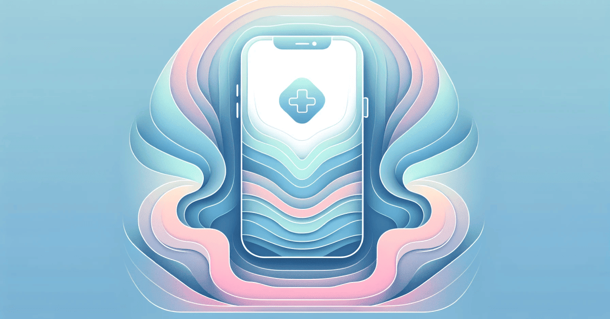

Some years ago, when you wanted to get an appointment at a medical center or clinic, you had to be ready to listen to the short beeps of a busy line for hours. Although some healthcare institutions still follow the same patterns, many others have already introduced alternative methods. Thanks to the digitalization of this process, now, when you need to visit a doctor, it can be enough just to make a couple of taps in a medical appointment app.

In general, the demand for <a href="https://anadea.info/solutions/medical-app-development" target="_blank">medical app development</a> today is continuously growing. And there are dozens of reasons for that. But the strongest factor that still has an enormous influence is the coronavirus pandemic. Though the pandemic is over, a lot of markets still have some tasks to do in order to solve the issues that it highlighted. In the case of healthcare, it became obvious that the industry was not ready for crises. Modern technologies can change the game. The rise of **telemedicine** is a good example.

As for doctor appointment scheduling software that can be used for both online and traditional visits, one of the key ideas behind its introduction is convenience. This convenience can be ensured not only for patients but also for doctors and administrative staff. A doctor scheduling app can not only help to reduce the time needed for making an appointment but also allow users to minimize risks of mistakes and centralize all data related to appointments.

Moreover, regardless of the industry that we are talking about, **34% of online appointment bookings** are <a href="https://marketsplash.com/appointment-scheduling-statistics/" target="_blank">made</a> outside of office hours. In other words, it doesn’t matter what time is, patients can still use an online doctor appointment booking system. And that’s a huge plus.

If you are planning to develop a doctor appointment app and you want your solution to succeed, we have a row of practical tips for you.

## Target audience of your medical appointment app and market research

When you have decided that you want to build an app for doctor appointment, you should study the market needs and review the expectations of your target audience. In general, the appointment scheduling software market is actively expanding. In 2023, the market size [reached](https://www.verifiedmarketresearch.com/product/appointment-scheduling-software-market/) the level of **$294.25 million**. Experts believe that it can hit a new milestone of **over $400 million by 2030**. It means that the expected CAGR is close to 10% for the period from 2024 to 2030.

Why is it important to study the market before initiating doctor appointment app development? It will help you to see what solutions are already available, what benefits and drawbacks they have, and define what can be done better.

Here, you should decide on whether you will launch a doctor scheduling app for one medical center only or whether it will be a common platform for many organizations that offer healthcare-related services. Depending on this decision, you will be able to understand what tasks your application for doctor appointment should solve. Will it only facilitate the interaction between patients and a clinic? Or will it also help people find the required services across different organizations?

After getting a clear understanding of the target audience of your online doctor appointment booking system, you can start thinking about its functionality.

Get a consultation

## Doctor appointment app features

The exact set of features that you will build for your medical appointment scheduling software should be chosen based on your project concept. Nevertheless, let us share the list of the most common doctor appointment app features. We hope that it may help you define what tools you should include in your product.

### Essential features for doctors and patients

- **Search tools**. You should provide a convenient search functionality. It could be a good idea to make it filter-based so that patients can find a list of available doctors with the required skills just in a few clicks.
- **Booking tools.** Patients should be able to see available slots in doctors’ schedules and make bookings.
- **Appointment management tools**. Users should be allowed to view, change, and cancel their bookings. Doctors should also be able to introduce changes in their own schedules.
- **Real-time chat**. This channel of establishing communication with a support team and administrative staff will greatly facilitate the way of getting the required info for patients.
- **Online payments**. Though not all appointment booking apps have such functionality, it will be a good idea to add it. This payment method provides users with greater flexibility and convenience.

### Advanced features

- **Online consultations**. Telemedicine features let patients avoid the necessity to leave their homes to get a consultation. You can make it possible for them to communicate with doctors via a chat, a phone, or video call.
- **Integration of EHR.** Thanks to integrating electronic health records into an app for doctor appointment, you will ensure faster access to the required data and its secure transfer. With EHR integration, all doctors will be able to see full info about patients’ diagnoses and symptoms.
- **E-prescriptions.** This feature will help reduce paperwork and allow patients to get prescriptions in a remote format.
- **Knowledge base.** You can enrich your application with a section where users can find helpful health-related tips, as well as different updates regarding innovations in medicine.

### The most innovative functionality

- **AI-based symptom checker.** Artificial Intelligence can greatly streamline a lot of processes for people. With an AI-powered chatbot, users can get a general understanding of their states in just a few minutes. Of course, such tools won’t be able to replace doctors (at least in the near future). However, they will help patients make more informed decisions on their plan of action if they notice any symptoms.
- **Integration with wearable devices.** Today, there are different devices for health monitoring. While some of them, like fitness bracelets, are commonly used, there is also a range of special medical wearables that are used exclusively in the healthcare industry. Such devices can continuously monitor various parameters (like blood pressure or blood sugar level) and send this data to the app. If any critical changes in these parameters are defined, an app can notify a patient and medical staff.

Talk about your project

## Doctor appointment scheduling software UI/UX design

It doesn’t matter whether you want to develop a doctor appointment booking app, a [professional medical solution for doctors](https://anadea.info/blog/how-to-develop-a-professional-medical-app-for-doctors), or any software product for any other domain; you always need to think about what users will see and what they feel while interacting with your product.

Let’s be honest: when you see two solutions in front of you, one built 20 years ago and the second one built 1 year ago, you will easily tell them apart. There are trends in design. And when you are creating your own app, you need to take them into account. Of course, we all have different tastes, but when it comes to healthcare-related apps for a wide audience, there are some general rules to follow.

1. **Try to keep it simple.** Even if you have a complex, feature-rich product, it should be easy to interact with.
2. **Don’t use too many images and colors.** The visual part shouldn’t distract users from functionality.
3. **Introduce voice commands.** Voice user interfaces help to create hands-free experiences, which is one of the trends in UX design today.
4. **Implement data-driven design and personalization.** Data-driven design presupposes relying on user data to provide tailored experiences. It is required to analyze demographics and behavior patterns to elaborate design strategies that address the needs of each user.
5. **Think about the accessibility of your solution.** The concept of accessible design goes much beyond making your doctor scheduling app compatible with devices of different types. Your task is to make your solution comfortable to use for people with various disabilities and limitations. Hands-free experiences, text-to-speech, and speech-text tools are among the examples of such design.

## Approaches to doctor appointment booking app development

Another thing that you should think about is the development approach. For mobile apps, you can opt for <a href="https://anadea.info/blog/native-vs-cross-platform-app-development" target="_blank">native vs cross-platform app development</a>. Both options have their pluses and minuses.

Native development proposes creating separate code bases for iOS and Android apps. Cross-platform development involves writing one code that will be compatible with two operating systems.

<table>
  <tr>
    <th></th>
    <th>Native Development</th>
    <th>Cross-platform Development</th>
  </tr>
  <tr>
    <td>Pros</td>
    <td>This approach will allow you to create absolutely unique applications that will demonstrate excellent performance and stable functioning.</td>
    <td>You can greatly save your time and money. You do not need to hire two teams of developers.</td>
  </tr>
  <tr>
    <td>Cons</td>
    <td>It is a rather time-consuming approach that requires bigger investments.</td>
    <td>There can be some limitations in building the required functionality and performance.</td>
  </tr>
  <tr>
    <td>When to choose</td>
    <td>It is usually chosen for complex solutions with a huge number of tools and integrations.</td>
    <td>It is a perfect option for less complex apps, MVPs, and small projects.</td>
  </tr>
</table>

Based on the chosen approach to the doctor appointment app development, you will need to define the technologies that will be used.

- **Mobile development:** Swift for iOS and Java for Android
- **Frontend development:** ReactJS, Angular
- **Backend development:** Python, PHP, Node.js
- **Database:** Postgres, MongoDB, MySQL
- **Calendar integration:** Google Calendar
- **Payments:** Stripe, PayPal, Google Pay, Apple Pay
- **Push notifications:** OneSignal, Twilio, Push.io
- **Maps integration:** Google Maps API, MapKit



## Compliance and security of your medical appointment app

Healthcare is one of the industries with the strictest regulations and the most serious requirements for data protection. Each jurisdiction has its own regulations and laws. That is why you should check what rules are in force in the region where you want to make your app available.

In the US, one of the most important laws that should be taken into account when you are creating an app for doctor appointment is **HIPAA**. It requires the introduction of standards to protect sensitive patient health information. In the Europan Union, there is another legal framework - **GDPR**. It should be used by organizations that deal with the personal data of citizens.

To make sure that your app ensures the required protection for users’ data, you can introduce such measures as:

1. Data and code encryption;
2. Two-factor authentication;
3. [Passwordless auth implementation](https://anadea.info/blog/how-to-implement-passkeys);
4. Use of authorized APIs only;
5. Use of reliable libraries;
6. Minimized storage of sensitive data;
7. Continual testing and updating;
8. AI-powered monitoring tools.

## Testing and feedback loop

When you are building doctors office scheduling software, you should make sure that your final product fully meets your expectations and users’ needs. It is necessary to test your software through the development process not only to define and fix bugs but also to **see what stakeholders and potential users think about it**.

Feedback loops are mechanisms that are aimed at validating and receiving both positive and negative feedback about the software development process. The goal of using such mechanisms is to immediately implement the required changes to achieve better results.

There are different types of feedback loops:

- Daily standups (scrums);
- Getting user feedback;
- Calls with stakeholders;
- Code reviews;
- Unit testing;
- Performance validation in pre-production environments;
- Performance monitoring in production;
- Product usage tracking.

## Monetization of your doctors office scheduling software

It’s obvious that when you invest in doctor appointment booking app development, you want to make money with this solution. There are several options that you can use:

- A subscription-based model for doctors/clinics that want to be listed on your platform;
- Online paid consultations for patients;
- Paid features (like AI-powered chatbot for checking symptoms);
- Advertisement on your app.

## Medical appointment app launch and marketing

Mobile apps should be published on **marketplaces** (Google Play and App Store) where they can be found and downloaded by users. To be published there, your app should meet the requirements introduced by these platforms.

Today, there is a great number of applications. That’s why we also recommend you do your best to make our app visible to potential users. One of the ways to do it is to apply the principles of **ASO** (app store optimization). The use of the right keywords, a good description, and high-quality images increase the chances for your app to be ranked higher.

As for other marketing efforts, it will also be useful to think about the promotion of your doctor scheduling app outside marketplaces. You can establish cooperation with medical centers that will tell their patients about your app and work with bloggers and influencers, as well as pay for contextual advertising.

Build my app

## Post-launch support and continuous improvement

Sometimes, people think that after their solution is launched, they can fully relax and enjoy its work. However, this is not true. It is highly important to continuously track the performance of your app, define the existing vulnerabilities, and address them.

Your doctors office scheduling software will work with sensitive users’ data. That’s why you should pay high attention to its security and continuous monitoring is a must.

Moreover, you also need to take into account what users think about your solution and introduce improvements based on their needs. To gain loyal users, you should demonstrate to people that their opinions are valuable to you.

## Our experience in building solutions for the healthcare industry

At Anadea, we work with companies that work in different spheres, but healthcare is one of the domains that we focus on.

In our portfolio, there is a row of solutions built for this industry, including <a href="https://anadea.info/projects/gogoof" target="_blank">**Gogoof**</a>, which is an online doctor appointment booking system. It is a web-based SaaS product for the mental health sector. With this app, therapists can schedule appointments, create custom plans for individual patients or groups, and monitor their progress. Patients also get access to the portal, can connect with professionals, view their treatment plans, and track their progress. The core feature is a calendar. It shows appointments and treatment programs, and it is absolutely simple to reschedule the planned meetings.

Another project that you can read about is **My Medical Guide**. It is a solution for automating and digitizing the work of a medical institution. The platform has a wide range of tools, including but not limited to patient records management features, visit management functionality, and a staff calendar. To get more info about this project, please follow the <a href="https://anadea.info/projects/my-medical-guide" target="_blank">link</a>.

Get estimate

## How much does it cost to develop a doctor appointment booking app?

The cost of doctor appointment app development depends on the concept of your solution, its functionality, and your special requirements. As a rule, the price of such projects will be around **$20,000-$60,000**. However, if you plan to add some advanced features like AI chatbots or you want to integrate your app with wearable devices, investments in such projects will be higher.

As for the timeframes of such projects, they also can vary. Here, it is important to take into account not only the project’s complexity and functionality but also the composition and the size of the team that you will have. On average, the creation of such an app takes **5-8 months**.

If you turn to our team and share your ideas with us, <a href="https://anadea.info/free-project-estimate" target="_blank">request a free quote</a>. We will estimate the scope of work and the necessary budget. Also, if required, we will be able to offer ways to optimize your expenses without losing the quality of your future product.

## Conclusion

The digitalization of various industries is actively going on. Many traditional processes have been practically fully replaced with new alternatives. And while many clinics still offer their patients to book appointments via phone calls, others are actively integrating tech tools. That’s why the launch of a doctor scheduling app can become an excellent project, as it will represent a huge value for both patients and medical staff.

At Anadea, we have rich expertise in building solutions for the healthcare industry, including doctors office scheduling software, and we will be ready to support you at any stage of your project development. Contact us to learn more about our experience and services!

Drop us a line
