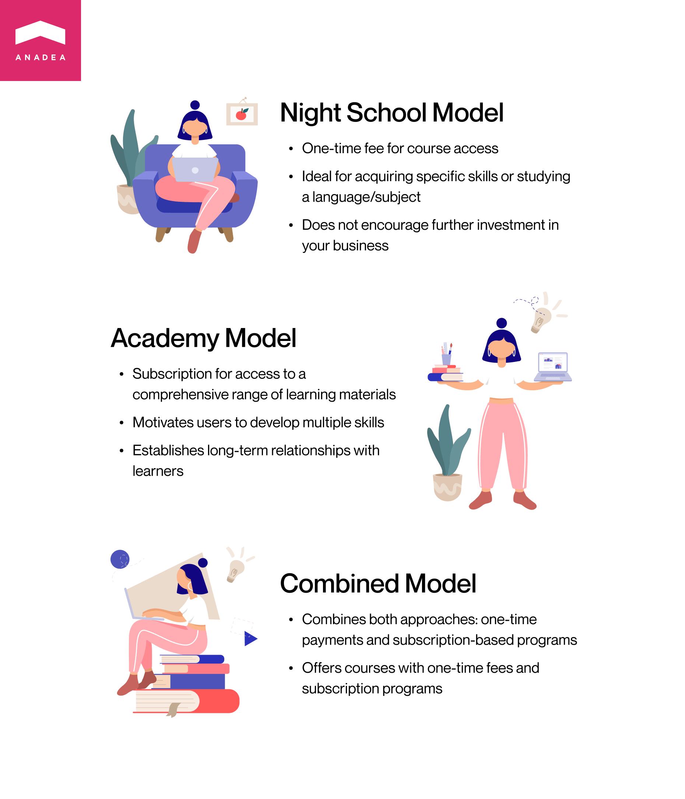

Modern approaches to education seriously differ from traditional ones. And technologies play a vital role in this transformation. Thanks to the introduction of new solutions and tools, the e-learning industry is growing at an impressive pace. In 2022, the [global e-learning industry size](https://www.vantagemarketresearch.com/industry-report/online-education-e-learning-market-2028#:~:text=Snapshot&text=Global%20Online%20Education%2FE%2DLearning,17.2%25%20over%20the%20forecast%20period.) was at the level of over $198 billion. And with the projected CAGR for the period from 2023 to 2030 of over 17%, this figure will be around $692 billion by 2030.

An interest in online education from different participants of this market is continuously boosting the demand for e learning website development services and pushing more and more businesses to think about launching their own solutions.

But what are the factors that drive the market growth? First of all, it is the flexibility that is available to students and professors. Very often online learning can fully replace traditional approaches to getting education in offline classrooms. The necessity to have such an alternative variant became obvious in 2020 during the first wave of the coronavirus pandemic and the most serious lockdown measures. A lot of people were deprived of the possibility to attend educational institutions. Schools, universities, and language centers had to look for new options to provide their services. Namely, amid the COVID-19 pandemic, a lot of institutions made a decision to build an eLearning website for the needs of their students.

**Among favorable factors for the industry development, we also should mention other benefits of online education:**

- the possibility to continue studying at any time and from any location;
- new engaging formats of learning materials;
- personalization of content and educational programs;
- higher efficiency of learning;
- reduced cost of education;
- access to detailed analytics;
- the possibility to adjust the learning process to the needs of students;
- increased satisfaction of learners.

Nevertheless, if you want to create eLearning website today, it is vital to understand that you may face serious competition. The industry already has its strong players and to win your market share you should offer a high-quality solution that will satisfy all the ongoing requirements of users. And in this article, we are going to share our professional secrets on how to create an eLearning website that will be able to succeed and gain positive reviews from learners and professors.

## Types of e-learning platforms

If you are interested in [eLearning platform development](https://anadea.info/blog/create-online-learning-platform), one of the first things that you will have to do is to choose the exact type of solution that you want to launch. There can be different approaches to classifying these software products. We offer you the following one.

### LDS (learning destination websites)

On this platform, users can get access to different courses published by numerous professors, universities, or companies. Very often, these websites are enriched with functionality for authors that allows them to create, update, and change the learning materials.

Coursera and Udemy are the most well-known examples of such solutions. **Coursera** today has more than 100 million users from all over the world who can get access to its 7,000+ courses. The platform cooperates with universities and organizations that provide online courses, degrees, and certifications in a wide range of fields. It is interesting to observe how Coursera itself is expanding and transforming with time flow. The platform is open to new technologies and in April 2023, it [announced](https://blog.coursera.org/immersive-learning-on-coursera-2023/) the release of VR-enabled course experiences from prominent universities. The course is powered with VR capacities to make the learning more engaging and helps users to develop job-relevant AR skills.

**Udemy** also boasts great popularity and currently has more than 62 million registered users, over 70,000 instructors, and 210,000+ courses. Moreover, the platform has more than 14,000 enterprise customers.

### LMS (learning management system)

These platforms are intended for letting companies organize various educational and training activities. They typically have rich functionality for creating the required materials, managing, editing, and organizing distribution for making them available to learners. **Moodle** is a bright example of such a platform. It is targeted at learners and educators who are looking for a highly efficient learning environment that offers a lot of possibilities for personalization. Today 44+ million courses that are available in 239 countries have been created on Moodle.

### LXP (learning experience platform)

If you are planning to build e learning website for corporate needs, we recommend you consider this option. Thanks to AI-powered functionality, these platforms allow to deliver personalized and agile education to learners. With the most relevant materials chosen from a huge library of content, learners can get the most valuable knowledge that will correspond to their needs. A cloud-based learning suite **Docebo** can be named as an example of a platform from this category. Today it has around 3,000 corporate users all over the world.

### LME (learning management ecosystems)

Such platforms can be explained as some kind of combination of the functionality of LDS and LMS. They have all the required tools for creating courses. And they also open access to learning materials for students. Very often, businesses that are interested in e learning website development launch such platforms for their internal needs. Such systems can be also built for the needs of universities and only their students, professors, and administrative staff will use them.



## E learning website development: Define your target audience

If you have already started looking for the answers to the question of how to create an eLearning website, you probably already know that after choosing the type of product you need to analyze the peculiarities of its potential users. Some businesses believe that the analysis of the target audience should be conducted only at the first stage of the [eLearning course development process](https://anadea.info/blog/4-fundamental-stages-in-elearning-course-development-process). But it is not so. You should know your users, their needs, their expectations, and preferences already at the stage of preparing requirements for your e learning website development.

By having a good understanding of these things, you will make better decisions when it comes to choosing the design of your platform and the features to be added. Of course, when you need to build an eLearning website for your employees, it can be easier to understand their preferences and needs. But when you've chosen an external audience, it is a completely different story.

**Here are a couple of tips that can help you:**

1. Analyze the market and study the target audiences of similar products.
2. Detect the goals that you want users to achieve with your solution.
3. Identify industry trends and the most highly-demanded functionality.
4. Create user personas that will encompass all the crucial details about those people who can be interested in your product.
5. Listen to users' opinions after the launch of your MVP to enhance your platform.
6. Use analytics tools after the release in order to understand how people interact with your website and be ready to continuously improve it.

## How to choose the business model when you build e learning website?

When you want to create your own e learning website for an external audience and monetize this product, you need to apply the right business model. There can be different models but we'd like to focus on three of them that have proven to be the most suitable for eLearning projects.

1. **Night school model.** It presupposes paying a one-time fee for getting access to the course. Usually, this model is the best choice for those cases when a learner wants to get a particular skill or study a particular language or subject. It is a convenient model but it is important to understand that it doesn't encourage users to further invest in your business. They just buy one course, pass it, get new knowledge, and can leave the platform if they do not have any other plans for getting new knowledge.

2. **Academy model.** This is a subscription-based model. Here, your business will operate as a virtual school which will motivate users to develop numerous skills by getting access to a huge range of learning materials. As a rule, the content can be available in many different formats, and by paying a subscription fee, a person will be able to use all of them. Such platforms are aimed at establishing long-term relationships with learners.

3. **Combined model.** Platforms that choose this option have a combination of the two models mentioned above. Such websites offer courses with one-time fees and subscription-based programs.

Widely known Coursera and Udemy have opted for a combined approach. They offer paid courses and also allow their users to choose a subscription plan to learn whatever and whenever they want. This flexibility is a good choice for well-established businesses. At the same time, young platforms quite often prefer the Night school model as it allows them to quickly start gaining revenues and expanding their user bases.

## Essential features of an e-learning website

If you have plans to create your own e learning website, you need to make sure that the interaction with it will be comfortable and clear to all potential users. As the online education industry has been already developing for a couple of decades, there are already some market standards that you need to follow. Below you can find a list of features that should be created for your website.

- **Registration**. It is important to make this step quick and clear. It will be a good idea to let learners sign up by using a social media or Google account.

- **Personal account.** This section should include all personal details of a user, a preferred payment method, a history of transactions, and a list of the acquired/passed/unfinished courses.

- **Payment gateways.** It is important to think about the comfort of users and the security of their money. We recommend you integrate the most popular payment systems like Paypal, Stripe, Apple Pay, and Google Pay. But you can also research the market to understand what methods your potential users usually prefer for online payments.

- **Search system.** You should include a convenient filter-based system for easily finding the required courses.

- **Dashboard for teachers and students.** This panel should be enriched with the tools for managing their courses (either those that have been created by them or have been chosen). You can also add the functionality for creating learning plans and schedules.

- **Dashboard for administrators.** This feature will allow admins to manage the content on the platform, update courses, introduce changes, operate subscriptions, send notifications to users, or even block them.

- **Course pages**. Each course should have its introductory page with a detailed description. There should be buttons for buying the course, joining it, or proceeding to its materials.

Based on the type of content that you will publish on your website, it should be also equipped with a video player, libraries, or tools for live broadcasting.

## Additional features for your e-learning platform

As the competition in the industry is rather high, you need to build an eLearning website that will stand out from the row for its unique and advanced features. What are the key trends in e learning website development today?

- **Gamification**. Everyone likes games and the spirit of competition. To boost learners' engagement and help them to achieve better results, we recommend you add such elements as leadership boards, different rewards (like badges and stickers) for new achievements, quiz-like tests, and various extra tasks for getting points or unlocking new levels.

- **Personalization**. It is one of the main trends in software development today. Personalized learning plans and AI-powered recommendations will specifically address users' needs and add more value to all their learning efforts. Personalization will help people to focus on their problem areas and move further at their own speed.

- **Social learning**. This concept is based on the belief that by observing others and communicating with them we can better develop new skills and behaviors. And thanks to modern tools, this concept can be applied to online education as well. That's why adding such formats as discussion forums, chats, peer mentoring, virtual group projects, and the use of social media for sharing materials and resources with followers can be a good idea.

All these elements can greatly enhance user experience, make the learning process more result-oriented, and boost the efficiency of all their efforts.

## Key tips on how to create an eLearning website

With our rich expertise in building solutions for the eLearning industry, we've managed to prepare our own list of important things to do, if you want your website to succeed.

### Tip 1. Create an intuitively-clear design

When users open your website and they do not know what they should do at least to have a look at the list of the available courses, it is likely that they will just close the page and start looking for a new platform. How can you make the navigation intuitively clear?

1. Follow the modern trends in design.
2. Use visual design elements to facilitate navigation.
3. Organize content in a logical manner.
4. Test your navigation with your target audience before the product launch and introduce changes.

### Tip 2. Choose the right tech stack

It is very important to use the technologies that will ensure the desired scalability and flexibility of your website and will allow you to integrate it with other third-party solutions. Moreover, we advise you not to choose very rare or already obsolete tools. Otherwise, it will be very challenging to find experts who will be able to work with them. The exact tech stack will depend on the desired functionality of your website but we have some examples of popular technologies that you can consider.

- **Frontend:** HTML, JavaScript, ReactJS
- **Backend:** PHP, Python, Node.js
- **Database:** MongoDB, MySQL
- **Payment gateways:** Stripe, Paypal, Apple Pay, Google Pay
- **Video streaming:** RTMP, WebRTC
- **Cloud platform:** Google Cloud, AWS, Microsoft Azure
- **Push notifications:** Onesignal, Firebase

### Tip 3. Hire a professional development team

If you want to outsource software development, you will have a wide choice of companies to choose from as your potential partner. We highly recommend you analyze their expertise in the eLearning industry, the tech stack that they work with, the reviews written by their customers, and the [IT company portfolio](https://anadea.info/projects#elearning). It is also important to find out whether the company will be ready to offer post-launch support services. For seamless website functioning, regular maintenance and monitoring are a must.

The exact composition of your development team will be defined after you provide your requirements for the project. But as a rule, for e learning website development from scratch, it will be necessary to have a team of 5 members: **two software developers, one UI/UX designer, a QA engineer,** and **a project manager.**

### Tip 4. Provide high-quality learning materials

A good online education platform is not only about excellent tech part but also about up-to-date and highly relevant learning materials with unique insights. To provide them you need to establish cooperation with good educators.

Depending on your approach, you can work either with individual teachers (here, it will be crucial to be very attentive at the stage of onboarding and carefully verify their expertise) or with educational institutions and universities with outstanding reputations.

When you are only starting your business journey, it can be rather challenging to establish cooperation with globally known universities. That's why you can start with local establishments and gradually move to new heights with the growth of your platform.

### Tip 5. Promote your website

Marketing is of vital importance for the success of your business. And here, again, you will need to use your knowledge about your target audience. Based on their interests, you will understand what promotional tools will be the most effective in your case.

Among the most popular ways to promote a learning website is to use social media channels and work with influencers that are popular among your potential users.

Moreover, we recommend you apply different incentives like free courses or discounts for joining your platform or inviting friends. You can also ask users to share the links to your website on their social media accounts to get some bonuses.

## How much does it cost to create your own e learning website?

This is the most pressing question for every business that is considering such plans. Nevertheless, it is impossible to name the exact amount without analyzing your project. The costs will be calculated based on the rates of your software development partner and may vary given the complexity of the solution and the desired features.

In general, the average cost of such a project starts at $40.000.

## Final word

The e learning website development can become a very promising idea for your business today. But to make sure that users will like it, you need to carefully study the market and detect their ongoing demands.

If you need a professional development team to assist you at any stage of the project realization, at Anadea, we are always open to cooperation. Thanks to our experience in creating solutions for this industry, we are sure that we will help you to build the best online platform for learning.

Do not hesitate to contact us to get more detailed information on our services! Moreover, we will provide your project estimates absolutely for free.

Get in touch
