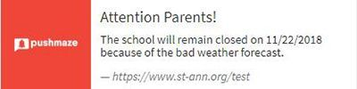

You certainly received a push notification from some app today—a reminder, an announcement, or an email preview. These notifications truly justify their name, effectively pushing users to an action. This article aims at explaining how they can be used in education to improve the overall performance of the students and reveals some mobile app and web browser push notifications insights.

## Ways to blend push notifications with regular learning
What are push notifications in Ed-tech? Push notifications are the easiest way to adopt some non-traditional yet competent ways to make learning efficient, entertaining, and engaging. The app push notifications students receive can, in fact, assist in the seamless operation of an educational institution. <a href="https://anadea.info/solutions/e-learning-software-development" target="_blank">Educational software development</a> is not the only way to adopt technology in education.

Related article: <a href="https://anadea.info/blog/how-digital-technology-has-changed-modern-education" target="_blank">How Education Technology Improves Teaching at Schools</a>

There are two prominent ways that can equip any traditional educational institution with EdTech capabilities that depend on whether your eLearning project is mobile or web-based.

### 1. Dedicated mobile app for eLearning & student information systems
Mobile apps provide an immediate mode of communication with the users. All those who have chosen to receive the messages receive them, whether or not they are actively using the app at the time. Be it an official notice, assignment, exam schedule, test results or anything, authorities can communicate an array of messages to the students and ensure a 100% delivery of the same.

Not just information, push messages from an __SIS mobile app__ (Student Information System) can contain links directing users to specific pages, offering a detailed information of the notification, or asking to complete a further action. Something like in this alert from Pushmaze notification tool.

Mobile apps being used as learning and teaching tools are not new to higher education. However, what makes an eLearning mobile app effective is the way it is utilized in the blended environment. In addition to the lectures, if mobile apps are used as SIS then not just the learners would benefit, but also the stakeholders like teachers and institution administration would be more interested in the participation.

At a time when the demand for micro-personalized edification is rising, mobile apps can permit students to access course materials, submit assignments, and stay updated with the institution's bulletin board at the same time.

#### How do mobile app users receive alerts?
* Android users automatically subscribe to in-app push notifications while installing the particular mobile app. However, they can __change the preferences manually__ through app settings.

* iOS users need to allow or block the notifications manually on the first use itself. iPhones also enable users to change the notification preferences from app settings.

#### How much do push notifications cost for eLeaning mobile apps?
Usually, adding push notifications to a mobile app isn’t a lengthy process, so be sure that developing this functionality won’t make up the lion’s share of the development time and cost defined during the estimation. The most frequently used free service for push notifications on Android and iOS is __Firebase__ most mobile developers are familiar with.

It’s impossible to provide exact numbers because much depends on how push notifications are implemented. Sometimes, there’s no need in creating a whole module for sending pushes. More accurately, it's not required if your educational app implies sending emails or messages. When integrated with apps, messaging modules often include push notifications already. A __Business Analyst__ expert in the eLearning industry will help you decide what’s best in your situation and whether adding a separate push notification module is necessary.

### 2. Equip your eLearning website with push notifications
One does not necessarily need a mobile app to trigger alerts to the relevant audience. The beauty of push notifications is they permit a publisher to send alerts to the users even through a website server. If the institution possesses a website or a dedicated web-based SIS, sending push notifications to the students is way too easy. A relevantly triggered message can benefit the administration as well as the student by alerting both of them of the important events.

#### How do website visitors receive web push notifications?
A website equipped with a web push notifications tool triggers a pop-up box to the website visitors asking permission to send the messages.

It works the same even when the users visit the website on the mobile web browser:

Once allowed, the particular user is ready to receive push notifications from the website. The user will receive all the notifications triggered to them by the particular website.

Related article: <a href="https://anadea.info/blog/5-surprising-ways-educational-apps-can-help-improve-students-performance" target="_blank">How You Can Improve Your Educational App — Tips for Business</a>

#### How much do push notifications for websites cost?
There are <a href="https://www.pushmaze.com/best-push-notification-services/" target="_blank">web push notifications</a> tools that let a website send alerts without demanding a mobile app. Some charge a one-time payment and others have a monthly fee for using their services.

An alternative to using these tools is the above mentioned __Firebase SDK__ (Software Development Kit) __for web__. Just like in the case with mobile applications, implementing this service won’t take eLearning developers long and can be completed in less than a week.

## How to improve academic performance with custom push notifications?

### Communication to parents (junior schools in particular)
For almost a decade, there's been a revolution to make learning micro-personalized; a learning designed to fit every student's academic strengths, weaknesses, and preferences. If we consider a child's overall development, learning is not just a stuff that they get in schools only. The time children spend with their parents is way too important. Learning efforts shouldn't be limited to an individual child's ability to spell or do the math. It should equally consider the thinking that goes beyond schools and reaches the places where students are distracted the most - the home. The only way to control this distraction is an easy channel of communication between the schools and the parents.

Push notifications can perform the same with much more efficiency. In fact, way better than the traditional student diary notes and quarterly organized parent-teacher meetings. Schools can send messages to the parents informing on the aspects like child's attendance, weekly test performance reports, assignments, school holidays, and much more.

### As a bulletin board
With push alerts, colleges and schools can notify the students of various events that occur regularly in the campus. For instance, news alerts, campus election results, announcements of sports events, fundraising events, functions, concerts, etc.

### As a deadline announcer
Educational institutes let students fill different forms for numerous activities. For instance, they allow students to fill up scholarship forms, exchange program forms, extra-curricular activities forms and much more. Schools and colleges can use these alerts to notify students about the deadlines of applications and assignments.

### As a campus news source
Colleges can utilize alerts to notify students of latest news or issues going on in the campus. For example, many colleges notify their students of the issues with transportation services through traditional bulletin boards. Push alerts can be extremely useful in this particular case, to spread any news to almost every student in no time.

### As a reminder service
Can be used to give key reminders to the students. Daily morning reminders can be sent to remind students of bringing photo-IDs, assignments, or any special pass.

Colleges can also remind students to submit online assignments before the deadline.

### As an emergency broadcaster
The student information system can be linked to the government agencies to receive an emergency broadcast. For example, it can be linked to the weather forecast portal to get a notification like this in case of an emergency.

### As exam results announcer
Students, indeed, check their results on traditional bulletin boards or websites, colleges can use push alerts to let them know that results are out.

## Summing up
No doubt, push notifications are a powerful tool for digital marketing. However, their recent application in EdTech is seen more as a utility than marketing. A tool that can work with equal efficiency in both mobile apps and websites is unquestionably a powerful medium to improve traditional operand of education. Just don't let your alerts become so intrusive that they lose their essence. They are effective only when well-timed and used for engaging students with relevant information. The best way to maintain this relevance is segmenting the students on different grounds, and pushing only the corresponding information. Thus, you would not scare a first-year student with an assignment deadline alert for second-year students.
