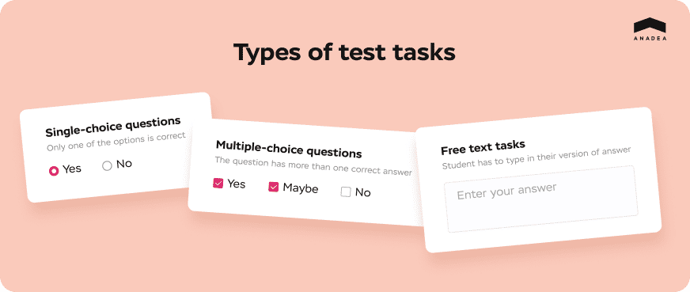
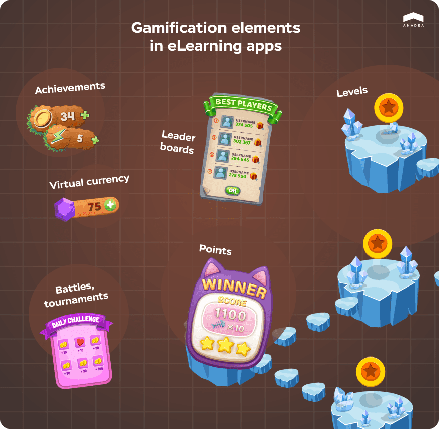
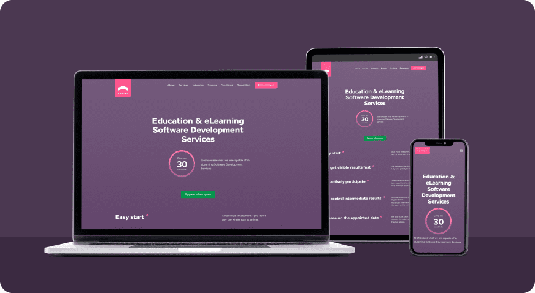

What is it about eLearning that makes it so efficient and convenient? It is a wise set of features an educational platform has. Let’s think what these features are, what are the ones no eLearning platform can go without and what are just nice to have. Keep reading if you are about to <a href="https://anadea.info/solutions/e-learning-software-development" target="_blank">create your own online learning system</a>.

Before listing the features, let’s picture what an ideal educational platform should look like and keep these in mind.

* Infinite content to make the platforms as sticky as possible;
* Responsive to the new information and knowledge, meaning being easily supplemented with new data;
* User-friendly and visual, meaning that as little time as possible has to pass between the user installing the app and figuring out how it works.

## Education app features to look into
View the list of educational app features for students and teachers, as well as features regarding the technical aspects of educational software.

### Tests & Quizzes
Disputes about whether standardized tests help or damage students’ ability to think, whether they are valid to measure students’ knowledge or not don’t die away. Nor do we have clear answers; what we do know is that many schools and universities use tests as an admission exam, and consequently, the test module for e-learning is a must.

Besides, if you are worried about the regular test ineffectiveness, try different types of tasks. Tests are not limited to marking the correct answers of a list, they can include free text questions where students have to type in their answer. Creating free text tasks requires an additional development effort (letter cases have to be distinguished and results calculation has to be revised) but certainly makes students think beyond the usual checkmark paradigm.

### Content management
Ideally, an eLearning platform is a customizable ecosystem that tutors can adjust according to the curriculum. A CMS, or a content management system, is a module that makes it possible to add or delete tasks and knowledge base and upload media content.

### Hints & Knowledge base
Tests in which wrong answers are marked wrong are basic functionality. An advanced functionality is hints and comments after the questions are answered, with extended information on the subject if the answer is correct and alternatively, provide proof it is wrong. A reliable knowledge base should not be rigid and has to be accessible and editable through the CMS mentioned earlier. Since new knowledge appears continuously and old ones get obsolete, it is important that the eLearning system is up-to-date.

### Gamification
<a href="https://anadea.info/blog/gamification-in-e-learning" target="_blank">Elements of game in e-learning</a> serve to boost user motivation and engagement by making their results visible to them — instant rewarding still works. These elements can be:

* __Levels__ — users complete more tasks and get nice level-specific ranks or badges next to their avatar. For an eLearning platform, levels can be associated with degrees of mastery, like Novice, Skilled, and Master. Only your imagination is the limit;

* __Points__ — the more points collected, the higher the level;

* __Achievements__ — one can be attached practically to any event, from registration to reaching certain levels;
Battles, tournaments — a positive competition can be beneficial to each participant and give them a space to grow by learning on each other’s mistakes;

* __Leaderboards__ — climbing higher on a leaderboard could be an additional motivation and an exciting challenge for users;

* __Virtual currency__ — for example, coins that can be spent on a chance to redo the test in the case of failure.

### Social network elements
Social media functionality would be the best feature in educational apps for team players who prefer studying in groups. Adding friends and sharing direct messages will give students a genuine feeling of sitting in a classroom next to others.

Group chats and the ability to save materials to bookmarks help students organize their study and keep in touch with mates to discuss study matters. And sharing content from educational apps to other social networks like Twitter or Facebook is also a huge social media element that can give your platform an additional promotion.

### Progress tracking
People love seeing the fruits of their labor. Their progress depicted in a real-time graph or numbers satisfies their urge to be rewarded and pushes to keep working as hard. Graphs, diagrams, tables of scores are exciting to look into and allow one to analyze their progress and define gaps in their knowledge.

### Push notifications
Some may find these annoying, especially when slacking off. Meanwhile, push notifications are more than reminders to open an app after a while. Here is our take on what an e learning app can notify about:

* A class starting soon;
* Schedule update;
* Student’s achievements;
* Student’s ranking update;
* New tasks available;
* New message from mate/teacher.

### Teacher dashboard
Teacher dashboard feature is the teacher’s virtual class book where the information about student progress and activity of each student is stored and where the teacher can share study materials, schedule classes, and set notifications to students about the upcoming tests.

### Syncing across devices
One account, and the platform is accessible through all devices with the latest progress. Allow users to proceed from the moment they’ve stopped wherever they are. Additional work on the platform's adaptability to different screens is required.

However, we suggest you not adapt your system to all platforms at once from the start. In the beginning, the primary task is to make an application that performs well at least on one platform. Growing wider goes along growing deeper. Start thinking about widening to more platforms as the basic web or <a href="https://anadea.info/solutions/e-learning-software-development/m-learning" target="_blank">mobile e-learning app</a> version is spotless.

### Backup & Recovery
What is going to happen if a user changes a device by the time they’ve reached the 199th level on your educational app and can’t restore their progress on a new device? They’re likely to swear at it and never come back. To not let that happen, make sure the user progress is recoverable. This can be implemented in the following ways:

* Data is saved to user account created while registration;

* If no registration option is provided, offer users to have a unique code generated. By entering that code after app reinstallation, they’ll have their progress back.

### Offline access
To study on trips or anywhere with poor Internet access, people sometimes turn off Wi-Fi or mobile data. What may be a little unsettling for you is that no ads will be shown to users if they are enabled to use the app offline. However, such an option has a great potential to increase their loyalty — eventually, it can pay off more than any ads.

We can’t insist this feature is a total must for a number of reasons. First, some app types simply don’t allow for going offline — these are live lessons platforms and anything where broadcasting is involved. Second, the content accessible offline is always the one stored on a user’s device, and not that many people have enough space for that.

The offline access for an eLearning platform is the issue to be addressed personally depending on the app’s type.

### Screen sharing
Now, especially that everyone has gone through Covid and remote work or study, it is hard to picture any online team gathering without screen sharing. The function available on Google Meet, Zoom, and Slack will just as well fit into your e-learning app if it suggests group calls. A shared screen in such cases is certainly a must — sometimes it is just easier to show than trying to explain.

### Lesson recording
Recording lessons is an essential feature for students that would like to get back to the subject when doing homework or for uploading lessons on YouTube. Lesson recordings can come in handy when the connection is poor — students can share their recordings with those who were unable to present on the lesson.

## Wrapping up
What features of an education app are must-have and what are not remains an open question. From our point of view, which we did our best to justify, these are truly essential:

* Tests and quizzes,
* Content management,
* Backup and recovery.

The rest are nice to have — even great to have, actually. But from the business perspective, you need to think about priorities. What is more important at the stage of an <a href="https://anadea.info/guides/what-is-mvp" target="_blank">MVP development</a>, to launch as soon as possible to test the demand or add the offline access functionality?

Still, much depends on the app type. Depending on whether it is the app for self-education, like Duolingo or LinkedIn Learning, or the app for K-12 online classes, the sets of essential features will be nothing alike. Apps for kids’ education have to be gamified while platforms for remote classes must allow screen sharing. Benefits of educational apps are only achievable if the apps deliver what they are expected to.

Let's discuss your project!
