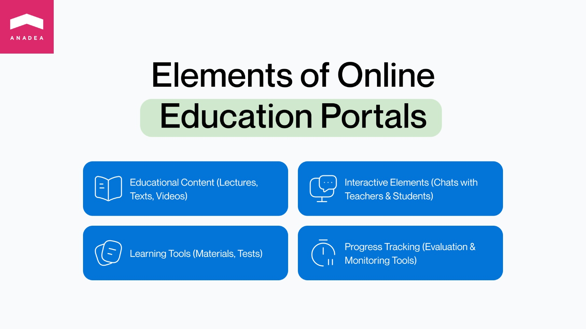
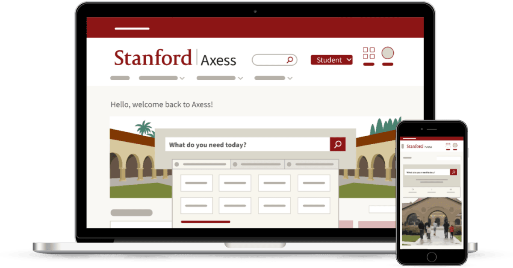
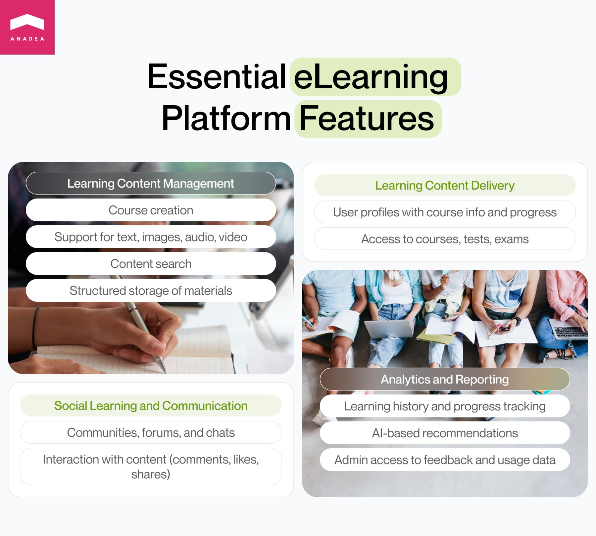
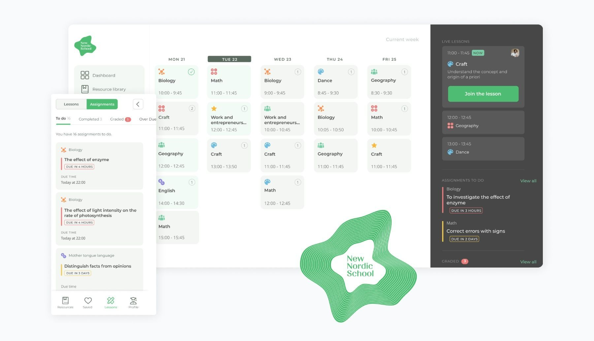

Online learning keeps gaining popularity. While in some cases digital solutions play a supportive role in the studying process, a modern online education portal can fully replace traditional learning methods.

The [revenue](https://www.statista.com/outlook/dmo/eservices/online-education/worldwide) of the global online education market is expected to achieve the level of $185.2 billion in 2024, and it is projected that by 2028, the market volume will reach $275.7 billion. This means that the CAGR for the period from 2024 to 2028 will be around 8.6%.

It is widely believed that one of the major boosters for the growth of the [eLearning](https://anadea.info/solutions/e-learning-software-development) market was the coronavirus pandemic. However, we must admit that other factors such as overall digitalization and mobility also greatly contribute to the expansion of this industry.

If you are considering starting an education portal development project, this article can help you make some important decisions.

## What is an online learning portal?

An online education portal can be defined as a platform or a web space for educational resources and content. It unites under one roof everything that users may need for going through the learning process: lectures, texts, videos, materials, tests, chats with teachers and other students, etc. In addition to just access to learning materials, such solutions typically offer a row of convenient tools for evaluating students’ knowledge and tracking their progress.

What are the key benefits of eLearning portals?

- Flexibility of the learning process;
- Access to a wide range of materials in different formats;
- Advanced analytics;
- High personalization;
- Consistency in learning;
- Higher engagement in comparison to traditional learning methods.

Talk to eLearning experts

## Examples of online education portals

There are different types of platforms that can be included in this category, such as school web portals, university portals, platforms for professional training, web spaces for learning foreign languages, etc. Let us mention a couple of existing solutions that can be taken as examples of successfully launched products.

### Coursera

Coursera is a globally known e-learning portal that can provide anyone with access to online courses and degrees from a wide range of prominent companies and universities. The total number of organizations and institutions that offer their programs via Coursera has already gone beyond 300, while the [number](https://about.coursera.org/press) of registered users is around 129 million. There are hundreds of free courses for learners, but the majority of them are paid. However, users can leverage the possibility of getting scholarships and financial aid.

### Udemy

This is another popular online learning and teaching marketplace, with 69 million students and over 213000 courses available to them. Udemy sells content on demand. The tuition fees for different courses greatly vary as they depend on the instructor. Everyone can become a student and a tutor, meaning that if you have an idea for launching your course, your main task will be to create the content. The course hosting and promotion will be the responsibility of Udemy, but of course, your reputation as a tutor will also matter. The better reputation you have, the higher your chances to attract learners to your course will be.

### Stanford University Student and Faculty Portal

This online learning portal differs from the ones mentioned above. It is not a widely available but a secured student portal. Users can submit their required data to start their association with the university and interact with the provided materials. It has the functionality required for student enrollment and financial questions, teaching and grading, academic advising, employment, and training, as well as for various administrative processes. Students can also get access to a library of course materials with real-time access, use online test and exam assessment tools, and communicate with other students, administrators, and alumni via online chats and forums.

Create your own platform

## Education portal development process

If you want to develop your own learning guide portal, we recommend you attentively plan the entire process of the project realization in advance. This will help you to better understand what resources you need to possess for that and how can you get prepared for it.

### Step 1. Concept and idea

You need to define what solution you want to build and what tasks it will solve. Here, it is required to decide on the exact target audience of your online education portal. Will you offer a platform for a wide audience or students of a particular university or school? Will your courses be available for free or will users need to pay for them? For some inspiration, you can analyze the market and the already launched solutions. It will be also helpful to read the reviews written by users of these eLearning portals. Their opinions will provide you with valuable insights into their needs and expectations.

### Step 2. Planning

When you have a general understanding of what you want to get, you should find specialists or a company that will be responsible for e Learning platform development. Further in this article, we will discuss how it is possible to do it. You will need to discuss your requirements with developers. Experts will help you choose the best tech stack and define the right approach to software development. You will also need to approve the budget and time frames of your project.

### Step 3. Design, development, and content creation

It will be a core stage of the entire e-learning portal development process. Software developers and UI/UX designers will work on transforming all your ideas and requirements into a real product. At the same time, it will be necessary to think about [creating learning content](https://anadea.info/blog/4-fundamental-stages-in-elearning-course-development-process) for your platform or looking for tutors, professors, companies, and institutions that will post their courses. Though the tech aspect is very important, it is impossible to achieve success without high-quality materials that should be available to students.

### Step 4. Testing

A good development team will always allocate enough time and resources for testing a software product. While some tests should be conducted in parallel with software creation, some others should be executed when your product is ready. It is necessary not only to fix all the bugs but also to check that all elements and modules of your software smoothly interact with each other.

### Step 5. Launch

When you are satisfied with the solution built following your requirements, you can release it. Very often companies decide to build an MVP first and then proceed to the development of a solution with an expanded set of features. A minimum viable product has only basic functionality and the main goal of its launch is to analyze whether it is worth investing in a full-scale platform.

### Step 6. Support and maintenance

It is impossible to release an online education portal and then fully forget about it. Your team should continuously monitor its performance, address all the detected vulnerabilities, and introduce new features that will enhance user experience. Moreover, when it comes to eLearning portals, it is vital to regularly add new courses and materials to retain existing users and attract new ones.

You can find some other practical tips in one of the previously published articles on [How to Create E-Learning Website](https://anadea.info/blog/e-learning-website-development-tips).



## Key learning platform features

While trying to make your solution as unique as possible, you shouldn’t forget about some basic functionality essential for any e-learning portal.

- **Learning content management**. You need to build course creation tools (and here, it will be necessary to decide on the range of users who will be provided with access to them). It is important to ensure support of content of different types, including text materials, images, audio, video, etc. Among other crucial things, we should mention a content search system and a good structure for learning material storage.
- **Learning content delivery.** You should think about the way to allow users to access courses and other materials. Users should have their profiles where they will indicate their personal data and will be able to view the basic information about their courses, tests, exams, etc.
- **Analytics and reporting.** Users should be able to consider their learning history and monitor their progress. If you add AI-based analytics tools, learners will get personalized content recommendations and tips. Moreover, you can make it possible for administrators to have access to such data as learners' feedback, learning content usage, learners’ performance, time spent on courses, etc.
- **Social learning and communication.** You can allow users to create and join learning communities, forums, and chats where they can share their thoughts, impressions, and fresh ideas, as well as get some help from others. It will be a good idea to let learners interact with content via comments, likes, and shares.

## Our experience in education portal development

Today Anadea has an excellent reputation as a reliable elearning portal development company. And our successfully launched projects can tell you much more than all words. One of the solutions built for the learning industry was the Nordic Learning Platform.

This powerful web platform caters to educators, administrators, and students within the Nordic Baccalaureate program. Fueled by Artificial Intelligence (AI), it fosters innovative pedagogy and aspires to be a global leader in personalized learning. Launched in September 2020, the platform has undergone continuous improvement through multiple releases.

The Nordic Learning Platform empowers students from pre-kindergarten through grade 12. By leveraging AI, the platform personalizes learning journeys, ignites student passions, and equips them to shape their future. This is achieved through features like:

- **Adaptive learning paths.** AI analyzes student performance and tailors the curriculum to their individual needs and strengths.
- **Smart feedback and recommendations.** The platform provides targeted feedback and suggests additional learning resources based on student progress.
- **Predictive analytics.** AI helps anticipate student difficulties and recommends interventions before they fall behind.

Feel free to find out more about this project in the [case study](https://anadea.info/projects/nordic-learning-platform).

## How to build an educational portal: hiring developers

When you decide to build your own platform, you should find specialists who will provide eLearning portal development services to you. If you do not have an in-house team of programmers or your inner resources are not enough to make your project come to life, you need to hire external specialists.

Traditionally, you have two options: **freelancers or an education portal development company**. Both of them have their pros and cons and you should analyze them all to make up your mind.

If you want to work with freelancers, it is recommended to use one of the popular freelancing platforms like Upwork. You can look for the required specialists regardless of their location and can find experts with really rare skills. Moreover, rates in some regions can be significantly lower than in the country where your business is based. As a result, you can greatly reduce your development costs.

Nevertheless, you should understand that freelancers are always interested in increasing their incomes. This means that quite often they work on different projects simultaneously and do not fully concentrate on one task. It may be rather challenging to build long-term cooperation with the same people. Moreover, not all of them demonstrate the desired level of punctuality and responsibility.

Cooperation with an education portal development company like Anadea is more suitable for businesses that are looking for stability and long-term partnerships. Such companies can offer you full-cycle development services that include post-launch support, maintenance, and software modernization. As a rule, they offer various engagement models which can provide flexible conditions. In comparison with in-house hiring, this option will be much more cost-efficient. However, as a rule, these services will cost more than those offered by freelancers. Good companies usually work with a rich tech stack and continuously hire only experienced developers and other specialists.

Usually, freelancers are hired for small short-term tasks that should be done extremely fast. For more serious projects, establishing cooperation with a software development company will be the best solution.

Book a consultation

## How to choose an education portal development company?

Today the number of companies that provide elearning portal development services is continuously increasing. All of them claim that they can build user-friendly solutions of the highest quality. Unfortunately, not all can do it. The market is full of businesses interested only in getting profits while customer satisfaction is not their priority. That’s why when you are looking for an elearning portal development company you need to be very attentive and analyze a row of parameters.

1. **Experience**. First of all, you need to pay attention to the date of the company’s foundation. Of course, young companies should also have a chance. Nevertheless, teams with rich experience have better-established processes and a deeper understanding of the market needs.
2. **Domain expertise**. Establish cooperation with a company that has already gained strong expertise in the eДearning industry. For example, at Anadea, we work with customers from different industries. But eДearning is one of the domains that we are focused on.
3. **Portfolio**. We recommend you carefully consider the portfolio of the company before making a final decision. This will help you to see the level of project complexity that a team can cope with. It will be also good if the chosen company has built solutions that are similar to yours. It will guarantee that developers have already studied the peculiarities of your market and the expectations of potential users. If you want to have a look at the projects that our team has worked on, you can find our [software company portfolio](https://anadea.info/projects) on our website.
4. **Reviews**. Read the reviews that were written by the company’s customers. A lot of businesses publish such opinions directly on their websites. But it will be sensible to look for reviews posted on external platforms like Clutch or GoodFirms. Very often such testimonials can shed some light on possible pitfalls of cooperating with this or that company. And thanks to them, you will get a rather realistic picture of what you can expect.
5. **Terms of cooperation**. Consider not only the rates of developers but also offered engagement models and other details of the project realization process. You need to be confident that the proposed way of establishing interaction is fully relevant to your business model.

Ask us anything

## Instead of a final word: How we provide eLearning portal development services at Anadea

At Anadea, we believe that our main task is to help our customers reach their business goals using our tech expertise. We work with a modern tech stack and have a deep understanding of the needs and trends of the eLearning market. Our company was founded in 2000 and since then we have been working hard to continuously improve our skills and stay updated with all the latest tech innovations.

When a customer turns to us with a request to build an e-learning portal, first of all, we deeply study the provided requirements and all the available tech documentation, if any. We need to explore all specific demands that a client may have to prepare cost estimates and an initial plan.

We do our best to find the most feasible approach to project realization and offer various engagement models that can help to optimize development costs. We provide full-cycle development services that also include QA, deployment, as well as post-launch software support and maintenance.

For us, it is crucial to build mutually beneficial long-term relations with our customers and to contribute to their business growth. If you want to learn more about our approaches to education portal development and our services, do not hesitate to contact us!

Get in touch
