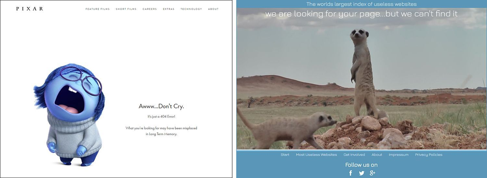

Nearly all of us have a smartphone. We use various applications every day - document management, driving assistance, dictionaries, workout tracking, [brain puzzles](https://anadea.info/blog/7-cool-apps-for-boosting-your-brain-power), local weather, barcode scanners, you name it. There are as many apps in App Store and Google Play as stars in the sky.

Now think of the applications that are now in your smartphone. Can you name at least 5 reasons why you have chosen the app that you use now over the other from the very same category and with the similar features? You narrowed down the list of your device memory "nominees" to two. Both fitted your needs, both had great reviews and still for some reason you opted for the only one app.

Now we are getting to it. Most of us may not realize <a href="https://en.wikipedia.org/wiki/Emotions_in_decision-making" target="_blank">how much impact emotions have on our decision-making</a>. Charles Darwin argued in his 1872 work that different <a href="https://en.wikipedia.org/wiki/Evolution_of_emotion" rel="nofollow" target="_blank">emotions help humanity to survive</a>. It would seem that technology and biology are radically different from each other. However, it is safe to say that taking into account users' emotions when creating an app will help you to survive in the fierce competition in the market.

Say mission impossible or technology can't rise an emotional reaction? Have you ever seen videos of testing Boston Dynamics robots when scientists punch and kick them?

<iframe width="560" height="315" src="https://www.youtube.com/embed/aFuA50H9uek" frameborder="0" allow="autoplay; encrypted-media" allowfullscreen></iframe>

We all emphasize these tech creatures in some way. Smart technologies are making big steps towards human emotions recognition.

## Web and mobile UX design is moving towards positive emotions

Insignificant and at first glance imperceptible details of visual design without which the app will continue its work, often cause a greater emotional response of users than the concept of an app as a whole. For example, this fun feature expresses the emotions in a chat by shaking a smartphone.

Such details give the product a unique identity and help to establish communication with users on a personal level. This technique is called emotional user experience design.

Let's take a '404 not found' page. It is a good place to trigger emotions of your site visitors. Most users reaching the 404 error page will try to leave it as soon as possible. If small sites can monitor the correctness of their links, then on larger sites, tracking broken links leading to deleted or moved files or pages becomes more difficult. Well-thought-out UX design of the 404 page will not only offer visitors links to relevant material, it will spark their interest and encourage to explore your offerings.

Source: <a href="https://www.pixar.com/404" rel="nofollow" target="_blank">pixar.com</a> / <a href="https://www.theuselesswebindex.com/error/" rel="nofollow" target="_blank">theuselesswebindex.com</a>

Designing for emotions also works great for educational apps. For example, we used emotional elements of UX design while developing an e-learning system [STAV Online](https://anadea.info/projects/stav-online) since emotions create motivation, allow to attract the attention of students and make it easier to memorize educational material.

## Emotional UX design - the path to interactive relationships

Expression of emotions is natural. All of us learned to recognize emotions since childhood. When we are chatting online, we use emoticons, smileys, emojis to let people understand how we feel. And now technologies are learning to identify users emotions. With every year we see more and more emotional intelligence is being integrated into the mobile experience.

Emotional intelligence is not just animation effects that appear when the user performs certain actions. Today, emotional intelligence in mobile is a way to make a user experience more delightful and interesting and therefore to make your app more popular.

The giants of the market - Android and Apple are trying to simplify interaction with their services by carrying out machine learning research. So far, there are 4 key elements of emotionally intelligent design:

* Personalization,
* Conversational interface and voice recognition,
* Face detection and expression analysis,
* Analysis of physiological parameters.

### Personalization

Personalization in apps creates a connection with the user. When you come to a hairstylist and say that you like colder water when washing your hair it is called customization. When you come next time to the hairstylist and he/she remembers your preference it is called personalization. Personalized push and in-app notifications make users feel special.

For example, the largest on-demand music streaming service **Spotify** uses the technology that determines the rhythm of running and, based on the results, offers joggers a suitable playlist. And the right music for running is very uplifting. All joggers who don't know about this app are already interested in it, right?

### Conversational interface

Not so long ago, people interacted with computers by means of the text only. And today, with the development of [artificial intelligence](https://anadea.info/blog/artificial-intelligence-pandoras-box-or-the-holy-grail), the progress of natural language understanding and processing algorithms gave us conversational interface and [chatbots](https://anadea.info/blog/what-is-a-chatbot-and-how-to-use-it-for-business) in order to make our communication with technology more natural.

One of the undisputed leaders of emotional voice technologies is the company **Beyond Verbal**. They created a mobile app that analyzes raw ten-seconds records and extracts data which indicates emotions, mood, speech habits, stress, and also the user's health.

The Internet giants developed the army of devices and services on basis of conversational AI like **Google Assistant**, **Siri** by Apple and **Cortana** by Microsoft. For example, a hands-free device controlled by Amazon's **Alexa** voice assistant can wake you up at the right time, turn on your favorite music, find and read news and even order food takeout.

There is no need anymore to type your requests. You can say it and the app with language processing will find everything for you. The graphical interface still prevails in mobile app development. However, with the burgeoning of the conversational interface, we are about to talk to the apps like to an old friend who understands your mood.

### Face detection and expression analysis

Laptop or smartphone recognizes you without requiring to enter the password. Cars, social media networks, stores - all welcome you and call by the name from the very sight of you. This is how face detection works.

The distance between eyes, nose width, the length of the chin - you catch all these details unconsciously when you look at another person. A computer does it by combining all these metrics and getting the mathematical formula of a human face.

There are many ways to produce a better user experience with face detection in mobile apps. For example, iPhone X has **Animoji** feature, which creates your own animated characters that use your voice and copy your facial expression.

<iframe src="https://giphy.com/embed/10Y1Tu4y6gy94Q" width="480" height="270" frameBorder="0" class="giphy-embed" allowFullScreen></iframe>

<a href="https://giphy.com/gifs/adweek-fox-apple-10Y1Tu4y6gy94Q">via GIPHY</a>

### Analysis of physiological parameters

Today's smartphones are equipped with an array of sensors that can detect a range of physiological parameters, such as blood pressure, pulse, and skin temperature. But did you know that these sensors can also be used to track and monitor our emotional states?

Our emotions have an immediate effect on our muscle tone and movement. When we experience different emotions, we may either tense up or relax specific groups of muscles. For instance, feelings of anger may cause us to tighten our fists, while guilt may cause us to hunch our shoulders and look away.

To take advantage of this connection between emotions and muscle movement, companies like __Sentio Solutions__ have developed bracelets that can track and recognize emotions by monitoring physiological parameters. By collecting data on the wearer's emotional state, these bracelets can provide personalized recommendations to promote positive and emotionally healthy habits.

Overall, the integration of emotional tracking technology into smartphones and wearables is a promising development in the field of mental health and well-being.

## Emotional UX design and development. Magic? Technology!

There are many forthcoming forks in the emotionally intelligent design industry. There are even more research and technological challenges that need to be solved. But one thing is clear, using emotional intelligence brings endless opportunities into the world of professional UX design.

If you like the emotional user experience design concept and want to incorporate it into your app, we are hear to help! Whatever your idea is, our team of [mobile app developers](https://anadea.info/services/mobile-development) can make it true.
