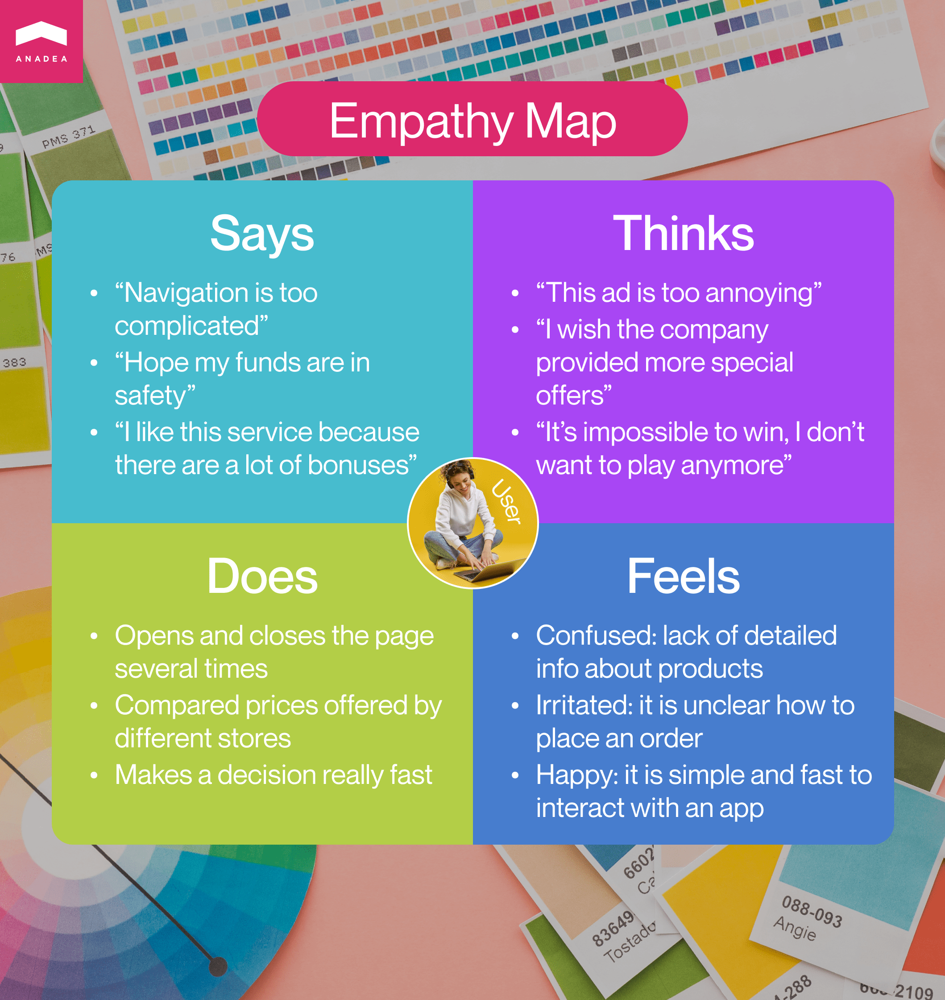
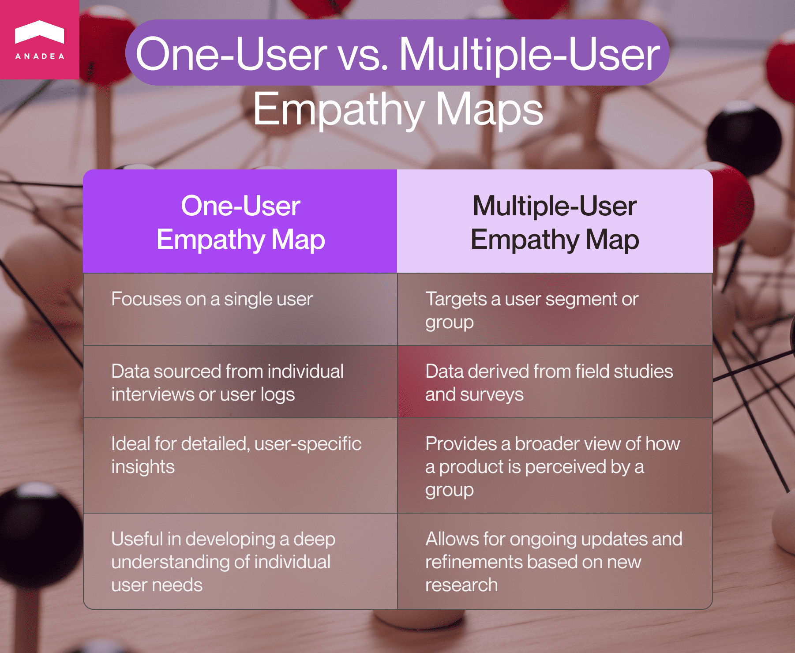
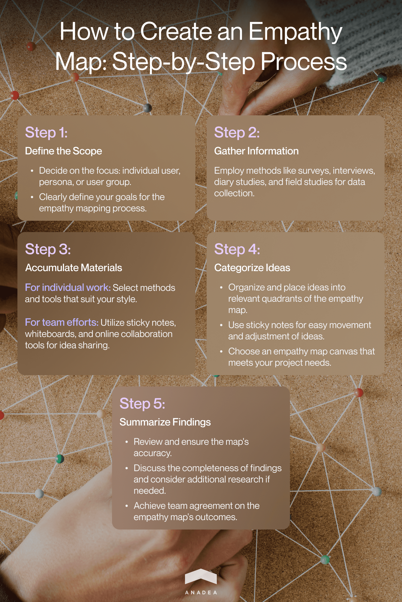

Just building a reliable and secure app from the technological perspective wouldn't be enough to ensure success for your solution.
People will never use an app just because "it works well". They should
clearly know what tasks they can solve with it, how and why they can
turn to it, and what benefits they can get thanks to it. All this is
about user experiences that people can leverage. Standards in [UI/UX
design](https://anadea.info/services/ui-ux-design) are high
which means that your team should pay enough attention to this aspect as
it is an integral part of any software solution. It is required to
allocate time and resources to study your target audience and deeply
understand the demands and preferences of potential users. That's what
you can achieve thanks to empathy mapping in design.

In this article, we are going to talk about what it is, why you should
take it into account, and what efforts from your side the creation of a
design thinking map presupposes.

## What is a UX empathy map?

The first thing that we should do before we dive deeper into the role of
design thinking empathy maps is to provide a general definition of this
term and explain what it is in general.

In a very broad meaning, it is a visualization tool that is applied in
the field of building interaction between humans and computers and in
the sphere of creating UX designs. The key purpose of mapping in design,
regardless of the exact type of product that you are building now, is to
gain an excellent understanding of the end-user and their intentions.

On the internet, you can find a wide range of variations of the empathy
mapping definition. For example, according to the experts at Nielsen
Norman Group, which is one of the leading UX consulting and research
companies, "an [empathy
map](https://www.nngroup.com/articles/empathy-mapping/) is
a collaborative visualization used to articulate what we know about a
particular type of user".

While the explanations themselves may differ, the core idea is always
the same. This tool will help you to better learn and understand those
people who will be potentially interested in using your products or
services.

Usually (but not always) a design thinking empathy map will be divided
into four parts which will be dubbed **"Says", "Thinks", "Does",** and
**"Feels"**. All these quadrants will characterize the end user. It is vital
to bear in mind that all the facts that you will add to your map
shouldn't have any sequence or chronological order as they should
describe a user as a whole and allow you to see the entire picture.

Let us explain what information you should include in your UX empathy
map.

The **"Says"** part should include what opinion is voiced by the person. You
can take the information received during usability studies or interviews
with users. In other words, you can just take direct quotes and add them
to your map. For example, it can be some phrases like

-  "I always have difficulties in using the app as the navigation is too complicated".
-  "I always have worries about the safety of my funds during transactions".
-  "I like this service because there are a lot of bonuses for clients".

The **"Thinks"** part is more challenging to fill in if we compare it with
the previous one. In this case, you can't just take the words of users.
You need to understand what thoughts they have, what is happening in
their heads, and what concerns they do not voice. Of course, in some
cases, the content in the "Thinks" and "Says" quadrants may coincide.
Nevertheless, let's admit that very often people prefer not to share all
their opinions (especially if they are negative). It happens because
they do not want to seem impolite or even rude. That's why you should
try to understand what users may really think.

-  "This advertising is too annoying".
-  "I wish the company provided more special offers for users of this application".
-  "It is impossible to win, I do not want to play anymore".

The **"Does"** section covers those steps and actions that a person
performs. Here you do not need to take into account any words, here only
actions matter. It means that you should analyze what a person does.

-  Opens and closes the page several times.
-  Tries to compare prices offered by different online stores.
-  Makes a decision really fast.

The content of the **"Feels"** section is often presented as a list of
adjectives. It should describe the emotions that the user feels. While
filling in this quadrant, you need to think about impressions that the
person may have during interaction with your solution.

-  Confused: lack of detailed information about the offered products.
-  Irritated: it is unclear how to place an order.
-  Happy: it is simple and fast to interact with an app.

Empathy mapping may be a rather confusing task if you have never done it
before. Sometimes you will find out that people express rather neutral
opinions and have controversial thoughts, but perform actions that
indicate their positive attitude. Nevertheless, humans are complex
creations which means that such things could happen. UX professionals
should investigate how to deal with such cases, how to address possible
weak sides and turn them into strengths.

Moreover, you may face a situation when it won't be very clear which
section to choose for placing this or that info. For example, in some
cases, the data for the "Feels" and "Thinks" quadrants may be
practically the same. In this case, we recommend you just choose one
section.

If one of the sections remains empty and you have no idea what you can
write there, it can be an excellent sign that you should conduct
additional user research and study the question in a more detailed way
before moving to the next stage of the entire design journey.

If the four mentioned sections are not enough in your case, you can add
extra fields that will help you analyze your users more deeply.

## Mapping in design: One-user vs. multiple-user empathy maps

There can be several approaches to empathy mapping. Your design thinking
empathy map can reflect either one user or a group of users.

If you want to create an individual (one-user) empathy map, data for it
can be taken from a conducted interview with a person or can be based on
a user's log in your studies.

When we are talking about the multiple-user approach, it is necessary to
understand that in this case you will consider a whole user segment,
instead of just one person. Such aggregated maps can be created for
those users who share similar opinions and behaviors. In this case, you
will be able to have a look at how your product is perceived by the
group in general and such an empathy map can be used for creating user
personas as it helps to visualize your knowledge about users. However, take into account that user personas should be still created.



Aggregated maps can be created based on the information gathered during
field studies and surveys and can help you summarize the collected data.
By the way, if you have already created a UX empathy map but your
research is still going on, you can always come back to the map and add
new information or remove any data that has turned out to be irrelevant.

## Why you should create a design thinking empathy map

When it comes to empathy mapping, there is always a very reasonable
question: is it really worth investing time and effort in it? In design
thinking empathy map is a very important tool to make sure that all the
specialists who are working on the product development are on the same
page and they clearly understand what users expect to get.

These maps are created at the beginning of the web or [mobile
design](https://anadea.info/services/ui-ux-design/mobile-app-design)
process and then can be used as guidelines for all the next stages. But
not only the artifact itself matters. The process of preparing it also
has a very high value for the team as it allows us to find a new
perspective for looking at users.

What does empathy mapping help to do?

- **To understand who a user is.** While studying what your users think, what they do, what emotions they have, and how they interact with your product, you can find out the needs and expectations of people which can help you to see how you can adjust your solution to them. Moreover, thanks to empathy mapping UX experts can detect the knowledge gaps your team still has. Based on their opinion, you can conduct additional surveys and studies to get enough information for your further project realization.

- **To better explain to all the team members who a user is.** A design thinking empathy map is an excellent tool to use within a team. Thanks to a convenient form of presenting the information, all team members can easily see what attitudes people have and what behaviors are demonstrated by them. After the creation of such a map, it can be used during the entire project realization process.

- **To gather data directly from users.** It is also possible to provide users with all the required tools for filling in such maps fully on their own. You can utilize such a chance as a secondary source of data. You should also bear in mind that on the one hand, while sharing any data without an interviewer, people can stay more open, but on the other hand, there is still a probability that they will be ashamed to share their real thoughts. It means that even in this case, some part of the information may stay hidden.

When you have enough information about users and can efficiently use it
in your product creation, you can achieve the following results:

-  Higher user satisfaction;
-  Increased conversion rate;
-  Enhanced loyalty;
-  Better profits.

## How to make an empathy map?

The process of empathy mapping typically includes the following steps.

1. **Scope definition.** First of all, you need to understand whether you need to analyze an individual user, a user persona, or a group of users. Then you should decide on the exact goal that you have. Do you want to use this tool just for a better understanding of the people who use or will use your product or do you have a more precise goal? For example, do you need to analyze your audience to deliver a special tool that will be of great use during the holiday season? In the second case, you will have set time frames which will also have an impact on your working process.

2. **Collecting information.** To prepare an empathy map you should gather enough materials. There can be different methods for that, such as surveys, user interviews, diary studies, field studies, etc.

3. **Accumulating the material that you have.** If you are working alone, you can use any methods and techniques that you like. If you are working with a team, it will be a good idea to use sticky notes, whiteboards, and online collaboration tools that will allow all team members to share their ideas.

4. **Grouping ideas for each section.** When you have enough information, you will need to analyze which quadrant each thesis will suit. In this case, sticky notes will be very convenient to use. You can easily move them if you decide that this or that idea will be more appropriate for another section. Today there is a wide choice of empathy map canvas options. That's why for your convenience, you can choose one of them.

5. **Summarizing what you have.** After placing all notes in the corresponding section, you need to analyze whether everything is really okay with your map and whether all team members agree with the results. You can discuss whether your findings are sufficient and whether any additional studies are required. Namely, thanks to an empathy map design thinking can bring the best results as the creation of a UX empathy map is the first step of this framework. That's why you should pay enough attention to evaluating the quality of the materials and information that you have at your disposal.

## How to use a design thinking map?
Let's imagine that you have already created an empathy map. But what can you do next? How to utilize it?

- **Find out patterns in user behavior and discover new opportunities.** Thanks to the visualization of the data that you've gathered in various studies, you can quickly identify the existing patterns and explore areas for improving your product and, consequently, user experience.

- **Refine user personas.** Thanks to better seeing what people think about your offer, you can improve user personas by expanding and updating the information that you have.

- **Enhance user journey.** It will be helpful to combine such tools as user journey maps with empathy maps to get a full picture of the user experience that you provide. By doing this, you can identify at what points users face frustrations or challenges. Based on the results of such analysis, you can deliver adequate solutions.

- **Make better-informed design decisions.** After defining the specific needs of your users, you can better address them with your solution. It means that thanks to empathy mapping, you can deliver more impactful and valuable products.

Actually, placing users and their needs at the center of building
solutions is not something extraordinarily new. This approach has been
here already for a while and has proven its efficiency. In one of our
previously published posts, we've shared what emotionally intelligent
design is and how it helps to improve software products. If you are
planning to build a mobile app, [this
article](https://anadea.info/blog/emotionally-intelligent-design-why-you-need-it-in-your-mobile-app)
will be useful for you.

## Empathy maps in design thinking

As we've already mentioned, empathy mapping is aimed not only at
collecting some information about users but also at making it known to
the project team. Though the creation of such maps is viewed as the
first step of design thinking, they are used throughout the whole
journey.

In general, empathizing is taken as a core priority of [design
thinking](https://www.nngroup.com/articles/design-thinking/)
which is defined as a user-centered methodology for solving problems. It
is an iterative framework that presupposes defining users' pains
(problems) and directly addressing them with offered tools.

The understanding of users' needs that you gain at the step of empathy
mapping stays with you at all the further stages of design thinking,
including solution prototyping, testing, and implementation.

Moreover, within the development process, it is also recommended to
update your maps if you get new insights.

There are a lot of different methodologies that can be taken as a
foundation for the design process. If you are looking for the most
efficient approaches to designing your web solutions, you may be also
interested in reading about [atomic
design](https://anadea.info/blog/atomic-design-2-0-and-style-guide-driven-development)
which includes the creation of a system of components that belong to
different hierarchy levels.

## Final word

Empathy mapping is a comprehensive part of the design thinking
methodology. It allows teams to deeply study the opinions, demands, and
behaviors of their existing and potential users and deliver tools that
will fully correspond to their requirements.

You can use an empathy map canvas or template but it doesn't mean that
there are any strict rules in their creation. You can adjust standard
schemes to your business needs so that they will fully satisfy your
project requirements.

If you are creating a software product and need help from experienced UX
and UI designers, developers, and other tech professionals, at Anadea,
we are always open to cooperation. We have rich expertise in various
business domains and will be happy to support you at any step of the
realization of your project. Share your idea with us to get project
estimates.

Get in touch
