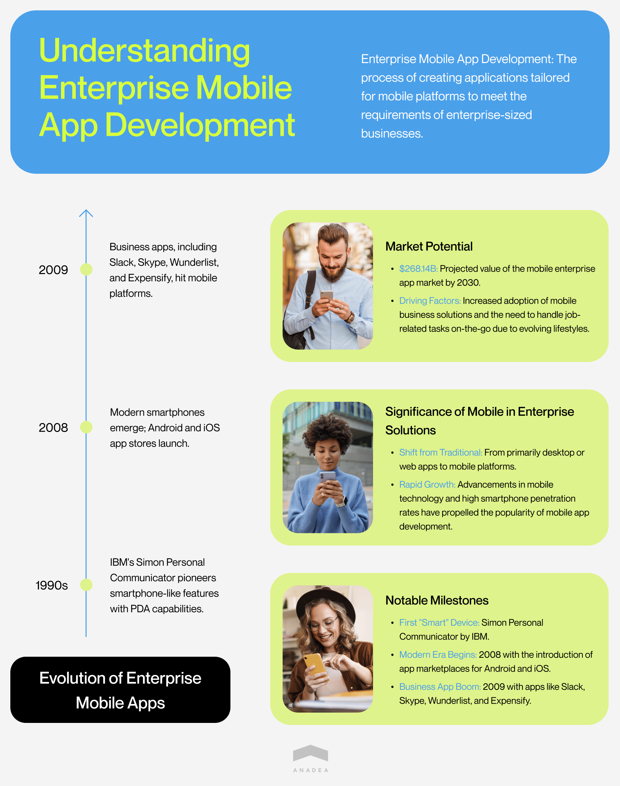
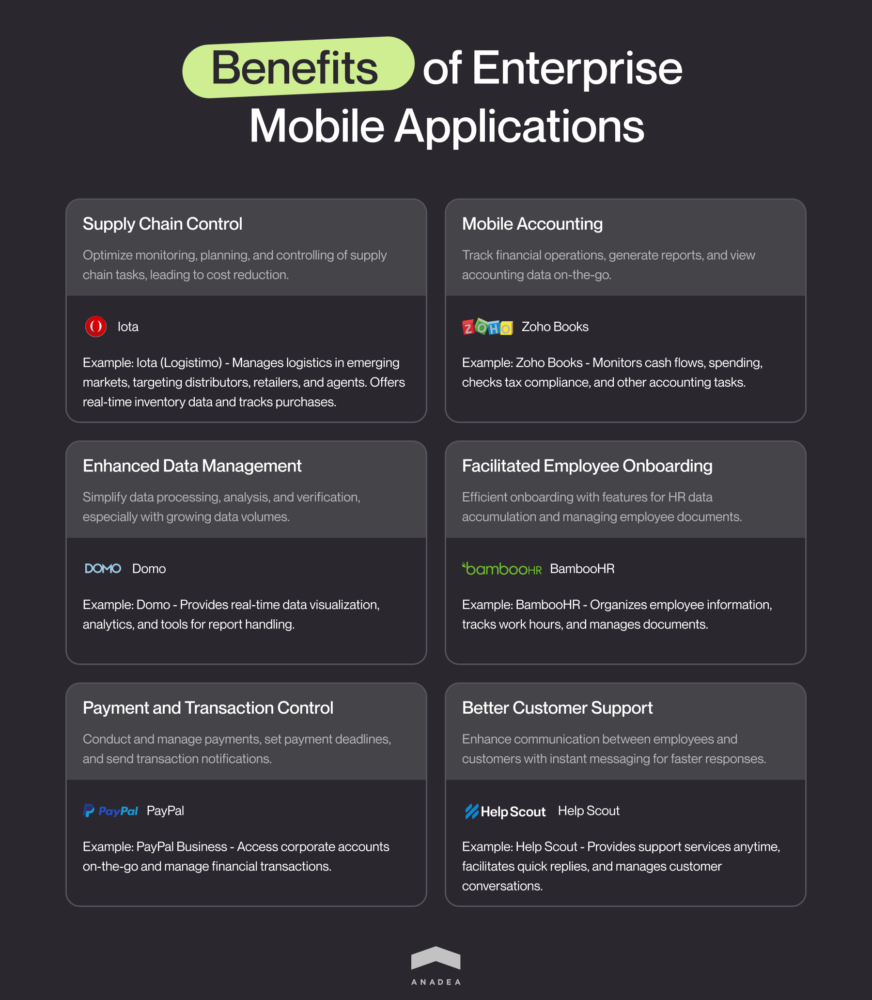
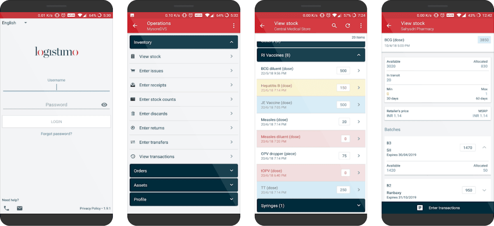
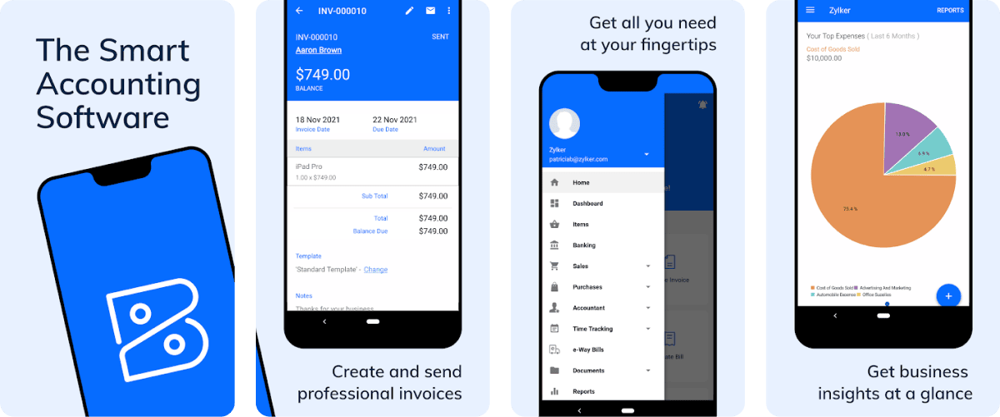
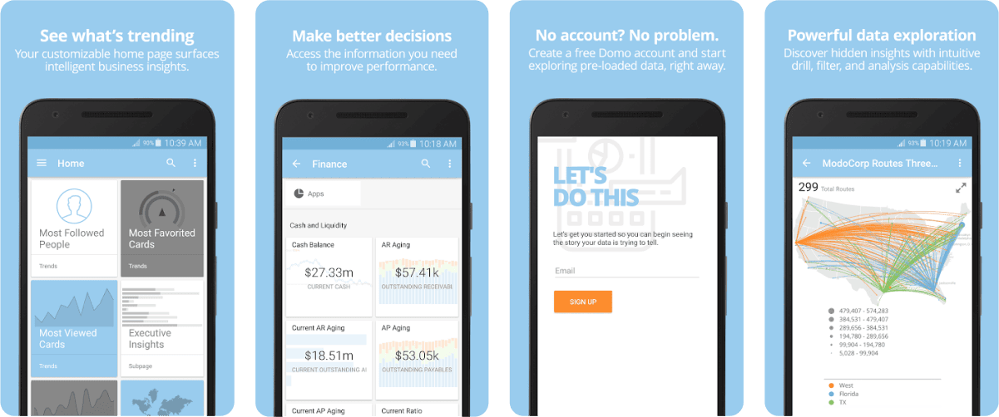
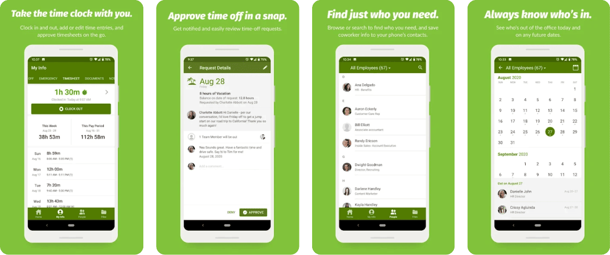
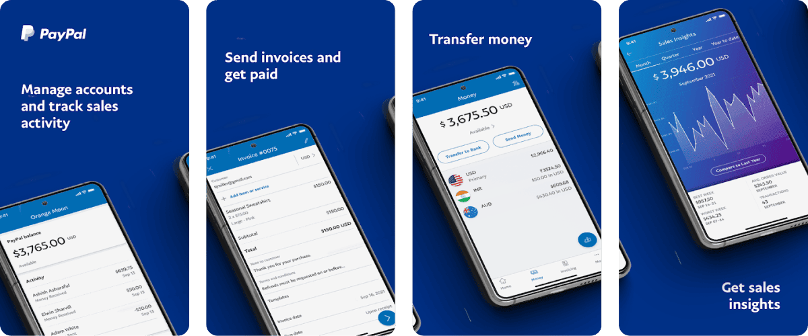
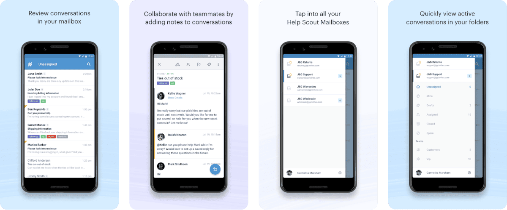

Today, the success of businesses greatly depends on the quality of the software solutions that are used by their employees for organizing work processes. That's why, if you have plans to create mobile enterprise applications for your business processes, you should be ready to invest enough time, resources, and force into the development process in order to achieve the desired results.

Over the years of work in the IT industry, we've managed to accumulate strong expertise in enterprise mobile apps development and a deep understanding of all its peculiarities. And in this article, we are going to share some insights that will help you to build efficient software solutions for your business needs.

## What is enterprise mobile app development?

Let's start with the most basic definition of this term. It can be explained as a process of building applications that are intended for running on mobile platforms and are tailored to the needs of enterprise-sized businesses.

While traditionally enterprise solutions used to be either desktop or web apps, the progress made in the sphere of mobile technologies in combination with smartphone penetration boosted the popularity of mobile app development.

It is expected that by 2030, the mobile enterprise app market will reach a [volume](https://www.verifiedmarketresearch.com/product/mobile-enterprise-application-market/) of $268.14 billion. Its growth will be supported by further adoption of mobile business solutions and the necessity to solve a lot of job-related tasks on the go which is explained by the changes that take place in our everyday lives.

The history of enterprise mobile applications is not a very long one and it takes its roots in the 90s when the first device that could be defined as a smartphone was presented. It was the [Simon Personal Communicator](https://en.wikipedia.org/wiki/IBM_Simon) by IBM. With this device, users could not only make calls remotely but also leverage the capabilities of a Personal Digital Assistant (PDA). It was possible to make notes or schedule meetings in a calendar. Nevertheless, it was still too early to speak about modern mobile apps.

Only in 2008, the first modern "smart" mobile phones appeared and two well-known marketplaces for Android and iOS apps were launched. In 2009, Slack and Skype released their mobile applications that were extremely popular among business users. Among other popular business-oriented mobile apps that became available at that period of time, we could name **Wunderlist** (it has been shut down by now) and **Expensify**. The market started its active expansion and today we can see thousands of apps intended for different purposes.

## Trends in enterprise mobile app development

Every year mobile apps are becoming more and more advanced. The current tech trends in building enterprise solutions are the following:

* **AI and ML.** Machine learning and Artificial Intelligence help to take process automation to a new level. These technologies can be used for analyzing huge volumes of data, preparing reports, making predictions, and offering personalized recommendations.
* **IoT.** The Internet of Things makes it possible to unite a lot of real-life objects into a single network and collect real-time data. It can be done thanks to numerous sensors that can track various parameters and send the gathered info to a common server. And via mobile apps employees can get access to this data just immediately.
* **Cloud computing.** Cloud-based apps let users access data and files from anywhere. It means that all employees can work with the same docs and introduce their changes. Moreover, it is absolutely quick and easy to update such apps. They are reliable and secure.

## Types of enterprise mobile applications

If you are interested in mobile enterprise application development, first of all, you need to get at least the most general understanding of the classification of such solutions. It will help you to define the most appropriate type of app in your case.

* **Employee-level apps**. These mobile solutions are intended for internal purposes and are used exclusively by employees who hold a particular position. Such apps have the narrowest functionality in comparison to other app types on our lists. These applications are typically task-oriented, they are usually helpful for solving one problem only. It can be an app that helps managers quickly check the progress of the project realization or to see whether all employees have sent their reports.
* **Department-level apps.** These solutions already address the needs of the entire department. For example, it can be an app for marketing specialists or sales representatives. They are intended to help teams optimize, streamline, and facilitate the execution of various tasks. Moreover, these apps can have some features intended for being used by clients (for example, they can track the delivery process or just contact company employees directly via the app). There can be a lot of examples of applications of this type: supply chain management apps, customer service apps, financial apps, recruiting apps, sales process management apps, and others.
* **Company-level apps**. Such applications have functionality that can unite all the departments of one enterprise into a common network. They allow a company to organize efficient work with common documents, increase transparency and visibility, as well as facilitate communication between employees from different departments. It is possible to introduce several access levels that will depend on the position of each employee. This group of solutions includes collaboration and communication apps, general productivity apps, as well as [mLearning solutions](https://anadea.info/blog/5-surprising-ways-educational-apps-can-help-improve-students-performance) for corporate training.

## Benefits of mobile enterprise applications

The demand for mobile enterprise application development today is high and there are not any indicators that it is going to decline in the nearest future. It can be explained by the range of benefits that businesses can leverage thanks to the implementation of such solutions. We offer you to have a look at least at the most important of them.

### Supply chain control

Businesses that deal with supply chain processes can introduce various mobile applications for better monitoring, planning, and controlling of all the related tasks. Such apps can help to greatly optimize all these processes and reduce costs.

**Iota** (Logistimo) is one of the apps that can be used to demonstrate the benefits of this type of solution. It helps to manage logistics and supply chain processes in emerging markets. Namely, this app is targeted at all participants of supply chains, including distributors, retailers, and agents but your app can be developed specifically for the needs of your company. This mobile app helps to view real-time data related to inventory and track purchases and sales.

### Mobile accounting

Desktop accounting software was introduced several decades ago and quickly started to gain popularity. But now, there is a pressing need to allow managers and employees to track financial operations, generate reports, and view accounting data directly from their smartphones.

**Zoho Books** is one of the most well-known and widely used apps for mobile accounting. It helps to keep track of cash flows, monitor spending, check tax compliance, and perform other important accounting tasks.

### Enhanced data management

Data processing and management can be a very time-consuming and challenging task, especially when volumes of data are continuously growing. With mobile enterprise applications intended for editing data, its analysis, and verification, such tasks will be simplified.

If you want to find out how such apps can be helpful in your business processes, you can have a look at the example of the **Domo** application. It offers its users much more than traditional static reports. Instead of that, it is possible to get access to real-time data visualization, data analytics, and convenient tools for working with all the reports.

### Facilitated employee onboarding

Mobile apps can help to increase the efficiency of the onboarding process. Such applications can have all the required features for accumulating HR data and managing information related to employees' documents and certifications.

**BambooHR** is an app that has managed to gain high popularity among small and medium-sized companies. It helps to smartly organize all information about all the employees, track work hours and quickly edit or update any necessary documents. You can consider this app as an example for building your own solution for your enterprise.

### Payment and transaction control

Your app can be enriched with the functionality for conducting payments and managing them. It can control all the set deadlines for payments and notify users about the necessity to make a transaction.

**PayPal Business** is now widely used by companies for getting access to their corporate accounts just on the go and managing financial transactions.

### Better customer support

Enterprise mobile applications can become a convenient channel of communication between the company's employees and customers. An instant messaging feature will ensure the fastest reply to any inquiry.

**Help Scout** is a solution that allows companies to provide support services to their customers at any time. This app helps to quickly reply to clients, view conversations, and assign them to other employees.

## Enterprise mobile app development process

To organize the development process in the most feasible way, it is necessary to have a good understanding of all the steps of the project realization. There can be a little bit different approaches to defining these stages but we offer you to use the following one.

1. **Planning and market research.** First of all, you need to think about the concept of your app, its type, functionality, and the purpose of its launch. To get some inspiration and fresh ideas, you can research the market, analyze the features that similar apps have, and read the reviews in order to understand what people think about such apps. You can also communicate with your employees to find out what tools they require for performing their everyday tasks. When you have a general idea of your app, you can proceed to planning. At this step, you may also need to establish cooperation with a software development company that will build a mobile app for you.
2. **Preparing requirements and choosing a tech stack.** Based on your ideas, your development team will prepare tech specifications and select tools and technologies that will be used.
3. **Prototyping and MVP development**. At this step, developers and designers will closely cooperate to create prototypes and wireframes. Thanks to them, you will better understand whether you are satisfied with what your app will look like.   For enterprise mobile apps development projects, we also recommend you not skip the step of [building an MVP](https://anadea.info/guides/what-is-mvp) as it will be a good way to test the feasibility of your app for a reasonable amount of money. Developers will create the simplest version of your solution with a basic set of features that will be enough to gather feedback from end users. Based on the received information, you can easily introduce changes and improvements in the final version of your product.
4. **UI/UX design and development**. This is a very important stage when the whole team will work on creating your solution in full accordance with the set requirements. Specialists will have a task to make your app not only fully functional but also user-friendly, secure, and highly reliable.
5. **QA assurance.** Though we define a separate stage for testing and QA activities, very often they are conducted already in parallel with development in order to timely fix all the bugs.
6. **Deployment**. When the team is sure that an app is bug-free, it is time to make it available to users. While some enterprises use FTP servers for distributing their applications, the majority of companies prefer to upload their apps to marketplaces.
7. **Support, updates, and maintenance.** After deployment, you can't leave your app to work on its own. You need to monitor its performance and introduce updates to make sure that it will cope with growing loads.



## Enterprise mobile app development platform and tools

For launching a highly efficient solution that will demonstrate excellent performance, it is important to choose the right development platform and tools.

What is an enterprise mobile app development platform? It is a suite of services and tech products that make it possible to build mobile software. For example, you may have already heard about Android Studio, Visual Studio, Xcode, or Ionic. But how to find the most suitable one? There are some parameters that you should bear in mind while making a choice.

* **Intuitive interaction**. You need to make the development process for your team as simple and clear as possible. That's why it is recommended to choose platforms that are comparatively easy to use.
* **Status updates in real-time.** You should have the possibility to track the development progress in order to implement any changes, if required, before it is too late to do it.
* **Easy integration**. Your mobile application should be compatible with your entire software infrastructure. That's why you should choose a platform that will ensure seamless integration of your app.
* **Security**. This feature should be taken as a top priority for any company. It is necessary to find out whether a platform under consideration is compliant with all modern security standards.
* **App management**. We recommend you check in advance what opportunities you will have for managing your app when it is ready. You should be able to track its performance and make adjustments.

As for development tools, there also won't be a single option that will suit everyone. You will need to opt for those that will allow you to create all desired features of your app. We've prepared a list of the best tools for enterprise mobile app development.

### React Native

This open-source framework is used for building native-like apps for both Android and iOS. It allows developers to rely on the native platform capabilities and the capabilities provided by the framework itself.

Pros:

* A rich library of ready-to-use components;
* Code reusability;
* Quick iteration cycles;
* Compatibility with third-party plugins.

Cons:

* Lower app's performance in comparison to native applications;
* Low efficiency for complex interfaces.

### Xamarin

It is one of the most popular tools among mobile app developers that allows them to create feature-rich apps for iOS and Android. As well as React Native, this tool is applied for building cross-platform solutions.

Pros:

* Simple maintenance;
* Complete development ecosystem;
* A wide range of available components;
* Full hardware support.

Cons:

* Heavy apps;
* Time-consuming UI creation.

### Flutter

It is a mobile software development framework that can be used for creating high-performance Android and iOS apps.

Pros:

* Beautiful designs;
* Lower costs;
* Faster time to market;
* Native-level performance.

Cons:

* A limited set of available libraries;
* A larger size of apps.

## Cost of mobile enterprise application development

When our clients come to us with a request to build a custom mobile app for them, one of the most popular questions that we get is related to the cost of such a project. And here, we should admit that we can't provide any precise answer just immediately.

All mobile enterprise applications that are built for the needs of specific businesses will be unique. They will have different functionalities, different capacities, and different technologies that will be used for their development. That's why the amount that businesses need to invest in such products can significantly vary.

To provide our clients with accurate estimates, we should analyze different factors, including:

* the type of software (while some companies prefer building native Android and iOS apps for their staff, some others opt for cross-platform development. This approach allows developers to write only one code that will be compatible with both platforms);
* features that will be built (the more feature-rich app you want to get, the higher the cost will be);
* the complexity of your future solution and the time that will be required for its development;
* tools that will be used and the necessary expertise;
* the size and composition of the development team and its location.

As you can understand the rate of developers will be one of the factors that will have the strongest impact on the final amount. The rates depend on the seniority level of specialists and the region where you are going to hire the team.

Below you can find average software development hourly rates in different regions in 2023:

* Western Europe: $75
* Eastern Europe: $58
* North America: $77
* Latin America: $61
* Africa: $28
* Asia Pacific: $33

When you are looking for a software development team, it is crucial to find a perfect price-quality ratio. Too low rates always look very suspicious which may be a sign of the poor quality of final products.

In general, the costs of the development of mobile enterprise applications may start at $50,000 and reach the mark of $500,000 and higher, depending on the project's requirements.

Based on our practical experience, we can say that there are some tricks and approaches that can be useful for optimizing development costs and better budget planning.

* Opt for cross-platform app development instead of building native applications.
* Test the viability of your app with an MVP instead of investing in a full-scale solution from the very beginning.
* Discuss all the financial terms with your team beforehand in order to avoid any possible hidden costs.
* Carefully prepare the requirements for the project so that the development team can provide accurate cost estimates.

## Security of enterprise mobile applications

Security has always been one of the most serious concerns in enterprise mobile apps development. Such solutions deal with huge volumes of highly sensitive information which attracts hackers. Security vulnerabilities pose a threat not only to mobile apps and data but also to the reputation of companies that use them. Cyberattacks and hacks can lead to data leaks and significant financial losses. But what is even more serious, such incidents can result in the loss of trust from the side of customers.

That's why professional developers always take the security of mobile enterprise applications and the protection of business data as their top priorities, alongside the functionality and performance of apps.

We have some practical tips that will help to ensure the desired level of protection for your apps.

* **Consider security aspects in advance.** You should think about the ways to protect your solutions already at the stage of planning. Otherwise, it will be very challenging to introduce any changes after the solution is already built.
* **Deeply analyze the security of the development framework that you will use.** In general, it is very important to choose the correct tech stack. We always recommend our customers opt for those technologies that have already proved their reliability. If you have any doubts, your development team should always help you to make the right choice.
* **Apply data encryption**. End-to-end encryption is one of the most commonly used and efficient methods of protecting data. Encryption algorithms and keys will prevent hackers from deciphering your data even if they get access to it.
* **Implement strong user authentication**. It is crucial to control access to your enterprise mobile apps. One of the most powerful ways to do it is to introduce two-factor authentication. Your employees will be able to open their apps only after entering a code that they will receive via SMS or phone call.
* **Continuously monitor the performance of your software.** It is necessary to track how your app is functioning. This approach will help you to detect all the vulnerabilities and bugs just in time. The sooner you fix them, the better protection will be ensured.
* **Regularly update your apps**. Timely updates help to guarantee the proper protection of your solution from any external attacks.

## How to choose an enterprise mobile app development company?

When it comes to building mobile enterprise applications, you need to make sure that you can fully rely on a vendor that will be responsible for such projects. Such solutions have their specificity and it is important to understand that the performance of the entire huge enterprise may greatly depend on their productivity, security, and efficiency.

Given the importance of enterprise mobile applications, the majority of businesses prefer not to cooperate with freelancers and to work only with professional software development companies, like Anadea, that are known for their high-quality [mobile development services](https://anadea.info/services/mobile-development).

Nevertheless, today the number of companies that have similar offers is continuously growing. They all promise that they will build an app that will be the best one for your business and that they will use only the most reliable tools for it. But how to make sure that the chosen company will be able to fulfill everything that was promised?

1. Always check the portfolio. It is crucial to establish cooperation with a team that has already worked on [enterprise-level projects](https://anadea.info/projects#enterprise) before.
2. Read the reviews written by customers. It is always sensible to have a look at the opinions of those businesses who have already got their solutions delivered. From these reviews, you can learn a lot of useful facts about the company.
3. Communicate with a team. We highly recommend you communicate with representatives of the vendor before making up your mind. You can ask a lot of questions not only about their expertise in mobile enterprise application development but also about the project management methodologies and approaches to project realization that they use.
4. Ask for estimates. You also should get project estimates in advance in order to understand whether your budget allows you to cooperate with the chosen team. But even if the provided amount is higher than you expected you can always share your concerns with the development team. Real professionals will be able to offer you a way to optimize costs without affecting the quality.

Do not hesitate to ask questions and explain your doubts! It is important to build trust with a development team from the very beginning. At Anadea, we highly appreciate such openness and are always ready to do our best to provide the most comfortable terms of cooperation.

Contact us

## Our experience in building mobile enterprise applications

In our portfolio, you can find a wide range of mobile applications that were successfully built and launched for the needs of different businesses. Given the terms of the signed NDAs, we do not have the possibility to reveal all the details of the projects. Nevertheless, we'd like to share some general information about one project. It brightly demonstrates the benefits that a mobile app can bring to businesses.

One of our customers was a logistics company that had prominent experience in the industry but faced some issues due to the low efficiency of its obsolete business processes. The company asked us to build an app that will help it to ensure better communication with its drivers, suppliers, and clients and to optimize delivery tracking.

We built a cross-platform solution for smartphones that fully met the customer's expectations and demonstrated excellent results in solving the set tasks.

The range of the developed features includes but is not limited to:

* A list of available drivers and operators;
* a dashboard that provides access to information about all deliveries, active vehicles, routes, and plans;
* a real-time monitoring tool that makes it possible to check the location of each truck;
* a messaging tool for communicating with drivers and operators;
* a scanning tool that allows users to quickly upload the required documents.

The app is already being actively used. The company is highly satisfied with the results of its implementation and there are plans for further expansion of the app's functionality.

## Conclusion

The development of an enterprise mobile app for the needs of your business can be a very promising project that will be worth all the made investments. Such apps help to streamline and optimize a lot of processes, including those that typically require a lot of time and effort from the side of your staff. As a result, thanks to the introduction of such solutions, you can let your employees quickly solve routine tasks and focus on more creative aspects.

However, to make sure that enterprise mobile applications will bring the desired results, you need to work with seasoned developers who have relevant knowledge and qualifications. At Anadea, we will be always ready to offer you our help. Just contact us to discuss what we can do to transform all your ideas into real enterprise solutions.

Get in touch
