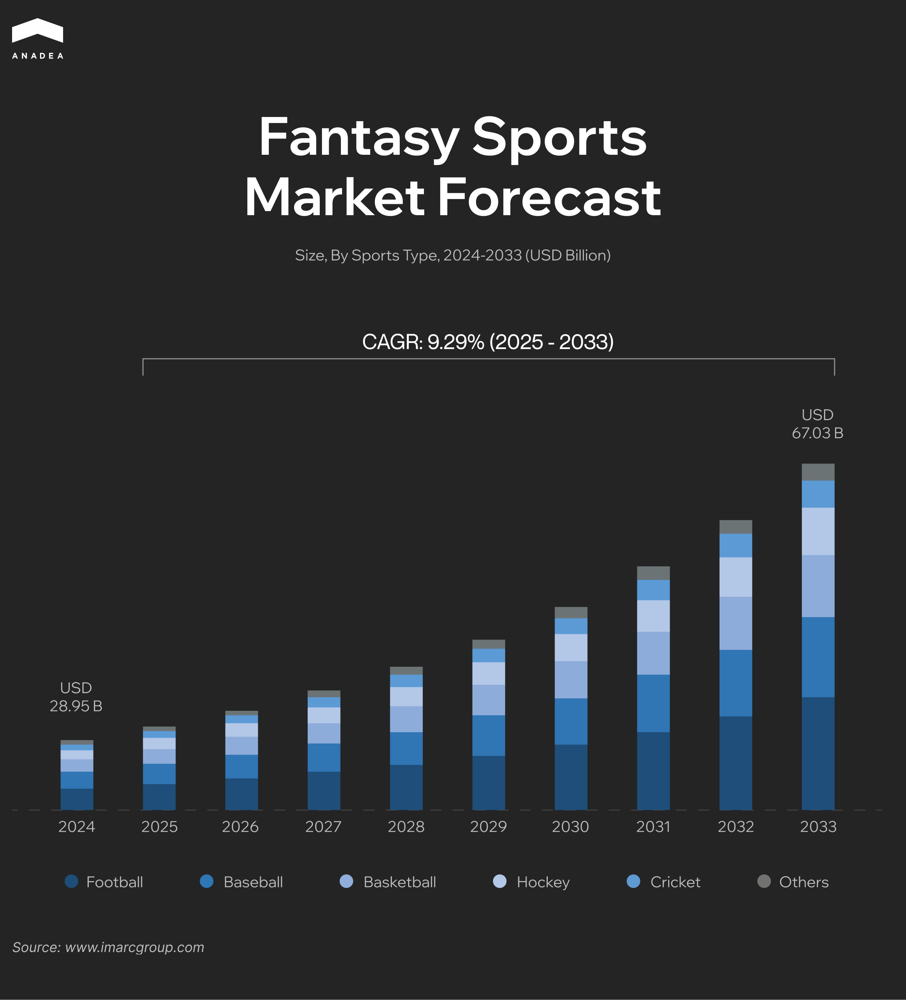

With millions of users participating in daily fantasy sports contests and season-long leagues, this industry has redefined fan engagement. Now, passive viewers can become active strategists and feel the vibe of real competition. This rise in the popularity of fantasy sports apps is fueled by tech advancements, gamification innovations, and new AI-driven possibilities for working with real-time data. All this makes fantasy sports one of the most promising trends in the entertainment sector.

In this article, we are going to talk about the basic and advanced features of a successful fantasy app and explore the tech behind it. Moreover, we will dive into the approaches to monetization of such products and share our expert recommendations for those who are planning to launch an app of this type.

## What Is a Fantasy Sports App?

Before we proceed to the peculiarities of [fantasy sports app development](https://anadea.info/solutions/sports-app-development/fantasy-sports-app-development), let’s start with the basics.

Such an app is a digital solution that provides users with the required tools to create virtual teams made up of real-world athletes. These teams earn points based on the actual performance of players during live matches. The better your players perform on the real field, the higher your team scores within the app.

In 2024, the global fantasy sports market value was at the level of $28.95 billion. According to the latest research, by 2033, the industry size can reach [$67.03 billion](https://www.imarcgroup.com/fantasy-sports-market). This will showcase a CAGR of 9.29% for the forecast period.

[Source](https://www.imarcgroup.com/fantasy-sports-market)

Among the strongest market growth boosters, analysts name growing smartphone penetration, expanding internet accessibility, and rising user engagement, which is achieved thanks to gamification and social appeal. 

Quite often, users invite friends to join their private leagues, which ensures the organic growth of such apps. At the same time, fantasy sport contests also encourage content sharing. Users like demonstrating their top scores or lineup picks on social media platforms. All this can help to draw attention to such apps and amplify their visibility across online communities.

Contests are an integral part of any fantasy sports app. They may come in many forms, including but not limited to daily challenges, public tournaments, and high-stakes leagues. They greatly drive user participation and can be either free or paid, which can become a powerful revenue stream for your app.

## Features of a Successful Fantasy App

With [custom fantasy sports app development](https://anadea.info/services/custom-software-development), you can make your solutions absolutely unique. Nevertheless, there is a core set of features without which running fantasy contests would be impossible. Below, you can find a list of these essential functionalities.

### User Registration and Profile

You should introduce a secure and simple onboarding system that will let users sign up via email addresses, phone numbers, or social media accounts. After the registration, users should be asked to create personal profiles for managing teams, tracking performance, and viewing contest history.

### Contest Creation and Participation

This feature will allow sports fans to join existing contests or create their own. It is recommended to include options for setting rules, entry limits, and prize pools.

### Player and Team Selection

Users should have feature-rich tools for building fantasy teams from a pool of real-world players. This section traditionally provides player stats, filters, budget caps, and other data for well-informed, strategic choices.

### Scoring and Leaderboard Systems

Your app should have features for live tracking of player performance and translating real-world stats into fantasy points. Leaderboards should display contests and league rankings.

### Wallet and Payout Integration

A secure in-app wallet system is a must. This functionality will help users deposit money, pay entry fees, and withdraw winnings. It can be a very good idea to integrate your fantasy sports app with popular payment gateways for reliable transactions.

### Notifications and Alerts

Push notifications and alerts will keep users informed about match timings, team updates, scoring changes, contest deadlines, and other strategically important data.

### Social Sharing 

To increase your app visibility, you can introduce built-in features for inviting friends, creating private leagues, and sharing contest results on social media. Such social elements will also drive engagement and make the experience more interactive and fun.

### Advanced Functionality

Being a [fantasy sports app development company](https://anadea.info/projects), we stay on top of industry updates and emerging tech trends. Based on our experience and observations, we have identified the following advanced features that you could consider integrating into your fantasy sports app.

#### AI and ML for Better Experiences

These technologies can bring smarter, more personalized experiences to your app. AI-powered tools can provide team recommendations to help users make better decisions.

Moreover, if you want to create the best AI app for fantasy football or any other sport, you can also use this emerging tech to increase security. [ML algorithms](https://anadea.info/services/machine-learning-software-development) can detect suspicious activities and timely block them.

#### Blockchain Integration

Blockchain can bring transparency, trust, and security into the fantasy sports ecosystem. It can be applied to verify contest fairness, handle secure transactions, as well as introduce digital ownership through NFTs and digital collectibles.

#### AR/VR

Augmented and virtual reality offers immersive and interactive tools and can take engagement to an absolutely new level.

#### Advanced Analytics

Fantasy sports contests are powered by data. Advanced analytics and real-time data processing can give users deeper insights and faster updates. Besides, predictive analytics for contest outcomes or trends can greatly fuel the spirit of competition.

#### Live Streaming Integration

Thanks to modern technologies, you can bring live sports directly into your app. This step can significantly boost user retention as your application will become a one-stop shop for many sports fans. Users will watch matches and manage their fantasy teams in the same place, which will make their experience much more seamless.

## Fantasy Sports App Development Tech Stack

The correctly chosen tech stack largely determines the success of your app.

What are the key factors you should consider before opting for particular tools and technologies?

* **Type of your app** (tech stacks for web and [mobile applications](https://anadea.info/services/mobile-development) will not be the same);
* **Complexity** (the range of used technologies will differ for an MVP and a full-scale solution);
* **Functionality** (the set of chosen features will define the list of tools and frameworks);
* **Business model** (if you want to introduce subscriptions and other monetization options, you may need specific integrations).

### Popular Technologies for Building Fantasy Apps

* **Mobile development:** Java, Swift, Kotlin;
* **Frontend development:** Angular, React Native, Flutter;
* **Backend development:** Django, Node.js, Python, PHP, Java;
* **Database:** MySQL, Cassandra, PostgreSQL, MongoDB, or Firebase;
* **Push notifications:** Firebase, Onesignal;
* **Sports data APIs:** FantasyData, SportRadar, Sportmonks, SprtsDataIO, LiveScore;
* **Payments:** PayPal, Stripe.

### Practical Tips from Anadea

Our company has rich expertise in building solutions for the [sports and fitness industry](https://anadea.info/solutions/sports-app-development/fitness-app-development). Currently, we are focusing on custom fantasy sports development. Here’s what we can recommend for such a project:

**Think about your app’s look and feel.** [UI/UX design](https://anadea.info/services/ui-ux-design) is as important as functionality. Given the modern trends, it will be sensible to introduce minimalist layouts. Ease of navigation and quick access to key features greatly enhance the user experience. Additionally, make sure that the app works smoothly across different devices. 

For example, when building a [social sports app](https://anadea.info/projects/justplay) and a [sports management platform](https://anadea.info/projects/plei), our team ensured that they were perfectly compatible with any device, relying on cross-platform development.

**Check legal compliance and licensing rules.** In some regions, fantasy sports apps still operate in a legally grey area, especially when financial rewards are involved. That’s why you need to verify in advance whether your platform will comply with local regulations, like the Unlawful Internet Gambling Enforcement Act in the US, as well as data privacy laws such as GDPR and CCPA. For operating in different jurisdictions, you may also need to acquire the relevant gaming licenses.

## The Best Monetization Strategies for Fantasy Sports Contests

It doesn’t matter whether you want to build the best fantasy football app, a [fantasy cricket solution](https://anadea.info/blog/fantasy-cricket-app-development-guide-2025/), or any other product of this type; your final goal will be to monetize it. Luckily, today, there are quite a lot of opportunities for it. You should think about them in advance, specifically at the initial stages. The implementation of many approaches requires varied functionality that should be added to your solution.

Here are the most common (and efficient) monetization and cross-selling strategies for fantasy sports apps.

### From Freemium to Premium Tiers

The freemium model often becomes a foundation for many successful applications and you can also choose it for your fantasy app. For instance, you can provide basic access to leagues and contests for free, while premium features will be available after making a one-time payment or buying a subscription.

**What premium options can you offer?**

* No ad experience;
* Early access to player statistics;
* Match previews;
* Advanced analytics and AI-powered predictions;
* Access to fantasy sports contests with bigger rewards.

One of the strongest benefits of this monetization strategy is that freemium works like a hook that demonstrates the value of your app to users. Meanwhile, the premium tier offers better experiences and higher engagement.

### In-app Purchases

In-app purchases can become a very important revenue stream in an NFL fantasy football app, for example, or any other solution with fantasy contests. 

**You can offer users to buy:**

* Power-ups and boosters (for instance, they can receive double points for a particular player);
* Custom themes or badges;
* Additional transfers or line-up changes;
* Access to special contests with high stakes.

### Mini Reward-based Games

You can enrich your app with side games or mini-challenges. Such options are aimed at boosting retention and leveraging additional monetization opportunities.

For example, your app can offer prediction challenges or spin-the-wheel games. Thanks to them, users can enjoy additional benefits, like extra points, coins, or exclusive access.

### Merchandising

Passionate fans love showcasing their favorite players or fantasy teams. And you can turn their enthusiasm into your additional revenue stream.

You can sell branded merchandise, like caps, mugs, jerseys, toys, or digital collectibles. Apart from this, you can introduce limited-edition merchandise related to special events.

### Affiliate Partnerships

The concept of affiliate marketing includes promoting another company’s products or services and earning a commission for every sale or lead generated through your unique referral link. When it comes to this monetization strategy, it’s important to think not only about your potential income but also about creating additional value for users. It means that you need to establish cooperation with those services and businesses that can be potentially interesting to your audience.

For example, it makes sense to promote sports streaming services, sports betting platforms (if they are legal in the chosen jurisdiction), sports equipment, or training apps.

### Access to Premium Content

Access to exclusive content can be tied to premium membership or offered via separate microtransactions depending on your broader revenue strategy. As premium content, you can offer practical tips for fantasy sports contests from experts and influencers, exclusive interviews with players, in-depth player stats, and analytics, as well as regular video or audio podcasts.

### Private Leagues 

Private leagues allow users to create invite-only contests for their friends or online communities. Such exclusive spaces provide them with more control over the rules and competition style.

In order to get the possibility of monetizing private leagues, you can launch custom branding, unique team logos, custom scoring and rule variations, league trophies, etc.

### VIP Fan Communities 

VIP fan communities go beyond the fantasy sports contests themselves. Such communities enable fans to connect, interact, and unlock exclusive perks in an exclusive virtual space. These communities can be centered around specific sports, teams, or even influencers. The main idea behind them is to transform users into invested brand advocates.

These communities can be subscription-based or part of a premium tier, giving fans access to such perks as:

* Early access to premium contests;
* Direct interaction with players, influencers, or analysts;
* Exclusive articles or podcasts;
* Member-only merchandise.

## Final Word

Fantasy sports apps today are much more than just picking players and gaining points. They have become full-fledged digital ecosystems powered by emerging technologies. User expectations are continuously increasing. To make sure that your fantasy app will win the hearts of sports fans, you need to think not only about its functionality, but also about its seamless performance, flawless design, and engaging experiences. 

Given the current market competition, it may be quite challenging to stand out. However, with a reliable tech partner by your side, this goal is absolutely achievable. At Anadea, we have the expertise, experience, and innovative approach required to [build a cutting-edge fantasy sports app](https://anadea.info/solutions/sports-app-development) that exceeds user expectations. [Contact us ](https://anadea.info/free-project-estimate)to discuss the details of our potential cooperation.


