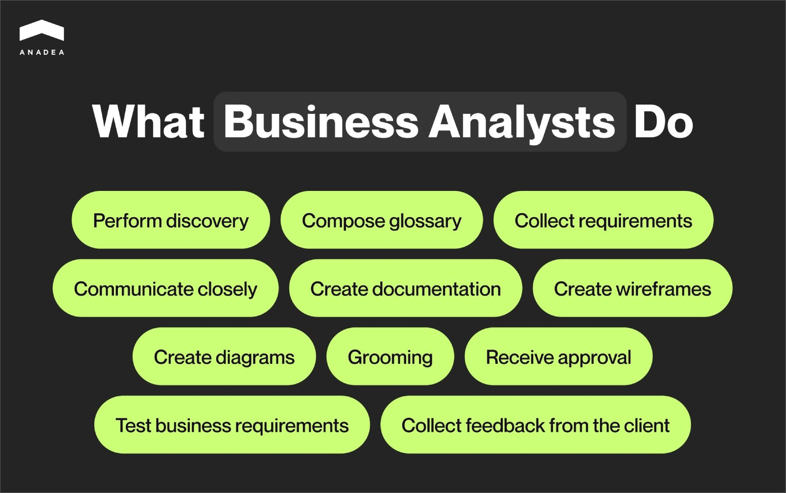

A fintech product is a dynamic system comprising many interconnected parts, constantly evolving and forming new connections. How do you keep track of them all, not missing a single detail? For that, fintech companies bring in **business analysts** (BA). These specialists spot emerging trends, streamline processes, ensure regulatory compliance, and offer strategic insights to boost decision-making and drive innovation. 

In this article, we will explore the vital role of [business analysis](https://anadea.info/services/business-analysis) in fintech software development. We'll break down their responsibilities, explain why they are essential, and share a real-world success story from one of our clients to highlight their impact.

## What are the challenges of fintech projects?

Business analysts work on projects across various domains, however, the fintech industry presents unique challenges that only a skilled analyst can navigate.

### Domain knowledge

Fintech is a dynamic, multifaceted field requiring specific industry knowledge. Without this knowledge, a BA may overlook critical compliance issues, misunderstand market trends, or fail to capture essential requirements.

While expertise takes time to develop, investing in domain knowledge early on significantly reduces costs of [fintech software development services](https://anadea.info/solutions/financial-software-development). In their turn, a business analyst with domain expertise will:

* Conduct domain-specific research.
* Create a glossary of key terms.
* Visualize processes using **Business Process Model & Notation** (BPMN) or **Unified Modeling Language** (UML).
* Study existing documents and compliance regulations.
* Analyze current product functionality.

### Ineffective stakeholder communication

Effective stakeholder engagement is crucial in fintech projects. However, stakeholders may be partially involved due to time zone differences, multiple commitments, or other business activities. Insufficient engagement can lead to outdated requirements and delayed feedback.

These steps on the BA’s part ensure that stakeholders are informed, engaged, and able to contribute effectively to the project's success:

* Developing and agreeing on a communication plan before project initiation.
* Recording discussions and sharing them with all stakeholders.
* Writing and distributing meeting minutes, highlighting significant decisions.
* Asking stakeholders to review meeting agendas and materials beforehand.
* Conducting all project-related correspondence in a single channel, avoiding direct messages, and tagging all relevant stakeholders.

### Changing business needs

Business needs in fintech can change frequently, leading to revisions even after requirements are finalized and approved. It can cause rework, project delays, and cost overruns.

A business analyst helps avoid rewriting code later, ensuring smoother project execution and better resource management by:

* Choosing an appropriate project delivery approach, such as Agile (Scrum or Kanban) for dynamic requirements.
* Constantly improving requirements elicitation processes.
* Thoroughly documenting and approving requirements with stakeholders before development begins.
* Analyzing the impact of changes on the current solution, considering timelines, budget, and resources.
* Discussing with the client which changes need immediate attention and which can be postponed.
* Maintaining a backlog, regularly coordinating it with the client, and prioritizing high-priority tasks.
* Overseeing change implementation, ensuring proper execution and tracking any subsequent modifications.

### Unrealistic timelines

Setting up timelines for a project is a skill in itself. Tight ones can create pressure affecting work quality.

A BA is someone who navigates tight timelines while maintaining project quality and stakeholder satisfaction. They:

* Evaluate the effects of timeline pressure and inform the client of potential costs and losses.
* Conduct grooming sessions with the development team and set task estimations before approval.
* Use outsourcing by attracting available specialists to resolve development issues quickly.
* Discuss all additional expenses with the client to ensure transparency every week.
* Manage unrealistic stakeholder expectations carefully to maintain balanced relationships without causing permanent damage.

### Legacy systems

Fintech’s reliance on legacy systems is no surprise, complicating new project integration due to outdated documentation and obsolete technologies.

A business analyst’s understanding of both legacy systems and new products makes software development easier and more cost-effective. It’s achieved through:

* Engaging the development team to define system resource constraints and scalability issues.
* Maintaining close communication with stakeholders for requirements elicitation and risk mitigation.
* Researching the existing legacy product and documenting any missing workflows.
* Creating clear and unambiguous requirements and conducting grooming sessions with the development team.
* Performing functional, integration, and acceptance testing of business requirements.
* Collecting feedback from end-users regarding implemented solutions.



## More benefits of financial business analysis

Besides overcoming known industry challenges, how else can business analysts help on a fintech project? Take a look at a few examples of what you get when engaging these specialists.

### Ensuring compliance

BAs make sure your products and services meet legal standards. This keeps consumer data safe, maintains system integrity, avoids penalties, and protects the company's reputation.

### Driving innovation

BAs are the innovators, and fintech thrives on innovation. They propose the development team ideas on automating tasks, cutting down on routine work, and reducing errors using [Machine Learning](https://anadea.info/services/machine-learning-software-development) (ML) and Deep Learning (DL) solutions. These solutions, further implemented by developers, streamline processes, boost accuracy, and enhance efficiency, all while hitting business goals.

### Facilitating integration with third-party solutions

BAs make third-party solutions fit smoothly into existing systems using APIs. Together with the development team, they check for compatibility and ensure integrations meet technical and business needs, helping you expand services and improve customer experiences.

### Enhancing data security

Data security is crucial, specifically in fintech. Business analysts recommend top-notch security features like encryption and two-factor authentication, making sure these measures comply with regulations and protect sensitive data.

### Optimizing costs

BAs are key to keeping costs in check. They define the project's value stream, prioritize the backlog, and cut unnecessary changes. By spotting areas for automation and process improvements, they ensure efficient resource use and timely project milestones, speeding up market entry and giving a competitive edge.

Hire a business analyst

## Business analyst in finance: What they do

Discovery phase, wireframes, documentation—we decided to gather in one place most buzzwords tightly associated with business analysis. Together, they will give a complete understanding of the tools and methods BAs master.

### Perform discovery

The [discovery phase](https://anadea.info/guides/project-discovery-phase) is a stage (3–6 weeks) where business analysts and developers explore and identify the goals, requirements, constraints, and risks of the project. This phase helps fintech companies overcome initial market barriers by validating theories with market data before launching a product. While discovery is important, some would say necessary, remember that BAs can be involved throughout the entire development process. Even after the discovery is completed, they continue to play a critical role in optimizing costs, enhancing data security, and driving innovation.

### Compose glossary

Business analysts create a comprehensive glossary of key terms used in the fintech project, ensuring everyone has a common understanding, reducing miscommunication, and improving clarity. The glossary includes technical jargon, business-specific language, and any unique terminologies used by stakeholders.

### Collect requirements

BAs gather detailed information about business needs and objectives from stakeholders through interviews, workshops, observations, and surveys. They ensure thorough understanding and effective communication by preparing in advance and facilitating discussions.

### Communicate closely

Regular engagement with stakeholders is essential. BAs discuss project progress, clarify requirements, and address concerns, building strong client relationships. They also work closely with the development team to translate business requirements into technical tasks, ensuring alignment and successful project outcomes.

### Create documentation

BAs translate business requirements into clear documentation, choosing the appropriate type based on project needs and budget:

* **User stories:** Describe functionality from the end-user's perspective.
* **Use cases:** Detail interactions between users and the system for specific tasks.

### Create diagrams

Business analysts use diagrams (UML or BPMN) to visually represent the system’s structure and processes. These help stakeholders and the development team understand architecture, data flow, and interactions, identifying bottlenecks and making early improvements.

### Create wireframes

To illustrate the user interface layout and functionality, business analysts create wireframes. These help stakeholders visualize the end product and provide feedback before development begins, ensuring design alignment with expectations.

### Grooming

In agile, grooming is the process of reviewing and refining the backlog of requirements. Grooming, organized by a business analyst, ensures each item is well-defined, prioritized, and ready for implementation, facilitating smooth development.

### Receive approval

Before development starts, BAs seek client approval for the gathered and estimated tasks, ensuring agreement on the planned scope of work and reducing the risk of misunderstandings and scope changes later.

### Test business requirements

BAs participate in testing to ensure that developed features meet specified business requirements. They conduct functional, integration, and acceptance testing, validating that the system performs as expected and documenting any issues for the development team.

### Collect feedback from the client

After delivering the product or feature, BAs gather client feedback to understand how well the solution meets their needs and identify areas for improvement. This feedback informs necessary adjustments and continuous improvement in future releases.

By following these steps, BAs ensure fintech projects align with business objectives, meet required standards, and deliver high-quality products that satisfy client needs.

Discuss details

## Essential skills of a fintech business analyst

Successful business analysts in the fintech industry need a mix of technical (hard) and common (soft) skills. When you hire a business analyst for your fintech project, you want them to possess the following skills:

### Hard skills

**Technical background**

* **Understanding programming concepts.** Helps in breaking down functionality and communicating effectively with the development team.
* **Knowledge of system architecture.** Provides robust, scalable, and integrated solutions.
* **Proficiency in database technologies.** Necessary for extracting and analyzing large datasets.

**Modeling skills**

* **Proficiency in BPMN and UML diagramming.** Align and visualize requirements, identify bottlenecks.
* **Data modeling expertise.** Use ERD and DFD to represent database structures and relationships.

**Documentation skills**

* **Creating clear reports.** Integrate technical decisions and business goals.
* **Requirements documentation.** Document stakeholder needs through user stories, use cases, and technical specs.

**Regulatory compliance**

* **Knowledge of compliance regulations.** Ensure new products meet regional and service-specific regulations.
* **Upholding ethical standards.** Maintain trust and integrity by recognizing ethical implications.

### Soft skills

**Communication skills**

* **Effective stakeholder interaction.** Communicate clearly with technical teams, management, and end-users.
* **Strong presentation skills.** Explain complex concepts in simple terms.
* **Empathy and sensitivity.** Understand and respond to stakeholder needs.

**Analytical skills**

* **Advanced data analysis.** Use analytics tools to generate insights and guide decisions.
* **Problem-solving acumen.** Identify patterns and solve complex problems.

**Critical thinking**

* **Logical evaluation of systems.** Navigate complex financial systems and make informed decisions.
* **Risk assessment skills.** Identify potential risks and incorporate them into mitigation strategies.

**Problem-solving skills**

* **Innovative solution development.** Use new technologies and methods to improve processes.
* **Quick decision-making.** Adapt swiftly to changing market or project conditions.
* **Effective risk mitigation.** Develop strategies to ensure stability and security.
* **Strong negotiation skills.** Reach beneficial agreements with stakeholders to streamline development.

By mastering these skills, a fintech business analyst can effectively manage financial projects, ensuring success and continuous improvement.

## Anadea’s practical experience: Helping our client integrate annuity Flex Loan

**Flexidea**, an invoice factoring company, approached Anadea’s business analysts to integrate an annuity credit line into their existing solution, which already had a linear credit line. Without a clear technical task from the client, we had to dive deep into the domain, search for existing formulas, and conduct competitive analysis to find the optimal solution. Throughout this process, we maintained open communication with Flexidea to understand all the requirements.

### Step 1. Modeling the credit line in sheets

Our team decided to model the credit line using Google Sheets. This approach addressed several key issues:

1. **Visualization.** Flexidea could see how the credit line would be implemented and understand their potential income.
2. **Requirement clarity.** The prepared tables helped clarify requirements, and we received client validation before starting development.
3. **Testing the concept.** Together with the client, we tested different ideas for interest accrual and loan repayment.
4. **Reducing risks.** Including these calculations in the user story and getting client approval minimized the risk of rework.

We also noted the differences in rounding between Google Sheets and the legacy system. To maintain consistency, we used the legacy system's rounding logic and, to adhere to the logic of annuity lending, where all payments should be equal, proposed to implement balance recalculation in the final period.

### Step 2. Daily updates and offer management

For a better user experience and compliance with current domain rules, we implemented daily updates to the loan schedule until the offer was accepted. This included updating the offer signing date and displaying it correctly in the loan agreement.

### Step 3. Addressing integration challenges

Integrating the new product into the legacy system came with its own set of challenges. Customers needed to sign both a credit and a service agreement with Flexidea, a rapidly growing startup. To avoid legal issues, new service agreements were required for the new product. However, since not all Flexidea clients could use the new product, we had to develop a mechanism allowing customers needing loans to sign the new agreement without disrupting existing workflows.

Additionally, we ensured that each approved Flex Loan included all required terms in the agreement to comply with domain regulations.

### Step 4. Automating transactions and ledger entries

Automating transactions and ledger entries was crucial. This not only saved time but also reduced human error, meeting a key requirement for Flexidea.

### Step 5. Enhancing user experience

Another key focus was ensuring that the solution was integrated into the existing system with maximum simplicity, without compromising functionality. Wireframes played a big part in this, helping us and Flexidea align on functionality. Once approved, a designer brought these wireframes to life.

### Step 6. Notifications and customer convenience

To minimize financial risks like late payments, arrears accrual, and incorrect repayment amounts, we developed notifications with up-to-date information. Relevant figures on the loan's indebtedness were displayed in the customer's personal cabinet, along with the loan agreement, reducing potential claims against Flexidea.

Anadea’s work with Flexidea is a perfect example of a difference made by a business analyst in finance. This integration, coupled with Flexidea's innovative AI functionality (find out more in the [case study](https://anadea.info/projects/flexidea)), has allowed the company to offer a robust and user-friendly factoring app. Finally, the recent stake acquisition by **Helenos** private equity fund is another evidence of Flexidea's success.

## Bottom line

In fintech, business analysts are the unsung heroes. They navigate evolving technology and regulations, making sure projects hit business goals. Hiring experienced BAs makes financial product delivery smoother and helps catch risks early on.

Interested to learn how a fintech business analyst can contribute to your company? You’re one click from finding out. Book a consultation with our experts and secure a successful future for your product.

Get in touch
