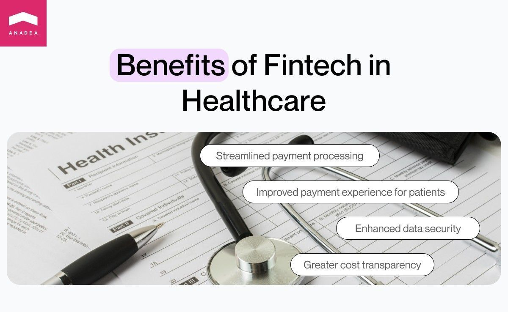
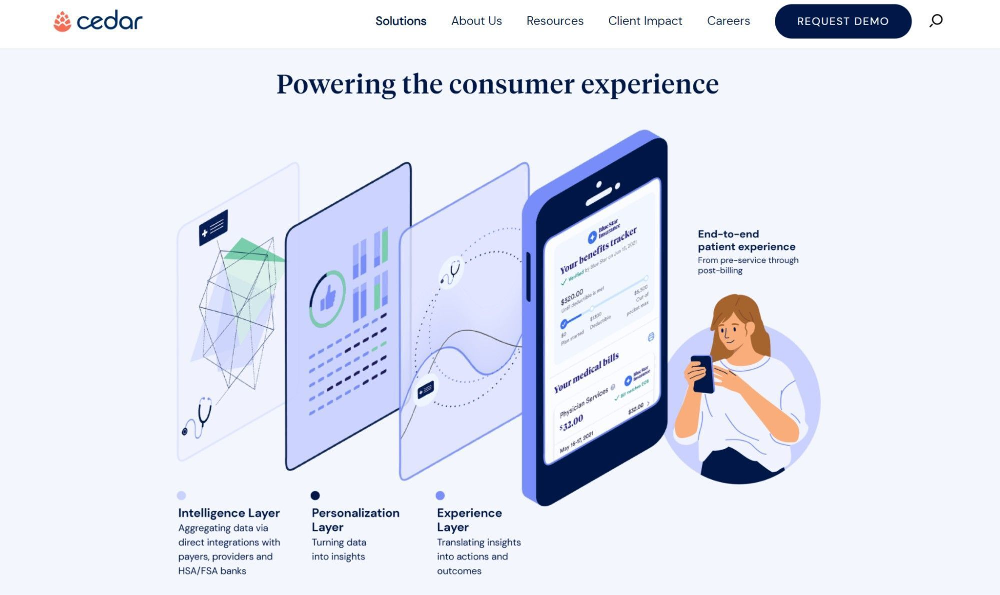

Healthcare is one of those industries that are actively adopting various <a href="https://anadea.info/solutions/medical-app-development" target="_blank">digital solutions</a> these days. A lot of them are directly aimed at increasing the quality of medical services and expanding their range. Nevertheless, we shouldn’t forget that the provision of medical care is also associated with a huge number of administrative tasks and processes which traditionally used to take a lot of time and effort. However, the application of fintech in healthcare industry can help to efficiently address the existing issues related to them.

In this article, we will talk about fintech healthcare solutions and provide a row of practical tips for those who have plans to launch such a project on their own.

## What is fintech in healthcare?

In a very broad meaning, fintech (financial technology) is a new alternative to traditional financial services and products that quite often turn out to be obsolete and inappropriate in modern conditions. Such solutions help to automate and enhance the delivery of financial services in order to streamline, facilitate, and optimize a lot of tasks for all market participants.

The concept of fintech in healthcare presupposes the use of financial technologies to improve the process of exchanging funds and information between medical service providers and patients. And the final goal of the implementation of healthcare fintech solutions is just the same as that of financial technology in general - to let all involved parties save their valuable effort and time.

## How is fintech transforming healthcare?

Today, fintech is gradually revolutionizing the healthcare industry by introducing new models for record management, telemedicine, insurance, and much more. Here is a couple of use cases of fintech in healthcare.

1. **Healthcare lending**. This model includes the possibility of getting credit for covering medical expenses and other associated costs. According to recent data, around <a href="https://www.kff.org/report-section/kff-health-care-debt-survey-main-findings/" target="_blank">40%</a> of the US residents have different kinds of debts that have a direct relation to their healthcare needs which highlights the necessity to introduce reliable and easy-to-use healthcare lending services. And that’s exactly what fintech projects can provide.
2. **Health wallets.** Such solutions are special digital accounts where patients can save funds for their medical expenses. Health wallets are already quite popular in the US, but in a wide range of developing countries, the majority of patients have never heard about them. Nevertheless, we shouldn’t underestimate their significance and benefits.
3. **Digital payment systems.** The introduction of advanced payment systems is a major step for the healthcare industry. Such solutions as online gateways, crypto payments, and mobile transactions provide better convenience and ensure higher accessibility of medical services.
4. **Insurtech.** Insurtech projects that unite the power of technologies with the best practices of the traditional insurance industry can greatly change the healthcare landscape. Thanks to such technologies as Machine Learning and Big Data, healthcare insurance services become more personalized and better tailored to patients’ needs.

Let's talk about your project

## Reasons to employ fintech in healthcare industry

Let’s summarize the benefits that both healthcare service providers and patients can leverage thanks to [fintech development services](https://anadea.info/solutions/financial-software-development).

1. **Enhanced patient payment processing and management.** The processing of payments can be not only time-consuming but also rather confusing for the administrative staff of medical institutions. Moreover, when it comes to the necessity to find any documentation, it also can become a real challenge. When all paperwork and obsolete web portals are in the past, it’s time for fintech apps. They allow medical institutions to reduce administrative costs, get payments faster, and enjoy smoother inner processes.
2. **Better patient payment experience.** With traditional approaches to organizing payments, making transactions can become a very stressful task for patients. But thanks to the launch of user-friendly online platforms and apps, payment experiences can become much more straightforward and seamless. As a result, people can pay for the required services with just a few clicks, view their payment history, and be sure that their transactions will be securely processed and delivered.
3. **Higher data security**. Medical data have always attracted hackers. And unfortunately, due to the lack of proper protection systems, hospitals often become easy prey. In 2023, in the US only, there were more than <a href="https://www.statista.com/statistics/798417/health-and-medical-data-compromises-united-states/" target="_blank">800 incidents</a> of data breaches in the healthcare sector. This figure is rather impressive, especially given the fact that, for example, in 2005, the number of such incidents was only 16. Paper systems and legacy software can be easily compromised. But data encryption, blockchain, and other technologies that healthcare fintech solutions are powered with ensure better protection of sensitive patient data.
4. **Increased cost transparency**. Transparency is one of the key principles that the modern economy should be based on. Buy now, pay later fintech solutions that are introduced in various market sectors greatly contribute to the overall growth of transparency, which is also demanded by patients in the healthcare industry, Unexpected amounts seen in medical bills can not only compromise trust but also spoil the general patient experience. And fintech healthcare tools can fully eliminate such risks. Patients can always stay informed about relevant pricing and can better plan their budget allocation.

Contact fintech experts

## Examples of healthcare fintech companies

If you have plans to build your own fintech healthcare project, it will be helpful to have a look at the successful companies that work in the market.

### Cedar

The US-based company Cedar provides a patient-centric healthcare fintech platform powered by smart product design, data science, multi-party integrations, and personalization. The idea for this project was born based on the personal experience of its co-founders who faced quite disappointing situations related to the traditional healthcare system processes. The platform covers the entire patient journey, from pre-service to post-visit support. And what makes the platform really special is that it brings personalization to the interaction between patients and clinics regardless of the chosen channel. It can be a contact center, a clinical patient portal, the offered login-free web app, or other options.

Thanks to combining the best of fintech, ad tech, and healthcare, Cedar helps providers better understand their patients and engage them more effectively. At the same time, patients can leverage clear processes and smooth experiences at all the steps of their interaction with hospitals and medical centers.

### CareCredit

This company offers a health and wellness credit card with flexible financing options. Thanks to the provided opportunities, patients can pay for the required services over time. Patients can apply for getting funds online and their applications will have no impact on their credit score. Credit decisions are made instantly. The company offers a convenient online calculator that helps people quickly explore different options that are available to them based on the amount that they want to get. Today, the CareCredit card can be used to pay for multiple healthcare and wellness services at more than 260,000 locations in different countries of the world.

### Wellpay

This fintech platform provides complete and secure payment and financing solutions for different types of healthcare services and practices. The company developed a range of tools that are aimed at streamlining billing operations and reducing staff workloads. Service providers can enjoy such features as customizable patient financing options, dashboard & real-time reporting, intelligent patient communications, EMR integration & file imports, and automated eligibility checks.

At the same time, for patients, the process of making payments has become much less stressful. Wellpay has established a partnership with Affirm. Thanks to this collaboration, their customers can get access to financing and pay for medical services over time.

Build your own platform

## How to launch your own fintech healthcare startup

Before you establish your own company that will offer fintech services in the healthcare industry, you need to attentively plan this journey. What steps should be included?

1. **Market analysis.** First of all, you need to understand what solutions are already available to patients and providers. It will be helpful to analyze not only their functionality but also reviews of those who have already started using them. Based on the opinions of users, you will be able to understand how you can address the existing pains with your product.
2. **Ideation**. You need to clearly determine the goals of your project. And in accordance with them, you will be able to elaborate the general concept of your solution. To define how you will cope with the existing tasks, you need to study what opportunities are available to you thanks to modern technologies. For example, you can study our article on the use of <a href="https://anadea.info/blog/ai-in-fintech" target="_blank">AI in fintech</a>. Also, do not forget to think about your monetization strategy. Already at the initial steps you need to know how your project will earn money.
3. **Development team hiring**. Not every startup has the possibility to hire a big development team just at once. That’s why in many cases, it’s worth considering fintech outsourcing. Today, there are quite a lot of available options. It means that you have a very high chance of finding a team with the required expertise that will provide appropriate terms for cooperation. At Anadea, we will be always happy to offer you our services. And given our experience in building fintech solutions and working with <a href="https://anadea.info/blog/healthcare-saas" target="_blank">healthcare SaaS</a> projects, we can become a perfect match for you.
4. **Project realization planning**. When developers are hired, it’s time to discuss all organizational moments, set budgets and timeframes, choose a tech stack, etc. All this presupposes the necessity to conduct a deep analysis of the available resources and the desired outcomes.
5. **Design and development.** Traditionally, this step requires a lot of effort from the side of your tech team. It includes prototyping, designing, coding, testing, bug fixing, and many other tasks that are quite traditional for software development projects. To minimize financial risks, a lot of startups initially invest in the development of an MVP only. This product version with a limited set of features allows them to test whether their solution meets the needs and expectations of users. Based on their feedback, it is possible to make better-informed decisions regarding launching a full-scale product.
6. **Marketing and promotion.** Even the greatest project will fail if it isn’t promoted well enough. You should consider various marketing strategies that will let your target audience learn about your solution. Though you can rely on such time-proven tools as context advertising, we also recommend you not ignore the possibilities provided by social media platforms. Collaboration with influencers can bring excellent results.

## Conclusion

As you can see, the launch of your own fintech healthcare startup is not the easiest task. Nevertheless, with the right approach and a good idea, you can greatly contribute to the digital transformation of the healthcare market and bring real value to all its participants.

Have a fresh idea for a fintech solution that will revolutionize the healthcare industry? Just let us know! With our expertise in this domain, we are sure that we will find the best approach to your project realization.

Get in touch
