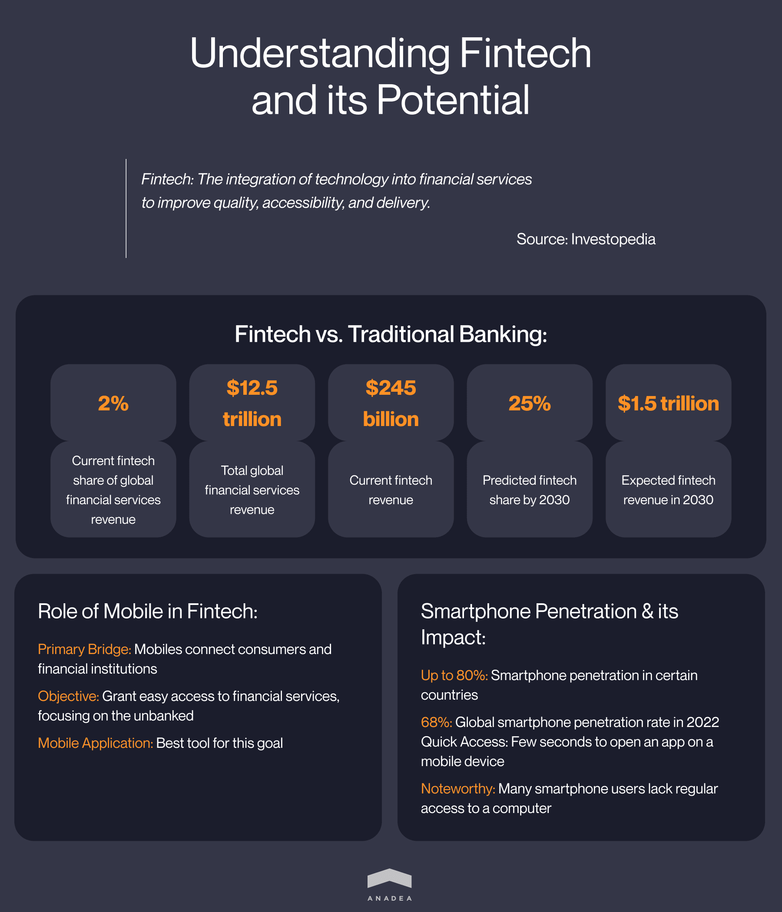
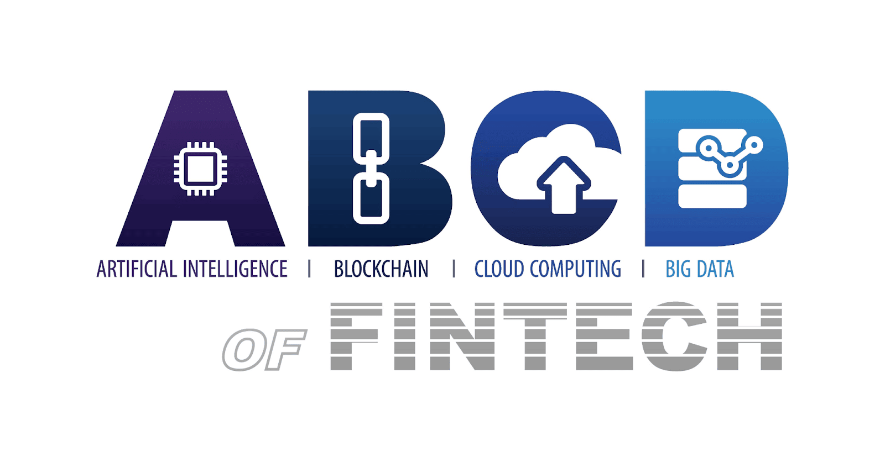
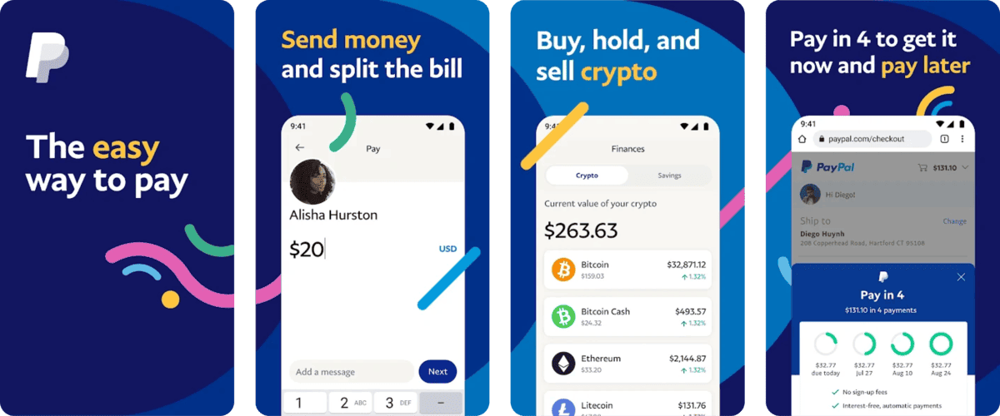
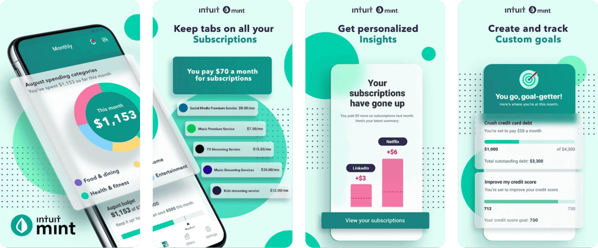
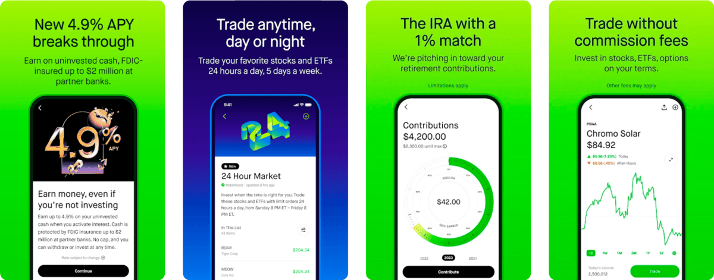
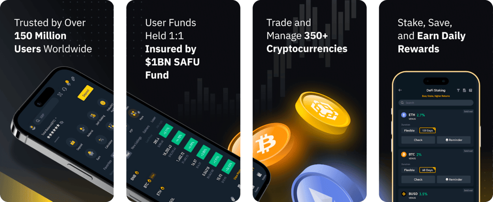
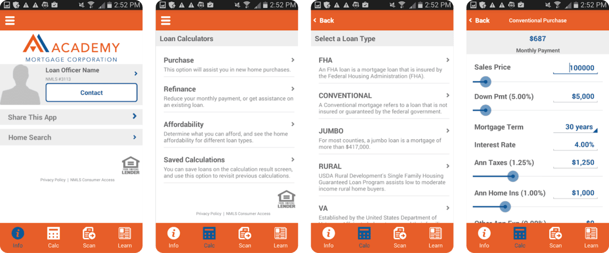

Though the traditional banking and finance industry has been growing and
developing for centuries, today, it may seem that it is experiencing not
the best times. The main issues are related to the lack of flexibility
in its processes and its inability to cope with the continuously
increasing number of clients, transactions, and tasks.

The market desperately needs new innovative solutions that will address
the existing problems. As you know, an increase in demand inevitably
leads to an increase in supply. And here the fintech industry comes to
the arena as an alternative to a rather cumbersome traditional banking.
In this article, we are going to talk about the growing popularity of
new solutions, the peculiarities of fintech mobile app development, and
share a row of recommendations that will help you to build a fintech app
that will be welcomed by the market.

## The current state of the fintech industry

Before speaking about fintech app development, we need to make sure that
every person who reads this blog post has the right understanding of
fintech. According to
[Investopedia](https://www.investopedia.com/terms/f/fintech.asp),
this term is used for describing the integration of technology into
financial services which is done to improve their quality,
accessibility, and the way of their delivery to customers.

Today it is too early to speak about the potential of the fintech
industry to fully replace the traditional banking and finance industry.
However, together with the growth of the demand for [fintech software development services](https://anadea.info/solutions/financial-software-development), we can observe the expansion of the fintech sector. At the
current moment, it holds a share of 2% of the global financial services
revenue which stays at around \$12.5 trillion. But analysts
[expect](https://www.bcg.com/press/3may2023-fintech-1-5-trillion-industry-by-2030)
that by 2030, the share of banking fintechs will be almost 25%. It means
that from \$245 billion, the revenues of fintech will grow to \$1.5
trillion.

Fintech mobile app development services can boast their skyrocketing
popularity these days because namely smartphones can be viewed as the
main liaison between consumers and financial institutions. One of the
core goals of every company that wants to build a fintech app is to
guarantee easy access to financial services to everyone and especially
to those who are currently unbanked.

And a mobile application is just the best way to do it With the enormous
[smartphone
penetration](https://www.statista.com/statistics/203734/global-smartphone-penetration-per-capita-since-2005/)
that we can observe today (in some countries it is already around 80%
and the global rate was 68% in 2022), it is quite logical to rely on
mobile technologies in delivering financial services to people.
Smartphones are always in our pockets, bags, or just somewhere nearby.
Usually, just a couple of seconds are required to take a mobile device
and open an app. Moreover, not every person who owns a smartphone has
permanent access to a computer. That's why we can say that financial
mobile app development is the most relevant and feasible approach to
delivering fintech services to users.

## Benefits of fintech solutions for businesses and consumers

To estimate whether it is really worth investing in fintech apps
development today, we suggest you have a look at the list of new
opportunities that such solutions open to all participants of the
financial market.

Let's start with the advantages for consumers:

1. Higher level of financial inclusion
2. Availability of new products and services
3. Personalized approach
4. Speed of financial transactions
5. Easy access to financial products
6. Lower fees
7. Enhanced transparency

And what benefits can companies leverage thanks to fintech app
development?

1. Optimized operational costs
2. Access to business capital
3. Enhanced cash flow management
4. Higher client satisfaction and loyalty
5. Increased security of transactions
6. Automated accounting record keeping
7. Streamlined payment process

All these benefits that we've enumerated are only a small part of those
that businesses and consumers can enjoy thanks to implementing a fintech
mobile app in their interaction. Moreover, there are a lot of
industry-specific advantages. But one thing is obvious, financial mobile
app development is always a win-win initiative for companies and their
clients.

## What technologies are used in fintech mobile app development?

If you have already started planning your fintech application
development project and communicated with finance app developers, you've
probably heard about **ABCD of fintech**. This acronym stands for the
technologies that are widely applied in fintech solutions. They are
**Artificial Intelligence, Blockchain, Cloud Computing, and Data (Big
Data).**

-  **Artificial Intelligence (AI) and Machine Learning (ML).** These
  technologies play an important role in the evolution of the
  fintech landscape today. They help to increase the automation of
  numerous processes, enhance efficiency, enable accurate
  predictions, and improve risk management. Moreover, by using
  AI-powered solutions, companies can deliver highly personalized
  services and experiences to their customers in full accordance
  with their ongoing needs.

-  **Blockchain**. Though blockchain is widely associated with
  cryptocurrencies, crypto assets are only one of the use cases of
  this technology. Today blockchain is chosen by many companies for
  building their apps and storing their data. Blockchain platforms
  provide the possibility to record and spread digital information
  but prevent it from being edited. As a result, the transparency of
  all transactions is ensured. What's more, thanks to blockchain you
  can fully exclude intermediaries from financial processes which
  will help you to make all operations faster and cheaper.

-  **Cloud computing.** Cloud technologies are among the main boosters
  of the fintech sector's growth. Cloud computing has fully
  revolutionized the way financial companies provide their services
  and organize their internal processes. With cloud platforms,
  companies can store, access, and process their data much more
  securely and efficiently than earlier. Cloud applications are also
  much more scalable and flexible than others and by using them,
  companies can implement new business models for enhancing user
  experience

-  **Big Data**. Data is one of the most valuable business resources
  these days. And the better a company can work with its data, the
  higher the results it can achieve. But in the modern business
  world, the volumes of data are really huge which makes it
  absolutely impossible to process them manually and do it quickly.
  And that's when Big Data analytics should enter the game. By
  getting valuable insights into customer demands, expectations, and
  requirements, fintech companies can adjust their services in such
  a way that they will precisely address the needs of their clients.

The evolution of these technologies and the achieved progress will
greatly define the future of the fintech industry and fintech mobile app
development services. It is expected that already in the near years we
will be able to observe further expansion of the fintech sector. This
growth will be greatly supported by the adoption of blockchain and
crypto assets. At the current moment, different governments all over the
world are working on the elaboration of solid regulation of this type of
asset. Meanwhile, central banks of different countries are developing
**CBDCs (central bank digital currencies)** that can fully change the way
international transactions are conducted today. If all the current plans
are realized, crypto will have just the same rights and power as fiat
currencies have today in b2b, p2p, and p2b transactions.



## Finance mobile app development: Different types of solutions

The sector of mobile application development for fintech unites numerous
app types. That's why when you are planning to deliver such a solution,
first of all, you need to make up your mind and choose what product you
are going to build. We've prepared a list of app types that today are
highly demanded in the industry. Nevertheless, it doesn't mean that you
should opt for just one type. For your custom fintech mobile app, you
can choose several types of solutions, analyze their functionality, and
combine their features in your unique software product.

### Banking apps

Let's put it as simply as possible. A digital banking app can be
explained as a bank on your smartphone. Such applications provide users
with access to a wide range of banking products and services. And what
is even more important is that thanks to such apps, users can avoid the
necessity to work with banks in a traditional manner and visit bank
offices each time they need a consultation or when they want to make a
transaction.

As an example of such solutions, we can mention an application run by
**Nubank**, a Brazilian fintech startup that has won global fame. The
company offers such services as instant money transfers, invoice
management, spending monitoring, etc. People get free accounts,
easy-to-use interfaces, and the possibility to earn rewards.

### Payment apps

As it is clear from the name of this category, these apps offer
functionality for making and receiving payments. They can be viewed as
an alternative to traditional online payments that are performed with
the help of credit and debit cards. On such applications, users should
create their own accounts where they will store their funds. Money can
be withdrawn and sent to bank accounts.

**PayPal** is a US-based fintech company that operates its online system for
payments. Users can get access to the system via a web platform and
mobile app. Today the company has over 426 million users from all over
the world. The mobile app can be used for p2p transactions as well as
for business financial operations and p2b payments.

### Personal finance apps

Such apps provide users with convenient tools for managing their money.
As a rule, they have functionality for tracking expenses, planning
budgets, calculating savings, etc.

**Mint** by Intuit is a free application that provides people with the
possibility to have a clear picture of their financial situation. A user
needs to link a debit or credit card to the Mint's account and the app
will help to analyze all the transactions. All financial operations will
be categorized and a user will see how the money was spent. With Mint,
users can also track their bills and create budgets.

### Stock trading apps

Investing today has become absolutely simple and available to a very
wide audience. With the help of mobile apps, everyone can buy stocks of
the most prominent Wall Street giants and get profits.

**Robinhood** is one of the best examples of such solutions. It was launched
in 2015 and since then it has been offering zero-commission stock
trading and other investment opportunities. The app is considered to be
a good option for beginners who are interested in trading stocks, ETFs,
and even crypto assets.

### Crypto apps

The adoption of cryptocurrencies is gaining momentum. Though there are a
lot of risks associated with investing in these assets, with the right
approach and some portion of luck, it is possible to make money on
crypto trading.

Practically all crypto exchanges, including **Binance, Coinbase, OKX,** and
others, have their mobile apps today. That's why users just need to find
the most appropriate variant for them based on the range of trading
pairs, size of commissions, and availability of the app in their region.

### Insurance apps
Such apps allow users to find insurance programs
based on their individual needs and to buy insurance policies online.
Apps of this kind typically offer a very convenient search system that
helps to find appropriate options within just a couple of seconds. Users
just need to answer some questions and an application will offer
suitable variants.

**Lemonade** is an AI-driven insurance app that relies on bots instead of
brokers and allows users to avoid a lot of paperwork. By using this app,
can find any type of insurance they can only wish for, analyze the
terms, and buy the best option.

### Loan apps

Now to take a loan it is not necessary to visit a physical bank office.
It is enough just to download a loan app, view available options, and
submit an application. Such apps allow users to calculate the
feasibility of different options and make well-informed solutions.

**SoFi**'s mobile application is not only a loan solution, it also offers
investments and banking functionality. However, the company has a wide
range of loan products like private student loans, loan refinancing, and
personal loans. For so-called smart money moves, users get points that
can be redeemed for cash or used for loan payments.

### Mortgage apps

This is one of the types of loan software. They are intended for dealing
with loans that will be used for buying real estate. A mortgage app
provides access to a digital format of interaction between borrowers and
lenders (credit unions, p2p platforms, banks). Usually, these apps offer
such functionality as a mortgage calculator, submission of applications,
payment management, and customer support.

**My Mortgage: Mobile** by Mortgage Academy is one of the apps that have
very high rankings on the marketplaces. A solution allows users to
compare different loan programs, calculate the feasibility of mortgage
refinancing, stay in touch with their loan officers, and easily scan and
store all the required documents.

## What should you think about before fintech app development?

Though the stage of design and development is always believed to be the
core part of any project that includes the creation of a software
product, there is a row of other important things, steps, and issues
that you shouldn't forget about.

### Idea

One of the most fundamental steps of any finance mobile app development
project is ideation. Nevertheless, its significance is often
underestimated. You need to elaborate a clear concept of your future
solution, set tasks that it should fulfill, and find out what features
should be built to make it possible to achieve the defined goals.

### Monetization

Already at the stage of planning you should know how you will make money
on your app because some monetization strategies will presuppose
building additional functionality. When you are going to build a fintech
app, you can consider one of the following options:

- In-app advertising;
- Subscription fees;
- Commissions for transactions;
- Premium features.

Of course, your choice of the way to make money on your app will greatly
depend on the exact type of solution that you want to launch. But
please, never forget about user experience. For example, if you want to
introduce some paid features, it should be absolutely simple to pay for
them. And if you want to introduce in-app ads, you should make sure that
they are not too irritating.

### Your development team

It is crucial to work with finance app developers who have strong
practical skills and deep theoretical knowledge that are required for
creating advanced solutions for the fintech industry. If you already
have in-house professionals with the required qualifications, then you
will just need to make sure that the size of your team will be enough to
perform all the set tasks. But if you do not have such professionals,
you will need to work with freelancers or a reliable software
development company. It will be useful for you to read some tips on
[how to find an app
developer](https://anadea.info/guides/how-to-find-an-app-developer)
for your project. And you should also know that at Anadea, we have
[relevant
experience](https://anadea.info/projects#financial) and
will be always happy to support you at any step of the development
process.

Usually, a fintech apps development team has the following composition:

- 1 backend developer;
- 1 or 2 mobile developers (iOS and Android);
- 1 UI/UX designer;
- 1 QA engineer;
- 1 project manager.

However, your project team may look different based on the peculiarities
of your future solution.

### UI/UX design

We'd like to pay special attention to the necessity to think about the
user-friendliness of your application and the way people will interact
with its functionality. With such solutions, people will manage their
finances and conduct various operations with their money. That's why it
is vital to make all processes as straightforward and clear as possible.
The complicated logic of your app will pose additional risks of losing
money by mistake or conducting wrong operations. And without any doubt,
such threats will discourage users from choosing your application.

### Regulatory compliance

The banking and finance industry is one of the most regulated ones. To
operate a fintech mobile app, your company should have all the required
licenses and permissions (their list will depend on the chosen
jurisdiction). Without obtaining such approvals from the relevant
authorities you can't offer any finance-related services. And here, you
should be very attentive. You need to study the existing requirements,
rules, and regulations already at the stage of fintech application
development in order to build a solution in accordance with them.
Moreover, you should check whether the services that you are going to
offer are allowed in the chosen region. This point is especially
important if you want to provide any services related to
cryptocurrencies.

## Fintech mobile app development challenges

When you are looking for tips on how to develop a fintech app, it will
be very helpful to analyze potential challenges that you can face at any
stage of project realization. When you are well-prepared for them, you
will be able to easily mitigate any possible risks.

-  **Right targeting**. Already at the stage of planning, you need to
  clearly define who will be your target audience and what tasks you
  will help them to fulfill. Let's admit that when, for example, you
  want to build a solution for investing in stocks, students or
  teenagers won't be the right audience. That's why you should
  always know who, how, and when will use your software.

-  **Appropriate tech stack.** We always recommend customers choose
  rather popular and widely used technologies. Otherwise, it will be
  difficult for them to find developers who will be able to support
  their solution, enrich it with new features, and make the desired
  integrations. Moreover, the selected tech stack will greatly
  depend on the type of application (a native, cross-platform, or
  hybrid app) that you are going to create. The wrongly chosen
  technologies may become an obstacle to your app's growth,
  enhancement, and user base expansion.

-  **Security**. Fintech apps deal with a lot of sensitive data and
  have access to users' funds. That's why fintech app developers
  should always focus on the necessity to introduce strong tools and
  measures that will help to protect their solutions from different
  types of external attacks.

## How to build a fintech app: Key features

You will create an exact set of features for your solution after you
define the goals of your project and its target audience. Moreover, you
should be ready for the situation when already after the launch of your
app, you may realize that to achieve higher user satisfaction you need
to introduce new tools. Below you can find a list of features that you
may use for building your application.

Must-have features for fintech apps:

-  **Registration**. The process of signing up should be simple and
  clear, otherwise, you will risk losing users already at this step.

-  **Personal accounts**. This section will store the personal and
  financial details of users.

-  **Payment gateway**. You need to provide functionality for quick and
  safe transactions.

-  **Personal finance management.** This group of features may include
  tools for saving, tax planning, and budgeting.

-  **Bank cards**. Users should be able to add their existing bank
  cards or create them directly on the app.

-  **Push notifications**. This feature can be used to notify users
  about special offers, new products, services, and important
  changes in your company's policy. Moreover, via notifications
  users can be informed about incoming transactions as well as the
  necessity to complete failed operations.

-  **Transaction history**. Users should have access to the history of
  all their transactions conducted via your app.

-  **Chatbots**. AI-powered chatbots can be used to get answers to
  questions related to the interaction with your app, your products,
  and your services.

Advanced features for fintech apps:

-  **Biometric scanning.** You can increase the protection of your app
  by introducing tools for facial, voice, and fingerprint
  recognition instead of traditional passwords.

-  **Two-factor authentication**. 2FA features that will require
  providing codes received via phone calls or SMS are also expected
  to guarantee a higher level of security.

-  **KYC**. Such features as identity verification, customer
  identification, transaction monitoring, and risk scoring will help
  to reduce the level of criminal activity on the app and ensure
  regulatory compliance.

-  **Cashback**. Let users enjoy refunds of some percentage of the
  amount spent via your app.

-  **Card scanning**. This AI-powered feature will help eliminate the
  necessity to enter card details (such as cardholder name, expiry
  date, or card number) manually.

-  **Education features.** You can enrich your solution with various
  guides, quizzes, and videos that will help users better understand
  the principles of financial literacy.

-  **Dynamic CVV2.** This feature is highly important for virtual
  cards. This tool will let users get a changing CVV code each time
  they need to make a transaction.

-  **Cost tracking.** With this functionality, users will be able to
  better monitor their expenses and plan their budgets.

## Latest trends in financial mobile app development

To make sure that your fintech mobile app will get excellent chances to
succeed in the market, it is important to build it in accordance with
the ongoing market trends. And this principle works not only in
situations related to its design but also its functionality.

The fintech landscape is a quickly evolving one. That's why it is
necessary to continuously track all the changes in order to stay tuned.
At the moment we can observe the increasing demand for the following
cutting-edge functionality.

-  **AI**. It is one of the core technologies used in mobile app
  development for fintech firms. Chatbots, scanning features
  (image-to-text), voice recognition, as well as AI-powered
  predictions and personalization are among the most promising tools
  for fintech apps of the latest generation.

-  **Open banking**. This concept presupposes letting financial service
  providers get access to the financial data of users across various
  financial institutions after getting users' consent. The process
  of accessing this data is possible thanks to APIs. It is expected
  that open banking will help to boost customization, transparency,
  and automation within the financial industry and will help users
  to better manage their financial data.

-  **Embedded finance**. This approach is based on the idea of
  integrating financial services like loan processing or payments
  into non-financial solutions (social media apps, e-commerce
  platforms, etc.) without redirecting to traditional financial
  applications. One of the most obvious benefits of this approach is
  a seamless payment process.

## Final word

Fintech apps are believed to be the future of the financial industry.
Though at the moment they can't fully replace traditional financial
processes, they can greatly complement them by making financial products
and services available to a wider audience. Users demonstrate a strong
interest in such applications. And it can be viewed as a sign that today
is just an appropriate time for finance mobile app development projects.

If you want to find out how to build a fintech app or you are already
ready to proceed to the development stage, do not hesitate to contact
us! Our team
will deeply study your case and will offer the most feasible solution.
With our expertise in this sphere, we are sure that we can cope with
tasks of any complexity.

Request a free quote
