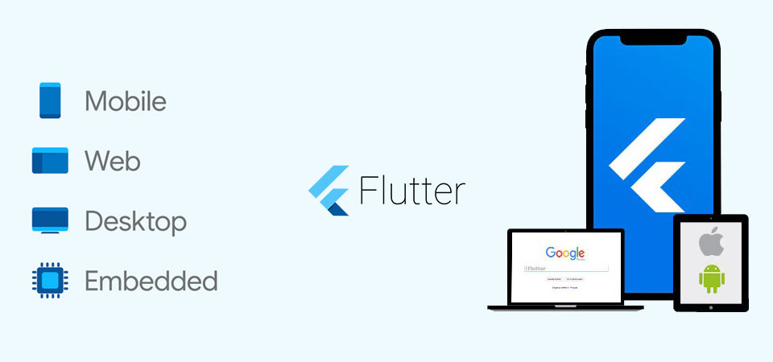

The times when Flutter was just a hype technology and developers rolled their eyes at the mention of it, prophesying it a quick death, are long gone. Death did not happen, the framework has been evolving for more than four years, attracting more and more people, and has already won the title of the best framework for cross-platform development.

The demand for <a href="https://anadea.info/services/mobile-development/flutter-development-services" target="_blank">Flutter app development services</a> is also growing from the business side, especially with the development of Flutter for web and Flutter for desktop. Therefore, it's time to talk about it as a technology that’s been around for a while. Based on our experience as a team and my own, let's talk a bit about Flutter’s competition with native development and analyze the situation in the market.

## Why is Flutter this good?

So here are the three most attractive things about Flutter that inspire programmers to use this framework. But don't rush to close the page - below you'll find advantages of using Flutter for business as well.

### 1. It’s multiplatform

Managers of all times were perplexed: why write the same thing for different platforms (iOS, Android, Web, Desktop)? Therefore, since time immemorial, the world has been flooded with various development tools that help to combine development for all platforms in one project - on the same code base and even in one programming language. Among them, there were (and remain) Xamarin, React Native, and Flutter—the latter can be used to write excellent applications for both iOS and Android at the same time. In addition to mobile phones, we also used Flutter Web in the production project and even Bluetooth web (yes, there is such a technology and it can be used in Flutter).

### 2. Supported by Google

Flutter and the programming language Dart (the language in which Flutter applications are developed) are the brainchildren of Google. The industry leader believes in technology so strongly that it even released an entire operating system, Fuchsia OS, which interface is built on Dart. This inspires optimism for the future of Flutter and even raises some concerns for the future of Android.

### 3. Compatible with Native

The last advantage of Flutter and the greatest one is the ability to drag Native code into the project. That is, for example, some specific thing that you will not find out of the environment box since it is only present on iOS and there is no point in dragging it into Flutter. But don't worry - Flutter allows you to embed code written in Swift as a plugin and use this iOS-specific and iOS-only feature. And there’s the same opportunity with other platforms, so there’s an answer for everyone thinking that Flutter can’t do everything: it can, the only question is the time to implementation.

This is what prompted me to switch from native Android development to Flutter development: it's an incredible killer feature for business. A very common problem with Xamarin and React Native is that you need to specify all the wishes at once, because situations may arise when a feature that the customer wants after half a year or even after a few years of development cannot be implemented, and Flutter is devoid of this problem.

Also, let's look at the number of requests and see that for the last 12 months, Flutter has been <a href="https://trends.google.com/trends/explore?q=flutter,react%20native,xamarin" target="_blank" rel="nofollow">holding a stable first place</a> among cross-platform frameworks.

Now, let’s pass from numbers to some actual analysis and benefits of Flutter app development compared to native solutions.

## Flutter app development cost

Native apps do not have significant disadvantages and their users can enjoy all kinds of complex features. At the same time, the development and support of native applications require significant investments. This is because you need a development team for each platform. Both will need to tailor the business logic to your requirements and duplicate the interface logic and layout to suit the specifics of each platform. With Flutter, you need one development team, so the development process is simply faster.

Read also: <a href="https://anadea.info/blog/best-flutter-packages" target="_blank">Must-Have Flutter Packages with Alternatives</a>

Because of this, low-budget Flutter is becoming more popular compared to native technologies. Flutter allows developers to use a single code base, which significantly reduces the cost of development. Again, as for native technologies, developers have to write code for each platform, which inevitably requires more work and budget.

Code maintenance is also an important element of development and support. In most cases, maintaining a native app requires a larger team, whereas a Flutter app can be maintained by a single developer.

<table>
 <tr>
  <th><b>Native Team</b></th>
  <th><b>Flutter Team</b></th>
 </tr>
 <tr>
  <td>1 QA</td>
  <td>1 QA (or part-time for start period)</td>
 </tr>
 <tr>
  <td>2 IOS developers</td>
  <td rowspan="2">2 Flutter developers</td>
 </tr>
 <tr>
  <td>2 Android developers</td>
 </tr>
 <tr>
  <td>2 Web developers</td>
  <td>1 Flutter developer</td>
 </tr>
  <tr>
  <td>1 Designer</td>
  <td>1 Designer</td>
 </tr>
  <tr>
  <td>1-2 Back-end developers</td>
  <td>1-2 Back-end developers</td>
 </tr>
</table>

It's hardly possible to say how much does flutter app development cost without knowing your idea and requirements. But at least I can tell how much you can save if you hire a <a href="https://anadea.info/services/mobile-development" target="_blank">mobile development company</a> using Flutter, compared to native development:

  <table>
   <tr><b>
    <th>For one month rate</th>
    <th>Android + IOS</th>
    <th>Android + IOS + Web</th>
    <th>You save</th></b>
   </tr>
   <tr>
    <td>Native</td>
    <td>160 \* 50 \* 4 = $33K</td>
    <td>160 \* 50 \* 4 = $48K</th>
    <td>$16K</th>
   </tr>
   <tr>
    <td>Flutter</td>
    <td>160 \* 50 \* 2 = $16K</td>
    <td>160 \* 50 \* 3 = $24K</th>
    <td>$8K</th>
   </tr>
  </table>

Flutter vs Native price difference

In my experience and the experts of the our team, using Flutter can save you up to 40% on development and up to 30% on application design. However, the projects are different, and besides, it depends on the number of platforms, whether it will be Android and iOS, or whether Flutter will also be used for the web or desktop. Sometimes Flutter can save up to 15% of the budget and sometimes up to 40%.



## Flutter use cases

When should you choose Flutter and when native development?

Flutter is now used in projects of all sizes, including large business applications such as <a href="https://flutter.dev/showcase/ebay" target="_blank" rel="nofollow">eBay</a>, <a href="https://flutter.dev/showcase/toyota" target="_blank" rel="nofollow">Toyota</a>, and <a href="https://flutter.dev/showcase/google-pay" target="_blank" rel="nofollow">GooglePay</a> (click the links for showcases). Now there are up to 3000 applications in the open list of applications created in Flutter.

As for native technologies, developers use them to create complex niche applications with advanced features. Such an example is the development of games, AR/VR apps, applications that use Bluetooth functionality at 100%, and of course, applications that are developed for one platform.

The table below shows use cases for Flutter and native technologies.

<table>
 <tr>
  <th><b>Native</b></th>
  <th><b>Flutter</b></th>
 </tr>
 <tr>
  <td>Develop top-performance apps with a strong OS Embedded connection between the app and the device</td>
  <td>MVP apps</td>
 </tr>
 <tr>
  <td>Fast app updates based on the release of every new OS version</td>
  <td>If you are targeting multiple platforms at once</td>
 </tr>
 <tr>
  <td>Need for sophisticated features with top reliability</td>
  <td>Creating a common design across all platforms</td>
 </tr>
 <tr>
  <td>Build standalone apps (for only one platform)</td>
  <td>Quickly reach a wider target audience and reduce time-to-market</td>
 </tr>
 <tr>
  <td>Build AR/VR apps</td>
  <td>Advanced OS plugins with simple logic</td>
 </tr>
 <tr>
  <td>Build Al-triggered apps with big data</td>
  <td>App development without a high investment plan</td>
 </tr>
 <tr>
  <td>Build Gaming apps</td>
 </tr>
</table>

## Summary

Summing up all the above, I can draw the following conclusions:

1. Flutter is a great solution to reduce development time and budget.
2. None of the technologies is a lifesaver for your specific projects and business needs, each case is different.
3. In Flutter, you can create MVP applications in 2-3 months. Developing with Flutter will cost you an average of 30% less than building two native apps. And the ability to support the Web and Desktop can further increase this figure.
4. Native technologies will always hold their own because they are better suited for complex niche applications with advanced features. The examples that don't go with Flutter are games and AR/VR applications.

So is Flutter good for app development? Our team and I personally think that Flutter is a great tool to quickly expand your influence, digitize your existing business, and expand it online. If you are looking for a solution to quickly develop an application for iOS and Android without sacrificing quality and budget, feel free to choose Flutter and you won't go wrong.
