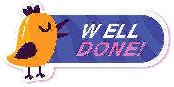
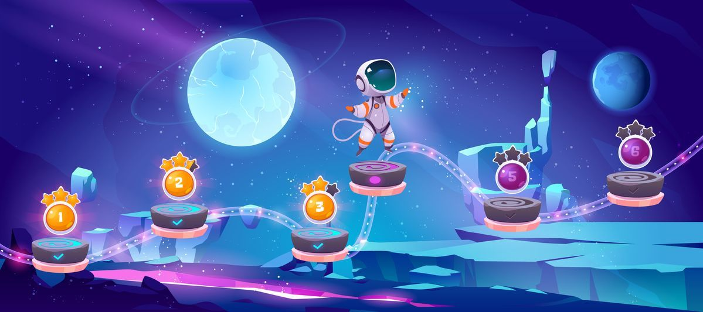
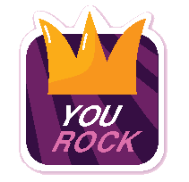
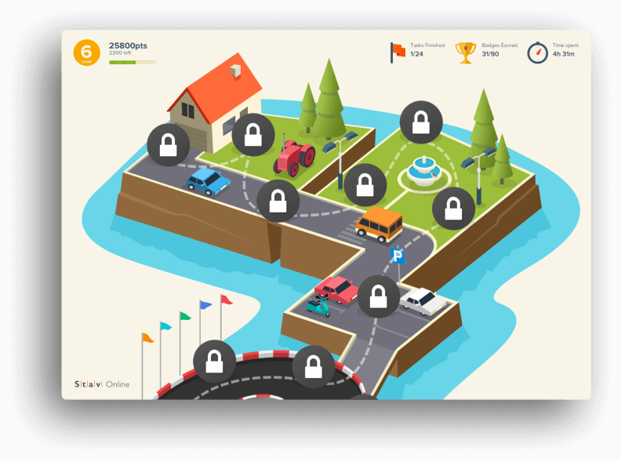
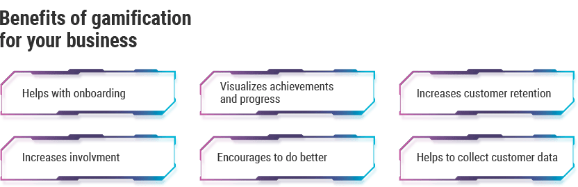

Take a look at how online games have changed over the past ten years. They have become bolder and more diverse. They have reached a big audience, bigger than ever before. They have received great attention, greater than ever before. They have earned lots of money, more than ever before. These changes in the gamification industry certainly spark up the interest of smart entrepreneurs who come up with more and more game-based solutions for business. <a href="https://www.statista.com/statistics/608824/gamification-market-value-worldwide/" rel="nofollow" target="_blank">Statista</a> helps to match words with numbers - the gamification market is expected to grow to over 12 billion U.S. dollars in 2021.

That's why it is not a surprise that gamification is no longer an exotic method. It turned into a popular and effective technique used both to increase the productivity of employees and to <a href="https://anadea.info/services/business-analysis" target="_blank">promote a business</a>.

Our congratulations! Reading the introduction to this long article has earned you a badge.
If this fictional award makes you feel proud, at least for a little while, then you are on the right course to understanding the role of gamification.

<h2>Table of contents</h2>
<ol>
 <li><a href="#word">A word about the terminology of "gamification"</a>
 <ul>
  <li><a href="#main-goal">The main goal</a></li>
  <li><a href="#why-it-works">Why gamification works</a></li>
 </ul>
 </li>
 <li><a href="#use-cases">The core areas of application. Gamification use cases</a>
 <ul>
  <li><a href="#talents">Discovering hidden and new talents</a></li>
  <li><a href="#motivation">Gamification as a non-material motivation for employees</a></li>
 </ul>
 </li>
 <li><a href="#education">Gamification in education</a>
 </li>
 <li><a href="#ecommerce">Ecommerce gamification</a>
 </li>
 <li><a href="#healthcare">Healthcare gamification</a>
 </li>
 <li><a href="#advantages">Advantages of using gamification software</a>
 <ul>
  <li><a href="#onboarding">Helps with onboarding and retaining users</a></li>
  <li><a href="#involvement">Increases involvement</a></li>
  <li><a href="#visualization">Visualizes achievements and progress</a></li>
  <li><a href="#encouragement">Encourages to do better</a></li>
  <li><a href="#retention">Increases customer retention</a></li>
  <li><a href="#data">Helps to collect customer data</a></li>
 </ul>
 </li>
 <li><a href="#what-can-go-wrong">What can go wrong with business gamification</a>
 <ul>
  <li><a href="#superficiality">Superficiality</a></li>
  <li><a href="#short-term-effect">Short-term effect</a></li>
  <li><a href="#wrong-objectives">Wrong objectives and priorities</a></li>
 </ul>
 </li>
 <li><a href="#gamification-software-development">Gamification software development</a>
 <ul>
  <li><a href="#how-to-develop">How to develop a gamification app for business</a></li>
  <li><a href="#game-elements">Game elements used in business applications</a></li>
  <li><a href="#how-to-make-gamification-work">How to make gamification techniques work for your business</a></li>
 </ul>
 </li>
 <li><a href="#conclusion">As a general conclusion</a>
 </li>
</ol>

## A word about terminology of "gamification"

Just what it sounds like - gamification is a transformation of something in a game. It's an implementation of approaches typical for games in software development, websites, apps, different business activities, generally in all non-game processes with the aim to attract users, to increase their engagement in using products, and services or to achieve other practical outcomes.

Here we reach the aims and objectives of gamification services and technologies.

### The main goal

Gamification aims to bring elements of games into business processes, to engage, to give fresh impetus, and also to facilitate the introduction of innovations. Gamification can be utilized internally to increase productivity and motivation within your company, or externally to enhance relationships with your customers. Thus, it can change the behavior of employees and customers depending on your business goals.

### Why gamification works

The generation of those who had computers and played computer games from early childhood has not only grown up but taken key positions in all spheres of life. From a very young age, the motivation system of this generation has been built around passion and awards.

The point is, all of these people have a pretty good idea of what levels, and quests, and awards, and achievements are. At the same time, they may not always understand what the boss expects them to do or how to get the most of your new online service.

However, to be efficient, gamification requires the fulfillment of some conditions, such as:

* A victory should be achievable;
* There should be clear and simple rules;
* Rules should not be too robust;
* Goodwill of a user - nobody is forcing you to play poker with friends, right?

## The core areas of application. Gamification use cases

### Discovering hidden and new talents

Game-like mechanisms help to discover true talents, whether you want to find them within your company or look for individuals to join your team. The brightest examples can be found among IT companies such as Google and Facebook. They pretty often organize various programming competitions: Code Jam, Hacker Cup, etc. You didn't really think it is all for amusement, did you? The goals behind these competitions are much more businesslike, including:

* A search of prospective projects;
* Testing of their own technologies;
* Basic screening of people or ideas for further development.

[Anadea](https://anadea.info/) also resorts to gamification for similar purposes. [Initially](https://anadea.info/blog/it-duel), our annual IT duels were held internally for our Ruby and Java engineers, mobile developers, and QA testers. The idea was to let employees show their abilities in a fun gamified environment, establish contacts between cross-functional teams and strengthen team spirit in the company. However, it went beyond our internal use and grew into an international IT tournament carried out simultaneously in several cities and attracting lots of participants.

### Gamification as a non-material motivation for employees

Gamification techniques can be employed to make daily work more exciting and give employees additional motivators. For example, office life will be more fun if there are digital duels and battles with bosses. People love playing games just for enjoyment, not for material reward. Surely, there are more sophisticated ways to drive staff engagement and efficiency through [workplace gamification](https://anadea.info/blog/how-gamification-in-the-workplace-impacts-employee-productivity).

SAP, a provider of enterprise resource planning software, created a gamified system named Roadwarrior to keep their sales team motivated. As a rule, salespeople must face large amounts of rejection along with keeping up with changes in the product. Roadwarrior trains sales representatives to face up challenges by putting them in front of a simulated customer. The players earn points and badges by responding to questions and at the same time get better prepared to deal with the real customer.

## Gamification in education

Education is a never-ending process. Learners have to maintain an awareness of their progress, however, with time abstract goals like "It would be nice to learn a new language" are becoming less motivational. Then a user hurries to his/her comfort zone.

[Gamification in education](https://anadea.info/blog/gamification-in-e-learning) is based on the principles of instant feedback - "Look, you learned 100 new words, your level has been improved". One big goal is being fragmented into a lot of small ones, even if they are virtual. Thus a user always notices the progress. A good example of an [application for learning a language](https://anadea.info/projects/stav-online) with integrated game elements is Stav Online by Anadea <a href="https://anadea.info/solutions/e-learning-software-development">e learning software development company</a>. It's an e-learning gamification platform with game-like interface, points gained for correct answers and a bonus system that turns study into exciting and competitive entertainment.

## Ecommerce gamification

Gamification has become a powerful tool in the fight for online shoppers' preferences. It opens limitless possibilities to providing a unique and memorable shopping experience, which helps to increase your brand awareness, drive sales and revenue.

Gamifying the shopping process makes it more entertaining, motivates people to visit your website more often, compete with other shoppers, share their experiences with friends and, of course, spend more in your online store. The benefits of sales gamification can be successfully employed by all types of companies, from mobile shopping startups to known brands like <a href="https://econsultancy.com/blog/61912-six-interesting-examples-of-gamification-in-ecommerce" rel="nofollow" target="_blank">Dropbox and Nike</a>.

## Healthcare gamification

Medicine and healthcare are the areas where gamification initiatives are flourishing. There are loads of websites and applications that help to improve your health and wellness. For instance, Mindbloom - a gamification application that rewards you for living a balanced and healthy life. There are apps that make fitness and weight loss more fun or encourage users to achieve their health goals.

Medical organizations employ gaming technologies to improve relations with patients, make medical treatment and rehabilitation more effective. A medical survey app with a cute interface can add some amusement to routine visits to doctors. However, it is particularly important to use games in medical applications aimed at children as kids may not fully understand the purpose of therapy.

## Advantages of using gamification software

### Helps with onboarding
It often happens that people simply don't want to change the way they work, learn, communicate and live. A new product, mobile app or software may be just brilliant, however, people have to learn how to use them to see their benefits. With serious business applications, like accounting software or [ERP system](https://anadea.info/solutions/erp-development), it may require considerable efforts to explore their features, especially for non-tech savvy users. An engaging gamified guide may come in very handy for them.
Gamification is one of the best onboarding practices. Game elements help to overcome barriers to entry through simple steps (answering questions, performing simple tasks, etc.) and motivate people to use basic features of an app.

### Increases involvement
One of the most widespread reasons why companies introduce gamification technologies is an insufficient level of staff motivation. Many employees can't determine their personal contribution to achieving the company's goals. Obviously, a lot of us need an additional impetus in this case. Gamification successfully resolves this problem. In sales and ecommerce, gamification helps to turn a one-time buyer into a regular customer. It also can increase the amount of time a visitor spends on a website.

### Visualizes achievements and progress
In a gamified workplace, each of employees constantly receives notifications on results of his work in a form of badges, scores and can track the results of colleagues. The same is true for a learning process. Gamification visualizes the progress of students towards levels of mastery.

### Encourages to do better
When a person has an opportunity to learn and has good chances for promotion he finds himself valuable. For employees, awareness of their position in a company's structure correlates positively with their willingness to contribute to your business goals and enhances corporate culture. If we turn to education, gamification helps to encourage students' perseverance as games spark up the curiosity and foster learning outside the classroom.

### Increases customer retention
It is well-known in retail that engaged customers buy more and stay loyal to the brand. By introducing games, businesses establish ongoing relationships with their customers and get the maximum results.

### Helps to collect customer data
Gamification implies statistics gathering. It helps to collect information on behavior and preferences of consumers, their email addresses and true opinions regarding a product or a service. Quizzes and polls in a gamified app provide valuable feedback from users.

## What can go wrong with business gamification

### Superficiality
Many companies introduce gamification techniques at a surface level. Managers start to use a rating system with its scores and badges in all in-house processes without thinking about how these techniques can help to achieve the balance between competition and cooperation. They focus on achieving high results and forget that gamification should bring more meaning and fun into the workplace. Employees also can misuse gamification, they may cheat to obtain better results or may not take gamified tasks seriously.

### Short-term effect
No matter how interesting and exciting the game can be, after a while it gets boring. Participants may get tired of ratings, competitions, and other game-like elements that are used for increasing their motivation. Gamification of business processes guarantees a short-term rise in productivity, however, not all companies succeed to transform it into a long-term positive effect.

### Wrong objectives and priorities
Gamification software development should be aligned with your business goals, which requires thorough analysis and implementation strategy. Unfortunately, businesses often skip this important part. They proceed with the development of gamified programs without having a clear understanding of what exactly they want to achieve, what users should do to meet their objectives, and how gamification can help to get the desired behavior. As a result, they can fail to meet their business and users' expectations.

## Gamification software development

### How to develop gamification app for business

You’ve just learned what may go wrong while implementing a gamification approach. If you are creating a business app and you want your product to become popular, you’d better find a trusted gamification software development company to implement game-like techniques in the right way. Which elements should be included in your gamification software and which steps should be taken? Keep reading to find it out.

### Game elements used in business applications

As we have already stated, applying gamification to business requires defining your goals and finding an engaging way to motivate users to help you accomplish those goals.

In most cases gamified business software uses the common game-style elements:

* **Points.** A reward for performing certain tasks.
* **Progress indicators.** A status bar or percentage showing how much was done.
* **Badges.** Virtual achievement is designed to measure the activity of participants.
* **Levels.** The status which a participant reaches through his activity in a game.
* **Leaderboards and ratings.** Tables that determine leaders among participants.
* **Interactive elements.** Quizzes, surveys, contests, counters, animations, etc.

These elements can be combined in various ways to create diverse motivators and experiences. However, creating a good gamification system for your business is more complicated than just adding some game mechanics to your website or mobile app. Gamification tools should be carefully customized to suit the specific needs of your business and audience.

### How to make gamification techniques work for your business

The successful introduction of a business gamification system requires certain steps and first of all a careful investigation and planning:

* **Set business goals.**
Define objectives achievement or non-achievement of which will determine the success or failure of your project. For instance, getting twenty badges by users in a month is not a goal. Increasing site traffic is a goal.
* **Determine required behavior of users.**
The behaviors you want to achieve are key to defining the game techniques that can be utilized in your software.
* **Identify your audience.**
It is necessary to analyze demographic characteristics and interests of your app users. It will help to choose the rewards that are most motivating for them.
* **Make it a fun.**
Don't forget that gamification software should provide an enjoyable and engaging experience.
* **Select the game elements which will help you reach goals.**
Leaderboards, for example, help to create a competitive environment, progress bars help to make the system clear as a user sees how far he is from the desired result.

When you are done with the project requirements, you can proceed with selecting a technology stack, estimating the costs of implementation, and picking a development team capable to build cutting-edge business gamification software for you.

## As a general conclusion

Gamification is changing our world. If implemented effectively, it can have a great impact on all spheres of our lives. The reason can be explained by the quote of Friedrich Schiller:
> Man only plays when he is in the fullest sense of the word a human being, and he is only fully a human being when he plays.

Gamification ideas must and should be used to add more fun and efficiency to our work, our educational practices, and our online experiences.

Gamify your business and boost your biz results!
