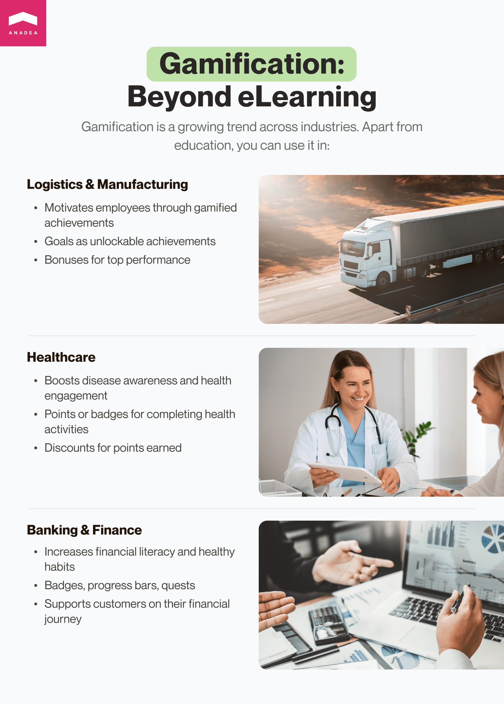

The thesis that games are only for kids should be forgotten once and forever because it is not true! Everyone loves games in one form or another. Of course, the games that are interesting to toddlers do not look quite engaging for teenagers, while some entertainments created for adults can’t attract children from primary school. But the fact that we all like the spirit of competition and the taste of victory is obvious. Namely, it provides the foundation for the increasing popularity of the gamification concept.

In this blog post, we are going to talk about gamified learning platforms and the benefits that they can bring to all categories of users. But before we proceed to the peculiarities of the software in the education industry and provide tips on how to build such a solution today, we’d like to draw your attention to the basics of gamification itself.

## Gamification platform: What is it?

First of all, let’s define gamification. Gamification is a method that presupposes introducing game-like elements and principles to a non-gaming environment. A gamification solution is typically aimed at enhancing processes, services, systems, and activities by offering user experiences that are similar to those that people have while playing games of different types. All this is done with a view to engaging and motivating users to achieve the set results faster and more easily.

In 2024, the global gamification market size is around $15.4 billion. And according to experts, it will be able to reach $48.72 billion in 2029. The <a href="https://www.mordorintelligence.com/industry-reports/gamification-market" target="_blank">studies</a> show that the projected CAGR for the period from 2024 to 2029 is over 25%.

Gamification services are gaining popularity across various industries and market segments and are not limited to learning gamification platform development only. But what are at least some of the other spheres where it is used?

- **Logistics and manufacturing**. A gamification solution can be part of a motivation program for employees. The goals set by managers can become new achievements in the gamified journey that can be unlocked. When people see their progress, it can inspire them to demonstrate even better performance. Quite often, when companies introduce such programs, they offer special bonuses to those who manage to show the best results.

- **Healthcare**. Gamification elements introduced to various telemedicine apps and platforms can help to increase awareness about different diseases and motivate people to pay more attention to their health. For example, for participating in some surveys, filling in particular forms, or answering the questions of tests, users can get points or badges. In their turn, such points can be exchanged for discounts on the platform.

- **Banking and finance**. Banking gamification services today are not a rare thing and mainly, they are aimed at increasing the level of financial education among customers, helping them develop healthy finance-related habits, and supporting them in their investment journeys. The gamification tools used in this domain are quite standard and include badges, points, progress bars, quests, challenges, and leaderboards.

Given the freedom in software development that we have today thanks to the achieved tech progress, it is possible to build a gamified platform for practically any domain. Moreover, such initiatives really make sense. According to conducted <a href="https://www.zippia.com/advice/gamification-statistics/" target="_blank">research</a>, 90% of people admit that gamification at work helps them stay more productive and the engagement of employees gets boosted by around 50% thanks to gamification.

Nevertheless, professional training and education still remain the most popular areas for the application of gamification platform software.

Talk to elearning experts

## Gamified learning platforms: What are they?

Today, we can say that gamification is one of the major trends and even standards in <a href="https://anadea.info/solutions/e-learning-software-development" target="_blank">elearning software development</a>. Let’s admit that good teachers have always been quite inventive when it comes to motivating students and letting them have fun while learning. That’s why even in a traditional classroom, it is a rather common practice to organize various competitions, contests, and other activities.

Modern technologies make it possible to greatly diversify experiences for learners of all ages, including adult people. But why do educators and software developers pay so much attention to gamification today?

Benefits of a gamified platform in education:

- Higher motivation;
- Better engagement;
- Enhanced retention of knowledge;
- Improved learning experience;
- Real-time feedback;
- Better progress monitoring;
- Access to analytics.

Speak about your project

## How to build a gamification learning platform

In one of our previous blog posts, we provided insights into <a href="https://anadea.info/blog/e-learning-website-development-tips" target="_blank">how to create an elearning website</a>. Now, let’s focus more on the creation of a solution enriched with gamification elements.

### Stage 1. Set your goals

First of all, you need to clearly understand what exact goals you want to reach with the introduction of a learning gamification platform. Think about those people who will benefit from your solution, what devices they will use, and how much time they will typically allocate to working with your software. To get some inspiration, you can analyze what is offered by other market players. And also, you can turn to our guide on <a href="https://anadea.info/blog/create-online-learning-platform" target="_blank">how to build an online learning platform</a>.

### Stage 2. Think about the content and game mechanism

For learning products, it is vital to bring value. It means that you should pay attention to the quality of the provided content, its logic, and the way of its presentation is highly important. Moreover, it is required to elaborate the game mechanism that will be used. Here, it is necessary to design the rules, principles, rewards, and other elements that will motivate people to study harder.

### Stage 3. Communicate your requirements to developers

You should formulate all your ideas and share them with developers (you can work with your in-house specialists or hire an external team at a professional software development company such as Anadea for example). Specialists will study your requirements, estimate the required budget, help you choose the right tech stack, and set realistic timelines.

### Stage 4. Build your software

Of course, that’s already the stage when the key role will be played by designers and developers. They will transform your ideas into a real product. Usually, it is rather sensible not to invest in the development of a full-scale solution before testing your idea via the launch of an MVP.

### Stage 5. Test your platform

To make sure that your gamified training platform works as you planned, it is necessary to test the solution before its release. There are different test types, and many of them should be conducted in parallel with development. But also, after all changes are introduced, it is high time for regression testing. Moreover, user testing is a valuable step when it comes to gamified learning platforms.

### Stage 6. Release your platform and regularly update it

When your solution is already available to users, it is still required to continue your work with it. It is necessary to monitor its performance and quickly react to all possible vulnerabilities, if any. Moreover, based on our experience, we can say that to guarantee the success of your platform in the long term, you should pay attention to users’ feedback. Namely, based on their opinions, you can enhance your solution and be sure that it fully meets their requirements. For example, it may be necessary to enrich a software product with a new feature or introduce its <a href="https://anadea.info/solutions/e-learning-software-development/m-learning" target="_blank">mobile version</a> for users’ convenience.

Hire elearning app developers

## Key features of a modern gamification learning platform

The nature of gamification services makes them stand out from the row of many other learning solutions. These peculiarities lead to the introduction of some specific features that are typical only for solutions of this kind. It doesn’t mean that all the features mentioned below are essential for your app. Your choice should be based on the idea of your solution, its goals, target audiences, and other individual parameters.

1. **User profiles.** Users should be provided with a dashboard where they will indicate their learning goals and preferences, choose the most appropriate courses, and monitor their progress.

2. **Points and badges.** For achieving goals (for example, studying some units), completing different tasks, and hitting new milestones, users can earn points and be rewarded with badges. You can also offer some other virtual or real-life prices, like discounts for the next course (if you provide paid services) or some items with your brand identity (this idea is good for a corporate gamified training platform).

3. **Leaderboards**. Such leadership lists are composed based on the performance of learners. For many people, it is important to see their names among those who demonstrate the best results. It means that the introduction of such a feature can greatly motivate learners.

4. **Challenges and quests**. These elements provide a specific goal that users should reach. You can offer team-based or individual quests. They can be time-limited or not time-limited, their complexity can vary as well. Everything depends on the specificity of your courses.

5. **Social media integration.** You can allow users to share their achievements with their followers on social network platforms directly via your app, which can motivate them to achieve even higher results. This tool can also attract the attention of potential users to your platform.

6. **Reports and analytics**. Elearning solutions have a very important benefit. Learners can track their progress and monitor the results. At the same time, educators can better understand the strengths and weaknesses of learners. This allows them to adjust the provided materials to users’ needs.

Request a free quote

## Examples of gamified learning platforms

To create a unique software product, it is always very useful to have a look at the already existing successful examples.

### Sporcle

This website offers quizzes generated by users on numerous topics. Though many quizzes are designed just for fun, you also can find a lot of those that have an obvious educational value. For example, there are many quizzes related to science, geography, literature, or history. To find their names on leadership boards, users should demonstrate really amazing knowledge.

### Duolingo

This platform, with its green owl as a mascot, is well-known to many language learners. The platform helps people to study different aspects of foreign languages in a gamified environment. The platform also has a mobile app, and the approximate number of its users is over 500 million.

### Stav Online

At Anadea, we also have solid experience in building gamification solutions. And one of them is <a href="https://anadea.info/projects/stav-online" target="_blank">Stav Online</a>. Our client wanted us to create an online version of a series of books for learning Danish spelling and grammar. Our main challenge was to make the solution not only engaging for children but also easy to use for teachers.

The learning process in the app is based on quizzes. We designed templates for different types of quizzes and added hints and explanations of the purpose of each test type. To make learning more interesting for young users and increase their motivation, we enriched the app with such gamification elements as points and rewards.

Among other important features, we should name a teacher dashboard with an automatic check of test results, students’ progress tracker, and statistics; an admin panel; and the integration of the authorization system of the Danish Ministry of Education.

Today, the solution can be used on PCs and tablets.

Build my platform

## Ideas for an AI-based gamification platform

The potential of artificial intelligence and other related technologies is being actively explored across various industries. And education is one of them.

AI and ML can bring to the learning segment such benefits as:

- high personalization;
- data-driven insights and analytics;
- adaptive learning experiences;
- diversified content;
- 24/7 user support.

Examples of AI functionality for gamified learning platforms:

- AI-powered generation of quizzes and challenges;
- AI chatbot or virtual assistant that will answer questions received from users, explain difficult topics, and offer materials;
- Intelligent recommendations;
- Text-to-audio and audio-to-text tools;
- Natural language processing.

The introduction of such features can not only enhance user experience but also change people’s understanding of a learning process.

## Final word

If you have plans to launch a custom e-learning solution, we recommend you think about building a gamified platform that will bring users absolutely new emotions about education and training. A lot of people, unfortunately, have rather negative memories from their schools and think about learning as something absolutely boring. But you can change the game!

An Anadea, we are ready even for the most challenging software development tasks and we will be always happy to help you with your project realization.

Let's collaborate!
