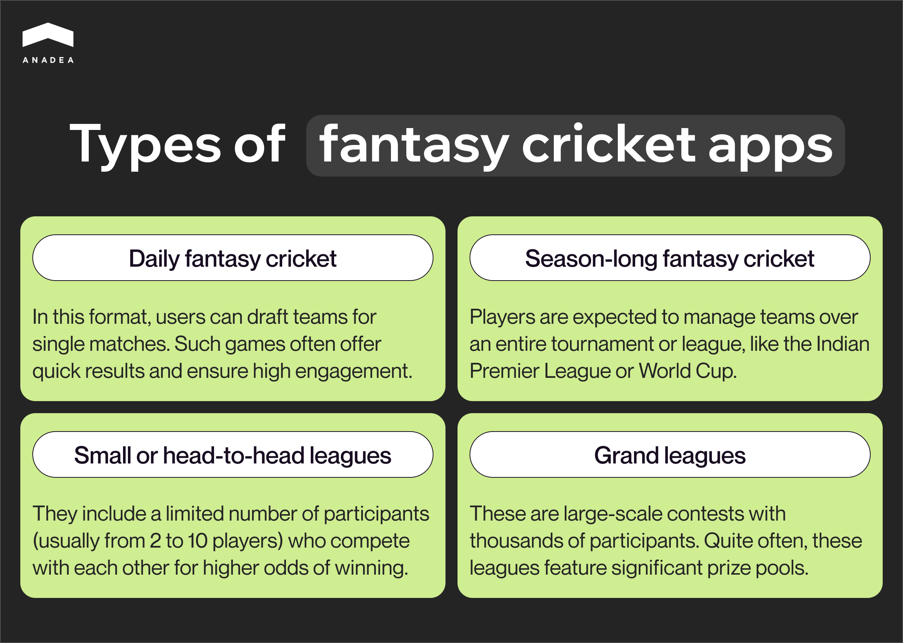
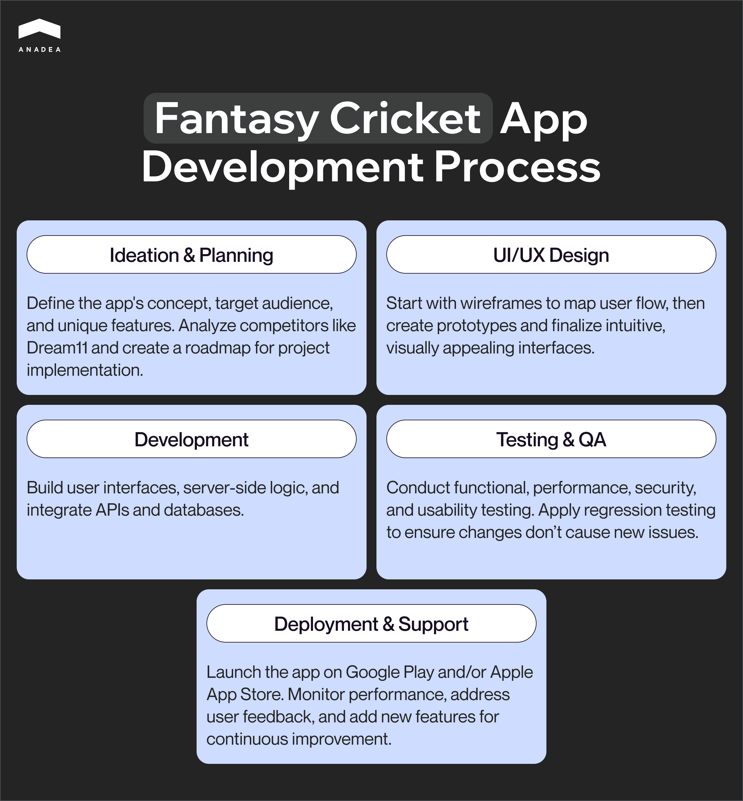

Once started as tabletop games and offline events, fantasy sports leagues have greatly evolved in the digital era. Now, to feel the competition vibes and win the fantasy matches, it is enough just to have access to a mobile or web app. This has significantly lowered the entry barrier and made fantasy games accessible to a wide audience. The popularity of fantasy sports differs in various regions and can easily change with time flow. According to [Statista](https://www.statista.com/statistics/1377841/most-played-fantasy-sports-north-america/), fantasy football holds the lead in North America. At the same time, in [India](https://www.statista.com/statistics/1322716/india-fantasy-sports-users-distribution-by-sport/), the leading position belongs to cricket. In one of our blog posts, we talked about different types of [fantasy sports software](https://anadea.info/blog/how-to-make-a-fantasy-sports-app/). Now, we’d like to focus on fantasy cricket app development.

## Fantasy cricket app: What is it?

A cricket fantasy app can be defined as a digital solution that allows cricket enthusiasts to create virtual teams of real-life players from upcoming or ongoing cricket matches. Users earn points based on the real-life performance of these players in the game. The app ranks virtual teams on a leaderboard.

Actually, to win, users of a fantasy cricket app do not need to be outstanding athletes. However, they need to have excellent sports knowledge and be good at strategic planning.

There can be different types of fantasy app cricket games that may address the needs and interests of various groups of players:

* ***Daily fantasy cricket.*** In this format, users can draft teams for single matches. Such games often offer quick results and ensure high engagement.
* ***Season-long fantasy cricket.*** Players are expected to manage teams over an entire tournament or league, like the Indian Premier League or World Cup.
* ***Small or head-to-head leagues.*** They include a limited number of participants (usually from 2 to 10 players) who compete with each other for higher odds of winning.
* ***Grand leagues.*** These are large-scale contests with thousands of participants. Quite often, these leagues feature significant prize pools.

  

It’s quite difficult to estimate the exact number of fantasy cricket app users worldwide. However, even very approximate figures can provide valuable insights. India is one of the regions with the highest interest in cricket.

In 2023, the number of registered fantasy sports players in this country hit the mark of over 180 million. According to the experts’ [expectations](https://www.statista.com/statistics/1322714/india-fantasy-sports-user-base/), this figure could reach a milestone of half a billion in 2027 already. And now just imagine, that around 85% of these people play fantasy cricket. This means that the user base of fantasy cricket apps is over 153 billion.

## What are the reasons for the popularity of fantasy cricket?

* ***Immersive experience.*** Cricket fans can feel connected to the game. They can closely analyze players, their performances, and match dynamics, and further use this knowledge to win in fantasy cricket app games.
* ***Monetary incentives***. Paid contests with cash rewards traditionally attract a large audience.
* ***Technological accessibility.*** Modern technologies let developers make a fantasy cricket application easy to use, while the interaction with it is intuitively clear. It means that the game is accessible to millions of people all over the globe.

## How does a fantasy cricket app work?

The typical way of interaction with a fantasy cricket application looks the following way.

1. A user creates a virtual team by selecting players from an upcoming real-life cricket match or tournament. All teams should be built in accordance with specific rules. For example, there are budget constraints based on virtual credits and particular player combinations.
2. Points in a fantasy cricket app are awarded based on the cricket players’ real-time performances, including runs scored, wickets taken, catches, strike rates, etc.
3. Users compete against others in different types of contests. They can join public leagues, as well as create their own private leagues to compete with friends.

Also read <a href="https://anadea.info/blog/fantasy-golf-app-development/" target="_blank">How to Build a Great Fantasy Golf App</a>

## Essential features of a good fantasy cricket app

By turning to fantasy cricket app development, you can create absolutely unique solutions for the needs of your target audience. Nevertheless, each fantasy cricket application should have some particular functionality that you can’t eliminate in such types of software. Namely, such features ensure the core mechanics of fantasy cricket. 

### User registration and authentication

You should provide users with simple options to sign up and log in using their email, phone number, or social media accounts. To protect users’ personal data, it is required to introduce secure multi-factor authentication that goes beyond just a password. Players may be also asked to provide a one-time code sent to their mobile phones or use Face ID.

### Personal profiles

After registration, users usually need to create their profiles. This feature allows them to add their photo and personal details, set their visibility, etc. The profile dashboard should also display users’ statistics, contest history, rankings, wallet balance, and achievements.

### Team creation

The team creation and management functionality is the cornerstone of any fantasy cricket application. These tools should enable users to build and change their teams. To do it, they need to select real-life players from different cricket teams. It would be a good idea to provide not only some general information about athletes but also include comprehensive statistics related to their latest performances. Users should have enough flexibility and be allowed to introduce changes to their teams until the match begins.

### Scoring system

This functionality is responsible for how users of your fantasy cricket app will earn points. It is vital to include a very clear explanation of the rules in the app. Even the smallest confusion can cause serious frustration and negatively affect the entire user experience. Moreover, you should take care of making sure that users’ points are updated in real time during matches.

### Leaderboard

As any fantasy cricket app is based on the principles of competition, leaderboards are a comprehensive element of such software. They can be presented in different formats but they should be available for all leagues and games. 

### Social features

To drive user engagement and build a strong community around your application, it is recommended to equip it with social tools. For example, you can allow users to share the results of the games on their social media accounts. This will be not only convenient for users who want to demonstrate their achievement to followers but also quite valuable for you. Their reposts can become a powerful tool for the promotion of your fantasy cricket app. At the same time, in-app chats and forums will help users establish contacts and communicate with people who have the same passion.

### Notifications and updates

Cricket fans want to stay tuned with all the updates during real-life matches as they need to understand how the chosen athletes are performing. Of course, they can use some external platforms to get this info. But will it be really comfortable? To ensure a seamless experience for them, you can integrate live match updates including detailed scorecards, commentary, and highlights, into your fantasy cricket application. When any serious updates take place (for example, a chosen athlete gets an injury), a player should be notified. Moreover, notifications can also include info about upcoming matches and changes in leaderboard rankings.

### Payments

A fantasy cricket app can allow people to win real money. That’s why you need to integrate a reliable payment system into your solutions. All transactions should be smooth and secure. It is highly recommended to use only transparent payment services with an outstanding reputation. Moreover, it is necessary to include different payment methods (such as traditional online banking, credit and debit cards, digital wallets, and crypto). In such a way, you will make the interaction with your app comfortable for the widest audience possible.

To make your app stand out from the row of similar solutions, you can enrich it with advanced features like AI analytics and recommendations. To better understand the new opportunities that this functionality can offer, you can read about how [AI is used in traditional sports software](https://anadea.info/blog/ai-in-sports/).

## Fantasy cricket app development tech stack

Apart from the choice of functionality of your fantasy cricket app, you will also have to make a decision regarding the tech stack to be used. This decision should be based on such factors as:

* the platform(s) your app is designed for (iOS, Android, web);
* the features and their complexity;
* your budget and timelines.

As a rule, you will choose the most suitable technologies together with your development team. Tech experts will analyze all the related factors and offer the best option. Here is a list of technologies and tools that are often used in fantasy cricket app development.

* ***[Mobile development](https://anadea.info/services/mobile-development):*** Kotlin, Swift, Java
* ***Backend development:*** Django, Node.js, PHP, Laravel
* ***Frontend development:*** Angular, Flutter, React
* ***Database:*** MongoDB, MySQL, PostgreSQL, Cassandra
* ***Cloud platform:*** Microsoft Azure, Google Cloud, AWS
* ***Push notifications:*** Onesignal, Firebase
* ***Cricket data API:*** CricAPI, ESPNcricinfoAPI
* ***Payments:*** Stripe, PayPal

## Fantasy cricket app development process

The creation of a fantasy cricket app involves multiple stages. And to achieve the desired results, you need to know how to organize them in the right way.

***Ideation and planning.*** Start with the identification of the key idea of your app, its target audience, and unique selling points. You can analyze your major competitors like Dream11 to understand their strengths and weaknesses. Based on the results of your research, you can already prepare a list of features that should be created. Here, it will be important to prepare a roadmap for your project realization.

***[UI/UX design](https://anadea.info/services/ui-ux-design)***. It’s always sensible to initiate this stage with the creation of wireframes to map the app’s user flow and layout. When your team is satisfied with the results, you can proceed to the development of interactive prototypes to visualize the app’s look and feel. And finally, it will be possible to create the design interfaces. They should be intuitive and visually appealing.

***Development***. This stage always includes the creation of user interfaces and server-side logic, as well as the integration of APIs and databases.

***[Testing and QA](https://anadea.info/services/quality-assurance)***. It’s vital to make sure that your app functions as it is expected to. To do it, the [web development](https://anadea.info/services/web-development) team traditionally applies tests of different types. For example, functional, performance, security, and usability testing. When all changes are implemented, it’s time for regression testing. It helps to verify whether new changes haven’t caused new problems.

***Deployment and post-launch support***. Is everything okay with your app’s functioning? Then it’s time to make it publicly available. Deploy your fantasy cricket app and publish it on Google Play and/or Apple App Store. It’s also vital to monitor the performance of your solution and address any issues reported by users. Do not forget to add new features based on players’ feedback and market trends, as well as handle traffic spikes during major tournaments.

## How much does it cost to build a fantasy cricket app?

The cost of fantasy cricket app development is usually calculated based on a rather straightforward formula. 

Cost = Development time (in hours) × hourly rate

But the problem is that the development time is greatly influenced by many variables, like the number and complexity of the features to be built, the peculiarities of the chosen tech stack, the composition of your team, as well as the team’s location.

Without analyzing your specific requirements, it is possible to name only a very approximate price range for building your solution.

Based on our experience in this sphere, we can presuppose that for developing an MVP of a fantasy cricket app (this version will have only basic features), a team may need around 14-16 weeks. It means that the cost of this project can be around $48,000.

Nevertheless, the cost of full-scale app versions can significantly vary. Very often, it can be somewhere between $70,000 and $120,000. However, if you want to equip your app with advanced AI tools, the final cost will be higher.

To get more precise estimates, you need to contact your development team. For example, at Anadea, you can get a quote for free. To do it, you just need to [share your requirements ](https://anadea.info/free-project-estimate)with us.

## Fantasy cricket app development: Challenges and solutions

The creation of a fantasy cricket app is associated with a row of challenges. Some of them are quite common for the development of software solutions regardless of their type. Others are more domain-specific. Let’s consider the most common of them together with the ways to eliminate (or at least) mitigate their impact.

### Legal and regulatory compliance

The gaming industry is traditionally one of the most regulated all over the world. But the main issue is that legal frameworks vary across different countries or regions. Fantasy sports-related regulations also cover licensing and tax implications.

*How to address this challenge:*

First of all, you need to study all relevant laws in the jurisdictions where your app will be available. You can establish collaboration with legal experts to ensure the app complies with laws in target markets.

Secondly, we recommend you implement geofencing to block users from regions where fantasy sports apps are illegal. For example, if we take the US only we will see that as of 2024, fantasy sports is [regulated](https://velawood.com/tracker/fantasy-sports-legislation-tracker/) in 27 states, unregulated but generally allowed in 19, and not allowed in 5.

### Scalability and performance

Your fantasy cricket app should be able to deal with peak traffic during popular tournaments like the Cricket World Cup. It means that thousands of users (or even hundreds of thousands) should have the possibility to enjoy smooth performance simultaneously.

*How to address this challenge:*

To handle dynamic loads, it will be the best idea to rely on scalable cloud services like AWS or Google Cloud. Moreover, you can apply load-balancing techniques and distribute traffic across servers to prevent downtime.

### High user engagement

It is usually not the easiest task to retain users in the off-season or during less popular tournaments. To achieve this goal, you need to make sure that your app can differentiate itself in a competitive market.

*How to address this challenge:*

One of the main things to do is to include some gamification elements like daily challenges, leaderboards, and rewards. They will motivate users to open your app more often. 

The implementation of social features can help as well. You can allow users to create private leagues, share achievements, and chat with other people with similar interests.

Moreover, content integration can be quite valuable. You can offer match previews, player insights, and fantasy tips to keep users engaged.

### Security and privacy

Your app will deal with personal information. That’s why the protection of sensitive user data from breaches becomes a must.

*How to address this challenge:*

You need to apply a range of protection measures. We recommend you use data encryption mechanisms to encrypt user data in transit and at rest. 

Another point is to ensure secure authentication with the use of multi-factor authentication principles.

At the same time, you shouldn’t ignore the necessity to conduct regular security audits and penetration testing. In case of any vulnerabilities, you should address them as soon as possible. 

### Monetization challenges

It’s obvious that when you want to launch your fantasy cricket app, you are planning to earn money on it. Nevertheless, it’s very important to find the right balance between monetization and the experiences that you offer. On the one hand, you can make your app paid for users who want to download it. And that’s it. However, this can greatly limit the number of potential users of your fantasy cricket app. That’s why you will need to smartly combine free features and paid offerings. Only this approach will allow you to generate consistent revenue without alienating users.

*How to address this challenge:*

You can implement a freemium model. In this case, you can offer a mix of free and premium features, such as exclusive leagues or analytics.

You can place advertisements on your app. For example, you can integrate non-intrusive ads or sponsored content. But be careful. These ads shouldn’t be too annoying.

Explore our expertise through the <a href="https://anadea.info/projects/sports-coaching-app" target="_blank">Sports Coaching App</a>

## Fantasy cricket app development best practices: How to build a successful app

The tech world is evolving too quickly. The same can be said about the expectations of users. Today people are spoiled with outstanding digital solutions. That’s why if you want your app to succeed, you need to make sure that you know the rules of the game. Based on our experience in [building fantasy sports apps](https://anadea.info/solutions/sports-app-development/fantasy-sports-app-development), we have defined the key principles that will help you create an excellent fantasy cricket application.

### Prioritize user-centric design

There is no need to offer complicated processes. Everything should be as simple as possible starting from the onboarding stage. Create an intuitive onboarding process to help new users understand how to play and engage with your fantasy app cricket games.

Design clean and well-organized interfaces. They should be clear and appealing to both beginners and experienced players.

Moreover, it would be cool to provide customizable experiences to users. You can enable them to personalize settings, including notifications, themes, and preferred leagues.

### Ensure real-time updates and high accuracy

You need to establish cooperation with trusted data providers for live match updates and player statistics. This will positively affect user satisfaction.

To provide real-time updates for scores, team changes, and user standings, we recommend you utilize low-latency APIs.

What’s more, it would be great to create dynamic notifications. They will help to keep users informed about lineup changes, player injuries, and match start times.

### Diverse game formats

To make the interaction with your fantasy cricket application more exciting for users, you can offer a variety of formats, such as head-to-head, winner-takes-all, and multi-entry contests.

You should cater to both long-term strategists and short-term enthusiasts with varied contest durations of season-long and daily leagues.

It is also recommended to provide both free-to-play and real-money games to attract a wide range of users.

### Monitor the performance of your fantasy cricket app

This advice is applicable not only to the technical aspect. It is also vital to track how players interact with your app to identify areas for improvement. 

It would be helpful to use key performance indicators (KPIs) like retention rate, average revenue per user, and churn rate.

### Invest in marketing and branding

Your fantasy cricket development budget should include expenses for the promotion of your solution and its correct market positioning.

Pre-launch campaigns will help to provoke user interest even before your fantasy cricket app is available. You can build hype through teasers, influencer partnerships, or early sign-up offers.

Social media engagement plays a crucial role in promoting your app. Leverage platforms like X (previously known as Twitter), Instagram, and YouTube to connect with cricket enthusiasts.

Referral programs will be helpful as well. You can encourage users to invite friends with attractive referral bonuses.

### Build your fantasy cricket app to rock the market!

Fantasy sports are continuously attracting new fans looking for an engaging way to connect with their favorite sports, players, and teams. Fantasy sports software (and cricket apps are not an exception) offers an interactive experience where people can manage virtual teams, compete against others, and use their sports knowledge strategically. 

The progress made in the tech industry allows developers to build feature-rich engaging apps that will ensure unique experiences for players. 

Looking for a professional team that will assist you in your fantasy cricket app development project realization? We will always be happy to offer you our services. Over the years of our work, we have gained exclusive expertise in various domains and fantasy sports is one of them. We deeply understand the needs of players and the market requirements, which helps us to deliver highly successful solutions that go beyond the expectations of our clients.

Want to find out more information about our team and services? Do not hesitate to [contact us](https://anadea.info/free-project-estimate)!
