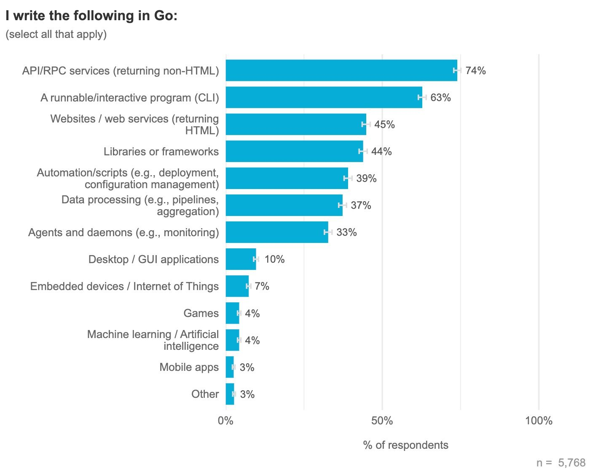
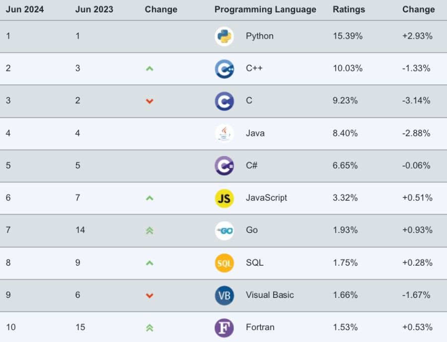
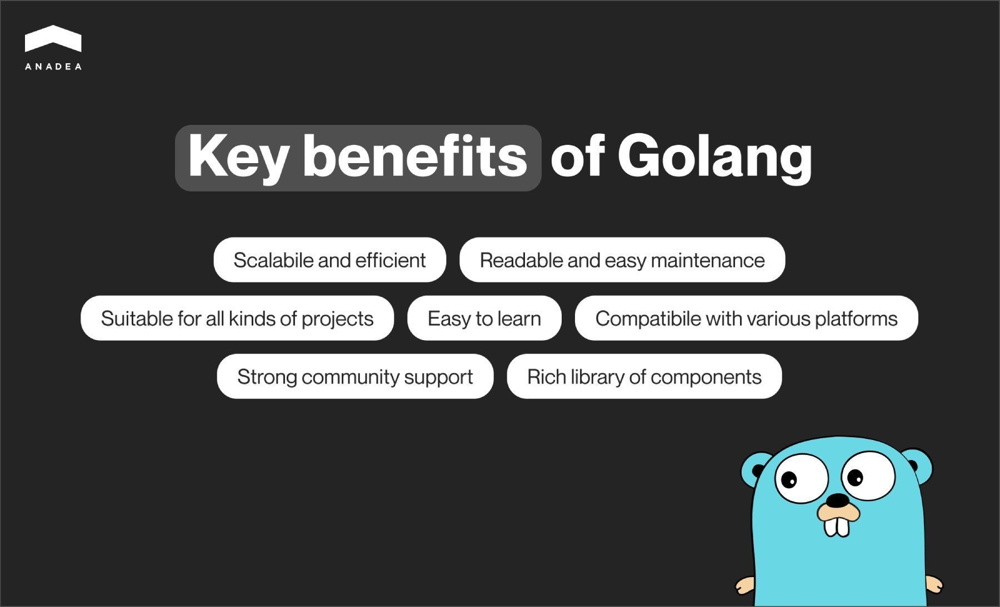
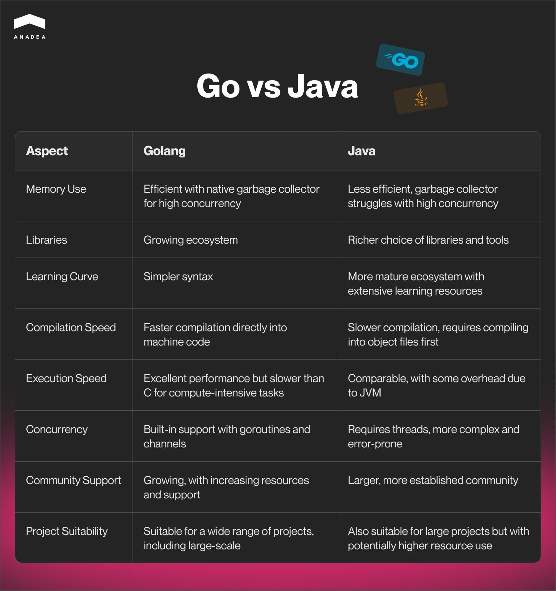
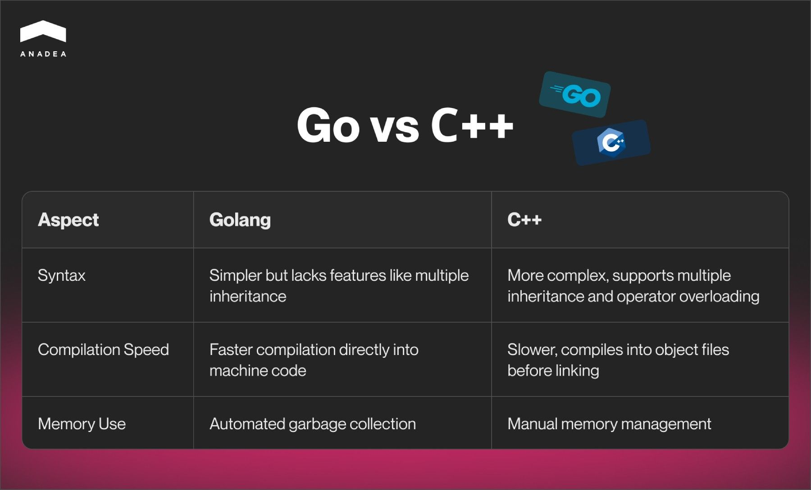
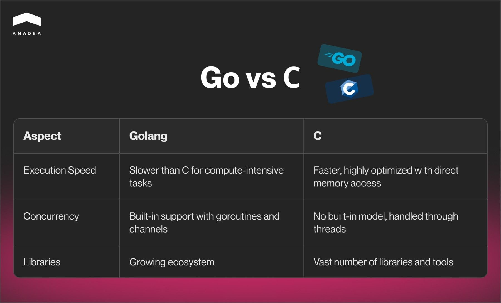
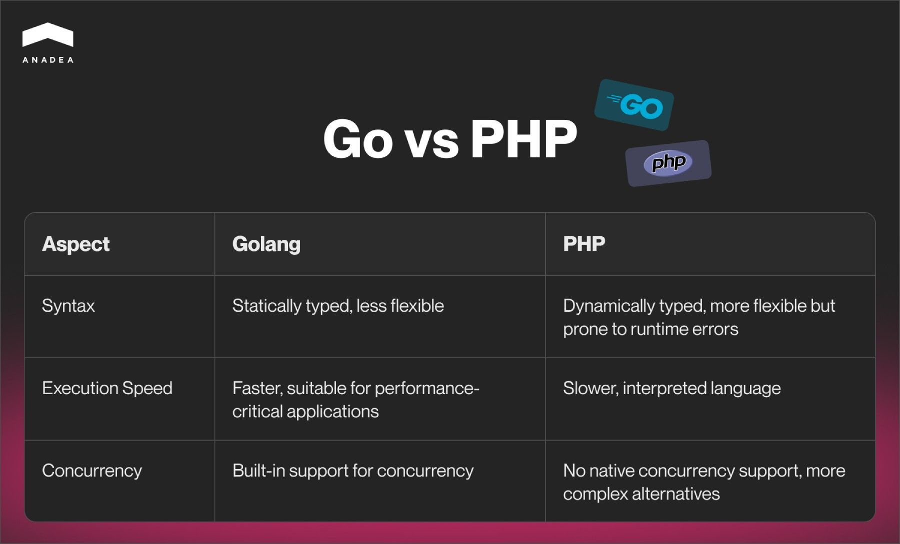
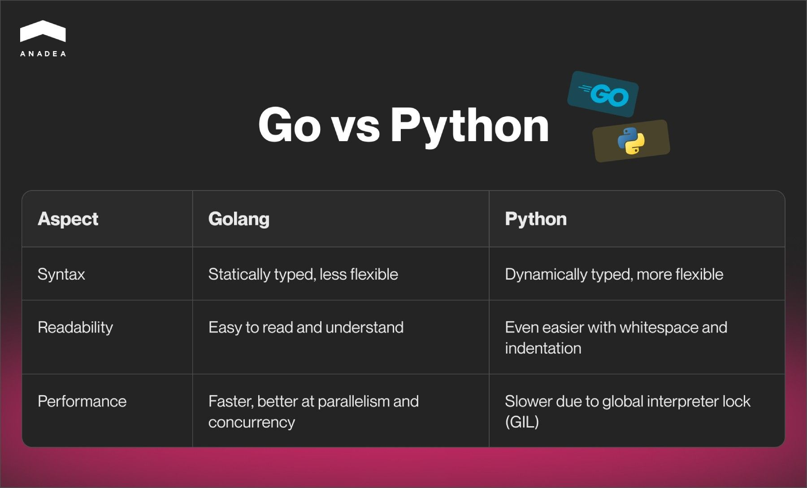

The choice of a tech stack is one of the most crucial decisions that you should make at the stage of planning the realization of your software development project. The range of chosen technologies is greatly influenced by the modern trends in the IT market and the popularity of different tools. For example, today we can observe the growing demand for such a programming language as [Golang](https://anadea.info/technologies/golang), also known as Go. In this article, we are going to explain the peculiarities of this language, mention its key use cases, and talk about Golang performance in various types of projects.

## What you should know about Golang

Go is a programming language designed by Google. The first official announcements of the future language release were made by the company in 2009. Nevertheless, the first users got the possibility to familiarize themselves with Go only in 2012.

It is an open-source computing language that was developed to facilitate the creation of apps of any complexity. The developer community positively welcomed the introduction of Golang which boosted its popularity. This can be explained mainly by its simplicity, efficiency, readability, excellent Golang speed, and performance.

Today this language is [used](https://go.dev/blog/survey2024-h1-results) for building various solutions, including but not limited to API-based services, websites, mobile applications, libraries of frameworks, games, and AI-powered apps.

As of May 2024, the TIOBE index [showed](https://www.tiobe.com/tiobe-index/) that Go is in the 8th position on the list of the top programming languages. It’s interesting to mention that a year ago, in May 2023, it occupied the 12th line of the same list. The index indicates the popularity of computing languages based on such parameters as the number of programmers who work with it in different corners of the world, the number of available courses, third-party vendors, internet searches, etc. The TIOBE index is updated every month and it is aimed at finding the languages in which the most lines of code have been written over the taken period.

## Is Go a compiled language?

Golang is a statically typed, high-level programming language and it is compiled.

It means that solutions that are written with Golang will be compiled into a machine code. Further, this code can be executed directly by the operating system. In other words, it is not required to run a virtual machine or interpreter that will perform this function.

Thanks to this the Golang speed is rather high, while the efficiency of the execution of Go apps can be fairly compared with the software written in other compiled languages like C++.

## What do developers think about Go language performance?

According to the results of the regularly conducted Go Developer survey H1 published in April 2024, within the period under consideration developer sentiment remains high. 93% of the survey participants expressed their satisfaction with Golang over the previous 12 months. And this figure has been stable quite for a while. Of course, the exact percentages can slightly differ in various time periods. Nevertheless, usually, they are quite close to 90%.

What are the main benefits of Golang that are highly valued by programmers?

* **Easiness of learning.** While there are a lot of languages that are too difficult to learn and understand, Go differs from them. A lot of developers who started learning Golang when they already knew some other computing languages stated that it is much simpler to learn and understand Go than many other alternatives. In general, the language is based on 25 keywords that are regulated with not very complicated syntax. Sometimes it takes just a couple of weeks for developers to get knowledge that will be sufficient for working on real projects. Thanks to the not-very-confusing logic and syntax, the risks of mistakes are lower which makes the development seamless and straightforward.
* **Compatibility.** Go is compatible with different platforms, operating systems, and devices. It means that it can be successfully used to create various types of software solutions intended for different goals and groups of users.
* **Rich library of components**. Golang developers can greatly streamline the process of software creation thanks to the possibility of using a wide range of tools that are available to them on GitHub. There, they can find ready-to-use components, plugins, editors, and IDEs.
* **Readability and easy maintenance**. Thanks to the absence of too tricky elements, programmers usually do not have challenges with reading the lines of code that were written by other teams. Even if you need to entrust the maintenance of your solution to those programmers, who haven’t written it, you shouldn’t worry.
* **Fit for projects of different types**. Golang can be chosen for projects of any complexity, including large [SaaS solutions](https://anadea.info/blog/saas-architecture/) and complex enterprise systems. This can be attributed to a row of factors. As we have already mentioned, this language is known for its comparative simplicity of syntax and great readability. This makes it appropriate even for big solutions which require the involvement of several teams. The use of such a language significantly facilitates their cooperation. Moreover, thanks to the available libraries of components and the testing tool, which is integrated into the Go framework, the entire development process can be streamlined.
* **Scalability**. Thanks to the concurrent nature, Golang allows apps to fulfill a row of tasks in parallel. What is even more important here is that these applications can still demonstrate a high level of efficiency and stability coupled with low memory use. The number of functions can be increased and your product will be still able to cope with higher loads.
* **Great community support**. The community of Go developers is continuously growing. It means that there are a lot of tutorials, guides, videos, and other materials that programmers can rely on in their work. If they have any specific questions, they can always ask them on forums and get valuable recommendations from other developers from all over the world.

As you can see, developers have quite a lot of reasons to like Golang. But now let’s compare it with some other popular programming languages.



## Go vs Java performance

Java was released in 1995 and since then it has become one of the most popular programming languages in the world. It’s known for its excellent features but Go outperforms it in some very important aspects, like speed and memory usage. Nevertheless, the community of Java is much bigger which provides a row of benefits for programmers. To better understand the advantages of these two languages, let’s have a closer look at the Golang vs Java performance comparison.

* **Memory use**. Go can adapt impressively quickly to systems of different kinds, including large-scale concurrent ones. This is possible thanks to its native garbage collector. Unfortunately, Java doesn’t have such abilities. Its garbage collector can’t handle loads of high-concurrency environments which can result in latency spikes.
* **Libraries**. [Java](https://anadea.info/services/web-development/java) offers a richer choice of libraries and tools. Nevertheless, it’s worth noting that the Golang ecosystem is gradually growing and is already bigger than of many other programming languages.
* **Learning curve**. Although Golang is known for its simplicity, when it comes to the learning curve Java still wins. Its ecosystem is more mature and can ensure a wider range of resources that developers can use for learning.

## Go vs C++ performance

Go and C++ have a row of similar features and characteristics. Namely, this explains when sometimes they are used on similar projects. Nevertheless, they both have their specificity that you should know when you are looking for a tech stack for your solution.

* **Syntax**. If we compare what these languages offer, we will see that the syntax of Golang is significantly simpler. However, it lacks some features that may be important for developers. For example, when working with C++, developers can leverage multiple inheritances and operator overloading. In Golang, they are not available.
* **Compilation**. Compilation in Go takes less time than in the case of using C++. While compiling directly into machine code, Golang ensures higher developer productivity. C++ demonstrates lower compilation times, especially in the cases of large projects with complex dependencies. It happens so because C++ must first compile into object files and then it will be able to link into an executable file.
* **Memory use**. The process of deleting unnecessary data is automated in Go. In C++, this process should be performed fully manually.

## Go vs C performance

When it comes to comparing Go and C, you will see practically the same situation as in the case of Go and C++ analysis. Nevertheless, C has a more minimalistic nature than C++. This explains some differences.

* **Execution**. While compilation speeds are practically the same in both cases, execution speeds are different. C is faster in this aspect. It is a low-level language. It offers direct access to memory and system resources, enabling highly optimized and efficient code. Go is known for excellent performance. However, its execution speed is lower, especially in the case of compute-intensive tasks.
* **Concurrency**. As we have already mentioned, Golang is a very good choice for writing efficient concurrent programs. As for C, there is no built-in concurrency model. Concurrency is usually handled through threads. This approach is more complex and can lead to a lot of errors.
* **Libraries**. C can boast a long-established ecosystem that provides a vast number of libraries and tools. Go is still not as extensive as C’s ecosystem.

## Go vs PHP performance

PHP is widely known for its ease of use in web development and rapid development cycles, which makes it a preferable option for many programmers. However, there are aspects in which Golang demonstrates better results.

* **Execution speed**. That’s one of the parameters, in which Golang wins. That’s why it is often chosen for performance-critical applications. As for PHP, it is an interpreted language. And even with the recent performance improvements, it doesn’t match the execution speed of compiled languages like Go. Given this, PHP can be suited for web apps when execution speed is less important than ease of development and deployment.
* **Concurrency**. Go has built-in support for concurrency with goroutines and channels. As for PHP, there aren’t any naturally integrated ways to handle concurrency. All the available options are more complicated and less efficient.
* **Syntax**. PHP is a dynamically typed language. It allows developers to avoid the explicit declaration of the type of a variable before using it. As a result, it is possible to write more flexible code but it can lead to runtime errors. Go is a statically typed language. In this case, it is required to declare the type of a variable before using it. The code is less flexible but the probability of runtime errors is lower.

## Go vs Python performance

Today, Python is the most popular programming language in the world. But does it mean that it is the winner in all the aspects?

* **Syntax**. Here, the comparison will be similar to what we have in the case of Go vs PHP. Python is a dynamically typed language. It is more flexible but the risk of errors at runtime is higher.
* **Readability**. Go is easy for developers to read and understand. But Python is even easier thanks to the possibility to use whitespace and indentation to define blocks of code.
* **Performance**. Go is objectively faster than Python when it comes to parallelism and concurrency. Python’s global interpreter lock (GIL) prevents it from maximum performance in the case of using multi-core processors.

## Final word

If you ask a professional developer to name a perfect programming language, it’s highly likely that you won’t get any precise answer. And the reasons for that are quite clear. Each of the available options has not only pros and cons but also its own range of use cases. For example, while some languages are more suitable for web development, others can be a good option for mobile or desktop apps. While some tools will be a good solution for small software products, others will be more appropriate for enterprise systems, etc.

Given the peculiarities of the Golang performance, this language is widely used for building microservices, web apps, cloud products, DevOps tools, real-time systems, and other solutions.

If you are trying to find out whether Go will be suitable for your project or are already looking for Golang developers, at Anadea, we will always be ready to help you. With outstanding expertise in building software products for different business domains, we will be able to offer the best solution for you.

Book a free consultation
