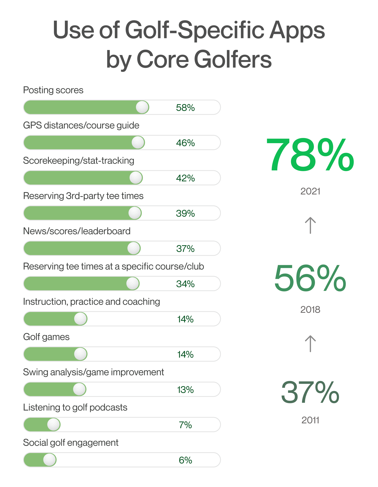
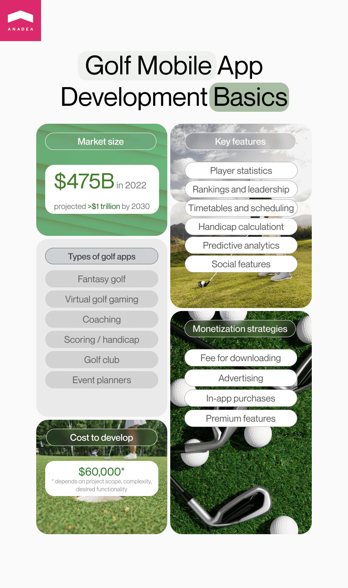

When people hear that there are mobile apps for hockey fans or applications launched by football clubs, it is highly unlikely that they will get surprised. However, a golf mobile app may seem to be not a very obvious choice. Nevertheless, given the general digitalization of the sports space, it's impossible to ignore the role of golf mobile app development in the industry. Moreover, the demand for such products as well as <a href="https://anadea.info/solutions/sports-app-development" target="_blank">sports app developers</a> has been growing in recent years, being boosted by the deeper smartphone penetration in modern society.

In this article, we offer you to have a look at the most popular types of apps for golf lovers and professional players. And if you are planning to build your own app of this type, we believe that the information that you will find below will be useful to you and will help you to develop the right strategy.

## Golf mobile app market in figures

With the overall digitalization of all the spheres of our lives, it is absolutely natural that sports and physical activity today are also widely associated with various software solutions that can facilitate numerous tasks and increase the efficiency of training sessions.

In 2021, the US National Golf Foundation (NGF) conducted a <a href="https://www.ngf.org/golf-app-usage-on-the-rise/" target="_blank" rel="nofollow">survey</a> that demonstrates that at that time almost 80% of golfers used at least one mobile golf app on a regular basis. In 2011, only 37% of golf players had such apps on their devices.

<small style="font-size: 14px">Source of information: National Golf Foundation</small>

The majority of people who participated in that survey said that they prefer to use apps for calculating their scores and viewing statistics.

In the US only, there were more than 25 million golf players in 2022 which proves that the audience for such sports apps is quite impressive. And it can be definitely viewed as a good sign for those who are thinking about launching a golf mobile app.

## Types of golf mobile applications

One of the first things that you need to decide about when you are planning to launch your own mobile software solution for golf lovers is the type of app that it will be.

### Fantasy golf apps

Fantasy sports apps are gaining popularity these days. They allow users to feel the authentic vibe of sports competitions even if they are far from being professional athletes. The idea behind such software products presupposes the possibility to create virtual teams of real players. It means that users need to select those athletes who, according to their opinion, will demonstrate the best performance in real life. The better these players perform, the more fantasy points are allocated to those users who have chosen them. You can learn more about it in our article on <a href="https://anadea.info/blog/fantasy-golf-app-development" target="_blank">fantasy golf app development</a>.

### Virtual golf gaming apps

People of all ages love games. Even those people who do not have enough skills or possibilities to play real golf may find it entertaining and interesting to play golf on their mobile devices.

### Coaching apps

No matter what sports you want to do, you may require help from the side of professionals who will not only explain the rules to you but also help to master your skills. Thanks to advanced mobile apps, the physical presence of your coach is not required. You can organize online sessions via video chats.

### Scoring/handicap apps

In golf, a handicap is a term that is used to describe a numerical measure that shows the potential of a player. Such apps help to facilitate the process of calculating handicap scores and detect the abilities of players and their level of professionalism. Such apps let users easily add their scores after (or even during) the game. Very often, apps that belong to this group also offer advanced statistics and analytics functionality.

### Golf club apps

You can build different apps of this type. It can be a typical golf club app that has a list of clubs located in specified zones and provides some general information about them, including available courses and prices. Or it can be an app fully managed by one club and targeted at its members and visitors. Such apps can be enriched with functionality for booking courses, scheduling games, making payments, etc.

### Event planners

These apps can be of great use not only for players and their coaches but also for fans and sports event organizers. Usually, such solutions help to add events and comments and further get notifications about them.

## Important features that can be built for your golf mobile app

The range of features that can be added to your application is an incredibly wide one. And while some of them are absolutely app-type specific, some others are practically universal. For example, a list of golf clubs and courses may be not a very useful feature for a fantasy golf app but some functionality for communication with people who share similar interests can be a good idea almost for every app.

- **Player statistics and performance analytics**. Thanks to this functionality, players will have the possibility to add their results during the game or training session and to get access to analytics in real time. This data can be used not only for tracking the progress but also for building the right gaming strategy, and, consequently, achieving better results in the future.
- **Rankings and leadership board**. Gamification can become one of the most powerful motivators for all people, regardless of their age. With this feature, players will be able to see their positions and even get some in-app rewards or unlock special bonuses.
- **Timetables and scheduling**. Let players use your app for planning their time, arranging training sessions, and adding notifications about upcoming games and other golf-related activities. As many people use in-built calendar apps on their smartphones, you can let your golf mobile app add scheduled events directly to the user's general calendar.
- **Golf club/course list**. Your app can be enriched with a map and GPS-powered functionality for finding the nearest open courses in accordance with the current location of a user. Or you can also create a filter-based search system that will help players to find clubs and courses using such parameters as opening hours, the costs of rent, etc. Via establishing cooperation with golf clubs, you can expand the functionality of your app with booking and online payment features.
- **Handicap calculation**. To calculate handicaps, you should know the exact arithmetic formula that is applied in the country (yes, please, bear in your mind that there can be different calculating approaches in different countries). Of course, it is possible to make all the calculations manually but this process can be rather time-consuming, and moreover, it can be associated with some risks related to errors caused by a human factor.
- **Predictive analytics and score prediction.** Thanks to ML and AI-powered tools, apps can analyze the live scores of players and the history of their performance and provide accurate forecasts on their further achievements and tournament results.

- **Social features.** Probably, you've already noticed that today there is a tendency to enrich different types of apps with various functionality for communication. And you can also make it possible for the users of your app to communicate with each other, exchange photos, and discuss the results of games. Moreover, you can allow users to share some materials, posts, and pics from your app directly to their social media accounts. It will be not only convenient for users but also very beneficial for your project as thanks to social media sharing more people can learn about your app.



## Tech stack for developing a golf mobile app

As it is quite typical for any software solution, the exact set of technologies and tools can be chosen only after defining all the features that should be added to your application. Nevertheless, we offer you to have a look at the list of technologies that can be useful for building a mobile application for golf players.

- Programming languages: Kotlin, Java, Node.js, Swift, Objective C
- Databases: MySQL, MongoDB
- Cloud platform: Microsoft Azure, Google Cloud, AWS
- Payment API: PayPal, Stripe
- Push notifications: Twilio

At Anadea, when we provide golf mobile app development services to our clients and have to choose the best tech stack for a future solution, we not only carefully analyze the technical side of the project but also attentively listen to the client's needs. There can be situations when companies ask us to use some particular technologies so that it will be possible for their in-house teams to support and maintain an app on their own. And we always do our best to satisfy such requests.

## Conclusion

When you are going to build a golf mobile app, the first things that you need to do are to define the type of solution that it will be and create a list of features. You should make these decisions based on your target audience and the tasks that you want to solve with your product. But if you have any difficulties with this, you can always contact our team. Our experts have not only strong tech skills but also a deep understanding of the ongoing market demands and trends. That's why you can fully rely on us when you are planning to rock the market with your outstanding sports application.

Request a free quote
