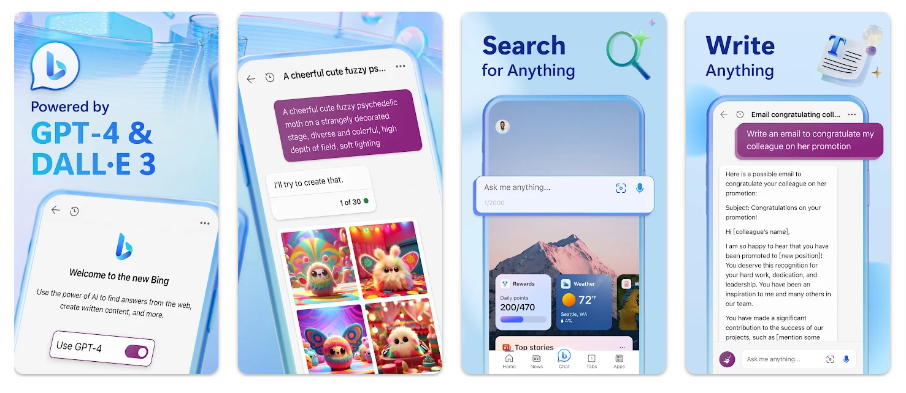

The introduction of ChatGPT by OpenAI in November 2022 became a major milestone for AI adoption in the business world. It would be absolutely incorrect to say that before this large language model-based chatbot was made publicly available, businesses and individuals hadn't used any AI-powered tools for dealing with various professional tasks or just for fun. Nevertheless, ChatGPT became a real game-changer. The team behind this model invested a lot of effort to enhance this AI chatbot and make it as helpful for different groups of users as possible. OpenAI is continuously working on delivering more advanced models that can act as "brains" for various apps.

In this article, we'd like to talk about the fourth GPT foundation model which is currently the latest and the most advanced in the series of models presented by OpenAI. If you are thinking about implementing an AI-powered solution into your business processes but don't know whether it will be a feasible solution in your case, it will be a good idea to have a look at GPT-4 use cases.

## GPT-4 vs. ChatGPT: What you should know about them

Before analyzing use cases for GPT 4, it is vital to make sure that you have a fully correct understanding of this term as there can be some confusion related to it. Is it just the same as ChatGPT and can you use these two names interchangeably? We should admit that a lot of people do it but it is not always correct.

ChatGPT is the name of the app. It is a popular AI-powered chatbot that relies on the GPT language model for building interaction with users in a highly human-like way. In one of our previously published articles, we've already chatbots and their types. If you are excited to learn what they are, please visit our article on <a href="https://anadea.info/blog/different-types-of-chatbots" target="_blank">different types of chatbots</a>.

Meanwhile, GPT is a large language model (LLM) that is applied to allow solutions to generate content. GPT-3, GPT-3.5, and GPT-4 are the widely used versions of this model, with GPT-4 being the most powerful at the moment. The key difference between them takes root in the volume of data that they were trained on and the number of used parameters. GPT-3 relies on 175 billion parameters. This figure for GPT-4 is not officially revealed. According to some rumors that were, however, denied by the OpenAI CEO, this LLM version uses 100 trillion parameters.

GPT-4 is the latest available version at the moment of writing this article and unlike its predecessors, it can work not only with texts but also images. Moreover, it demonstrates higher accuracy in its responses and is believed to be more creative.

So, how are GPT-4 and ChatGPT related? ChatGPT can rely on GPT-4's parameters. By default, every internet user can access ChatGPT 3.5 for free. ChatGPT powered by GPT-4 is also publicly available but only to those users who are ready to subscribe to ChatGPT Plus and pay $20 per month. As the range of Chat GPT 4 use cases is rather wide, users can enjoy a lot of opportunities gathered under the roof of one app.

At the same time, though GPT-4 was built by OpenAI, it can be applied to enrich different types of software developed by other businesses.

Contact AI developers

## How GPT-4 is used by different companies

Today there are a lot of well-established businesses and startups that use GPT-4 in this or that form. We've chosen the most interesting use cases for GPT 4 which you can take as inspiration for your own unique project that can be also powered by this LLM.

### Bing

AI search engine Bing which was delivered by Microsoft is [powered](https://blogs.bing.com/search/march_2023/Confirmed-the-new-Bing-runs-on-OpenAI%E2%80%99s-GPT-4)by GPT-4. What does this collaboration with OpenAI bring to Bing? First of all, when users want to find an answer to their question, they do not need to waste their time scrolling down the page and trying to guess which link will provide the most valuable information. Thanks to AI, Bing will offer a relevant summary of the found info.

Secondly, Bing also offers a virtual writing assistant that can create texts for emails, design quizzes, compose poems, and help a person get ready for a job interview. Bing can also help users translate texts, check their grammar, tell jokes, and create splendid images based on individual requests. All these features are available for free.

### Stripe

In March 2023, it was [revealed](https://openai.com/customer-stories/stripe) that fintech startup Stripe would use the power of GPT-4 to enhance user experience and minimize risks of fraud by implementing it into the processing of digital payments and other offerings.

It's interesting that it was already not the first experience of Stripe in working with products offered by OpenAI. Before GPT-4, Stripe had incorporated GPT-3. It was used to improve customer support services and to reduce the overload for agents who could spend time only on the most complex issues while the easiest ones were catered by AI.

### Morgan Stanley Wealth Management

US-based [Morgan Stanley Wealth Management](https://www.morganstanley.com/press-releases/key-milestone-in-innovation-journey-with-openai) is a leader in its segment. It works with huge volumes of data, including market research data, analyst insights, investment strategies, and vast knowledge bases. All this data is presented mainly in PDF format and kept across various sources. It means that employees need to look through numerous pages and spend a lot of valuable time in order to find the required info.

But GPT-4 can help to solve this problem. This model powers an internally used chatbot that can look for the required data based on requests from employees.

### Be My Eyes

Be My Eyes is a free mobile application built for people with visual impairments. The main goal of it is to connect users with volunteers who will be ready to help them perform various daily tasks that can't be executed by people with low vision. For example, a person can find a volunteer who can help him or her to navigate at the airport in real-time or identify products at the supermarket.

After the introduction of GPT-4 which has an image-to-text generator, the team behind Be My Eyes started creating a GPT-4-powered Virtual Volunteer. This tool is developed to be integrated into the already existing mobile application. What can it offer? When a user sends an image, this Virtual Volunteer can recognize what item is shown there and then will be ready to answer different questions related to it.

GPT-4 stands out from the row of other similar models for its deep understanding and excellent conversational abilities. For example, if it receives an image of a couple of products, it can offer different dishes that can be prepared with them.

### Government of Iceland

While speaking about GPT-4 use cases, we can't skip the following example. Iceland is an island country in the North Atlantic Ocean. Its population is around 380K and while the majority of citizens use English on a daily basis for different purposes, the preservation of the Icelandic is under threat. The local government even has a Language Planning department that is responsible for offering new words from various innovations that can be used instead of international loanwords.

To strengthen their efforts aimed at saving Icendic, the government has decided to establish cooperation with OpenAI and leverage the capability of GPT-4.

Tell us about your project

## GPT-4 use cases: Ideas for your business

The use cases for GPT 4 are rather varied which is well-demonstrated by companies and organizations that have already started relying on its capabilities in their work.

How can you use this LLM for your business purposes?

- **Text generation and copywriting.** Though we should admit that texts created by AI differ from what a specialist can write, marketers and authors can use GPT-4 as a supportive tool for creating various types of content to save time.

- **Natural language understanding**. Thanks to NLP (natural language processing) abilities, GPT-4 is widely applied for powering customer support systems and chatbots. Apps enriched with this LLM can interact with your customers in a human-like manner and provide answers to very different questions related to your business processes, products, and services.

- **Translation**. This language model can greatly improve the performance of machine translation solutions by allowing them to provide more contextually accurate translations.

- **Healthcare and diagnostics.** In the treatment process, it is highly important to determine the correct diagnosis. However, due to time restrictions, overload, and other factors, doctors do not always have the possibility to attentively study all the symptoms of a person. GPT-4 can address this issue. It can analyze medical records and patient complaints. Based on the data provided by GPT-4, doctors can make more accurate diagnoses.

- **Investment and financial analysis.** This LLM developed by OpenAI can also analyze various financial data, investment patterns, trends, and opinions provided by experts in order to generate valuable recommendations for financial institutions traders, and investors. In their turn, users can make more informed decisions based on the received insights.

- **Design and art.** What makes GPT-4 so special is its ability to generate design and visual concepts. The model can analyze artistic styles and mimic them in the process of creating various illustrations, graphics, and animations.

- **eLearning.** The concept of [eLearning](https://anadea.info/solutions/e-learning-software-development) is gaining popularity and the possibility of offering highly personalized experiences is among the reasons for this trend. GPT-4 can help to achieve this aim. Moreover, with it, you can ensure adaptive assessments, interactive materials, and highly engaging activities for learners.

- **Legal research**. GPT-4 can process huge volumes of data which can be a very valuable feature for lawyers who need to work with a lot of documents, statutes, and case precedents.

Discuss my idea

## How can you implement GPT-4?

If you have analyzed the use cases for GPT 4 and have already decided that you need to use this LLM for your business purposes, you need to find a way to communicate your solution with AI.

One of the easiest methods will be to find an out-of-the-box solution that can be seamlessly integrated with your software. In this case, it will be important to check whether the chosen product has all the required functionality and whether it can be customized.

Another option to introduce GPT-4 is to do it via an API provided by OpenAI. Here you will have another choice to make: Who will do it for you?

As well as in the case of any other software development project, there are several variants. You can do it either on your own (or maybe with the help of your in-house team) or you can hire developers with relevant skills.

When you rely on experts who definitely know what and how should be done, you can be sure that you will have a powerful solution. Moreover, if you turn to our team with such a request, we can guarantee that all your tasks will be performed within reasonable time frames and with the highest quality.



## Conclusion

Today GPT-4 is considered to be the most advanced LLM. It is already used by a lot of companies that work in different business domains and it has proven its efficiency in various processes. The GPT-4 use cases are really inspiring and it is amazing to observe how modern technologies, including AI, are revolutionizing the business world and simplifying a lot of processes for people.

If you have any ideas for a GPT-powered project or you want to create a product that will rely on any other AI model, do not hesitate to contact us! Our developers are real experts in the field of ML and AI and we are sure that we will find a solution even for the most challenging tasks. If you send us your project requirements, we will be able to provide project estimates for free.

Get in touch
