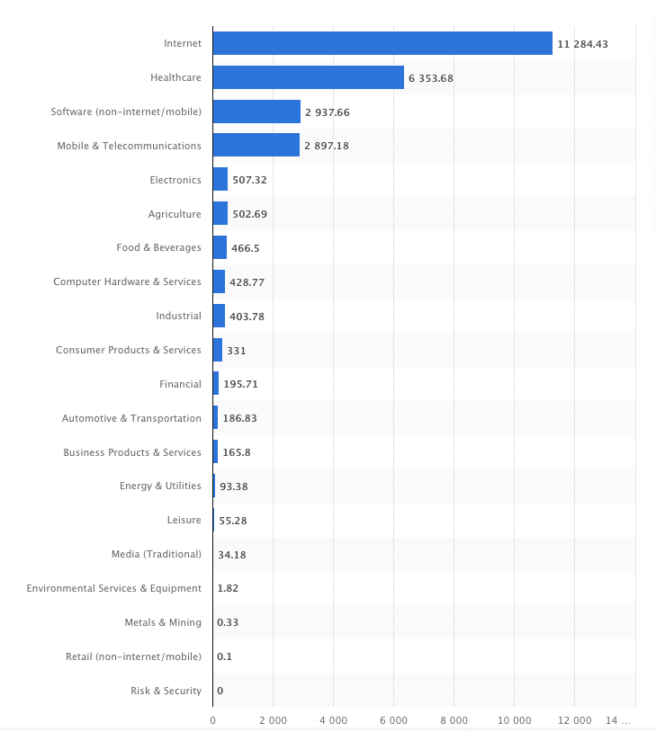

We have reached a new era in the digital world. The way healthcare organizations are delivering patient care is shifting in the rise of a worldwide pandemic. Telehealth, machine learning, virtual care and <a href="https://anadea.info/solutions/medical-app-development" rel="dofollow" target="_blank">custom healthcare software development</a> are emerging forces. To remain competitive, healthcare providers must change the ways they operate.

Consequently, healthcare providers and those responsible for paying for treatments are always looking for innovative ways to grow, improve patient outcomes, and reduce costs. The recent <a href="https://www.healthcareitnews.com/blog/beyond-telehealth-virtual-care-technology-trends-will-transform-healthcare" rel="nofollow" target="_blank">estimate</a> by consulting firm McKinsey suggests that $250 billion in healthcare spending could shift to virtual care models in the wake of coronavirus spread. At the same time, half of the world’s population lacks access to essential healthcare services, says the <a href="https://www.who.int/news-room/detail/13-12-2017-world-bank-and-who-half-the-world-lacks-access-to-essential-health-services-100-million-still-pushed-into-extreme-poverty-because-of-health-expenses" rel="nofollow" target="_blank">report</a> by the World Bank and World Health Organization.

Health IT startups should seize the opportunity. However, the challenge always comes to funding a healthcare startup. Luckily, here are some excellent ways to get funding for your health IT startup for you to consider, which we cover in this article.

Related read: [How Much Does It Cost to Develop an App for Healthcare?](https://anadea.info/guides/healthcare-app-development-cost)

## Do Your Homework

Start with the research. Your first step in finding seed funding for your health IT startup is ensuring the true value of your idea. Remember that your idea needs to be unique and solve the real problem. Copycat ideas almost always fail to attract funding. Same way, products that invent a problem rather than solve it never raise sufficient funding from experienced investors.

## Prove Your Worth

Big promises may impress an investor. More often, however, you still need to present realistic numbers and metrics. Consider which measurements are relevant for your health IT startup idea. If this is your first attempt to secure seed capital for your health IT venture, think about other KPIs that validate your idea from the business point of view:
* **Total Available Market** (TAM) - total revenue capacity of your services or products;
* **Market value** - the price of your healthcare startup could obtain for an asset it owns;
* **Market Share** you plan to conquer in a year, 5 years;
* **Sales Projections** - show your understanding of what drives sales (web traffic and conversions), show how many streams of revenue your startup has.

Failing to provide solid research shows a lack of preparedness and may even scare away potential investors.

## Partner with Healthcare Providers

Established healthcare providers that own chains of hospitals, clinics and diagnostic centers are offering seed funding for innovative health IT startups. It’s a common practice for these healthcare providers to join forces and create a fund that would provide seed capital to healthcare-focused IT startups.

Not only is this a great way to get funding, alongside mentoring and support, but it gives you a potential exit avenue. Some startup founders can receive funding in the early days, grow the business, and then be bought by the same company that provided the funding.

## Consider GV

GV, formerly Google Ventures, is the investment arm of the Alphabet enterprise. Established in 2009, the company has reportedly invested in more than 300 startups. GV focuses on providing seed capital to life sciences and healthcare-focused businesses.

Don’t let the lack of contact information on the website stop you from applying. A practical approach is to reach out to one of Alphabet’s stakeholders through their LinkedIn profiles. You can also send the message on the corporate Facebook page.

## Explore the Benefits of Crowdfunding

Crowdfunding platforms not only help you raise seed funding for your health IT startup, but also increase the brand awareness and help build partnerships. You can especially benefit from featuring your project on crowdfunding networks that specialize in healthcare and life sciences. Try one of these <a href="https://moneyconnexion.com/crowdfunding-websites.htm" rel="nofollow" target="_blank">health IT investment platforms</a> to find the one that perfectly suits your product’s niche and financing needs.

While crowdfunding works differently from seed funding, a successful campaign proves that your idea is feasible and has a solid business value. When you put all the required components in place, your health IT startup may attract even more investment than you initially planned.

## Don’t Ignore Traditional Bank Funding

Innovation in healthcare is happening faster than most people realize. With the global pandemic unveiling, the massive adoption of healthcare technology globally is inevitable. That’s why many global banks offer funding to health IT startups. In fact, some of the global finance players invest significant amounts in innovative startups in healthcare IT.

## Consider Your Local Regulations

Seeking seed funding from venture capitalists may seem like a simple solution for a health IT startup. <a href="https://www.statista.com/statistics/277506/venture-caputal-investment-in-the-united-states-by-sector/" rel="nofollow" target="_blank">Statista shows</a> that one of leading VC sectors in the United States, as of second quarter 2020, is healthcare.

However, it’s no secret that a lot of venture capitalists from China are investing heavily in startups, and healthcare is no exception. While you can approach Chinese venture capitalists and try to raise funds for your health IT venture, there are some things to consider.

It’s essential to make yourself familiar with the investment regulations in your country. Some legislations may actually place a ban on the Chinese investment. While a Chinese venture capital firm may agree to seed your health IT startup, local legislation can put a halt on all your hard work.

Related read: [Healthcare and Medical Mobile App Revenue Models to Achieve Best Results](https://anadea.info/blog/healthcare-and-medical-mobile-app-revenue-models-to-achieve-best-results)

## Reach out to the Big Pharma

Pharmaceutical companies are always on a lookout for excellent healthcare startup ideas to fund. Global pharmaceutical giants including Novartis, GlaxoSmithKline, and Pfizer often provide seed funding to healthcare-related startups.

This is not surprising, since all pharmaceutical firms are trying to diversify their businesses. According to various sources, their combined investment in healthcare startups is over $10 billion.

Pharmaceutical companies are looking for exciting and innovative healthcare startup ideas to fund. And they are willing to put money in, if you have an investable idea. Don’t be shy and approach pharmaceutical and life sciences firms to <a href="https://www.cbinsights.com/research/pharma-drug-startups-most-active-investors/" rel="nofollow" target="_blank">get seed funding</a> for your health IT startup.

## Lean Over to Your Family

If your health IT startup requires little funding, you can always borrow money from your family and friends. Start making small steps and make another try with big players as your project evolves.

## Key Takeaways

When it comes to funding a healthcare startup, there are a wide range of options. How you go about this depends on how much you want to raise, and also who you already know. If you know people in the sector, then take the more direct approach through your network. If not, then cold pitches (either to pharma firms, angel investors or VC’s), or crowdfunding is the way forward.

One of the first and most important things you should use investment for is custom software development. Providing you are at MVP stage, funding can take your product to the next level.
