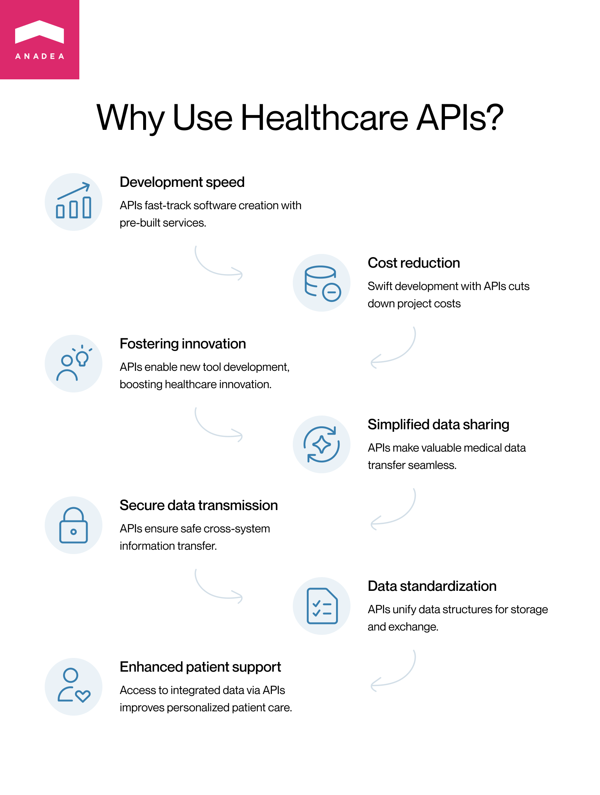
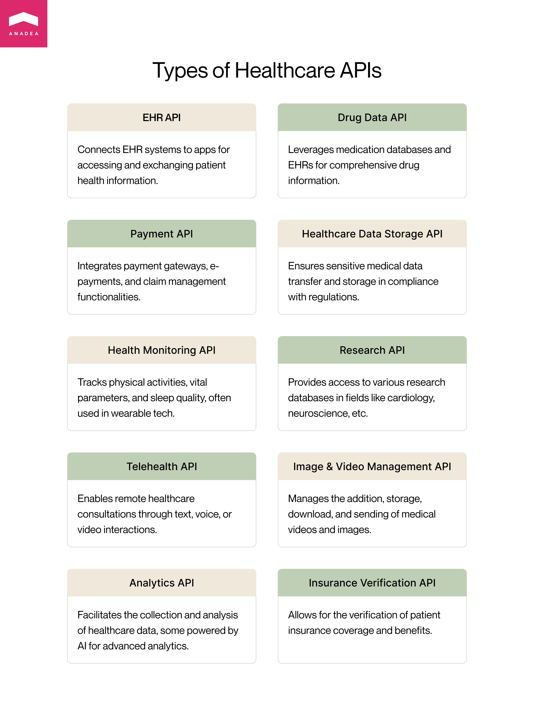
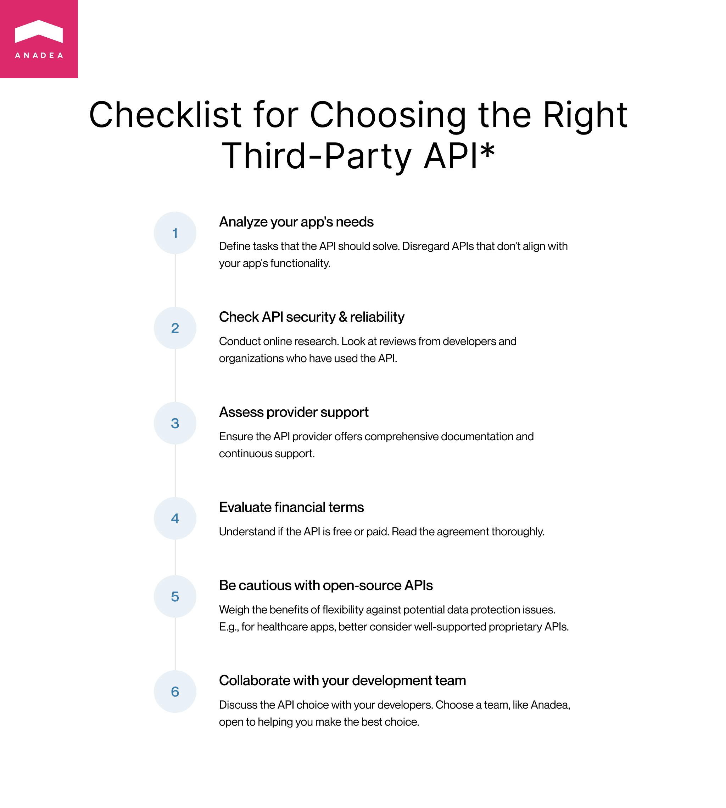

Despite the huge progress made in the development of software solutions for the healthcare industry over recent years, there is still a lot of work to do. In 2022, the global digital health market size [reached](https://www.statista.com/topics/2409/digital-health/#topicOverview) $330 billion, and investments in this market are expected to grow. According to [analysts](https://www.grandviewresearch.com/press-release/global-digital-health-market), by 2030, this figure may hit the mark of $809.2 billion. The digital transformation is going on. But is it as smooth as it is expected to be? Unfortunately, there are still a lot of issues related to a lack of data sharing between healthcare providers, format inconsistency (a lot of clinics in the US rely on faxes even today), and low interoperability of the used solutions. And here is when (and why) healthcare APIs enter the game.

## Healthcare API: Basic info

Before we proceed to the discussion of the top healthcare APIs and healthcare API vendors, it will be useful to make sure that you clearly understand what such kind of API is and what tasks it can help to solve.

In general, the abbreviation "API" stands for **Application Programming Interface**, which ensures a way of communication between two or more software programs. Today APIs are widely used in the software development industry to facilitate the integration of solutions with different external services, streamline data transfer, and provide users with access to additional functionality.

Healthcare APIs make it possible for information systems to interact and exchange data. In other words, they can be defined as sets of standards or protocols that are responsible for transferring and communicating medical data from one system or application to another. Their use also leads to continuously increasing interoperability.

The role of an API in healthcare can be better explained with the help of a real-life example. Thanks to the use of an API, a healthcare provider can get instant access to a system that is also used by insurance companies and see what options the patient's insurance coverage presupposes, and what procedures or medication can be provided to a person within the chosen insurance program. At the same time, insurance companies can get instant confirmation of their funds allocation.

## What are the benefits of using a medical API?

As you can see from the offered example, the use of APIs can bring a range of benefits to all the participants in the healthcare industry, including medical centers, hospitals, healthcare authorities, insurance companies, and patients.

- By using existing medical APIs, developers can build software solutions much faster than in those cases when everything should be developed fully from scratch and there is no possibility to integrate any services or components.

- Thanks to the optimization of the time needed for product development, it is possible to reduce costs. On our website, you can also find a lot of other valuable information about [how to develop a healthcare app](https://anadea.info/guides/healthcare-app-development-cost) and what factors can influence project costs.

- With the help of a healthcare API, it is possible to build a lot of new tools and products that will boost innovations in the industry.

- The process of sharing valuable medical data is facilitated and streamlined.

- Sensitive information is securely transmitted across various systems.

- The data storage on endpoint systems, as well as the process of data exchange, will be standardized within different data structures.

- Thanks to the use of a medical API, you can ensure access to integral healthcare-related patient data for all authorized parties. As a result, you can significantly increase the quality of patient support, provide a personalized approach to every person, and set significantly higher standards for the entire healthcare industry.

## Different types of healthcare APIs

If you monitor [healthcare trends](https://anadea.info/blog/the-future-of-health-innovative-trends-in-medical-software-development-2019) and innovations, you have probably already noticed that the industry today offers a wide range of various solutions for all its stakeholders. Based on your needs, a professional software development company like Anadea can build for you a telemedicine app, a [website for private psychology practice](https://anadea.info/blog/how-to-build-a-website-for-psychological-therapy-practice), a CRM for a medical center, or any other software solution. This variety of available options leads to the necessity to introduce different types of medical APIs.

Let us mention the most commonly applied ones.

### EHR APIs

An electronic healthcare record is a digital version of the medical history of a person. It typically includes such data as allergies, lab test reports, diagnoses, and treatment. By connecting an EHR API to a healthcare app, you will make it possible for users to access the patient health information kept in the EHR systems and exchange it with other healthcare providers.

### Drug (medication) data APIs

These healthcare APIs allow users to leverage a vast amount of info that covers such aspects as the name of the drug, recommended dosage for different cases, and details regarding its manufacturer. This information is taken from medication databases and EHR systems and can be extremely valuable for prescription management.

### Payment APIs

This type of API is not among those that are intended for being exclusively used in the healthcare industry. Such APIs are used in many spheres where functionality for online financial transactions is required. These APIs allow doctors, administrative staff, and patients to conduct and manage payments related to medical services. With the top healthcare APIs, you can integrate payment gateways, e-payments, and claim management functionality.

### Healthcare data storage APIs

For the healthcare industry, it is of crucial importance to organize the timely transfer of medical data which can influence the total effectiveness of treatment. Moreover, it is necessary to make sure that all sensitive records related to people's health are kept in accordance with the existing rules and regulations. That's what this type of API can ensure.

### Health monitoring APIs

These APIs are intended for tracking the physical activities of users, their vital parameters (blood pressure, heart rate, etc.), quality of sleep, and other data. Very often they are integrated into solutions developed for wearable devices, like fitness bracelets and smartwatches.

### Research APIs

By using these APIs, you can allow users to get simple access to databases and research info on various fields like cardiology, neuroscience, and others.

### Telehealth APIs

You can use these APIs for building telehealth applications intended for providing healthcare consultations at a distance. With APIs, you can ensure smooth interaction between patients and doctors via your application in one of the available formats, such as text chats, voice calls, or video calls.

### Image and video management APIs

These APIs will allow users to add, store, download, and send various medical videos and images like MRI scans or X-rays.

### Analytics APIs

These APIs are applied for collecting and analyzing healthcare-related data. They can help to conduct standardized data transfer from one healthcare application to another. Some available APIs are also powered by AI and ML capabilities for advanced data analytics.

## Top healthcare API vendors

When you are building a healthcare app and you are planning to use a medical API, it is necessary to have a good understanding of the available options. Of course, it is absolutely impossible to enumerate all the existing healthcare APIs. Nevertheless, in this article, we'd like to tell you about the most well-known healthcare API providers and explain what you will get if you choose these variants.

### Cerner Ignite APIs

These are health data APIs. They allow developers to ensure access for clinics and medical organizations to Cerner's EHR system and other solutions. By opting for these APIs, you can leverage seamless integration of the mentioned EHR system and different services to your systems and apps. Healthcare providers will enjoy the accessibility of medical info, interoperability, and fast data exchange.

What will you get with Cerner Ignite APIs?

- Cerner EHR data access;
- Data exchange in a standardized format;
- Simple integration;
- Reliable exchange of data;
- Enhanced interoperability;
- Streamlined workflows.

### Allscripts FHIR API

This API is intended for ensuring access to the EHR of Allscripts with the help of the Fast Healthcare Interoperability Resources standard. With it, healthcare organizations can significantly improve the quality of their services as they can easily get instant access to extensive medical info.

Key benefits of Allscripts API?

- Smooth integration;
- Security of data exchange;
- FHIR compliance;
- Interoperability;
- Possibility to easily turn to Allscripts EHR data;
- Standard XML and JSON data formats.

### National Drug Code (NDC) Directory API

This API will open you access to a directory with info on finished, unfinished, and compounded drug products. But it is important to bear in mind that this directory doesn't have any info on blood products, animal medication, drugs produced under contract, as well as medications that are offered only within a product kit. It means that if you need to have access to this type of information as well, you will also need to have access to other databases.

When to opt for NDC Directory API?

- When your system should get seamless access to the NFC data;
- When you want to have a functionality that will let users search for drugs with the help of the NDC code.

### OpenFDA Drug API

This one is always named among the top healthcare APIs. It provides access to detailed info on a wide range of medications. It enables fast search and analysis of huge volumes of data.

Why choose this API?

- Fast access to the most reliable data;
- Regular updates of databases;
- Possibility to make other FDA API integrations (Device API, Food API).

### Validic

This API helps healthcare organizations to get patient-related data from various sources.

Advantages of using this API:

- SSL/TLS protocol-powered data transit;
- GDPR, HIPAA, CCPA compliance;
- Possibility to integrate with Cerner, Allscripts, and other major EHR systems.

### Welltok

By using this API, developers can integrate their solutions with the Welltok platform which is a health optimization solution. It offers access to tools, data, and functionality for creating customized healthcare options for patients.

Reasons for choosing this API:

- Third-party health source integration;
- Personalized options for healthcare service optimizations;
- Access to patient engagement solutions.

### Stripe API

Stripe is a prominent payment processing platform that is known practically all over the world. It has a healthcare-specific API that is intended for enriching healthcare applications with payment gateways.

Why Stripe API?

- Tools for detection and prevention of fraudulent activities;
- Customizable payment flows and checkout forms;
- The possibility to integrate it with EHR systems and other healthcare solutions.

### Paypal API

This payment gateway API can be used by healthcare organizations for accepting payments via web and mobile applications. The platform offers a very convenient and quick payment process which makes it a popular choice not only in the healthcare industry.

What are the key features of this API?

- Analytics and reporting tools;
- Various payment options (Paypal balance, credit cards, debit cards);
- Two-factor authentication and data encryption.

### MirrorFly API

If you choose this API, you will get the possibility to integrate in-app communication features without the necessity to build them from scratch.

What will you get with MirrorFly?

- Free chat API;
- Video and voice calls in high quality;
- Self-hosted or cloud deployment;
- Indicators of online presence;
- Push notifications;
- Unlimited messages.

### Krames On FHIR

This API is often integrated into EHR platforms, mobile apps for doctors and medical staff, telemedicine apps, and other solutions for the healthcare industry. It provides access to relevant medical information and educational materials.

What makes it a good choice?

- Wide range of educational materials;
- Features for patient tracking, reporting, and analytics;
- Integration with different types of healthcare systems.

### BetterDoctor

This platform contains accurate info on doctors, medical centers, and insurance firms. As a result, patients can find the most suitable options for them.

Key things you should know about BetterDoctor API:

- Reliable tools for search;
- Filter-based system;
- Regular data updates.

### Healthgrades

It is a flexible API that can be used by healthcare providers for providing patients with access to online appointment scheduling functionality. It also offers a huge database that contains information on over 3 million healthcare providers in the US.

Benefits:

- Simple integration;
- Extensive and regularly updated data on healthcare providers;
- Access to ratings and patient reviews;
- Customizable workflows.

### Ambra Health

The use of the API of this cloud-based platform helps developers to build solutions with medical image management and exchange tools.

Advantages:

- Possibilities to customize the API;
- AI-powered image analysis tools.

### Dicom Systems Unifier

With this API, you can easier process medical images, and share and exchange them with healthcare systems.

New possibilities that you will get with Dicom Systems Unifier API:

- Automation of workflow;
- Reporting and analytics features;
- Secure medical image exchange.

## How to choose the right healthcare API for your solution?

Of course, it may be rather confusing to quickly make a decision when there is such a huge choice of available solutions. To make this process easier for you, we've prepared a list of tips.

1. **Analyze the needs of your app.** Define the exact tasks that you want to solve with your API. For example, if you are not going to receive and process any payments via your app, such APIs as Stripe and Paypal shouldn't be taken into consideration.

2. **Check the security and reliability of the API.** Top healthcare API vendors take care of their reputation and do their best to provide high-quality solutions. Before making a final decision, you can do your own research on the internet.You can read overviews and comments left by developers and healthcare organizations that have already integrated the APIs that you want to use in your software products.

3. **Find out whether the provider supports the offered APIs.** When the vendor has good documentation and continuously supports the API, its integration as well as further app modernizations will be seamless for you.

4. **Pay attention to the financial terms.** While some APIs are free to use, some others are provided on a paid base. That's why we recommend you carefully read the agreement where all the terms should be clearly stated.

5. **Be careful with open-source APIs.** On the one hand, such APIs have a lot of benefits. Developers can change the code in accordance with the needs of your project which provides a lot of flexibility. But on the other hand, there are some pitfalls. And some of them are related to the protection of data. That's why for healthcare apps, it is better to rely on proprietary APIs that are well-supported and maintained by vendors.

When you work with a software development team, you can always discuss the choice of a medical API with your developers. While you will deeper analyze the provided functionality, IT specialists will pay more attention to the tech aspects. For example, at Anadea, we are always open to such discussions and are ready to help our customers to make the right choice.



## How can healthcare APIs be used?

In our practice, we regularly work with healthcare APIs and quite often we offer our customers from the healthcare industry to use them for enriching their systems with access to the most reliable data sources or additional functionality. Of course, there are some concerns related to this approach from the side of customers. Very often they ask us about the security of these APIs and their compatibility with their software infrastructures. Nevertheless, when you rely on top healthcare APIs, they always have good documentation that helps developers to understand how to use them and in what cases they can be easily implemented. Moreover, as a rule, their providers take the entire responsibility for their security.

One of the examples of using a healthcare API was an integration of an EHR system into a web-based mental health platform. Our customer asked us to build a web solution that would help patients to find therapists, make appointments, and get video consultations in real time. We used an EHR API to allow therapists to get access to patient data, better understand the whole picture, and choose the most efficient approach to treatment. Together with a customer, we also decided to organize the payment process via the integration of the Paypal API. Today this platform boasts great popularity among patients in the US and stands out from the row of similar solutions for its stable functioning.

## Final word

The use of healthcare APIs for building your applications and systems can not only help you to decrease the time and money required for your project realization but also expand the possibilities of your solutions. Thanks to healthcare APIs, clinics, medical centers, and insurance companies can easily get access to huge volumes of health-related data which is important for offering high-quality services.

If you are interested in launching a healthcare application and are looking for a professional software development team, we will be happy to provide you with our help. At Anadea, we have rich expertise in building feature-rich [solutions for the healthcare industry](https://anadea.info/projects#healthcare) and are always open to new projects. Just contact us, share your ideas, and our experts will help you to find the best approach to transforming them into an advanced software product.

Get a free quote
