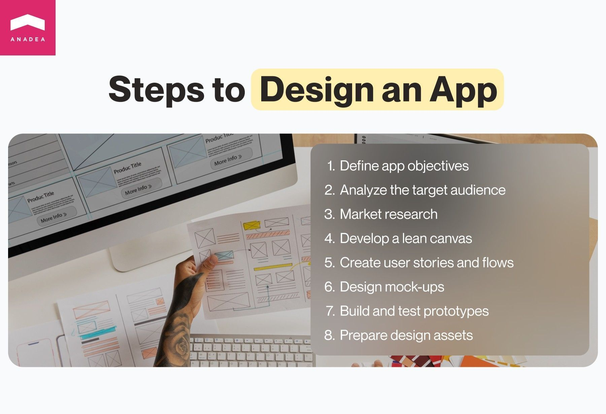

When companies want to launch their software solutions, quite often they fully concentrate on the functionality of their applications, while design takes a back seat. Nevertheless, it’s a risky approach as interfaces are the first things that users will interact with and, consequently, evaluate. In this blog post, we’d like to talk about healthcare app design and help you better understand what you should bear in mind while creating user interfaces for your solution.

## Health app design requirements

Though the process of [medical app development](https://anadea.info/solutions/medical-app-development) is quite similar to the creation of apps of any other type, it has its peculiarities. For example, these software products deal with huge volumes of sensitive information and often become a target for hackers. That’s why development teams always need to focus on the highest security standards in such solutions.

Healthcare mobile app design also has its peculiarities given the specificity of these software products. And we are going to highlight them in our article.

In general, [app design](https://anadea.info/services/ui-ux-design) includes two aspects: User Experience ([UX](https://en.wikipedia.org/wiki/User_experience_design)) design and User Interface ([UI](https://en.wikipedia.org/wiki/User_interface_design)) design. While UI design is about visual authentics, UX covers the questions of how users perceive the app and how it works. Is it possible to say which of these two aspects has a more important role? Definitely not, users can perceive them only together and their general perception of the software product is based on both UI and UX design.

The medical [app design](https://anadea.info/services/ui-ux-design/mobile-app-design) has its specificity. Such products have to be compliant with strict standards and they should provide users with a safe and comfortable experience.

Let’s consider the key requirements for health app UI in more detail.

* **Security**. Healthcare software solutions traditionally store and process a lot of sensitive medical data. That’s why while building your own app, you need to make its design and data processing clear and transparent. First of all, you need to focus on its compliance with GDPR or HIPAA regulations, depending on the jurisdiction where your solution will be available.   Traditional privacy agreements contain 40-50 pages each and it is obvious that users won’t read the full texts. That’s why it will be sensible to briefly summarize the key principles of your work with data and formulate 4-5 points. Users will be able to make a grounded decision on the permissions that they are ready to provide to you.
* **Accessibility**. When it comes to user interface design for healthcare applications, it is highly important to make it suitable for people with different kinds of disabilities and disorders. For example, there could be a version of the app for the low-vision community. Such tools as screen readers, voice assistants, text-to-speech, and speech-to-text features will be also helpful for users with full blindness and other vision impairments.
* **Positive user experiences**. This requirement is relevant to both healthcare user interface design and UX design. Such apps traditionally are aimed at helping people get treatment. Positive emotions that patients can experience also make a contribution to their recovery. That’s why it is vital to think about the colors, style, and ways of interaction with users that will ensure only positive vibes.

## Challenges of health app design

When it comes to building modern [healthcare SaaS products](https://anadea.info/blog/healthcare-saas) or any other medical solutions, there is always a row of challenges that are related directly to the peculiarities of such applications. The difficulties that we are going to mention are related not only to the design itself but also to the entire process of healthcare software creation.

* **Rapidly growing competition**. Despite the fact that the development of healthcare apps is a rather time-consuming process, today the market is expanding comparatively fast. According to different [sources](https://www.medicaldevice-network.com/news/digital-health-apps/), there are around 350,000 medical apps worldwide. However, despite such an impressive figure, there is still enough space for new solutions as the demand for them is still high.   Nevertheless, to attract users and further retain them, you should be able to offer them something that is really unique and valuable. In this case, you need to think not only about the functionality of your product or the [budget for your product](https://anadea.info/guides/healthcare-app-development-cost) but also about its design. To win its market share, your app should feel and look equally good. It should meet the existing industry standards and at the same time, it should be unique. It’s crucial to find this balance.
* **Keeping things simple**. Quite often medical apps are quite complicated solutions. And the task for UI/UX designers is to make interaction with them as straightforward and convenient as possible. We often recommend involving end users (doctors and/or potential patients) in usability testing. This step always helps make your app fully functional and, at the same time, easy to use.
* **Providing highly accurate and reliable data**. Content is an important part of the medical app UI design. And you should be very careful with the information that you offer to users. That’s why we highly recommend you devote enough time to fact-checking and data updating in order to minimize the risk of errors.

Hire professional designers

## How to design a healthcare app

Of course, there can be different approaches to creating user experience and user interface design for healthcare applications. But when our team is responsible for this process we try to encourage our customers to keep to the following plan.

1. **Define the range of tasks that your app should solve.** In other words, before making any health app UI design efforts, you should clearly understand the main aims of launching your solution and the key pains of users that it should address.
2. **Analyze your target audience.** You should study who potential users are, what they expect from healthcare apps, what interests they have, what they value most of all, what can irritate them when it comes to software products, etc.
3. **Study the market.** We highly recommend you research your competitors, detect their strong and weak sides, and find out what you can do better in the aspect of healthcare UI design and UX design.
4. **Prepare a lean canvas**. It can become a very helpful document that typically includes only one page but covers all the main points about your future app, such as the main problems to solve, the core solution, key metrics, and a unique value proposition.
5. **Create user stories and user flows.** Here, you need to think about the tasks that users may need to fulfill with your app and the ways they will move from one task to another.
6. **Design mock-ups**. At this step, UI/UX experts will transform the existing concept into a visual design. Usually, they start with low-fidelity black-and-white mock-ups and then proceed to high-fidelity screens. Typically, fully designed app screens with complementary sections are the artifacts of this step.
7. **Build interactive prototypes and test them**. Thanks to mapping interactive elements on a screen and linking them to relevant elements on other screens, you can see how it will be possible to interact with your solution even before it is developed.
8. **Prepare design assets for building your app**. When you are satisfied with the results, it will be necessary to develop the technical part of your application and make it function.



## Examples of health app UI design

As you can see one of the first things to do when you are creating an app is to study the market. It should be done not with a goal to copy and paste something that your competitors offer to users but to get inspiration and create something even better.

Let’s take a closer look at some of the healthcare apps that have already won the hearts of users.

### Flo

Flo is a reproductive health application for women that is well-known practically all over the world. The app has been downloaded by more than 220 million people and the number of active users is around 46 million per month.

The application has a clean and rather simple UX/UI design while the interaction with it is intuitively clear. Despite the fact that it works with huge volumes of data, its interfaces are not overloaded with it.

### Healthily

This application provides users with access to dozens of trackers such as health, mood, mental health, medication, symptom and other trackers.

The app has a minimalistic black-and-white design without any excessive visual elements that can distract users.

### Medisafe

This pill reminder and medication tracker is also known for its modern user-friendly design. The application offers such tools as a dug-to-drug interaction checker, support for complex dose schedules, refill reminders, doctor appointment calendars, customized notifications, and others.

But despite the wide range of features available, the interface doesn’t look confusing. The interfaces of the app are customizable which makes the interaction with them as comfortable as possible for every user.

Work with UI/UX designers

## Healthcare app design best practices

Our customers often ask us how to create an app that different target groups will positively welcome and will actively use. While there are a lot of nuances regarding the functionality of medical apps, we also always recommend paying a lot of attention to the design. Here are a couple of tips that can change the game for designers of healthcare apps.

* **User-centered design (UCD).** Your solution should focus on user needs and preferences and this should be reflected in its design. It is necessary to conduct extensive user research beforehand to clearly detect pain points, workflows, and expectations of patients and medical service providers.
* **Consistent design**. Though this advice sounds too simple, we believe that it covers a very important idea. It is necessary to ensure a consistent visual and interaction design language across the entire application.
* **Typography and colors**. It is highly recommended to select typography and colors that are not only pleasant for the eyes but also can create the desired mood and provoke the necessary emotions and feelings (such as calmness, safety, etc). Your healthcare app should look professional but not too “cold”.
* **Data visualization**. Medical apps often deal with huge volumes of complex health-related data. To make it better readable for users, you can present it in the form of tables and graphs.
* **Continuous feedback collection**. It’s helpful to listen to what your users think. Thanks to this, you can get valuable insights that will help you to enhance the design of your solution.
* **Regular maintenance and updates**. Do not forget to regularly review the state of your interfaces and update them in accordance with modern trends and changing needs.

## Top 3 trends in healthcare mobile app design

The design world is quite dynamic. That’s why it’s necessary to stay tuned with the latest tendencies to make sure that your app will meet users’ expectations. We’ve prepared a list of the most significant healthcare app design trends that can be observed today.

* **Minimalistic interfaces**. Though modern design tools allow us to create sophisticated interfaces with a huge number of visual elements of different types, it’s better not to do this. Minimalistic design reduces visual noise and makes it much more comfortable for users to navigate and concentrate on the most important info.
* **Inclusivity**. As we’ve already mentioned in our article, it is necessary to make your health app accessible to everyone. Yes, that’s a rather challenging task but given the modern trends in design, it is vital to deal with it. Adjustable font sizes and color schemes in combination with screen readers and voice commands are a must for many kinds of apps today.
* **Personalization**. That’s a common trend in the development of software solutions today. Users should be provided with content that is fully tailored to their needs. We also recommend you think about the possibility of allowing users to adjust interfaces in accordance with their preferences.

## Final word

While a lot of businesses mainly focus on the functionality of their app, the visual aspect also plays an important role. Now users are quite demanding and when they do not like how the app looks and/or feels, they can easily switch to another product. Moreover, do not forget that the competition in the medical app market is very high, meaning you should pay a lot of attention to health app design. You definitely can’t allow yourself to lose users due to poorly created interfaces.

If you are looking for professionals who can provide you with high-quality medical app UI design services, at Anadea, we are always at your disposal. Share your requirements with us and we will provide you with a free estimate.

Request a design quote
