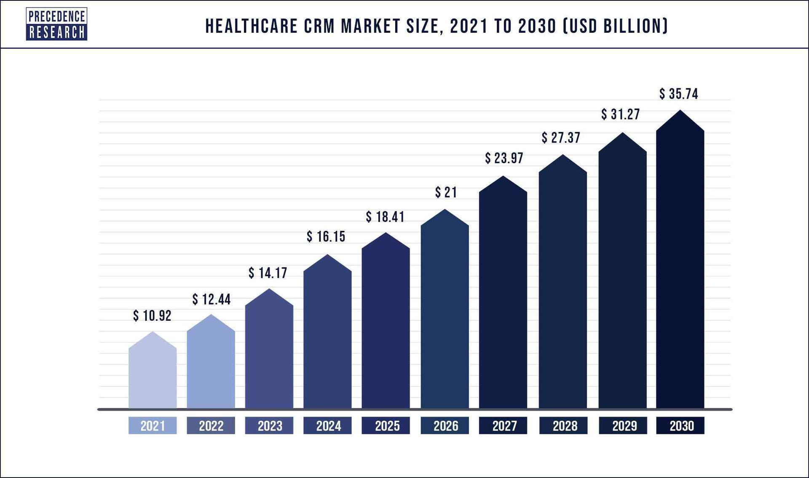
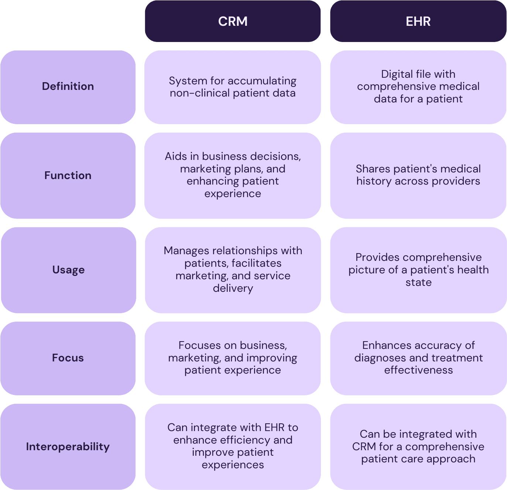
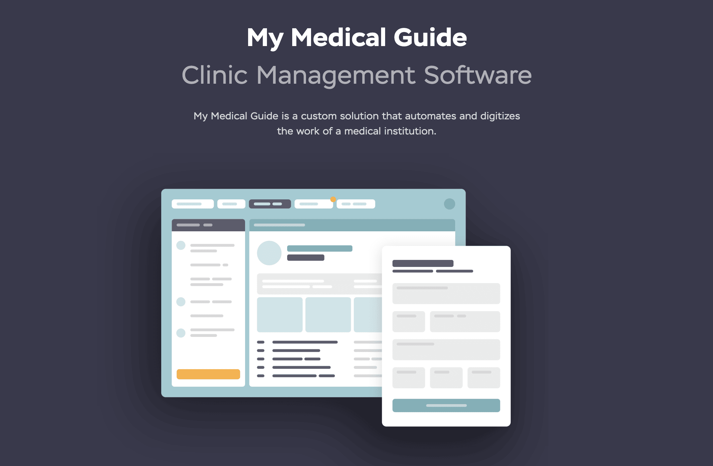

It's difficult to imagine the functioning of any modern company or organization without using business software in dealing with routine tasks and processes. Healthcare institutions also greatly rely on various systems and applications for efficiently building their workflow.

In this blog post, we'd like to focus on healthcare CRM development, explain the peculiarities of such solutions for this industry, and provide some practical tips that will help you if you are planning to build such a system for your business needs.

## Healthcare CRM: What is it?

A healthcare CRM system is a **customer relationship management** solution adjusted to the needs of the healthcare industry. Such a system helps institutions to accumulate important data about their patients from different sources, including but not limited to a contact center, website, online forms, etc. This information is crucial for understanding patients' activities, needs, habits, and behavioral patterns. Thanks to these insights, hospitals, and medical centers can better organize their interaction with patients, provide a higher quality of services, and enhance the patient experience. They are also valuable for marketing specialists who need to build the right strategy in accordance with the characteristics of the target audience.

The range of benefits of having such a system is rather wide. Let us enumerate at least the most significant ones.

### New opportunities for healthcare providers

- Access to a centralized repository for patient data;
- More efficient communication with patients;
- Improved workflows;
- Data protection and regulatory compliance;
- Minimized risk of administrative mistakes caused by a human factor;
- A deeper understanding of patients' needs for organizing successful marketing campaigns;
- Feedback collection;
- Optimization of manual administrative tasks and process automation;
- Increased revenues;
- Higher patient retention rates.

### Benefits for patients

- Better organized patient support;
- Faster response to inquiries;
- Personalized approach;
- Higher quality of the delivered services;
- Individual reminders and notifications.

## Healthcare CRM market

Given the advantages that medical institutions can leverage thanks to healthcare CRM development, it is rather simple to explain why the healthcare CRM market is continuously growing. The market size was at the level of around $14 billion in 2022 and is [expected](https://www.precedenceresearch.com/healthcare-crm-market) to hit the mark of $35.74 billion in 2030. The projected CAGR for the period from 2022 to 2030 is over 14%.

Though today the COVID-19 pandemic is officially over, we still should consider it among the boosters for this market growth. The pandemic in general and its first waves in 2020 and 2021 in particular brightly demonstrated the necessity to have convenient tools for organizing efficient work with patients and accumulating their data. And that's exactly those goals that can be achieved by means of CRM software development for healthcare organizations.

It is interesting to observe that absolutely different healthcare organizations today implement software of this type into their work. Among them, there are both **private and public clinics, research laboratories, medical centers, and others.**

## Essential features of a healthcare CRM system

Thanks to custom healthcare CRM development, it is possible to create any set of features that will satisfy your demands and fulfill all the set tasks. Nevertheless, we can define some essential features that form the basis of any customer relationship management platform built for a healthcare organization.

### Patient data management

The core components of a healthcare CRM platform are record-keeping, data consolidation, and updating. For performing these functions the software relies on several databases. The first one is a centralized database that includes such information about patients as their name, age, contact details, medical data, results of analysis, the chosen treatment, and insurance data. The second database contains templates of different documents and forms which allow medical staff and patients to add the required information just in a couple of seconds. Thanks to such templates, it is possible not to lose valuable data.

### Reporting and analytics

A good CRM solution always provides your organization with tools to monitor and analyze data gathered from various sources. Such a platform can create reports that will be adjusted to your needs. For example, you can generate a report that will reflect the changes in the number of patients in each department, the average time that a doctor spends with a person, or the most widely chosen treatment for different diagnoses.

Tools for analytics are intended for offering insights into an organization's performance. With their help, clinics and medical centers can better understand the efficiency of their budget allocation, and the results of their marketing campaigns, and evaluate patient retention rates and their changes over time.

### Communication management

This functionality is designed to organize the interaction between the organization's staff and patients. CRM should have features for patient segmentation based on different criteria for delivering personalized messages and services.

The system should be also enriched with features for customizing and sending emails and SMS with information on promotions, rewards programs, and special offers that meet the needs of a patient. It is also possible to add call-processing tools, voice bots, and pre-recorded voice messages.

For continuous enhancement of the delivered services, we highly recommend you integrate your CRM systems with your corporate website (such as your clinic's website or [website for private psychology practice](https://anadea.info/blog/how-to-build-a-website-for-psychological-therapy-practice)) for getting access to the feedback left by patients. This data will help you to understand whether you are moving in the right direction in your business development.

### Task management

This functionality is aimed at improving administration processes and collaboration between departments and covers different aspects of a healthcare organization's work.

As a rule, this system module has a dashboard for assigning, tracking, and updating tasks. Moreover, there can be an appointment scheduling feature, tools for monitoring and editing appointments, a calendar with reminders, and performance monitoring tools for collecting statistics.

### Security features

Security is a very important aspect of a healthcare CRM system as it deals with a lot of sensitive information related to patients' personal and medical data. That's why it is crucial to implement high-quality access control and two-factor authentication. Thanks to such tools it will be possible to make sure that only authorized employees will get access to the platform and its functionality.



## Trends in healthcare CRM development

The concept of healthcare CRM systems is not a new one. The first systems of this kind in their modern view started to appear a couple of decades ago. Nevertheless, with time flow and under the influence of tech progress and market conditions, such platforms are going through different changes. If you have a look at two randomly chosen CRM solutions, in the majority of cases, you will easily understand which of them was designed earlier. But what are the [healthcare trends](https://anadea.info/blog/the-future-of-health-innovative-trends-in-medical-software-development-2019) that rule the market today?

- **AI-powered functionality.** AI and ML algorithms play an important role in the automatization of various processes and in providing advanced analytics for better-informed decisions. In general, the role of AI solutions in the healthcare industry is growing, as the AI in healthcare market size. While in 2021 it was around $11 billion, by 2023 it can hit [$188 billion](https://www.statista.com/statistics/1334826/ai-in-healthcare-market-size-worldwide/).

- **IoMT**. The Internet of Medical Things helps to unite into one network a lot of real-life objects that previously couldn't be connected. Thanks to various sensors and smart devices, CRM systems can get access to new types of data that were not available earlier.

- **Personalized care**. Today it is necessary to build interaction with patients in a highly personalized matter based on their needs and requirements. Modern CRMs should be enriched with specific tools that will help to segment patients in accordance with the set parameters and provide customized offerings.

- **Attention to patient experience**. A lot of clinics today have to compete with others, especially when we are talking about private organizations. It means that they need to offer a higher quality of their services. That's why today CRM systems have not only functionality for gathering information about patients but also for organizing continuous communication with them and providing timely responses to their questions. Moreover, it is recommended to develop features for accumulating patient feedback that can help to improve the offered services in accordance with the opinion of the target audience.

Nowadays, we can observe a clear trend of building feature-rich all-in-one CRM platforms that are intended for covering a lot of aspects. Such systems are gradually becoming more complex and are often integrated with external services like payment systems or social media channels.

## Healthcare CRM and EHR software: What's the difference?

While analyzing the types of software that can be useful for a healthcare organization, you may have seen such systems as EHR (**electronic health record**). At first glance, it may seem that CRM and EHR systems are very similar to each other as they both help to accumulate patients' data but there are some obvious differences.

An EHR can be explained as a comprehensive digital file that contains all medical data for a patient. And this file can move together with a patient from one medical service provider to another. It represents a very convenient tool for sharing data about a person. It contains information about previous diseases, allergies, prescriptions, etc.

Thanks to EHR systems, medical practices can receive data on one patient from different organizations and get a full picture of the health state of a person.

CRM systems also focus on accumulating data related to patients, but, primarily, this data is **non-clinic**. The information collected by CRM systems is aimed at helping organizations to make better business decisions, adjust their marketing plans to patients' needs and enhance their experience. At the same time, EHR tools are intended for increasing the accuracy of diagnoses based on the patient's history and the effectiveness of the chosen treatment and prescriptions.

But does it mean that you need to choose between these two types of software? Definitely no. Vice versa. They can be simultaneously used separately as two stand-alone systems. But you can also integrate them and maximize their efficiency by delivering the highest quality of medical services and personalized patient experiences.

Here are some of the advantages of integrating CRM and EHR systems:

1. **Increased revenues and expanded patient base.** The better you serve your patients and the better services your offer to them, the highest opinion they will have about your medical organization. Moreover, with a deeper understanding of people's demands, you can create more sophisticated marketing campaigns that will address their needs.

2. **Better collaboration with other medical organizations.** Today patients do not try to hide the fact that they use the services of different healthcare providers. In this case, it will be sensible to establish cooperation with other medical practices to exchange valuable information on people's health. By integrating CRM and EHR platforms, it will be easier for you to get access to the required data, update it, and share it with other clinics.

3. **Decreased risks of human errors.** By keeping all information in one place, you can eliminate a lot of manual work with data. Thanks to digital workflow and automated data processing, the risks of errors caused by a human factor are significantly lower.

4. **Reduced time needed for adding data**. When you have an integrated system, it is easier to keep and update records. It is not required to update both systems at the same time. All the actions will be performed only once which means that medical staff will have more time to concentrate on other tasks.

CRM and EHR systems can become **a perfect duo**. That's why when you are thinking about healthcare CRM development, it's worth considering their integration. But let us highlight once again: their integration is not an obligatory step, though a rather beneficial one.

## How to build a healthcare CRM system: Key steps

The process of CRM software development for healthcare organizations should start with elaborating on an idea and setting project goals. You should clearly state what tasks will be solved with your software product. When you get an understanding of your product concept and idea you can proceed to further steps.

1. **Finding a development team**. It is crucial to establish cooperation with developers who have the relevant expertise and can deliver a solution that will meet the market standards.

2. **Discussing project requirements.** At this stage, you need to provide your development team with all the information that you already have about your future product, share the details of your business processes, and explain the peculiarities of the target audience that you work with and the provided services. Based on this information, it will be easier to choose the essential features that will perfectly meet your expectations.

3. **Design and development**. That's the step when UI/UX designers will create interfaces based on the provided requirements and engineers build the desired features and integrate the necessary services and tools.

4. **Testing**. As a rule, development teams conduct several types of manual and automated tests in order to check the correctness of the functioning of all the features. Some of the tests are conducted in parallel with development and others are scheduled for the period when everything is done.

5. **Deployment**. Before the release, it is necessary to prepare the environment and the product itself.

6. **Support and maintenance**. After the deployment, it is required to continuously track the system performance in order to avoid any possible vulnerabilities. Moreover, with time flow you may notice the need to expand its functionality with new features and your development team can help you with this task.

If you have ever studied the process of creating any other type of software, you may have already noticed that the general steps are very similar. However, there are always some peculiarities related to your software type. For those who are planning to launch any other software solution for the healthcare market, we recommend reading our previously published blog post on [how to develop a healthcare app](https://anadea.info/guides/healthcare-app-development-cost).

## How to choose the right partner for healthcare CRM development

If you do not have an in-house software development team but are planning to build your own CRM system for a healthcare organization, it doesn't mean that you should change the structure of your organization and create the relevant department. Today it is quite simple to outsource such services.

But the main task is to choose the right company to work with. As the number of agencies that offer similar services is growing, it is vital to be very careful at the stage of selecting a future partner.

To facilitate this process for you, we'd like to share a couple of tips. They will help you not to waste your time on building cooperation with a team that won't be able to cope with your tasks.

1. **Analyze the list of the offered services.** As a rule, this information is available on the website of any company. If you see that the company does not create CRM systems at all, it can be rather risky to start working with this team. In this case, it is highly likely that the developers of this company have never built solutions of this kind before.

2. **Check whether the team has the relevant industry expertise.** Healthcare is a quite specific industry and it has a lot of requirements for software products that will be used at medical institutions. And for offering a reliable and fully compliant solution, developers should have a deep understanding of the industry requirements.

At Anadea, we work with clients from different industries and healthcare is one of the spheres that we focus on. Our portfolio includes a wide range of successfully launched products for this market. If you want to learn more about our projects, please visit our [software development company portfolio](https://anadea.info/projects#healthcare).

1. **Pay attention to the healthcare CRM development cost**. It is obvious that every company is highly interested in optimizing its expenses. Nevertheless, it is vital not to lose common sense. When you see that a company names figures that are significantly lower than the average market rates, it can be an alarming sign. A healthcare CRM development cost greatly depends on a huge number of factors, including but not limited to the desired features, tech stack, and project complexity, but as a rule, the price will be somewhere in the range of **$30,000 - $150,000**. However, you should be ready to see higher costs if your software will have a lot of integrations and advanced tools.

2. **Read the reviews**. We recommend you read the reviews about the company's work on different external resources like GoodFirms and Clutch. It will be very useful to have a look at what the company's clients think about their cooperation, what are the possible pitfalls, and whether the results of their work satisfied the customers.

If you can't find any important details on the company's website or something looks unclear or suspicious after reading the reviews, do not hesitate the contact the company's team and ask all the questions in advance before making a decision regarding your future cooperation. Usually, companies are ready to discuss all your concerns and answer all the questions. At least, at Anadea, we follow these principles of openness and transparency as we highly respect our existing and future clients.

## Our experience in CRM software development for healthcare organizations

Anadea regularly works with customers from the healthcare industry, including private and public medical centers and practices, laboratories, and other healthcare providers. We've built different types of software solutions for them, including CRM systems.

One of our notable projects involved partnering with a private medical center to develop a CRM system aimed at enhancing patient interaction and elevating their experience. This project was particularly challenging as the client had previously had an unsuccessful collaboration with another offshore development team. They were seeking a solution to rectify the situation, having lost significant time and effort with a vendor who failed to meet their expectations.

The resulting product has these features among others:

* **Patient records management.** Secure access and management of electronic health records and medical history.
* **Visit management with dynamic templates.** Simplified patient reception with dynamically adjusted templates for different visit types and procedures.
* **Staff calendar.** A tool for scheduling appointments and planning workloads.
* **"ToDos".** A task management tool with start times and completion tags.
* **Integrations.** Integration with an e-Prescribing tool, a content editing tool, and external contact forms.

The implementation of this CRM system and the automation of existing workflows led to noticeable improvements in business productivity and internal communication among departments with access to the CRM software. Furthermore, it enabled the client to revamp their marketing approach and optimize their marketing efforts. View full case study at the [link](https://anadea.info/projects/my-medical-guide).

## Final word

CRM systems have become an integral part of the work of many healthcare organizations today. Such solutions can fully transform the way healthcare providers communicate with their patients by delivering more personalized experiences to them and offering a more individual approach.

Are you interested in healthcare CRM development services and looking for a reliable partner that can help you with your project realization? At Anadea, we will be always happy to hear from you. Contact us to get project estimates fully for free!

Request a free quote
