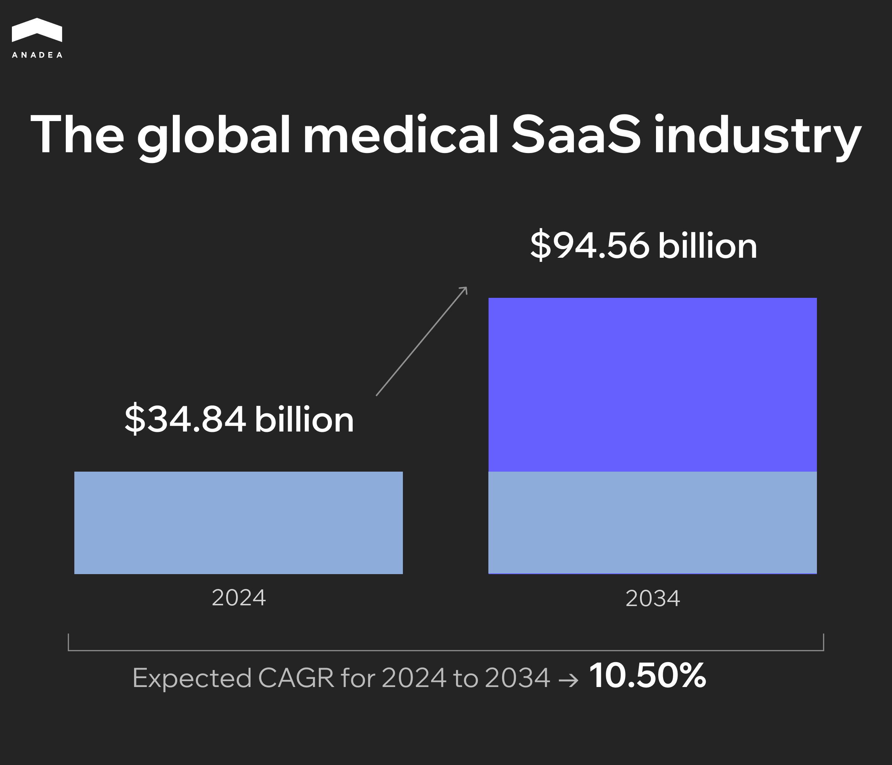
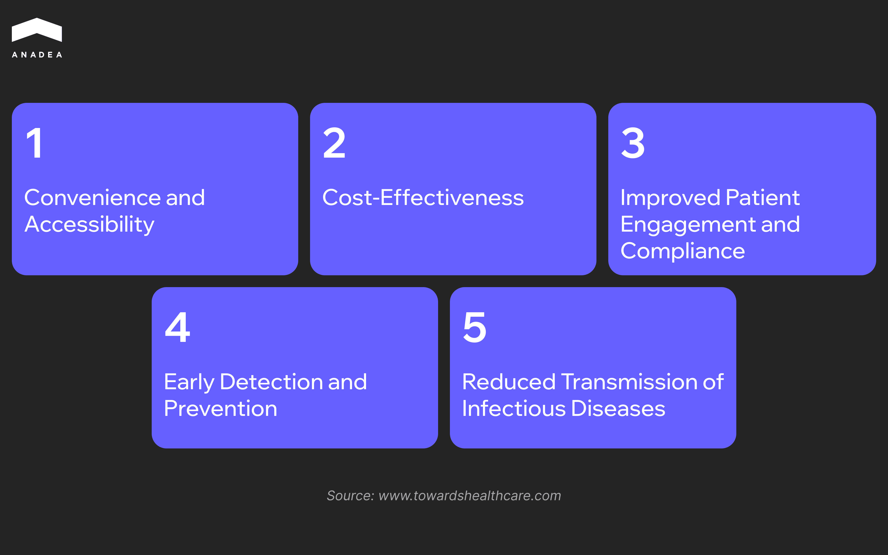
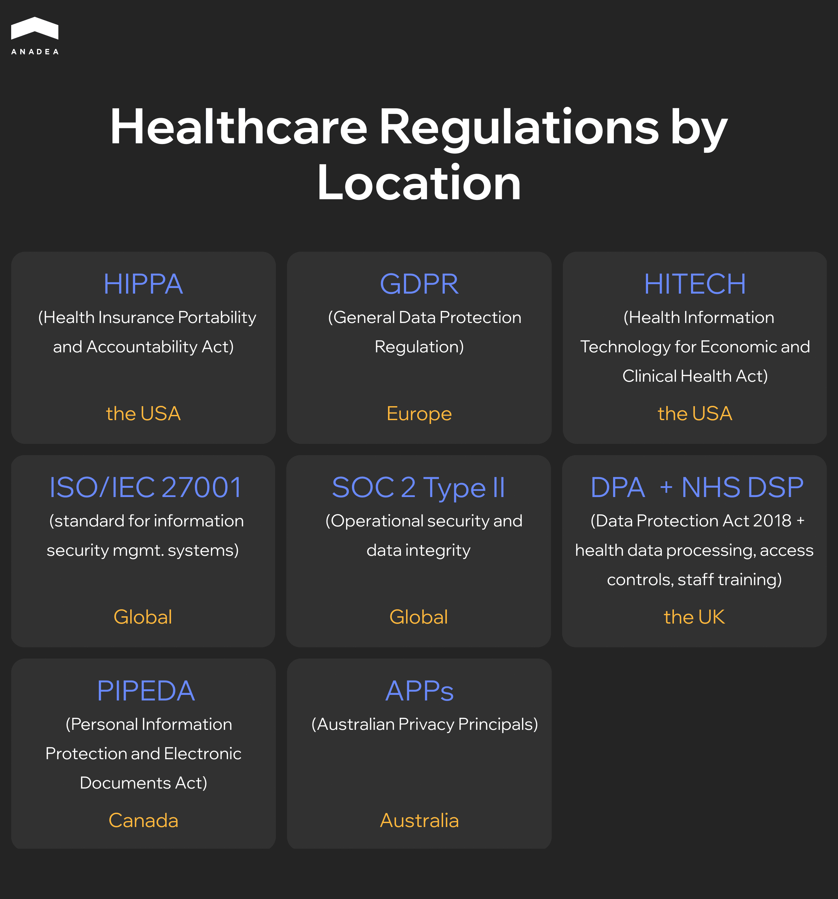

Going to the cloud is one of the top tech trends that we can observe across many industries, including healthcare, in recent years. Around [84% of healthcare organizations worldwide ](https://www.marketdataforecast.com/market-reports/healthcare-cloud-computing-market)are already using cloud services.

SaaS (Software as a Service) is the most popular software delivery model in the market. It accounts for around [61% of the healthcare cloud-based software market share](https://www.mordorintelligence.com/industry-reports/global-healthcare-cloud-computing-market-industry), and this figure clearly demonstrates its dominance over IaaS and PaaS models.

In our article, we are going to talk about the peculiarities of SaaS in healthcare and explain the benefits of this model for both patients and healthcare providers.

##  What Is Healthcare SaaS?

SaaS in healthcare refers to cloud-based software solutions that are delivered over the internet and accessed via a web browser. It means that users do not need to download and further install such apps on their smartphones, tablets, laptops, or PCs. They can get access to such applications and the provided data from any device, from any location, and at any time.

Such solutions are created in accordance with the needs of hospitals, medical centers, and healthcare institutions and may cover aspects like billing, managing patient records, analytics, and many others. They greatly facilitate data exchange and collaboration between different healthcare providers, which is vital for ensuring high-quality medical services.

SaaS in healthcare is already a widely applied model. But what is even more important is that this market is continuously expanding. Analysts are quite optimistic about the future of this sector. Here are some numbers:

The growing adoption of cloud and telehealth solutions, wearable devices, tools for remote patient monitoring, mobile apps for doctors and patients are among the strongest boosters for the SaaS market.

## Benefits of Healthcare SaaS Products

If you still have doubts about whether the launch of a medical SaaS app is a good idea, have a look at the benefits of such solutions:

* **Cost-efficiency.** SaaS operates on a pay-as-you-go or subscription model. This allows organizations to avoid large upfront capital investments. It also helps cut IT overhead as all infrastructure, maintenance, and support-related tasks are performed by SaaS providers.
* **Better collaboration and increased accessibility.** SaaS solutions facilitate cross-platform, real-time access for physicians, labs, insurers, and patients. This improves care coordination and administrative processes.
* **Automatic updates and continuous innovation.** All updates and new features are automatically introduced by the vendor. Thanks to this, users are always on the latest version.
* **Faster deployment.** SaaS solutions require minimal installation and setup.
* **Scalability and flexibility.** SaaS platforms can seamlessly scale up/down with the growing/decreasing number of patients or locations. Moreover, they can support telehealth features, remote access, and multi-location, which is crucial for distributed healthcare systems.



## Key Use Cases of SaaS in Healthcare

Today, SaaS healthcare solutions are used in different domains and for different tasks. Here are the most popular use cases.

### Telemedicine

Apps for online healthcare consultations have been actively gaining popularity since 2020, when the first coronavirus lockdowns began. Though the pandemic is over, the demand for such applications is not going to fall. For example, while in 2023, the telehealth and telemedicine market size was $214.55 billion, in 2025, it is already over $286.22 billion. In 2034, it is expected to reach [$1,046.96 billion](https://www.towardshealthcare.com/insights/telehealth-and-telemedicine-market-sizing). Such rise can be explained with the numerous benefits both telemedicine and telehealth bring:

[Know more about Telemedicine advantages and the real cost for implementation in our article!](https://anadea.info/blog/cost-of-telehealth-implementation/)

One of the main technologies that makes telehealth possible is video streaming. Today, doctors can organize consultations via online chat, phone calls, or video conferences.

**Examples of SaaS tools:** Teladoc Health, Amwell

### Remote Patient Monitoring

The progress made in the sphere of the Internet of Things and the introduction of innovative wearables, biosensors, and smart medical devices are the main contributors to this trend. Now, doctors can continuously track the changes in the vitals and symptoms of patients. Modern systems can automatically inform medical staff if any critical or dangerous changes are detected.

**Examples of SaaS tools:** HealthSnap, Athelas

### ML-powered Medical Data Analytics

Artificial Intelligence and Machine Learning tools have already found their use cases in many industries. In healthcare, they can help to increase the efficiency of treatment. ML can analyze all the symptoms and the history of diseases with high precision and offer the most promising approaches to dealing with them.

**Examples of SaaS tools:** IQVIA Technologies, N1 Health

### E-prescription Issuing

Thanks to the possibility of issuing e-prescriptions via a SaaS healthcare product, doctors can get access to all the previously prescribed medicines. At the same time, for patients and pharmacies, it is easier to interact with an electronic format than with traditional prescriptions on paper.

**Examples of SaaS tools:** DoseSpot, Surescripts

### Billing and Payment Management

Those healthcare providers that offer paid services also need to take care of the security of all the transactions and the convenience of making payments. Medical billing SaaS platforms can be integrated with different payment methods (like card payments, PayPal, Stripe, Apple Pay, or Google Pay). Automatic reporting and tax handling are also among the highly demanded features.

**Examples of SaaS tools:** Kareo Billing, Waystar

### Electronic Health Records (EHR/EMR)

Cloud-based EHR/EMR systems store, manage, and share patient health information in real time across providers and locations. They ensure improved accessibility to patient data via web and mobile apps and make it easier for doctors to get a comprehensive disease history to offer the most efficient treatment.

**Examples of SaaS tools:** eClinicalWorks, DrChrono



### Healthcare CRM

Such platforms help organizations track and personalize patient communications across multiple touchpoints, including appointment reminders, special offers, and marketing campaigns. Their implementation enhances patient engagement, supports marketing automation, and centralizes communication tracking.

**Examples of SaaS tools:** Salesforce Health Cloud, Luma Health

### Process Automation and Workflow Analytics

Software solutions for healthcare can automate repetitive tasks (including reporting, claims, patient onboarding, etc.) and apply advanced analytics to identify inefficiencies and improve care quality. Such solutions can enable real-time dashboards for staff productivity, financial KPIs, and care gaps. They can be also equipped with predictive analytics tools to identify clinical trends, fraud risks, readmission patterns, pain points, and others.

**Examples of SaaS tools:** Health Catalyst, UiPath

## SaaS vs Licensed/On-Premise Healthcare Software

If you haven’t made up your mind on the exact type of healthcare software solution, let’s compare the available options.

### Deployment Speed

As a rule, it takes less time to deploy SaaS solutions using pre-configured environments hosted in the cloud. When you have a SaaS app, you do not need to care about physical installation or infrastructure setup.

The deployment of on-premise software includes server procurement, system setup, and testing. Often, all this results in longer deployment timelines.

### Maintenance Cost

For all maintenance tasks, medical organizations can rely on SaaS providers. They will deal with updates, backups, and security patches. It means that the workload on in-house IT teams, as well as associated costs, will be lower than in the case of on-premise systems.

The use of on-premise healthcare industry software requires ongoing internal resources for updates, bug fixes, and security management. All this adds extra cost.

### Customization and Standardization

SaaS solutions normally offer more limited customization in comparison to on-premises software. This standardization is explained by the need to preserve system stability and ease of updates.

On-premise systems are more customizable and you can easily adapt them to specific workflows or integrate with legacy systems. In this case, you should bear in mind that customization increases complexity and cost.

### Compliance Risks

When you opt for reliable cloud-based healthcare software providers, you can be sure that they will maintain strict compliance with HIPAA and other healthcare regulations, as well as certifications like SOC 2 and ISO 27001.

In the case of on-premise systems, compliance becomes the responsibility of healthcare providers.

### Control and Convenience

Cloud-based medical software services ensure convenience and scalability. But control over infrastructure or update schedules is limited.

On-premise software offers full control over data, servers, and update timing. Nevertheless, this adds responsibility and technical overhead.

In the table below, you can find a brief summary of our comparison.

<table>

<thead>

<tr>

<th>

<strong>Parameter</strong>

</th>

<th>

<strong>SaaS</strong>

</th>

<th>

<strong>On-premises software</strong>

</th>

</tr>

</thead>

<tbody>

<tr>

<td>

Deployment&nbsp;

</td>

<td>

Fast deployment; no infrastructure setup needed

</td>

<td>

Slower; hardware setup and configuration required

</td>

</tr>

<tr>

<td>

Maintenance cost

</td>

<td>

Lower; vendor is responsible for updates, backups, and security

</td>

<td>

Higher; internal IT specialists are responsible for upgrades, patches, and system health

</td>

</tr>

<tr>

<td>

Customization

</td>

<td>

Limited; such software typically supports standard workflows

</td>

<td>

High; this software can be fully tailored to complex processes

</td>

</tr>

<tr>

<td>

Compliance risks

</td>

<td>

Lower; vendors maintain compliance certifications

</td>

<td>

Higher; healthcare providers bear full responsibility

</td>

</tr>

<tr>

<td>

Control

</td>

<td>

Less control over data storage and update scheduling

</td>

<td>

Full control over servers, data, and configurations

</td>

</tr>

</tbody>

</table>

## Security and Compliance in Healthcare SaaS

Security and compliance should be among the top priorities for software vendors, especially in such highly-regulated industries as healthcare. It’s time to take a closer look at them.

### Why Compliance Matters

1. **Patient data protection.** Sensitive health information must be properly protected against leaks and misuse.
2. **Reduced legal and financial risks.** Violations of regulations can result in multi-million dollar fines and serious reputational damage.
3. **Trust.** Compliance helps make sure that sensitive data is handled ethically and securely.
4. **Interoperability.** Such standards as HL7 and FHIR allow systems to interact seamlessly and exchange information in an efficient and safe manner.

### Key Compliance Standards for Healthcare SaaS

####  HIPAA (Health Insurance Portability and Accountability Act)

This act, which was signed into law in 1996, applied to US-based healthcare entities and their technology partners. [HIPAA](https://www.hhs.gov/hipaa/index.html) establishes national standards for privacy and security of patient data (how it must be used, disclosed, and protected), as well as breach notifications (when and how organizations must report security incidents).

Apart from this, it assigns legal accountability to healthcare entities and their partners that deal with sensitive patient data.

#### GDPR (General Data Protection Regulation)

[GDPR](https://eur-lex.europa.eu/eli/reg/2016/679/oj/eng) applies to any entity processing EU citizens’ data. Even if this entity is based outside the EU, this regulation still works. According to GDPR, SaaS vendors are obliged to obtain users’ explicit consent for data collection and processing and support data subject rights, including access, correction, and deletion.

It also requires privacy built into the application from the start. SaaS platforms must include features like pseudonymization, encryption, access controls, audit logs, etc.

#### HL7 (Health Level Seven International)

Health Level Seven International is a non-profit organization that develops global standards for electronic health data exchange and interoperability.

For example, HL7 v2 is the most widely adopted messaging standard in healthcare solutions, and it is commonly used for lab systems, scheduling, and billing.

#### FHIR (Fast Healthcare Interoperability Resources)

A modern API-based standard [FHIR](https://fhir.org/) is created by HL7. It simplifies interoperability, mobile access, and patient portal integration.

Let’s have a look at other standards that healthcare organizations in different countries must comply with:

## What SaaS Vendors Must Ensure

1. **Data security.** It’s vital to take care of encryption, firewalls, vulnerability detection, and DDoS protection.
2. **Auditability.** Detailed logs of access activity will greatly facilitate security audits that should be conducted on a regular basis.
3. **Incident response.** SaaS vendors should have a clear plan on how to act on possible incidents.
4. **Access control.** Role-based access, multi-factor authentication, and session monitoring are among the key elements.
5. **Compliance documentation.** SaaS vendors are responsible for up-to-date policies, audit trails, and certifications.
6. **Interoperability standards.** HL7/FHIR APIs, EHR connectors, and standardized data formats will simplify the process of integrating SaaS software with other systems.

## How to Hire Healthcare Developers with SaaS Expertise?

Hiring in-house SaaS developers will incur larger costs for recruiting, onboarding, and further training. Alternatively, you can establish cooperation with external specialists having relevant skills. A software development company, like Anadea, can build a healthcare SaaS product based on your needs.

To check the company’s readiness for your project, explore whether it fills the shoes with:

* Experience of the team,
* Terms of cooperation and the offered engagement models,
* Portfolio of the company,
* Comments and reviews written by the company’s customers on external platforms.

Anadea’s portfolio includes a wide range of successfully delivered SaaS projects for various domains. [Healthcare](https://anadea.info/solutions/medical-app-development) is one of them. 

**Case in point:** Our developers worked on the creation of [Gogoof](https://anadea.info/projects/gogoof), the multi-tenant software platform for medical teams. This solution provides medical professionals with convenient tools for scheduling appointments with patients. Gogoof has functionality for facilitating real-time patient data tracking and scheduling automation. The chosen cloud architecture ensures the 24/7 platform availability and allows doctors to connect to patients from any corner of the world.

## Closing Line

The demand for cloud-based solutions for the healthcare industry is high these days. A lot of modern healthcare SaaS examples demonstrate that the launch of such solutions can become a successful business idea.

If you are thinking about [building a SaaS product](https://anadea.info/services/saas-development) and are looking for a reliable development team to help you, consider partnering with Anadea. Share your project requirements and [get a free quote](https://anadea.info/free-project-estimate)!
