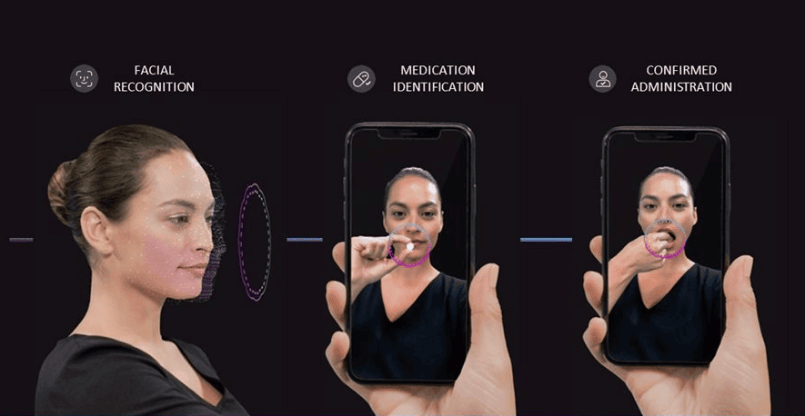

Going to the cloud is one of the top tech trends that we have observed across many industries, including healthcare, in recent years. And SaaS (<a href="https://anadea.info/services/saas-development" target="_blank">Software as a Service</a>) is the most widely used software delivery model. SaaS healthcare applications have numerous advantages that both patients and doctors can leverage. However, to develop high-quality healthcare SaaS products, a project team should deeply understand the specificity of such solutions and have relevant tech skills. Thanks to our rich practical experience in <a href="https://anadea.info/solutions/medical-app-development" target="_blank">medical app development</a>, we've managed to accumulate valuable knowledge on how to create products that fully meet the market needs.

In this article, we'd like to talk about the peculiarities of such solutions, their benefits, and approaches to their development, as well as consider the examples of the top healthcare SaaS companies.

## What is a healthcare SaaS?

In a very broad mining, SaaS is a cloud-based delivery of software apps. It means that users do not need to download and further install such apps on their smartphones, tablets, laptops, or PCs. They can get access to such applications and the provided data from any device, from any location, and at any time. The main condition that should be fulfilled in this case is the necessity to be connected to the internet.

When we are talking about healthcare SaaS products, we refer to cloud-based apps that are related to healthcare services or medical processes. They are created in accordance with the needs of hospitals, medical centers, and healthcare institutions and may cover such aspects as billing, managing patient records, analytics, etc. They also greatly facilitate data exchange and collaboration between different healthcare providers which is vital for ensuring high quality of medical services.

As a rule, SaaS healthcare products are provided based on a subscription model. It means that users pay vendors a fixed amount once a month or once a year following the chosen plan.

## Healthcare SaaS market overview

SaaS in healthcare is already a widely applied model. But what is even more important is that this market is continuously expanding. Analysts are quite <a href="https://www.precedenceresearch.com/healthcare-software-as-a-service-market" target="_blank">optimistic</a> about the future of this sector. In 2022, the global medical SaaS industry achieved a size of $28.66 billion. By 2032, the healthcare SaaS market size is projected to hit the level of $77.43 billion. It means that the expected CAGR for the period from 2023 to 2032 will be over 10%.

In 2022, 70% of healthcare software solutions used by medical organizations were cloud-based while 30% remained to be on-premises products.

The growing adoption of telehealth solutions, wearable devices, tools for remote patient monitoring, CRM platforms, and ERP systems can be named among the strongest boosters for the SaaS market.

Discuss your idea

## Top healthcare SaaS companies

To our customers who want to start a healthcare SaaS business, we always recommend analyzing the best healthcare SaaS examples. And here is our list of strong SaaS market players.

### Zocdoc

Zocdoc is a US-based company that started its business journey in 2007. It offers a mobile app powered by a SaaS platform that helps to ensure connection between patients and doctors. People can use this solution to look for the required specialists and schedule in-person and online appointments.

Patients do not need to pay for booking consultations via Zocdoc. However, healthcare providers who want to partner with the platform have to pay a subscription fee.

### Nomad Health

Initially, the platform was launched as a marketplace for clinical jobs to address the staff shortage in US hospitals and medical centers. Today it is a wide network for doctors and medical staff who want to find either permanent or freelance positions. Thanks to this solution, companies and candidates can build direct interaction and successfully digitize all the related processes.

The project was founded in 2015 and since then it has managed to attract quite impressive support from investors. In total, the [raised funds](https://www.crunchbase.com/search/funding_rounds/field/organizations/funding_total/nomad-health) equal to around $16 million. Currently, Nomad Health has extended its operations to 50 states.

### AiCure

It is an advanced data analytics and AI company that was founded in 2010. The main goal behind its creation was to revolutionize patient monitoring. The company's platform lets biotech and pharmaceutical firms remotely collect and process healthcare-related data. The platform uses digital biomarkers and predictive analytics to identify risks related to taking particular medicines, understand drug response, and get insights that previously used to be available only after face-to-face monitoring.

Build my healthcare SaaS

## Benefits of healthcare SaaS products

If you still have doubts about whether the launch of a medical SaaS solution is a good idea, we offer you to have a look at the benefits that it can bring to all the participants of the healthcare industry.

- Improved data management;
- Real-time data exchange;
- Increased accessibility;
- Cost-efficiency;
- Customization;
- Data safety and back-ups;
- Better collaboration.

The majority of these benefits are explained by the nature of cloud computing and the peculiarities of services provided by SaaS vendors. For example, when we are talking about cost-efficiency we are referring to the lowered costs associated with the use of cloud-based solutions. Healthcare providers do not need to buy and maintain on-premises hardware and can pay only for the services and resources that they really need.

Request for proposal

## Latest trends in healthcare SaaS development

It is always very interesting to observe how the introduction and adoption of the most innovative technologies influence software development trends. The healthcare industry and software products built for it are also experiencing a phase of active transformation. The solutions are gradually becoming more feature-rich and powerful. As a result, they can fulfill more crucial tasks and demonstrate better results.

We've analyzed the ongoing situation in the market and defined the top 5 healthcare SaaS [development trends](https://anadea.info/blog/the-future-of-health-innovative-trends-in-medical-software-development-2019).

1. **Telemedicine solutions.** Apps for getting healthcare consultations in a fully remote format have been actively gaining popularity since 2020 when the first coronavirus lockdowns began. Though the pandemic is over, the demand for such applications is not going to fall. One of the main technologies that make it possible is video streaming. Today doctors can organize consultations via online chat, phone calls, or video conferences.

2. **IoT-powered solutions for remote patient monitoring.** The progress made in the sphere of the Internet of Things and the introduction of innovative wearables and medical devices are the main contributors to this trend. Now doctors can continuously track the changes in the vitals and symptoms of patients. Modern systems can even automatically inform medical staff if any critical or dangerous changes are detected.

3. **ML-powered analytics.** Artificial Intelligence and Machine learning tools have already found their use cases in many industries. In healthcare, they can help to increase the efficiency of treatment. ML can analyze all the symptoms and the history of diseases with high precision and offer the most promising approaches to dealing with them.

4. **Patient engagement.** Though today the majority of healthcare SaaS solutions are built for medical service providers, patient engagement is gradually becoming an important element of such products. Thanks to such functionality, patients can get access to their appointments, medical records, and other important information. Access is usually provided via web portals or medical apps.

5. **Vertical SaaS.** Some years ago, the market offered mainly horizontal SaaS products (or solutions that could be used practically in any industry). Today the interest of users has shifted to vertical SaaS solutions that are targeted at a single industry or sector, like healthcare. Such solutions better address the needs of end-users and are more cost-effective as users do not need to pay for the functionality that is not relevant in their case.

Get a consultation

## How to develop a SaaS healthcare product?

The process of healthcare SaaS development typically includes a row of stages and each of them has its tasks. It's impossible to define which stage has the highest importance as each of them has its goals. And only all together they can help you achieve the desired results.

### Stage 1. Planning and ideation

To begin with, you should get a good understanding of the specificity of the product that you are going to build, its functionality, target audience., etc. For inspiration, you can analyze the examples of the top healthcare SaaS companies and their products. To make sure that your future solution will bring real value, you can communicate with its potential users to find out what tools they want to have.

### Stage 2. Analysis of regulatory requirements

When you are building a SaaS for healthcare, always study all the rules and laws that regulate the questions of data protection and privacy in the chosen jurisdiction. For example, in the EU, it is obligatory to make sure that your app will meet the requirements of the GDPR (General Data Protection Regulation) while in the US, the most important privacy and security regulation is the CCPA (California Consumer Privacy Act).

### Stage 3. Establishing cooperation with developers and discussing your tech requirements

You need to find a good team of developers who will be able to cope with your task. We will provide some tips on how to do it further in this blog post. You also need to discuss all your expectations and demands with your team. Namely, based on the provided requirements, they will estimate the development cost and set timeframes. If you want to understand how the project cost is typically calculated, please follow [this link](https://anadea.info/guides/healthcare-app-development-cost).

### Stage 4. Development

It is a central stage of the project realization process. It includes coding and designing efforts that are aimed at transforming all the ideas into a real product.

### Stage 5. Testing

When you are creating a software solution, it is necessary to pay enough attention to testing and quality assurance. Our team always conducts different types of tests to make sure that the risk of bugs will be minimized.

### Stage 6. Deployment and post-launch maintenance

When the solution is ready, you can launch it and proceed to the step of user training. Moreover, do not forget to monitor the functioning of your solution with a view to timely addressing any possible vulnerabilities.

On our blog, we've already provided our practical recommendations on how to build a healthcare CRM system. That's why if you are planning to launch such a product, it will be helpful for you to read this [article](https://anadea.info/blog/healthcare-crm-development).

Hire SaaS developers

## How to transform your healthcare software solution into SaaS?

Migration of on-premises data and systems to the cloud is a very highly demanded service today. Given all the benefits that cloud computing can offer, it is absolutely clear why so many companies across various industries make such a decision.

If you are also thinking about moving your solutions to the SaaS model, we have a few recommendations for you.

### Choose the most appropriate architecture

You have two options. It can be either a single-tenant SaaS or a multi-tenant SaaS. In the first case, your database, app, and supporting infrastructure will be isolated from other users on the cloud platform. In the second case, your data will be isolated but datasets, computing resources, and software instances will be shared with other users. Though this model may presuppose more security vulnerabilities and fewer customization options, it requires less investments in comparison with a single-tenant SaaS architecture. Single-tenant architectures often become a choice for huge hospital chains that have resources for controlling their IT environments fully on their own.

### Choose a cloud platform

Today the range of on-demand cloud computing platforms is rather wide. The most popular among them are AWS, Google Cloud, Microsoft Azure, and Oracle Cloud. They all are known for the high quality of their services. However, their offers are different, as well as their pricing policies. That's why you can analyze several variants to find the one that will correspond to your requirements the most.

### Plan the migration process and start with an MVP

You should understand that migration to the cloud always presupposes the introduction of serious changes. If something goes wrong, the risks of losing data or breaking some functionality are rather high. That's why your team should develop a good migration plan that will cover all potential risks and the ways to address them. Moreover, we recommended you build a minimal viable product (MVP) with a limited set of features to gather the opinions of end-users. Based on their feedback, you will be able to adjust your cloud product to their needs.

Get started

## Features of medical SaaS platforms

When you are planning to build your own healthcare SaaS product, regardless of its exact type, you need to clearly understand what tasks it will solve and what features it will offer. Of course, to achieve success with your project, you need to provide something special and unique to end users, something that will make your SaaS for healthcare stay out of the row. Nevertheless, there is also a range of features that are essential for many solutions from this category.

- **Patient data management.** A lot of medical centers and hospitals rely on software portals that allow them to store and manage all the most important data related to their patients. You can offer features for adding, editing, viewing, and exporting such documents as medical records, treatment histories, and prescriptions. As a result, you will not only streamline and facilitate workflow for hospitals but also increase the quality of medical services.

- **E-prescription issuing**. This feature will bring significant benefits not only to patients but also to doctors and pharmacies. Thanks to the possibility of issuing e-prescriptions via a SaaS healthcare product, doctors can get access to all the previously prescribed medicines. At the same time, for patients and pharmacies, it is easier to interact with an electronic format than with traditional prescriptions on paper.

- **Hospital analytics**. You can enrich your medical SaaS platforms with tools for analyzing workflows at hospitals and medical centers. You can make it possible to monitor the changes in the number of patients and visitors, the working hours of each doctor and nurse, inventory, etc. Based on the results of analytics, administrators and managers will be able to make more valuable and helpful decisions.

- **Billing and payment management.** Those healthcare providers that offer paid services also need to take care of the security of all the transactions and the convenience of making payments. Medical SaaS platforms can be also enriched with the relevant functionality. You can ask your development team to integrate different payment methods (like card payments, PayPal, Stripe, Apple Pay, or Google Pay). It will be also a good idea to introduce automatic reporting and tax handling.

- **Connectivity with biosensors and smart medical devices**. With the growing demand for remote patient monitoring, more and more hospitals implement IoT solutions in their work. In this case, a healthcare SaaS platform should have features for collecting, storing, and analyzing the received data.

Create my SaaS

## How to hire healthcare developers with SaaS expertise?

To be confident in the quality and reliability of a medical SaaS product that you are planning to launch, you need to have seasoned developers by your side. For these people, it won't be enough just to be good at coding. They need to deeply understand how to make the SaaS for healthcare fully compliant with all the rules and laws that are in force in the chosen jurisdictions.

Moreover, the gained expertise in this domain will help programmers create feature-rich solutions that will be easy to use, secure, and reliable.

Today if you run a healthcare SaaS company, it is not obligatory for you to hire in-house developers. You can establish cooperation with external specialists with relevant skills. Though for some tasks, it will be a feasible idea to work with freelancers, it may be not the best choice in this case. We recommend you consider an option to find a software development company, like Anadea, that will build a healthcare SaaS product based on your needs.

For choosing a company that you will work with, you should analyze such parameters as:

- experience of the team;
- terms of cooperation and the offered engagement models;
- portfolio of the company;
- comments and reviews written by the company's customers on external platforms.

As soon as you find the best partner to work on your project, you will be asked to provide all your requirements and project documentation (if any). The development team will elaborate a roadmap and timelines for your project and if you approve them, the work will begin.

It will be also very important to find out whether the chosen team will be able to provide post-launch support and software maintenance services (of course, if you do not have in-house specialists who will be responsible for this).

Given the specificity of healthcare SaaS products, it is vital to continuously monitor their performance to have the possibility to detect and further eliminate all the vulnerabilities as soon as possible.

Moreover, the market for healthcare solutions is very dynamic. It means that requirements, standards, and trends that define the expectations of users are changing rather quickly. To make sure that your solution can solve all the set tasks, you need to regularly update it. And here's when the help of developers will be required as well.

Contact healthcare developers

## Closing word

The demand for cloud-based solutions for the healthcare industry is stably high these days. And there are no signs that can indicate that it will get lower in the near future. A lot of modern healthcare SaaS examples brightly demonstrate that the launch of such solutions can become a successful business idea.

If you are thinking about building a SaaS product and are looking for a reliable development team to help you, you should know that at Anadea, we will be always ready to provide our services. With our experience in healthcare app development, we will cope with tasks of any complexity. Share your project requirements and get a free quote!

Contact us
