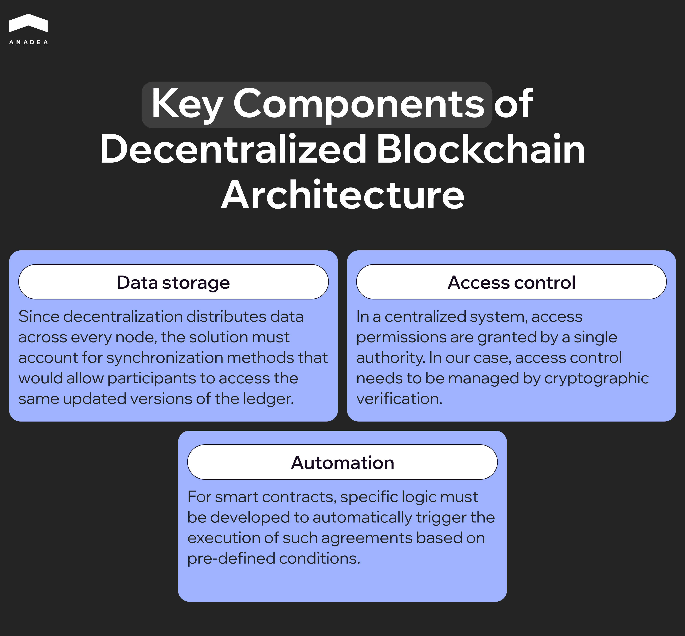
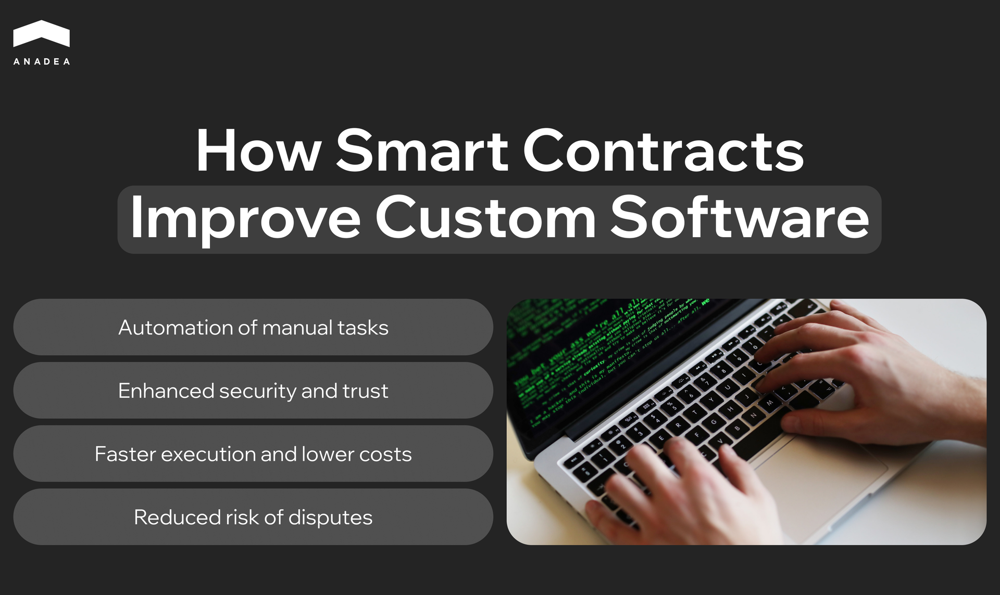
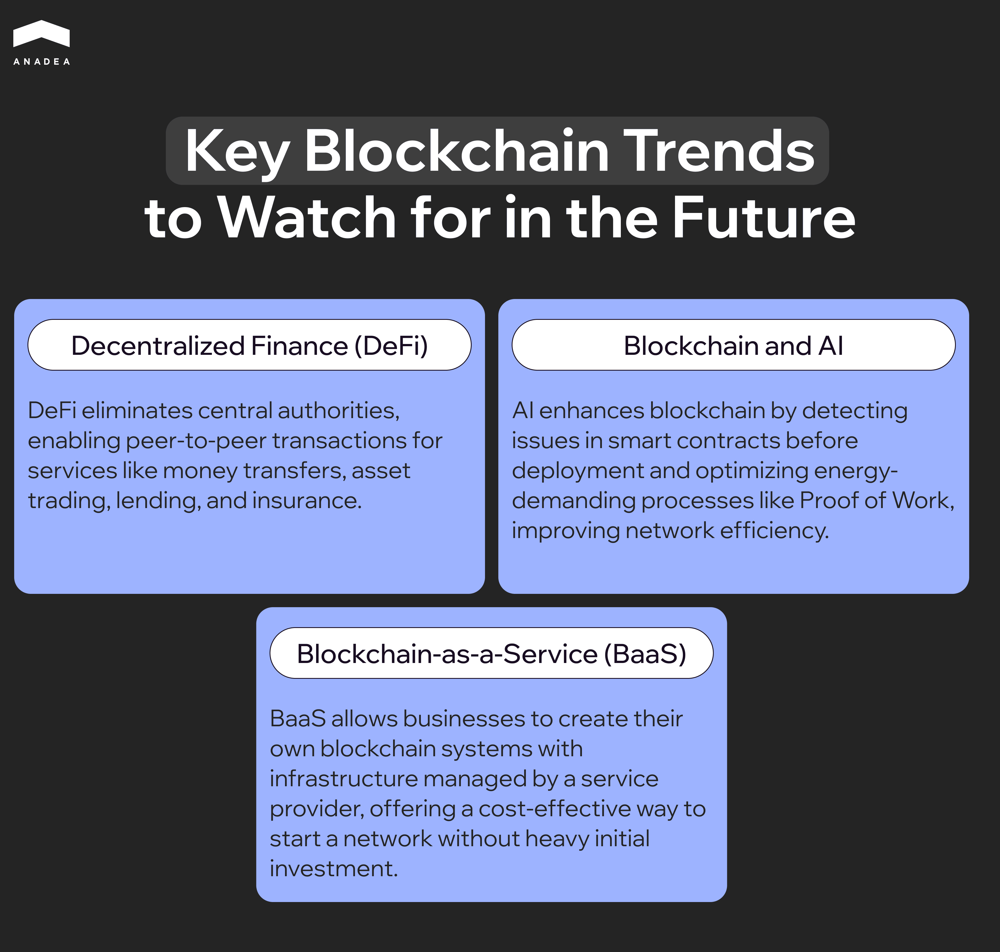

The arrival of blockchain technology has redefined how businesses across a multitude of sectors view security, privacy, and data management. While some entrepreneurs still have reservations, others are pushing the boundaries of the opportunities such solutions offer. It’s important to grasp how bespoke software powered by blockchain transforms the industry to avoid staying on the sidelines of this innovation.

In this article, we are going to explain the fundamental principles of this technology, how it shapes the future of custom software development, and what your business can gain from implementing it.

## What Is Blockchain and How It Transforms Custom Software Development

Before we can dive deeper into this topic, we have to get on the same page about what blockchain actually is. Essentially, data is recorded and stored on so-called blocks that are immutable, which means they can’t be altered. Each subsequent block of information is connected via cryptographic hashes, which form what we call a blockchain.

This type of ledger system creates a distributed database where each participant has access to the blockchain, eliminating the need for third-party involvement. Access to the database can be shared across multiple computers, given that the parties are authorized.

Since the first blockchain was introduced in 2009, this technology has seen ups and downs in interest throughout the years, which is typical for emerging solutions. As of 2023, around [15%](https://www.statista.com/statistics/661164/worldwide-cio-survey-operational-priorities/) of leading digital organizations have actively considered adopting blockchain into their operations.

The versatile nature of this tech allows implementation in various sectors: finance, healthcare, supply chain management, real estate, and more. Providers of [custom software development services](https://anadea.info/services/custom-software-development) recognize the distinct opportunities a distributed ledger system can bring to the table, transforming how clients view bespoke software.

Blockchain is capable of solving unique business challenges and tailoring solutions to individual goals where security and transparency are at the forefront. So, how exactly does this technology pioneer safety within custom-made software? Let’s dig a little deeper.

## The Role of Blockchain in Enhancing Security in Custom Software Solutions

Cybersecurity is a growing concern as digitalization sweeps the industries. IBM reports that the global average cost of a data breach in 2024 was [$4.88 million](https://www.ibm.com/reports/data-breach), which is a 10% increase from the previous year. This highlights the sheer vitality of prioritizing safety in software, pushing business owners to find more tamper-proof solutions.

As for blockchain, the two main pillars that support its security are decentralization and immutability. Here’s what those terms mean:

### Decentralization

Unlike traditional centralized systems, where one authority (such as a server or individual) controls the entire system, decentralization distributes control among participants or nodes. This means the data is spread across all involved networks, instead of being located in one place.

Centralized systems are more prone to a single point of failure. In other words, if the control point is compromised, the system can be at risk entirely. Decentralization mitigates those risks since, in the event of breaching one node, the system can continue functioning properly. This makes the possibility of compromising the entire blockchain extremely difficult.

### Immutability

Every piece of information within a block is encrypted with a hash value, which is a generated alphanumeric string. This string acts as an individual identification of any given data and it cannot be altered or deleted once it is recorded.

The hash value is included in the previous and next blocks, which essentially forms a chain. What this means is that an attempt to alter one block will lead to the modification of hash in other blocks, ultimately breaking the chain. Luckily, the decentralized nature of the blockchain makes such an event practically impossible, as the changes have to be agreed upon by at least 51% of the nodes in the network. 

Another feature enabled by and executed on the blockchain is *smart contracts*. These are digital contracts with pre-defined conditions written into their code. Once the conditions are met, they are automatically executed without the need for intermediaries. Smart contracts are also immutable and permanently stored on a decentralized ledger.

The value these standout blockchain security features bring to software solutions is hard to overlook. As of 2021, the leading use case of this technology for companies lies in secure information exchange, as reported by [45%](https://www.statista.com/statistics/878732/worldwide-use-cases-blockchain-technology/) of respondents. Of course, we have only scratched the surface of the underlying safety of blockchain and we will continue expanding on it as we move through the article.

## Blockchain Services for Custom Software: Key Benefits and Applications

Now that we have touched on the basics of how blockchain works, it’s time to put into perspective how such software can benefit various businesses and respond to their industry-specific needs. Below, we are going to explore the most prominent advantages of this tech and their practical applications.

### Unparalleled Security and Privacy

A customized blockchain software solution remarkably surpassed the capabilities and extent of security of generic solutions. If your business handles sensitive data, the immutable nature of this tech protects information from being tampered with. Anonymization of data further fuels privacy and warrants that no unauthorized parties are able to view what you recorded.

**Application:** The healthcare industry can greatly benefit from implementing blockchain in order to secure private patient information, such as electronic medical records or pharmaceutical prescriptions. It propels an innovative way of safely exchanging medical history between the patient and the healthcare provider without the risk of data breaches.

### Improved Transparency

Since every participant in the network has access to a distributed database that is verified by each node and protected, the possibility of fraud is virtually diminished. Such visibility of records and their traceability can build trust between the stakeholders and business owners, especially in sectors, where forgery is widespread.

**Application:** Financial and banking institutions are the most common applicants for blockchain development services since they can create personalized systems that address issues with transparency. Custom solutions that are decentralized and immutable can help combat the increasing risk of fraudulent activities associated with fintech.

### Greater Automation and Efficiency

The lack of third-party intermediaries, paper-heavy work, and time-consuming approvals from centralized authorities make operations on the blockchain outstandingly efficient. On top of that, automation driven by agreements like smart contracts significantly reduces the rate of human error and redundancy without compromising security and verification.

**Application:** Reducing error and streamlining supply chain management is how retailers can reap the benefits of a more efficient operational process and inventory management. The ability to quickly trace the product to its origin or the customer can support an often overloaded system. This further fosters resilience in case of supply chain disruptions.

## Decentralized Systems: How Blockchain is Changing the Architecture of Custom Software

By now, you should have a basic understanding of what decentralization means and its impact on the security of custom solutions. Nonetheless, we want to expand on this topic more, explaining how decentralized systems affect the core architecture of software.

Decentralization in blockchain is powered by distributed ledger technology (DLT), which shares access to the database across multiple participants or nodes. Data is synchronized for every node in the network, meaning each participant can view an up-to-date copy of the transaction history.

A peer-to-peer (P2P) network is also integral to how a decentralized system works. As we mentioned before, DLT does not require any third-party intermediaries or supervision. The result is that every participant can directly request data from another node or provide it upon request. This enables faster exchanges and transfers without latency, as well as eliminates a single point of failure.

There is another piece of the puzzle to decentralization which is called a consensus mechanism, but we will get to it in the next section. For now, what you’ll learn through blockchain consulting services is how the architecture of custom software changes with this approach. Here are the three main points:

* **Data storage.** Since decentralization distributes data across every node, the solution must account for synchronization methods that would allow participants to access the same updated versions of the ledger. This makes it a unique approach compared to storing data on a single server.
* **Access control.** In a centralized system, access permissions are granted by a single authority. In our case, access control needs to be managed by cryptographic verification. This is typically done by issuing and verifying personalized keys that prove the identity of the user.
* **Automation.** For smart contracts, specific logic must be developed to automatically trigger the execution of such agreements based on pre-defined conditions. Fail-safes must also be put in place to ensure immutability as contracts are irreversible once executed.

These differences demonstrate how much the architecture of custom blockchain solutions is inherently distinct from traditional software development.

## Improving Transparency and Trust with Blockchain in Custom Software Development

With what you have learned so far, it’s becoming pretty obvious how a blockchain solution can build trust between customers and stakeholders. However, a paradoxical outcome of such software is that it nurtures a trustless environment. While that sounds counterintuitive, it’s actually the best resolution.

Essentially, it means that participants don’t necessarily need to trust each other to conduct fair operations. Instead, your confidence lies in a system that promotes equality between the parties, immutability, and security. Since blockchain eliminates a governing entity, you put your faith in unbiased software that maintains the integrity of business procedures.

An underlying mechanism that makes transparency within blockchain possible is consensus protocols. These are protocols that ensure every node in the network agrees to take certain actions within a ledger, such as verifying and validating data. Such a mechanism is especially valuable to guaranteeing safety in areas like [fintech software development](https://anadea.info/solutions/fintech-software-development).

Although there are several consensus mechanisms, the two most vital ones in blockchain are Proof of Work (PoW) and Proof of Stake (PoS). Let’s take a closer look at each of them.

### Proof of Work (PoW)

This is the most widespread type of consensus mechanism. It involves a large number of nodes solving a mathematical puzzle in order to add the block to the chain. The first node to reach a solution makes it public and other nodes verify the conclusion. As a result, the participant who solves the puzzle receives a reward.

An approach like this is thought to be highly secure and decentralized, nurturing engagement and verification.

### Proof of Stake (PoS)

A less energy-consuming alternative to PoW, this method involves participants staking a designated amount of the system’s coins, which become frozen for the time being. Nodes then begin validating blocks until a consensus is reached about which blocks are added to the chain.

While this method is not as unbiased as PoW, it provides an incentive for participants to reach a mutually agreed-upon conclusion.

Through custom software development services, such mechanisms can be implemented into a solution. A noteworthy mention is that other alternative protocols exist, like Proof of Authority (PoA) or Proof of History (PoH) that may be more suitable to your particular business objectives.

## Smart Contracts: Revolutionizing Business Logic in Custom Software

Smart contracts are undeniably a major appeal of blockchain technology, driving the forefront of innovation with their flexibility and efficiency. These are self-executing agreements that work on an “if-then” logic. Meaning, that if the condition has been met, then an operation has been executed.

For example, if a property has been purchased, then funds are subsequently released to the appropriate party based on the terms of a contract. This kind of logic can be applied to a multitude of processes involving transactions or exchanges, which makes smart contracts highly versatile in a variety of sectors.

The unique thing about this tech is that conditions are written into the code of a contract, allowing execution to be fully automated without involving any middlemen like banking institutions to process payments. Since smart contracts are enabled on the blockchain, they are immutable once recorded. This strengthens its security and allows every participant to verify the validity of the operation.

The creation and integration of smart contracts as part of blockchain development services have seen a major rise in interest due to the possibilities they offer for businesses. To put it into perspective, their market size was valued at [$684.3 million](https://www.grandviewresearch.com/industry-analysis/smart-contracts-market-report) in 2022 with a projected growth of a staggering 82.2% from 2023 to 2030.

So, how do smart contracts enhance custom software?

* A major portion of manual labor is automated, freeing up the resources for businesses to focus on other prioritized tasks.
* Risks of fraud or contract breach are down to a minimum, fostering unparalleled security and trust.
* Removing central parties speeds up contract enforcement and lowers operational costs like commissions or transaction fees.
* Automatic agreement fulfillment reduces the chances of disputes and human error.

These and other advantages of incorporating smart contracts into business logic make them an increasingly popular choice among corporations. They have found applications in industries like finance, supply chain management, insurance, and much more, and they have the potential to grow in the upcoming years.

## Blockchain for Streamlining Data Management and Privacy in Custom Software

Data management is not just a fancy word, but an integral part of sustaining accountability and transparency. A common misconception is that managing data is only about storage when, in reality, it encompasses practices like extraction, normalization, and analysis of valuable information.

A reputable provider of blockchain consulting services can shed more light on how a custom-made solution can streamline data management for your business. Still, we can highlight some of its properties.

A distributed ledger makes access to data reliable by its very nature. Where centralized systems are prone to security breaches and single points of failure through a central server, a peer-to-peer network enables the distribution of data across multiple nodes. This further propels faster sharing of data between the involved participants.

The tamper-proof qualities of blockchain technology make data security impenetrable. Every piece of information is safeguarded by cryptographic algorithms and cannot be compromised once recorded. Such resilience to modification makes it irreplaceable in areas where data integrity is at risk.

On top of that, the immutability of records takes traceability to a different playfield. Since each block is time- and data-stamped, tracing data to its source and verifying its origins can save a lot of time and effort for management specialists.

It should also be mentioned that concerns about data privacy are substantially alleviated with blockchain solutions. Every bit of information is encrypted using specific protocols and requires specialized keys to decrypt to gain access. Otherwise, data is virtually unintelligible, protecting it from being viewed by unauthorized parties.

Taking these factors into account, it’s easy to see how custom blockchain software can streamline data management and address pressing issues with privacy.



## How Blockchain Services Are Redefining the Supply Chain and Logistics Software

Modern software for supply chain management and logistics operations addresses many issues that put roadblocks in this sector. However, not every problem can be saved by such systems, which is why [blockchain for retailers](https://anadea.info/blog/what-is-in-blockchain-for-retailers/) is transforming how supply corporations conduct business.

In fact, retail giants are already implementing distributed ledgers into their workforce. Below, we will explore how this technology is shaping an improved future for this industry.

### Supply Traceability

With traditional systems, visualizing the entire supply chain can be problematic, especially for corporations with large quantities of goods moving through the chain. Records can be tempered with, lost, or executed incorrectly. A distributed ledger can solve this issue by mapping out the entire supply chain in real-time, offering a transparent look at the journey of products.

Software like that can capture the movement of goods from manufacturers and suppliers to distributors and retailers, building an immutable trace. It’s also a fail-safe for preventing fraud, as products are identified and verified at every location. In cases of defects or contamination of goods, retailers can trace damages back to the source and issue recalls more effectively.

### Smart Contracts Automation

Smart contracts redefine custom software development services for supply chain organizations as they offer a revolutionary level of automation and security which often plagues this industry. As you know by now, these self-executing agreements are an ideal way to eliminate intermediaries and accelerate the verification process for specific transactions.

Beyond that, compliance checks can be automated. For example, if the certification conditions fail to be met, the contract will not be enforced and, therefore, the goods won’t be moved through the chain. Smart agreements also offer dynamic contract adjustments if certain conditions, like price fluctuations, affect the supply chain. Since the terms are written into the code, adjustments won’t take a significant amount of time to approve.

### Dispute Resolution

Disputes are not uncommon in the supply chain sector, arising from issues like supply delays, damages, payment execution, and much more. Considering that records on the blockchain cannot be altered, the process of identifying a party at fault becomes majorly seamless. Participants can overview the legitimate history of transactions and the movement of products on equal terms (as each side has access to an updated version of the ledger) and come to a resolution.

Moreover, smart contracts can also be employed for dispute resolutions, including specific conditions that lead to disagreement and pre-defined actions that can be taken immediately. The most prominent example of leveraging blockchain for dispute resolution is [Walmart Canada](https://hbr.org/2022/01/how-walmart-canada-uses-blockchain-to-solve-supply-chain-challenges), which managed to lower a troublesome 70% of invoice disputes to less than 1%.

## Challenges in Integrating Blockchain into Custom Software Development

Considering that we have unearthed the core principles of how blockchain works and the ways it can advance your business, it may seem that there are no downsides to adopting this tech. But it would not be fair if we only looked at the bright side and ignored real challenges that you are likely to face. Let’s examine closely what potential pitfalls you can encounter during blockchain software development.

### Interoperability and Scalability

Integrating blockchain software into existing systems may pose a significant challenge as distributed ledgers often operate on an individual level. Sharing data between several networks will likely require development professionals to come up with custom solutions to connect the systems and enable interoperability. Generally, this challenge is attributed to a lack of a standardized approach and protocols within the blockchain.

Scalability can also raise questions since ledgers may face bottlenecks as a larger number of blocks are added to the chain. Essentially, the bigger the database, the slower the recording and retrieval of data can become. This pushes software specialists to find innovative ways to scale blockchain solutions to withstand increasing loads of operations.

### High Energy Consumption

The resources required to run procedures like a Proof of Work consensus mechanism pose environmental concerns due to its high energy consumption. This can put a strain on the participants’ hardware and ultimately not be worth the resource spending. However, custom software development services offer more sustainable alternatives to mitigate these worries.

For instance, mechanisms like Proof of Stake and Proof of Authority are considered more energy-friendly, becoming a preferable way for businesses to engage in data verification. Still, the downsides of these alternatives include a less decentralized and unbiased method of verification.

### Regulatory Landscape

As with any new technology, the regulatory landscape is usually slow to follow the advancements, leading to ever-evolving compliances and legal standards. For blockchain software solutions, regulations still don’t fully account for every intricacy, which means the rules might change in the future.

Areas like data protection, enforced by GDPR, and country-specific regulations may hinder the potential of blockchain to operate at its full capacity. Nonetheless, it is worth mentioning that a few large corporations are already actively using this technology. While navigating a fluctuating landscape such as this can be difficult, it’s not impossible.

## The Future of Blockchain and Custom Software Development: Trends to Watch

As Grand View Research reports, the blockchain technology market size was valued at [$17.46 billion](https://www.grandviewresearch.com/industry-analysis/blockchain-technology-market) in 2023 and is projected to grow by 87.7% until 2030. The flexible nature of this tech and the rising demand for security and transparency are the leading factors to the expansion. These numbers indicate that the future of blockchain will see a larger-scale adoption across numerous sectors.

So, which trends should you be on the lookout for in the upcoming years?

### Decentralized Finance (DeFi)

DeFi solutions are bound to transform financial markets, as they remove the central entity and allow for peer-to-peer transactions. These services not only include money transfers but also enable asset trading, lending, buying insurance, and more. Decentralized finance operates on a blockchain and is enforced by smart contracts, which means transactions are frictionless and commission-free.

### Blockchain and AI

The synergy between blockchain and artificial intelligence can address some prominent challenges with distributed ledger technology and enrich its effectiveness. For example, AI can supplement smart contracts by analyzing any issues or errors within the code before the contract is deployed. It can also be leveraged to democratize energy-demanding processes like PoW by adjusting puzzle difficulty and predicting network demand.

### Blockchain-as-a-Service (BaaS)

A similar concept to software-as-a-service (SaaS), BaaS would allow users to create and operate their own blockchain system, while the underlying infrastructure would be supported by the development provider. It’s a more cost- and resource-effective way for clients to start their network without requiring intense initial investment and a support team to maintain the solution.

Overall, the future of custom blockchain software will likely focus on more industry-specific solutions, aimed at addressing unique problems businesses face.

## Conclusion: Embracing Blockchain for a More Secure and Efficient Future in Custom Software Development

Innovation is driven by businesses that are not afraid to embrace it. As blockchain pushes the envelope, the security of custom software is strengthened and the integrity of daily operations is enhanced. Distributed ledgers streamline data management, safe transactions, contract enforcement, and much more, paving the way for efficiency and transparency. While not without its challenges, the adoption of blockchain solutions can yield an unparalleled competitive advantage to corporations of any size.

If you’re interested in building your own custom blockchain software, be sure to [contact us](https://anadea.info/free-project-estimate). At Anadea, we personalize every project to the unique needs of our clients, bringing impactful results. Let’s discuss your requirements and our team of seasoned professionals will help you realize your vision.
