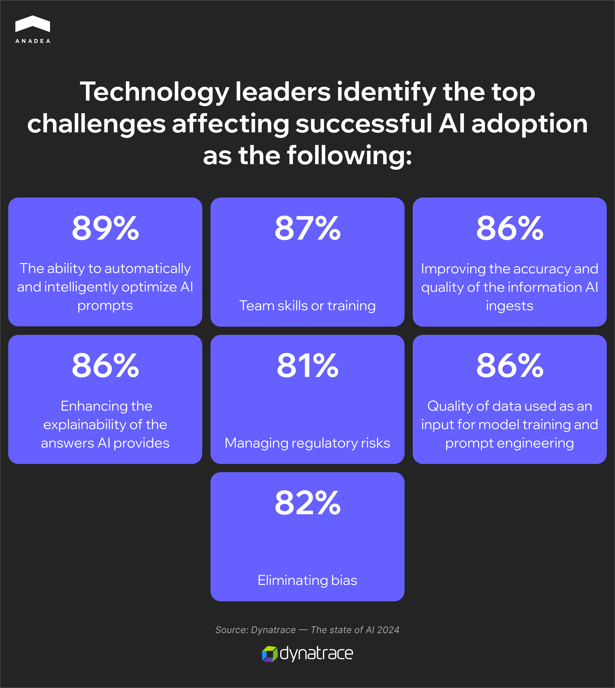
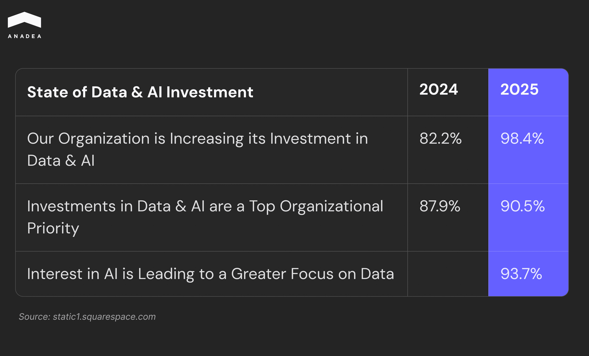

According to a [Gartner study](https://www.gartner.com/en/newsroom/press-releases/2025-02-26-lack-of-ai-ready-data-puts-ai-projects-at-risk), in 2026, 60% of AI projects without AI-ready data will be abandoned by organizations. At the same time, more than 60% of businesses still don’t have a good understanding of the right AI data management. According to another study, over [80% of companies](https://www.businesswire.com/news/home/20250312530068/en/Data-Quality-is-Not-Being-Prioritized-on-AI-Projects-a-Trend-that-96-of-U.S.-Data-Professionals-Say-Could-Lead-to-Widespread-Crises) have issues with the quality of data for AI systems. But the problem is that nearly [85% of AI models fail](https://www.forbes.com/councils/forbestechcouncil/2024/11/15/why-85-of-your-ai-models-may-fail/), namely because of poor data quality. Given the growing role of AI across industries, these figures are alarming. 

Cloud based data management changes the game. It provides the compute power and storage needed for modern AI workloads. In addition, it also enables real-time data pipelines and unified governance. 

In this blog post, we will talk about how cloud technologies enhance AI training and explain why it is so important for organizations today.

## Key Pitfalls on the Path to Successful AI Projects

Businesses of all types show strong interest in AI. There are a lot of promising ideas for AI-powered projects. Yet many of them fail—often due to different factors listed below.

### Low-quality Data

The performance of any AI system greatly depends on the data used for model training. In the perfect scenario, an AI model should be trained on high-quality, comprehensive, and diversified data. Unfortunately, in reality, organizations often have:

* Siloed data stored in different sources
* Incomplete records
* Unstructured formats.

Without proper data management, all this leads to poor model accuracy and limited ability to scale an AI-powered system across various use cases.

### Lack of Data Governance 

Data for AI systems should be well-labeled and compliant. However, today, many teams skip this requirement and ignore the necessity to have formal data governance or annotation protocols. Only around [30% of organizations ](https://www.prnewswire.com/news-releases/dresner-advisory-publishes-2024-data-and-analytics-governance-market-study-302173121.html)have formal data governance in place.

Such a situation can result in unclear data ownership, a lack of version control, and compliance risks.

It’s worth mentioning that today, there is already a positive shift in this aspect of data quality and governance. The 2025 AI & Data Leadership Executive Benchmark Survey by dataIQ showed that investments in data and AI are a top priority for most organizations. 

### Legacy Infrastructure

Some organizations still rely on on-premises servers or outdated systems built a decade or even more ago. The problem is that legacy tech stacks can’t handle modern AI workloads. [67% of companies](https://news.lenovo.com/why-data-and-infrastructure-modernization-underpin-the-ai-revolution/) admit that their legacy systems slow down the adoption of AI tools.

As a result, development teams face limited possibilities for experimentation, prolonged model training, and higher operational and maintenance risks.

### No Alignment with Business Goals

Amid the growing hype around AI-powered systems, some organizations implement AI “just because it is AI”. [64% of CEOs](https://www.cio.com/article/3980164/ais-big-payoff-hinges-on-fixing-fragmented-data-study.html) say that their investments in AI are not always supported by a full understanding of its true value. As a result, the implemented solutions do not always align with their real business goals.

Another issue is that some companies try to pursue too many AI initiatives at once. High-performing organizations concentrate their efforts on an average of 3.5 use cases. In contrast, others attempt to implement around 6.1. This focused approach enables leaders to achieve ROI that is 2.1 times higher than that of less focused organizations.

### Talent Gaps

AI development requires efficient collaboration of cross-functional teams, involving AI researchers, data engineers, domain experts, software developers, QA specialists, etc. 

Quite often, businesses do not have enough professionals with the necessary skills and expertise, as it is not always feasible and easy to hire such in-house experts. 

Nevertheless, the right approach to [AI training and development](https://anadea.info/blog/how-to-create-ai-software/) can significantly mitigate their consequences. For example, the use of cloud platforms can greatly improve the situation. 

Moreover, the talent gap can be addressed by establishing cooperation with a reliable tech partner like Anadea. Our company has access to a wide talent pool. It means that even if you have very specific requirements for your project, we will find the right experts to work on your tasks.

## AI on the Cloud: How Cloud Environments Affect AI Model Development

AI has become a part of many cloud-native apps. And there are several reasons for this:

* Cloud computing supports data-heavy workflows and parallel processing, which are typical for AI-powered systems.
* It enables distributed model training with massive compute capacity.
* Cloud platforms provide access to services and tools that can greatly speed up the delivery cycle.
* Without access to cloud environments, AI implementation would be too expensive and impractical.

To better demonstrate how cloud environments reinforce AI training and deployment, let’s take a closer look at the benefits businesses get.

### Compute Power at Scale

Training complex models such as deep neural networks or large language models requires high-performing computing resources (like GPUs and TPUs). Though it is possible to manage them on-premises, it will be a very costly and time-consuming task.

Cloud platforms become a good choice in this situation. They provide the required flexibility, allow for resources autoscaling, and spin up GPU/TPU clusters instantly based on demand. Paying only for used resources also helps minimize upfront hardware investment costs.

### AI/ML Services

Today, it is especially convenient that major cloud providers offer ready-to-use AI services. Of course, they can’t fully address all the specific needs you may have. But when applied correctly, they greatly save development time and reduce technical debt.

#### What ready-to-use AI services are available today?

* Voice recognition, text-to-speech (Google Cloud Speech, Amazon Polly, Microsoft Azure Speech Services, IBM Watson);
* Recommendation engines (Google Cloud Recommendations AI, Recombee, Luigi's Box);
* Computer vision (Amazon Rekognition, Azure Computer Vision);
* Translation, sentiment analysis, and document summarization (Google Cloud NLP, Amazon Comprehend).



### Comprehensive Toolset for the ML Lifecycle

Cloud ML platforms offer tools that can be helpful at every stage of the AI development process. Amazon SageMaker, Google Vertex AI, and Azure Machine Learning are among the most popular tools used by development teams.

#### Using these tools, you can leverage: 

* Data preprocessing and labeling capabilities;
* Distributed training;
* Model versioning and deployment tools;
* A/B testing;
* Automated monitoring of your model performance and its retraining.

### Centralized Data Ecosystem

The performance of AI solutions depends on the data on which the models are trained. The more comprehensive and diverse datasets you use for training, the more efficient outcomes you get. 

That’s why the choice of cloud solutions should focus on fitting your current infrastructure and supporting a centralized data ecosystem. It should enable data governance and compliance, data access controls, encryption, and audit trails for HIPAA, GDPR, SOC2, and other regulatory frameworks.

These cloud-based solutions can help you achieve those: 

* Data lakes for storing all structured and unstructured data (S3, GCS, Azure Blob Storage);
* Warehouses that accumulate large volumes of data from different sources for processing and reporting (Snowflake, BigQuery, Redshift);
* Streaming tools that support real-time, continuous data pipelines from multiple sources (Kafka, Amazon Kinesis, Google Pub/Sub).

Not only do they bring benefits of improved data quality, but they also ensure the effectiveness of AI solutions within a highly connected and smoothly functioning data ecosystem.  Enhanced Collaboration and Global Accessibility

[AI development](https://anadea.info/services/ai-software-development) is often conducted by distributed teams. However, a lot of tasks require close collaboration between experts, including data scientists, ML engineers, product teams, and stakeholders.

That’s exactly what cloud environments can ensure. With their help, teams can build, implement, and monitor models in real-time from any corner of the world.

Cloud-based shared notebooks, team dashboards, monitoring tools, and role-based access control features greatly contribute to this.

### Flexibility

The pay-as-you-go model typical for cloud environments is only one of the available possibilities to experiment with AI without allocating huge budgets for such projects. Some cloud platforms also provide such opportunities as:

* Spot instances with discounted prices for non-time-sensitive workloads;
* Reserved instances offering lower prices for predictable usage patterns;
* Serverless options for running inference models without provisioning servers.

Those businesses that do not want to depend entirely on one cloud provider can choose among these cloud models:

* **A hybrid cloud** allows teams to balance sensitive workloads on-prem and scalable workloads in the cloud.
* **Multi-cloud** helps to avoid vendor lock-in. By using the services of different providers, you can leverage best-in-class tools across their offers.

## Efficient Data Management and Analysis as a Success Factor for AI

At Anadea, we have rich experience working with advanced AI models. This helped us find the best practices for AI data management that we will share below.

### Clean and Structure Your Data

To eliminate data silos and make your data easier to work with, it is necessary to standardize data schemas and naming conventions.

Another important step is the application of modern data observability tools. For instance, you can consider such options as Monte Carlo, Dynatrace, Datadig, Grafana, etc. 

They will help you monitor data accuracy, usefulness, and consistency.

### Centralize Data Access

To reduce the heterogeneity of data, choose a cloud-based data storage that ensures centralized access to data. It means that it should become a single source of truth for every involved party, collecting data from all possible data sources. 

In the long run, it would result in better insights, faster reporting, enhanced data governance, and seamless integration with analytics and AI tools. Depending on your data and business needs, you can opt for a cloud data warehouse, data lake, lakehouse, or real-time pipeline.

**Cloud data warehouses** should be chosen for structured, analytics-heavy workloads and reporting. For instance, you can consider **Amazon Redshift**, **Google BigQuery**, or **Snowflake**.

AWS S3 and Azure Data Lake Storage are popular **data lakes** for storing all types of raw data.

**Data lakehouses** represent a hybrid architecture. They combine low-cost, flexible storage typical of data lakes with the structure of data warehouses. They are well-suited for ML and analytics use cases that require scalable governance.

**Real-time data pipelines** rely on such tools as Apache Kafka, Amazon Kinesis, and Google Dataflow to process and deliver data in near real-time. Therefore, you can get insights almost immediately.

### Work with Metadata, Lineage, and Versioning

AI data management and analysis should cover not only raw data itself but also its sources and the ways it is used.

**Metadata management tools** (Dataedo, Alation, Oracle OEMM) help monitor and organize essential information about data assets, including schema structure, tags, descriptions, and ownership.

**Data lineage** ensures visibility into the entire data pipeline. With tools such as Atlan and Collibra, you can track how data flows from source systems to final inputs. This is crucial for debugging and auditability.

**Version control tools** (Dolt, lakeFS, Neptune) support the reproducibility of AI experiments, enable comparisons between versions, and facilitate rollback to previously known states.

### Implement End-to-End Lifecycle Management

AI development is not only about model training. It’s also about data collection,  data management and analysis, model validation, deployment, fine-tuning, and re-training.

Manual execution of all these tasks can be very challenging and time-consuming.

Just like [DevOps](https://anadea.info/services/server-administration-and-maintenance) pipelines streamline the software development and delivery processes, MLOps platforms have a similar role but they focus on the deployment of AI and ML models. They automate and orchestrate the entire model lifecycle. This can greatly enhance the efficiency and increase the speed of delivery. Kubeflow, Amazon SageMaker, MLflow, and Metaflow are among the most commonly used platforms of this type.



### Optimize Infrastructure Costs with Cloud-Based AI Data Management Systems

The financial aspect remains one of the most important decisive factors for businesses. Due to the high costs related to the implementation of AI capabilities, a lot of companies are forced to forgo innovation and experimentation.

By migrating AI data management to the cloud, you can significantly reduce your expenses tied to on-premises infrastructure (including hardware procurement, its maintenance, and data center overhead). Want to know how you can optimize your costs by relying on cloud platforms? You can find the required information in one of the articles on your blog. Just follow the[ link to read it](https://anadea.info/blog/cloud-comparison-cost-saving-smbs/). 

Cloud based data management platforms ensure not only cost savings but also better scalability, flexibility, and operational efficiency of your AI workloads.

If you want to get more practical recommendations on applying AI in businesses, you can find expert insights on our [blog](https://anadea.info/blog/how-to-implement-ai-in-business/).

## Final Word

With the growing complexity and scale of AI systems, the role of cloud based data management is becoming increasingly significant for the success of such projects. Cloud platforms greatly reinforce AI capabilities as they provide the agility, flexibility, and intelligence infrastructure required for turning raw data into valuable insights.

However, to fully leverage the benefits of improved data quality, you need to have the right approach to training and deploying your models.

Over the years, Anadea has accumulated solid expertise in developing powerful AI solutions for different domains. Want to know more about our services? Share your requirements with us and [get project estimates for free](https://anadea.info/free-project-estimate)!
