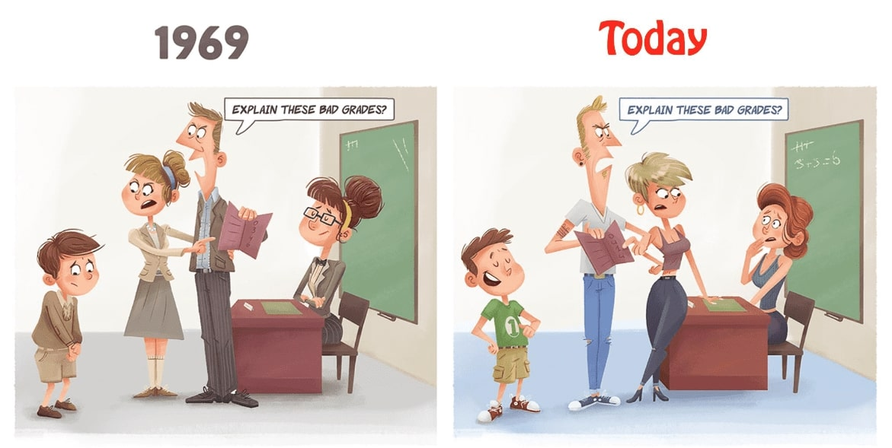
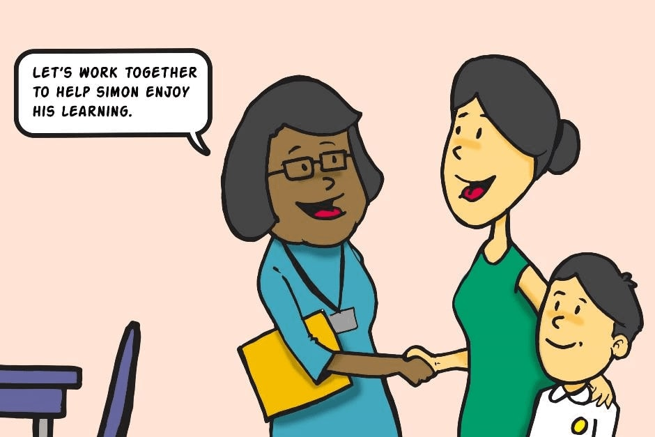

The times when a student owning a cell phone was something extraordinary are long gone, and now you can’t pry the kids away from their phones with a crowbar. As irritating as it may be for teachers, the new technology, in fact, is no evil. Once you comprehend how it can facilitate teaching and learning, adopting new tools for classrooms will become a question of time.

## Is this the end of traditional education?
Yes and no. Technology is not here to replace traditional learning with soulless machines; it’s here to help motivate students (according to PBS LearningMedia <a href="https://www.pbs.org/about/about-pbs/blogs/news/pbs-survey-finds-teachers-are-embracing-digital-resources-to-propel-student-learning/" target="_blank" rel="nofollow">research</a>, 74% of teachers responded that using classroom technology increases student motivation) and save teachers’ time.

Take a look at these numbers:

* In 2020, 71% of US students claimed to use laptops in the classroom.
* Having spent over 60 minutes in a classroom on a device, these students achieved better results.

So on one hand, it’s _yes_ because now the <a href="https://anadea.info/client-interviews/nordic-learning-platform" target="_blank">education is experiencing a great transformation</a>, and on the other hand, _no_ because essentially, studying in the classroom remains relevant as students still need active communication and guidance from a teacher even if there’s a third participant in their interaction, a device.

## How technology improves learning and communication
It’s believed that the teacher’s figure is not an unshakable authority for modern students. This puts much pressure on teachers that fail to reach out to kids and teens and emphasizes the gap between generations. We hope this comic strip has nothing to do with your job.

To some extent, positions shifted because students think that adults fall behind modern trends. As if only those adults who accept the modern world with all the novelties it brings along are worth listening to. From this point of view, technology has become a tool for improving teacher-student communication.

These examples illustrate how technology in the classroom positively impacts communication and the learning playground in general.

### Adds precision to the demonstration
The Internet is a bottomless source of all kinds of educational materials, for example, videos that can be freely used at the lessons. And videos are just a tip of the iceberg. Before demonstrations were limited to hand-outs and images from textbooks, now, entire ecosystems can be built to fulfill educational goals, where the content can be uploaded, downloaded, shared and modified.

### Accelerates research and information exchange
Gen Z is the most technologically advanced generation; they are fast learners able to gulp down huge amounts of information. So by the time a millennial would just make it to the library, a zoomer would have already found and read what they needed on a device.

With the availability of information online, including high-profile university resources (we’re not talking Wikipedia here), almost all can be found right at the lesson. In an __online learning environment__, teachers can even form a custom knowledge base to share the information across students and adjust it to fit the learning plan.

See also: <a href="https://anadea.info/projects/nordic-learning-platform" target="_blank">Nordic Learning Platform</a>, an educational ecosystem for pre-k through grade 12 developed by Anadea.

### Makes learning fun
Learning is surely a labor, but it can also be a joyful experience. Exploring the possibilities of a newly introduced learning system will inspire a renewed interest for the subject in children, especially if __gamification__ takes place. With a greater interest comes greater performance; as <a href="https://www.sciencedirect.com/science/article/pii/S1071581920300987" target="_blank" rel="nofollow">reported</a> in the International Journal of Human-Computer Studies (2020), challenge-based gamification may improve students’ performance by up to 89% compared to only being present at a lesson.

So when the learning process is gamified, the student feels an __active participant__ in the learning process instead of a static recipient of knowledge. This makes learning much more meaningful and helps students feel important. The examples of interactive learning elements are:

* Online quizzes and tests;
* Games in which freshly gained knowledge is put into action;
* Presentation tools, such as a virtual whiteboard where students can make schemes and present them to mates;
* Access to the Internet for research.

### Prepares kids for the future
The classic educational model has long been subject to criticism because it prepared students for tests rather than for real life. It’s getting different with the modern approach to learning that promotes comprehension before memorization, teaches kids problem-solving, finding and filtering information which is critical in the world of information, not all of which is worth buying into. And of course the future jobs of these kids will imply work with computers in either way, making these skills essential for further stages of education and professional development of the young generation.

### Reaches out not only to students, but to their parents as well
Parent-teacher conferences that take place twice a year may not be enough for parents to get the full understanding of their young children’s progress at school. Besides, it can be problematic to gather everyone at the same time at the same place.

For effective parent-teacher communication, there are tools that foster parent engagement and involvement in their kids’ school life, help teachers reach out to everyone and individually when announcing the upcoming events, as well as give parents the platform to communicate with each other. Given that not all parents like having group chats on their private messengers, a separate space for school matters would be much appreciated and enable:

* Student progress monitoring to parents;
* Payment collection from parents (for various activities, fundraising, etc.);
* Having documents signed by parents;
* Filling out forms and questionnaires, sending RSVPs;
* Setting up individual and group calls;
* Messaging between parents and school staff.

### Brings assessment to the next level
Every educational system has methodologies for assessing students’ performance based on many criteria in order to make assessment fair for everyone, as it should be. But every case still needs to be approached individually. Digital tools can simplify the process significantly, offering many tracking options that give teachers the aggregate picture of student performance on a timeline. If it’s not linear and the grades drill down emphasizes difficulties with certain study topics, perhaps the learning plan has to be reviewed either for individual students, a group of students or the whole class so that no gaps in their knowledge are present.

With technology, assessment becomes reciprocal. Teachers have always encouraged students to share their feedback at the end of the lesson, but was it effective? __Students are rarely willing to speak out in front of the class, so usually they say nothing.__ From experience, we see that it’s much easier for children to submit thoughts and questions in an online form, as they don’t feel awkward this way. Thus, technology allows teachers to understand what students really need, like or dislike about the studying process.

## What a custom LXP can offer
In 2022, the market offers hundreds of out-of-the-box learning management systems and learning experience platforms. At the beginning of the Covid-19 pandemic, many schools and universities hastily switched to systems like Moodle that have proven effective for holding online classes and performance reviews but turned out not that appealing in the long run due to limited customization opportunities. Now, institutions are increasingly leaning towards building their own LXP.

### An example from real life
A school in the US was using a paid learning experience platform it was fine with. That LXP had rich functionality and charged around $4 monthly fee per user. However, despite all its functionality, the LXP was lacking a module for connecting parents to the system. The administration decided to then start using another system on top of the existing one, a tool for parents and teachers connection.

Technically, the need was covered, but the second tool also cost money and more than that, duplicated certain functionalities of the primary system, such as the school event calendar, __which was also paid for__. After some consideration, it was decided at the school that a <a href="https://anadea.info/solutions/e-learning-software-development/lxp" target="_blank">custom LXP development</a> would be more cost-effective and __pay off in less than 2 years__, compared to keeping the two systems. So doing a little math pushed for creating a platform with the functionality meeting the needs of the school and to which the staff, students and their parents had access.

## Conclusions
The introduction of technology in schools should not be driven solely by the need to keep up with trends or peer pressure. Rather, the purpose of integrating technical tools in the classroom should be to demonstrate to students that education can be dynamic, contemporary, and enjoyable, while also streamlining the teaching process. Presently, digital resources are the most effective means of addressing communication and involvement challenges in the classroom. With the advantages of personalized LXP development outlined, it seems like an opportune moment to consider upgrading the educational experience at your institution.
