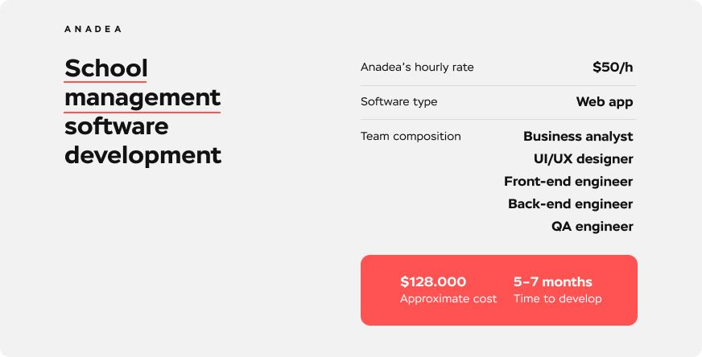

It’s important to say from the start that in today’s world there are 2 types of schools - traditional schools and online schools. Depending on what type your school belongs to, there will be different answers to the question “How to create educational software for schools”. An <a href="https://anadea.info/solutions/e-learning-software-development" target="_blank">educational software development company</a>, we will cover them both.

## For traditional schools

* **School management system software**. Modern schools tend to have a solid technical foundation for a full school ecosystem. You probably ask yourself “what scope of processes should a School Management System Software cover?” The answer is that it can ease routine for all participants - from school administration to students and parents. A lot of modules can be included in it, from managing school staff and procurement to reporting to governmental institutions, bookkeeping, and developing curricula. With its help, you can see how your school is doing as an organization, get insights on teachers’ load and efficiency, evaluate students’ performance and progress, the state of the training base, and much much more.
* To define the necessary scope for School Management System Software development, it’s a good idea to conduct a <a href="https://anadea.info/blog/how-to-turn-your-project-into-fantastic-with-discovery-phase-in-software-development" target="_blank">discovery phase</a> with a professional BA.
  It’s probably that in the basic complectation you’ll need these modules:
  - Student Management
  - Learning Management
  - Staff Management
  - Facility Management
  - Financial Management

  Let’s look at the time and cost and team composition to build an MVP version of such a system. The team will consist of:

  - Business analyst
  - UI/UX designer
  - Front-end engineer
  - Back-end engineer
  - QA specialist

  The approximate time for development will be about 5-7 months, and the price will start from $128K.

* **Education administration software**. The core occupation of the school is teaching students. Education administration software is a lighter version of School Management Software, it helps to automate administrative processes in educational institutions starting from scheduling and classroom administration, finishing with the supervision of an educational process and students’ performance.

  The approximate time for development will be about 3 months, and the price will start from $65K with the same team composition.

* **A specific module**. Sometimes there’s no need to develop a solution from the ground up. In case you need some functionality to add to the existing solution, you can build some specific module and integrate it with your system. It will cost you about $15-20K and take approximately 1,5-2 months.

## Other types of solutions in education software

At Anadea, we have 20 years of experience working in the sphere of education. Our team is ready to develop from scratch or enhance existing solutions. **On average, 7-8 weeks of development require a budget of $23,000.**

Here are the different types of solutions that we deliver for institutions that are mostly online business model:

* **<a href="https://anadea.info/solutions/e-learning-software-development/m-learning" target="_blank">eLearning apps development</a>**. Different types of educational mobile apps for school children, students, teachers, for personal self-education, and other kinds of purposes, tailored to your needs. <a href="https://anadea.info/projects/stav-online" target="_blank">Stav Online</a> for Dansk Psykologisk Forlag and <a href="https://anadea.info/projects/codecoach-by-first-code-academy" target="_blank">CodeCoach</a> for First Code Academy are interactive e-learning platforms developed by Anadea.
* **Learning experience platform (LXP)**. Provide all parties involved in education with data, tools, and resources to support and advance education delivery and management on one platform.
* **E-learning platform**. Provide educators, learners, and other parties with information, tools, and resources to assist and improve education delivery and management on a platform. A great example of this solution is the <a href="https://anadea.info/projects/nordic-learning-platform" target="_blank">Nordic Learning Platform</a> developed by Anadea for New Nordic Schools. Nordic Learning Platform is an ecosystem that provides all the necessary tools to assist the leadership, teachers, and students in focusing on their learning and development journey.
* **Knowledge management solutions**. Deliver a single access point to a knowledge base in a big organization. Keep, manage and deliver data in different formats to every knowledge management solution user.
* **Online training software**. It is possible to master and apply knowledge and build up your skills with this software type. We, in Anadea, will develop the system for specific educational needs on your request.
* **Drill and practice educational software**. Make sure students have the possibility of consistent practice and master materials they have come across before. Their progress can be sped up by drill and practice educational software.
* **Tutorial software**. Provide students lessons on a topic step-by-step, then practice and test their knowledge with tutorial software.
* **Education assessment software**. Give students access to tests and exams in a virtual environment. Let them see their progress, scores, and results to make their education process more efficient. This type has become quite popular. Recently, we developed the <a href="https://anadea.info/projects/ham-nat-coach" target="_blank">Ham-Nat Coach</a> online platform to prepare for HAM-Nat, a science test to enter several medical universities in Germany.
* **Digital learning platform**. Deliver a useful digital learning platform for education staff to make the learning process more captivating and engaging for students and provide lessons that can be tailored for each student.
* **Learning Management System (LMS)**. Our team will develop tailored <a href="https://anadea.info/solutions/e-learning-software-development/lms" target="_blank">LMS systems for administration</a>, documentation, and tracking. and reporting needs on-demand. Deliver educational courses, training programs, planning, execution, and evaluation of a learning process.

## Instead of conclusions

Typically, developing educational software requires a lot of integrations with various third-party services, as often, there’s no need to build some functionality from scratch. Secondly, it requires compliance with education standards like SCORM, xAPI, LTI and others. Don’t forget about GDPR and Accessibility.

In case you have any questions, feel free to contact us - we’ll be happy to help you with your project.


