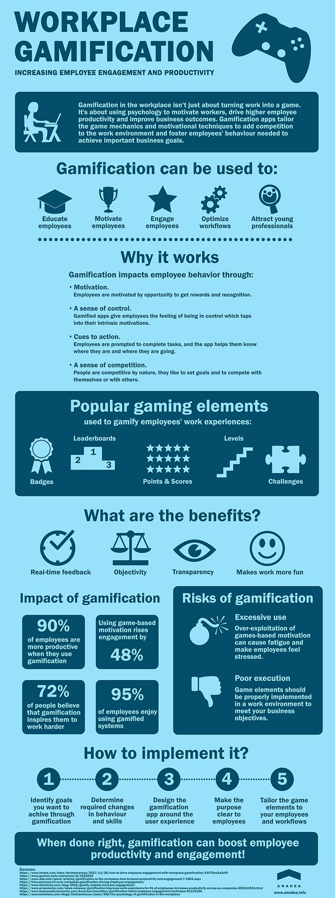

Happy employees are more productive. Staff who enjoy their work perform better, work harder and stay with a company longer.

Gamification is one-way employers are making work for staff more enjoyable. Tapping into our need for instant rewards, gratification and feedback, gamification tools are an effective way to engage employees, improve productivity and reduce staff turnover.

Consider the real-world impact of Pokémon Go. A globally popular location-based, augmented-reality app, downloaded over 750 million times since July 2016. Pokémon Go is currently generating over $1.2 billion in annual recurring revenues (the fastest mobile game to ever hit that figure so quickly), with hundreds of millions of active users. People from all walks of life are out
and about, right now, catching Pokémon. Although it's only a game, the real-world impact of Pokémon Go is getting people exercising, exploring where they are, and, for brands (who can pay to have their premises turned into a gym), increasing in-store revenue and engagement.

In the workplace, the same theories can be put into practice to promote employee engagement and productivity. The following infographic outlines the main aspects of gamification in the workplace:

## Why corporate gamification efforts fail

Every employer wants happy, engaged employees. Customers are treated better, and productivity is higher when staff enjoy their work. However, not every game-based app has the same impressive impact as Pokémon Go. Gamification statistics is not always optimistic. Gartner estimates that 80% of workplace gamification applications may fail to meet business objectives because of poor design, i.e. a lack of creativity and meaning.

When staff aren't engaged, when they don't care for what they do, productivity suffers. There can be numerous reasons for this. Workplace games is not going to be a miracle cure for low morale or productivity. The issue could be cultural. Companies can have negative cultures and practices that prevent employees from working at their best. Other times, poorly performing managers have a negative impact on productivity. Sometimes, an employee isn't a good fit for the work, culture or team. An employee engagement app can't solve all of these problems. Nevertheless, using gamification psychology can and does have a positive impact on everyday workplace challenges when designed and implemented successfully.

When gamification projects fail, it's often the result of poor planning or execution.

Employees with low levels of motivation for the work they do will see any attempt to gamify the experience as just another set of work-related tasks to perform. Most won't bother, or only pay lip service to the new program. Or they could see them as a great way to waste time, having the opposite of the intended impact. Whereas, more dedicated employees - especially those with a competitive streak - might be tempted to sabotage colleagues or find ways to cheat.

Another cause of gamification failure is when a desire to gamify work is overused. Simply throwing an off-the-shelf solution at your staff and hoping for the best is not the answer. In 2013, Omnicare, an American pharmacy and healthcare company, now owned by CVS Health, discovered this to their cost. Hoping to reduce customer service wait times, a leaderboard was created, with cash incentives for those who could complete customer calls fastest. This initiative backfired. Employees felt they were being monitored too much, causing response times to increase and some staff to leave.

When executed well, gamification for employees can generate impactful results across an organization.

## How to ensure your gamification efforts succeed

There are many successful gamification examples. Enterprise technology giant, SAP, needed to find a way to motivate and ensure sales professionals are prepared for complex consultative sales meetings with potential clients. Instead of using the traditional mix of coaching reading CRM notes, they created a gaming app, Roadwarrior.

Using real examples and data, sales reps for SAP take part in simulated meetings with clients and sales prospects. Reps that answer questions successfully can earn badges, compete against others in a virtual leaderboard and unlock higher levels within the game. Apart from training, it serves a
real-world purpose too. It provides a staging area - or cheat sheet - for data on a customer's needs and therefore, makes it easier for them to answer questions and close deals when in the field. Isn't it a great instance of using [gamification in corporate training](https://anadea.info/blog/gamification-in-e-learning) and motivation?

Unlike Omnicare, SAP took time and effort to understand what their sales team needed. And then created a solution that fits within those needs and ensured they would benefit. A custom approach to gamification of work is always more effective. Technology, of course, makes this possible. However, unless you invest in software that is tailored to the real working experiences of your staff, it won't have the impact you need.

LiveOps, a cloud-based contact center solutions company, with 20,000 remote customer service agents for national brands, wanted to find a way to improve employee motivation. Around the world, call centres are notorious for low morale, high turnover and low productivity. Staff turnover in the industry is usually anything from 43% to 70%. Rajat Paharia, founder of Bunchball
and respected godfather of the gamification industry, had a solution. Creating an app whereby employees earned rewards when they completed extra training, hit call time and quality KPIs and shared knowledge with colleagues.

For LiveOps, it was a huge success, as <a href="https://www.fastcompany.com/3063932/the-right-and-wrong-way-to-gamify-work" rel="nofollow" target="_blank">Fast Company reports</a>:

> Within a week of launching the program, 80% of LiveOps agents opted in and three-quarters of them return on a bi-weekly basis. Participating agents outperformed peers by 23% in average call-handle time and boosted customer satisfaction by 9%.

### Key considerations in employee productivity app development

* __Clearly define your goals:__ Set clear and specific objectives for your gamification app, and make sure they align with your company's goals. Define what you want to achieve and why, then work backward to identify the steps required to achieve them.
* __Understand user outcomes:__ Determine what you expect your employees to achieve when using the app. Identify the actions they need to take to get rewards and make sure they are connected in a smart way with the business objectives.
* __Design for user experience:__ Consider how the app will fit into your team's workflow. Determine if it can be integrated with other apps and tools, and make sure it's user-friendly and easy to use.
* __Ensure it's engaging:__ Don't forget about the "fun" aspect of gamification. Involve your employees in the process from start to finish. Get a small group to present ideas, beta test the app, and become advocates for it once it's rolled out.
* __Choose the right game elements:__ Select gamification strategies and elements that will appeal directly to your team and incentivize them when working. Leaderboards and rewards are a must in any competitive environment, but there are many other game elements to consider as well.
* __Consider the long-term impact:__ Evaluate the long-term impact of your gamification app. Will it help you achieve your goals and improve employee engagement over time? Continuously monitor the app's effectiveness and make adjustments as necessary.
* __Personalization:__ Consider incorporating personalized challenges or learning paths, customized to each employee's needs, interests and role.
* __Collaboration:__ Incorporate team-based challenges that encourage collaboration, promote knowledge-sharing and reinforce company culture.
* __Continual improvement:__ Ensure the app is regularly updated with new challenges, rewards and feedback mechanisms to keep employees engaged and motivated over the long-term.

If you'd like to implement your gamification ideas in practice, a skilled and experienced development team, such as Anadea, can give you a [custom quote](https://anadea.info/free-project-estimate) and guide you through the process. [Gamification apps](https://anadea.info/blog/gamification-in-business), when designed and tailored to the needs of your team, will give your business a real-world boost while also making work more fun for your employees. Everyone wins!
