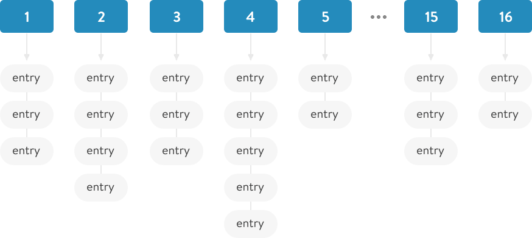
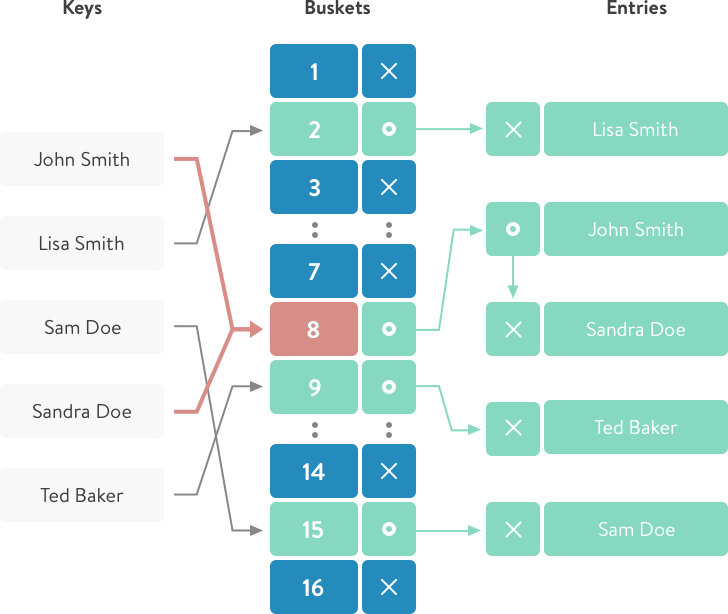

## What is hash table?

Hash table is a data structure that stores data in key-value pairs. It is also named as a dictionary or associative array. It stores data in a way that enables lookup and insertion in constant O(1) time. These properties of a hash make it one of the most useful data structures in a programmer's toolbox.

The main question is where does this speed come from and how does it work?

WARNING: I need to mention that in ruby 2.4, Hash table is moved to open addressing model. Read more
(see links tat the end of the article). So in this article I will describe only how Hash-tables data
structure works, not how it is implemented in 2.4 and above.

### The problem

Let's imagine for a second that we store all entries in an array or a linked list. When we need to find something, we have to go through all of the elements to match one. This can take a very long time, depending on the number of elements.

Using a hash table, we can go directly to the cell with the value that we need to find just by computing the hash function for that key.

### How does it work?

The hash table stores all values in the `store` (bins) groups, in a data structure similar to an array.



When adding a new key-value pair to the hash table, we need to calculate to which exact "storage" our pair will be inserted. We can do this using the `.hash` method (hash function).

The resulting value from the hash function is a pseudo-random number, i.e. it will always produce the same number for the same value.

```ruby
In ruby - `hash` method belongs to the module `Kernel`. Thus, it exists for almost every object.
```

```ruby
`hash` roughly speaking returns the equivalent of the link to the memory location where the current object is stored. But for strings, the calculation is relative to the value.
```

Having received a pseudo-random number - we must calculate the number of our "storage" where our key-value pair will lie.

```ruby
'a'.hash % 16 =>9
a - key
16 - amount of storage
9 - the storage number
```

So when you add a key/value to a hash, it will always be bound to the same repository. And due to the fact that "hash" returns a pseudo-random number - our pairs will be evenly distributed between all storages.

The worst result is when the result of the function produces the same number. Since in such a result - all data will fall into one “storage” and that case will not be better than a simple array.

### Wrapping up: How insertion works


1. The first thing ruby does is it takes the hash of the key using the internal hash function.

```ruby
:c.hash #=> 2782
```

2. After getting the random number (hash value), with the help of modulo operation (2782 % 16) we will get the storage number where to keep our key-value pair.

```ruby
:d.hash % 16
```

3. Add key-value to a linked list of the proper bin

### Wrapping up: How search works

The first and second steps are the same:

1. Determine "hash" function;
2. Find "storage";
3. Then iterate through a small list and retrieve a hash element.



```ruby
I just mentioned that we iterate through a small linked list.
```

In ruby, the average number of elements per bin is 5 ([see more](https://github.com/ruby/ruby/blob/9bfe7fc5cb457c7bc8df96115ee70b9035f5d885/st.c#L38)).[](https://github.com/ruby/ruby/blob/9bfe7fc5cb457c7bc8df96115ee70b9035f5d885/st.c#L38)

### Collisions and Growth (Rehash)

With the increase in the number of records added, as a consequence, the density of elements will grow in each repository (in fact, that size of hash-table is only 16 storages).

If the density of the elements is large, for example 10_000 elements in one "storage", while searching we will have to go through all the elements of this linked-list to find the corresponding record. And we'll go back to O(n) time, which is pretty bad in this case.

To avoid such a situation, the tactic is applied: table rehash (table increases and re-compilation of cells).

### What does it mean?

This means that hash-table size will be increased (up to the next number of - 16, 32, 64, 128, ...) and for all current elements the position in the "storages" will be recalculated.

"Rehash" occurs when the number of all elements is greater than the maximum density multiplied by the current table size.

```ruby
81 > 5 * 16 - rehash will be called when we add 81 elements to the table.
```

```ruby
num_entries > ST_DEFAULT_MAX_DENSITY * table->num_bins
```

[See more](https://github.com/ruby/ruby/blob/d40ea2afa6ff5a6e5befcf342fb7b6dc58796b20/st.c#L463-L464)

Ruby (before ruby 2.2.0) uses prime numbers to determine bucket sizes (11, 19, 37) [see more](https://github.com/ruby/ruby/blob/410b031acb0b85e86564cc5d6fdde57b1251505f/st.c#L151-L179), where initial bucket size was 11.<br /><br />
But after 2.2.0 it was decided to use sizes that correspond to "powers of two" (16, 32, 64, 128, …).
[See more](https://github.com/ruby/ruby/blob/9bfe7fc5cb457c7bc8df96115ee70b9035f5d885/st.c#L39)<br />
ST_DEFAULT_INIT_TABLE_SIZE 16

When the number of entries reaches the maximum possible value for current hash-table, the number of "storages" in that hash-table increases (it takes next size-number from 16, 32, 64, 128), and it re-calculates and corrects positions for all "entries" in that hash.

Here is a visual demonstration of how Ruby 2.3.4 behaves when you add a new element to the hash-table relative to the time.


[Gist link](https://gist.github.com/DmytroVasin/666b6ef191161160d258982014ad5e63)

From the graph you can see that some insertion cause "Spikes" in the timeline. At this time - the "Rehash" of the hash-table occurs. After rehashing you can see that time to insert for next element is drops several ms.

In Ruby 2.0+, extra data structures for smaller hashes were removed. They use linear search for better performance. [See more](https://terrainformatica.com/2017/10/15/when-linear-search-is-faster-than-stdmapfind-and-stdunordered_mapfind/)

## Conclusion

Hash data structure is the common thing in programming. Implementation of the hash quite the same in <a href="https://anadea.info/services/web-development/ruby-on-rails-development">Ruby development</a>, Java, <a href="https://anadea.info/services/web-development/python">Python development</a>. We just need to understand pros and cons of using it.

## References & Links

* [Ruby Under a Microscope](http://patshaughnessy.net/ruby-under-a-microscope)
* [Hash implementation on Ruby](https://blog.heroku.com/ruby-2-4-features-hashes-integers-rounding#better-hashes)
* [Hash changes at 2.4](https://blog.heroku.com/ruby-2-4-features-hashes-integers-rounding#hash-changes)
