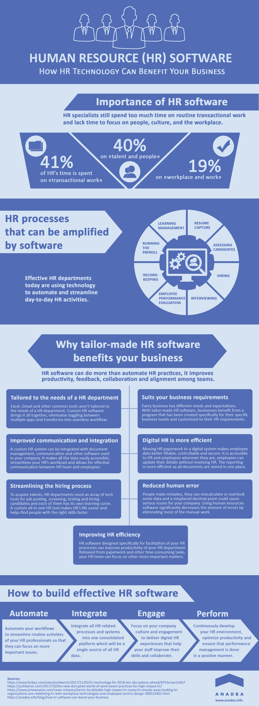

A growing business is an indicator of its success, but more people on the payroll can become a headache for HR personnel.

Many tasks have to be duplicated for every employee, often with minute alterations which can in turn affect other aspects. Sifting through employee files is a major time-waster; cross-referencing across multiple pieces of software is unwieldy and awkward. HR departments are not only recognizing the benefits of using dedicated human resources software applications for their tasks, they are coming to rely on them exclusively. Once the day-to-day running has been automated, HR staff can focus on shaping the culture, recruitment, and keeping employees happy.

## Automating the day-to-day

Many of the tasks that take up the time of HR are dull and repetitive, however it is necessary to keep records up to date and ensure that employees are receiving everything that they should. This might include payslips, updated policies, job applications, and handling perks and benefits. Since it's unlikely that two employees would have exactly the same needs or on the same pay scale, each record must be individually updated.

It's repetitive and time-consuming. Automated software can perform these tasks in a fraction of the time: by feeding on the available data, a single HR platform can perform daily maintenance and upkeep, freeing up staff to handle the more complex issues.

## Dedicated programming

Software isn't always the answer, not when you need multiple applications to manage employee records, payroll, pensions, and other details. Having one HR system that is specifically designed to meet the needs of the human-resources department is preferable to a variety of applications having certain aspects to offer but falling short in others. It's also a money-saver: one piece of software can perform multiple functions.

Flipping between Excel, Gmail, Word, and OneDrive is awkward when cross-referencing, and these are applications that, although designed for business use, can never be tailored to the exact needs of a HR department.

## Tailored to every business

Employing a "one size fits all" approach is useful for the company that is trying to sell its product to as many users as possible, but it does little for individual businesses that have vastly different needs and expectations. With one program, there is a seamless switch from screen to screen, or an overview that gives you precisely what you need.

By using [custom HR software systems](https://anadea.info/services), businesses benefit from a program that has been created specifically for them and for their HR requirements, not an application that is trying to force its way into every niche regardless of its suitability.

## Communication and integration

What if you are already using HRM software that works great in its own role but needs improving in other areas?

Newly integrated software can not only communicate with other applications to exchange data but can seamlessly integrate them to provide an expansive platform that works effectively and efficiently throughout the company.

<a href="https://www.turbinehq.com/" target="_blank">Turbine</a>, a cloud-based human resource management system with HR database and features for tracking employees' time-offs and expenses. It's a great example of a software that performs excellently on its own but can also be integrated with additional applications, such as Zapier and Slack, to cover every angle.

## Digital is more efficient

Paper files are a nuisance to store, update and look after. Getting rid of filing cabinets from the office and transferring this paperwork to a dedicated system not only removes their physical presence but also makes them accessible to the HR team and employees, wherever they are.

For example, an updated policy can be securely shared with the entire workforce, marked as read and accepted, and returned to HR within seconds: no need for following up, printing off new copies when the old ones were lost, or chasing staff for a signature. Plus, that policy can then be kept on the cloud to confirm compliance with government policies and new laws.

## Streamlining the hiring process

Even when applications for a position are coming in electronically instead of on paper – via a web portal or an email – they still need a human eye to read through the résumé to pick out the necessary qualifications and relevant experience. Dedicated software can filter out the desired qualities, whittling applicants to a more manageable number that HR personnel can then examine more closely for the subtler aspects of what makes a prospective candidate.

## Human error

Human error is an inevitable part of life, and it can lead to costly mistakes in some industries, to put it mildly. One such industry is human resources, where errors in data entry or processing can have significant consequences, including legal and financial liabilities. However, with the advent of HR IT solutions, businesses can minimize the risk of human error and ensure accurate and timely results.

## Focus on progressing forward

The HR team is often bogged down with paperwork, meaning that there is less time for them to work on the real issues presenting themselves, such as employee issues or hiring new staff. By integrating a software that is designed specifically to perform the more mundane aspects of the role, real employees can perform their roles as they should.

These are just few benefits of HR software. There are many more that both your HR staff and employees will undoubtedly appreciate.
