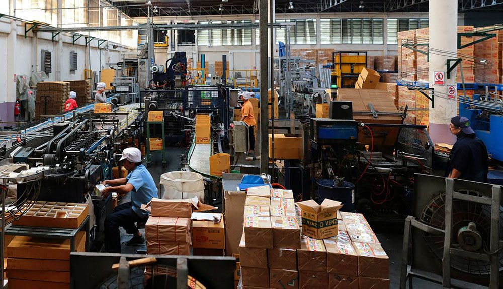

Technology takes over all industries in due time, whether it is advancements in hardware, <a href="https://anadea.info/blog/artificial-intelligence-pandoras-box-or-the-holy-grail" target="_blank">artificial intelligence</a>, or mobile technology.

In business, mobile apps have helped revolutionize payments, e-commerce, order management, and more. It's easy to see why some industries may have paved the way for the use of mobile apps while the rest catch up, given the benefits mobile technology (namely, <a href="https://anadea.info/solutions/erp-development" target="_blank">enterprise resource planning solutions</a>) can provide. These are the ability to connect from wherever you may be and much much more.

It can be obvious to think of how mobile applications have a strong role in some industries, such as <a href="https://anadea.info/solutions/ecommerce-software-development" target="_blank">e-commerce</a>. Something even as simple as paying with a credit card at a kiosk wouldn't be possible without the prevalence of smartphones and mobile apps. In an industry such as manufacturing, one might not have an immediate thought of why mobiles apps may be desired.

In fact, a <a href="https://softwareconnect.com/manufacturing/tools-of-the-modern-manufacturer-report-2017/" target="_blank">recent report</a> found that overall, manufacturers were less likely to use cloud software than other industries, and 2/3rds did not rely on mobile or tablet applications. One could argue that manufacturing is an industry that is resistant to change. However, the same report found that 46% of manufacturers planned on investing more money into their technology investments in 2018 as opposed to 2017. So what reasons do manufacturers have to look toward a future led by mobile applications?

## Manufacturing information in real-time

Manufacturing software plays a crucial role in managing inventory and executing production processes efficiently. In particular, two of the most important functionalities of manufacturing software are Material Resource Planning (MRP) and Manufacturing Execution Systems (MES). These tools enable manufacturers to streamline operations, reduce costs, and increase productivity.

While handheld devices have been used in the manufacturing industry for inventory management for some time, mobile technology has revolutionized the way manufacturers access and use data. With mobile devices, every piece of available inventory and production data can be accessed in real-time through a smartphone, tablet, or other mobile device.

According to a survey conducted by Decision Analyst, 94% of manufacturers reported increased efficiency and productivity when using mobile devices in their operations. Additionally, the survey found that 81% of manufacturers believe that mobile devices have improved their ability to make real-time decisions, and 78% of manufacturers report that mobile technology has improved their overall business performance.

For example, with mobile devices on the shop floor, manufacturers can quickly access real-time inventory levels and make informed decisions about whether they can complete new orders or not. If raw materials are missing, a purchase order can be generated on the spot to minimize production delays. Mobile devices also facilitate communication between different departments, enabling faster resolution of any issues that may arise during production.

## Increased employee productivity

We're in an age where your entire workforce likely has a smartphone as their own personal device. What this means is that opposed to even 5 years ago, everyone has familiarity with how mobile phones and tablets work (including how to operate applications within their operating systems).

In light of this, there should be no reasons why you don't have your workforce equipped to use mobile devices in the field to increase overall productivity. Having mobile devices used among your workforce allows for better tracking of your employee's actions. If you are tracking production output, or when inventory is being stocked/replenished, and require employees to make note of such at every step of the way, you allow for greater knowledge of how well your employees are using their time.

If you run a large enough manufacturing plant, it also may be important to know the location of your employees. While you don't necessarily need full GPS tracking of your employee's devices (although that option exists), you should be able to assume a location of an employee based on their last performed action (scanning inventory at a specific location, for example).

## Better management visibility

Keeping track of your inventory levels, production output, and your employee productivity are already great tools for management. Shipments and deliveries (either inbound or outbound) can be better managed when you have an increased view and control the day to day tasks of your employees.

The goal of having all that information at your fingertips? Faster decision making. Managers have to make the big decisions that affect ROI. You'll want to ensure they have all the information at their disposal in order to make the best decisions that can make a company hit goals. Manufacturing mobile apps allow manufacturers the ability to increase the overall productivity of their products, leading to more products being produced and orders being fulfilled at a faster rate.

## Progressing forward in manufacturing

Mobile apps will continue to be improved upon and added as available options to either operate your existing SaaS solution or to run an independent program you've fallen in love with. The answer won't be as easy as dropping your existing legacy system/methods in favor of mobile technology. In fact, the most scalable way to incorporate mobile technology will be a few tasks at a time. The technology is only improving, and it will not be waiting for you.
