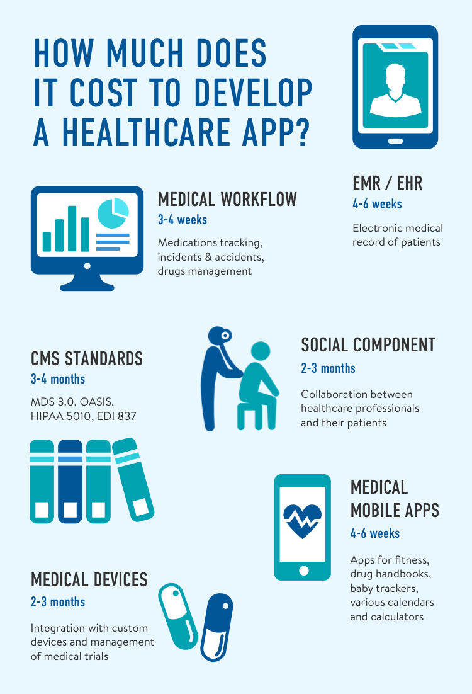

Usually, it’s the cost of custom development that interests entrepreneurs the most. It takes the time and skills of a whole team of specialists to develop a healthcare app, be it a fitness tracker or an EMR system. Below, you’ll find all you need to know before building a health app, including many aspects that can affect its cost.

<h2>Table of Contents</h2>
<ul>
  <li><a href="#overview">Market Overview of mHealth</a></li>
  <li><a href="#factors">What Factors Impact the Cost of a Customized HealthTech Software Development</a></li>
  <li><a href="#types">Types of mHealth Apps with Examples</a></li>
  <li><a href="#scope-cost">Scope and Cost of Healthcare App</a></li>
  <li><a href="#us-cost">Middle Cost of Developing a Healthcare App in the US</a></li>
</ul>

## Market Overview of mHealth
In the US alone, practically every 3rd adult has a health app installed on their smartphone. People monitor their health even more commonly than they use banking or educational apps: it’s 62% vs 57 and 30%, respectively. Consumer spending in health and fitness apps is set to exceed $100 million in the 1st quarter of 2022.

From fitness apps and water drinking reminders to medical workflow automation, overall, the mHealth industry has a lot to offer its users. And certainly, there is room for fresh ideas like yours.

## What Factors Impact the Cost of a Customized HealthTech Software Development
The cost of <a href="https://anadea.info/solutions/medical-app-development" target="_blank">healthcare app development</a> may vary many-fold depending on these factors below.

* __Vendor type__ 
First, it’s always the type of team that influences the cost of medical app development in the core. You have 2 options: hire a team or employ one in staff. Most opt for the first for several reasons: it’s easier, as you get a pre-formed team of developers who work well together, and just cheaper than financing your own staff. Given this, hiring a team, or outsourcing mHealth app development is what we’ll focus on in this post.

* __Region__ 
Most IT companies that provide outsourcing services have an hourly rate that differs a lot by region. In the US, this rate is the highest of all countries, usually starting at $100-150/hour. In Europe, rates are significantly lower for the competitive quality of development. Thus, when choosing a vendor, don’t limit yourself to the nearest regions: it’s in foreign contractors’ best interest to make the cooperation as convenient for you as it can possibly be.

* __The functionality of the product__ 
More app features mean more working hours which, in turn, mean higher costs. In the initial stages of your work with the vendor, the business analyst should break down the duration of developing all health app features for you to picture the work scope clearly. To assess the potential of your idea, we suggest starting with a minimum viable product and then building up new features step by step. An MVP is a product capable of solving the problem it’s designed to solve with no extra functionality.

## Types of mHealth Apps with Examples
From health monitoring apps for day-to-day use to those for healthcare professionals who have long introduced medical apps in doctor-patient relations.

* __EMR/EHR - medical/health records__ of patients. In a more general meaning, this type of module means automation of any workflow that takes place in the hospital or clinic being automated. The amount of time and money needed for this module is tightly tied in with the daily activities of the facility. If you would like to automate a clinic, provide your <a href="https://anadea.info/services/mobile-development" target="_blank">mobile application development services company</a> with all the papers and forms you are interested in so that they could "read" your workflow. Usually, an EMR module takes __4-6 weeks__ worth of work. 
__Examples:__ Epic, WebPT, Allscripts

* __Medical workflow__ automation. This type of functionality is usually integrated along with the EMR module. The usual workflows are medication tracking, incidents & accidents, drug management, and so on. Medical procedures development usually takes __3-4 weeks__. So, on top of EMR, a few weeks should be taken into account for any extra workflow. 
__Examples:__ AxisCare, CrelioHealth, WellSky

* __The social component__ provides an ability for doctors and patients to communicate. This component is often referred to as software for healthcare professionals and implements appointment scheduling, visit tracking, communication around patients' health, and other similar procedures. This type of medical software mostly depends on graphic design, which means that its estimate starts from __8 weeks__. 
__Examples:__ Medscape, Dock Health, MDCalc

* A huge variety of __medical mobile apps__ - such as apps for fitness, drug handbooks, baby trackers, various calendars and calculators, etc. To assess the work scope of a health mobile app development you should understand whether this app requires a back-end (server-side) development or not. The principle is simple - if the application allows for a few users to communicate, there should be a back-end. If a user is required to log in to the medical care app, a back-end is required. A mobile app with a back-end takes __8-12 weeks__ to be launched - its estimate depends on the back-end development. If the app allows one to open it and have fun without touching upon other users, your estimate will depend on the graphic design. In this case, it is possible to deliver a nice standalone healthcare app within __4-6 weeks__. 
__Examples:__ Flo, ZenPlanner, MyFitnessPal

* __Medicare & Medicaid standards__ implementation. This is the most time-consuming type of project. You should be aware that CMS standards usually take __12-16 weeks__ because of their sophistication and intricacy. At the same time, this type of app for healthcare is the most valuable type as there is a strong need for CMS standards automation in the market. Such medical applications often turn into multi-tenant SaaS systems and start serving multiple medical facilities.

* __Integration with medical devices.__ This is completely custom work because so are the devices. The amount of work required depends on the device and your goals. For example, you may want to run a medical trial or deliver supplementary software needed for the everyday use of the device. One way or another, such supplementary medical software will take no less than __8 weeks__ to launch.

Create health app

## Scope and Cost of Healthcare App
Anadea’s expertise in mobile health app development involves a number of finished projects for medical facilities flow automation and personal use. Below, find the scope and cost for one such project. This example is given for illustrative purposes - to get an estimate for the healthcare application development created with your sketch, address your idea directly to the company with relevant expertise.

__How much does it cost to create a healthcare app?__ 
$70,000 - $96,000

__How long does it take?__ 
14-20 weeks

__What's the scope?__ 
__Authentication__ 
Registration; login; logout; password reset.

__Profile management__ 
View and edit personal data; change password; delete an account.

__Scheduler__ 
Work/visit schedule for care workers and clients.

__Health data management__ 
Complete health questionnaire(s); receive food supplement recommendations; review results.

__Push notifications__ 
View list of notifications received; be notified about new recommendations; reminders, order updates.

__Admin panel__ 
Onboarding 
Client management 
Care workers management 
Scheduler management

## Middle Cost of Developing a Healthcare App in the US
Created by a US-based company, a similar app would cost nearly twice as much. More expensive doesn’t necessarily mean better, to which a number of Anadea clients from the US can attest. In this big world, boundaries disappear. Now it’s time to take a wider perspective.

Request mHealth app development
