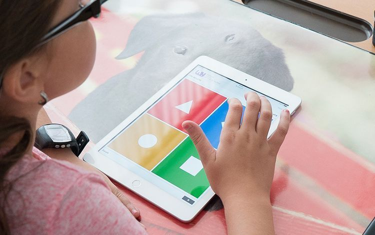
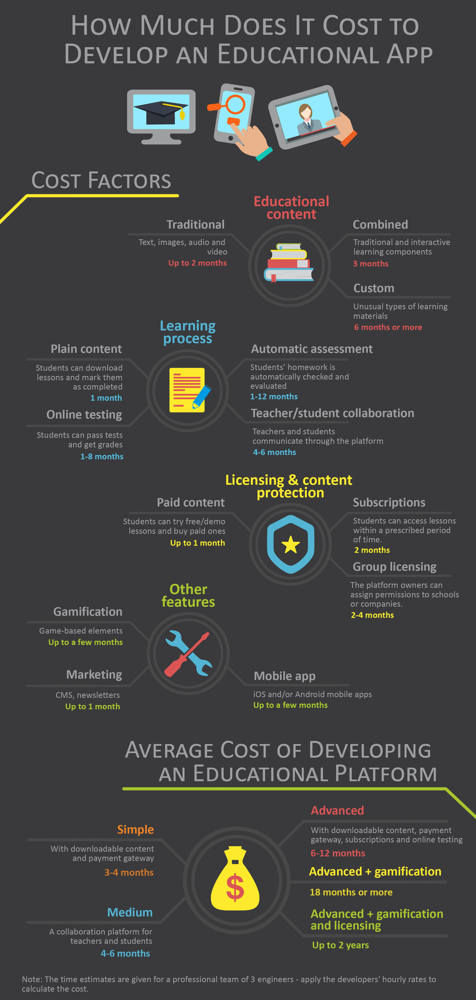

The good thing about the Internet is that sometimes it contains useful information. People who want to learn new skills start their road browsing the web in search of the topic they want to learn. They can find amazing resources that help people learn to play the banjo, speak Italian, play chess or even write software in Ruby on Rails.

When it comes to education, the Internet has changed the game that was in place twenty years ago. It has given opportunities to school teachers, instructors of all kinds and other people who produce high-quality educational content. These people can use well-known platforms such as YouTube or Patreon. But sometimes these platforms are too generic while the content requires a special licensing approach. In this case the content producers need a <a href="https://anadea.info/solutions/e-learning-software-development/lxp" target="_blank">custom e-learning platform</a>, provided by one of trustful educational app development companies.
.

<h2>Table of contents</h2>
<ul>
 <li><a href="#app-classification">Classification of Popular Educational Apps</a></li>
 <li><a href="#key-aspects">Key aspects that determine the cost of educational app development services
</a>
  <ol>
   <li><a href="#content">Content itself</a>
    <ul>
     <li><a href="#traditional-content">Implementing a platform with a traditional content</a></li>
     <li><a href="#combined-content">Combined content</a></li>
     <li><a href="#custom-content">Custom content</a></li>
    </ul>
   </li>
   <li><a href="#process">Teaching and learning process</a>
    <ul>
     <li><a href="#downloadable-content">Plain downloadable content</a></li>
     <li><a href="#online-testing">Online testing</a></li>
     <li><a href="#assignment-assessment">Automatic assignment assessment</a></li>
     <li><a href="#colloboration">Collaboration between teacher and student</a></li>
    </ul>
   </li>
   <li><a href="#licensing">Licensing and content protection</a>
    <ul>
     <li><a href="#paid-content">Paid content</a></li>
     <li><a href="#subscriptions">Subscriptions and plans</a></li>
     <li><a href="#licensing-schools">Licensing for schools and businesses</a></li>
    </ul>
   </li>
   <li><a href="#gamification">Gamification</a></li>
   <li><a href="#marketing">Educational mobile apps, newsletters, CMS for marketing</a></li>
   <li><a href="#monetization">Monetization models of educational app</a></li>
   </ol>
 </li>
 <li><a href="#mvp-cost-self-studt">MVP of a self-study app</a></li>
 <li><a href="#showcase">Showcase</a></li>
</ul>

## Classification of Popular Educational Apps

Before you start collaborating on developing an educational app with a software development company, it is important to determine what kind of application you would like to develop. It is crucial information, which will help to decide on the development roadmap, features, time, and cost of the application. There are a few following types of education apps that you might think of when you want to build an educational app:

* **Language learning app.**
Nowadays, language learning applications give opportunities to enrich vocabulary, refine speaking skills, and improve grammar. They are currently in high demand and can be quite profitable.

* **Remote tuition platforms.**
Remote tuition platforms are extremely useful in language learning. For example, the Chinese tutoring platform raised $100 million for connecting Chinese children with native English speakers from the US or the UK.

* **Educational mobile apps for kids.**
There are many types of apps for kids with the alphabet, mathematics, and language learning features. School applications with classes and subjects are in demand nowadays, especially since parents are ready to pay for such content.

* **Learning apps for people with disabilities.**
This kind of learning apps allows meeting the special education needs of students with disabilities with picture-based communication applications, choice boards, and much more. They are quite demanding in terms of user experience, therefore cooperation with a qualified UX designer and specialist working with people with disabilities is a must.

* **Learning apps for adults.**
There is a broad range of applications for this type of app: starting from deadline trackers, apps for proofreading and teamwork, homework reminder alerts. An app should also be open for additional combinations with campus maps, timetables, and learning databases.

* **Test prep apps.**
This type of application provides accessible learning materials like quizzes, flashcards, practice papers, which can be of great use in the preparation process for all tests from MBA to CAT. Monetization methods should be well-thought through beforehand since mobile ads would be too distracting from the learning process.

* **Online course learning.**
Online course apps cooperate with universities and offer a variety of courses in different industries to their users, while students can pick the university and online course of their choice.

## Key aspects that determine the cost of educational app development services

Here is your comprehensive guide to calculating the educational app development cost. Several key aspects define the complexity of educational platforms.

### 1. Content itself

Content defines the core of e-learning software. Once the software is developed and rolled out, the owners of the content need to upload the whole lot of their stuff to the database. Later on, they will be doing it on a regular basis. So the platform should be designed to represent the content in the best way possible.

Types of content may vary. Traditional learning materials are formatted text, images, audio and video. Some resources may combine all of those and even include interactive tests. Nowadays, many platforms have online streaming available to the teachers.

Also, there may be some unusual types of learning materials. For instance, music learning resources may contain interactive notation systems. For maths, one might need an interactive tool for graphs or drawings. To develop educational apps, an online console may be required.

Consequently, content defines not only the look and feel of the software, but also its cost. Here are a few numbers that are based on our experience:

* **Implementing a platform with a traditional content** is usually straightforward. It may take up to 2 months for two developers and a designer to implement text, images, audio and video. Also, it is worth considering a good storage like Amazon S3 or similar.

* **A combined content** requires an editor to pull all stuff together, so it takes a bit longer - let's say, the same development camp can release it in 3 months. Online streaming also adds some time on top of it.

* **Custom content** type is a completely different story. It requires significant development efforts. Interactive visual tools are usually developed using scalable vector graphics (SVG) and a lot of Javascript in the front-end. Such a feature can take 6 months or even more depending on the functionalities desired. This is why these tools are often sold in premium plans or cost the users additional money.

### 2. Teaching and learning process

When I worked at the sales department, potential customers often asked me, what is the cost of education app development in Ruby? In Java? What if we use Python? Here is the answer I had for them.

The language or the framework does not have a big influence on the project cost. What does have influence is the flow - the user roles and the sequence of actions available to users. How many steps should they take to achieve the goal? How do we even define the goal? Answers to these questions have a bigger impact on the development timeline than the technology.

There are several different flows common to educational apps: 

* **Plain downloadable content.** This is a simple flow because it leaves the learning process outside of the platform. Students download lessons, learn them and that is it. Perhaps, they can mark lessons as completed. This is a simple educational app that can be developed in a month and mostly depends on the graphic design. 

* **Online testing.** This case is more tricky because it introduces a new type of content - tests - and an interactive tool that allows passing those tests. Tests consist of questions and a certain number of answers linked to the questions. It is possible to show them as a set of radio buttons or checkboxes. But sometimes answers may require the user to click on an element, drag a slider or even enter an arbitrary text in an input - which impacts the overall project complexity. Also, testing requires a fair grading system. This way, testing can take from 1 month to 6-8 months depending on the variety of questions and ways they can be answered.

* **Automatic assignment assessment.** This feature is suitable for programming-related educational apps. After students take courses and solve examples, they can write programs for their homework assignments and upload them to the platform. Then the platform checks the submitted program and evaluates the solution. Automatic assignment assessment is an outstanding feature that saves a lot of time and effort for the teacher, but it requires a special interface between the educational platform and the course (which is part of the content). The time needed to develop such an interface can vary from 1 month to 1 year depending on the technology stack used in the course. 

* **Collaboration between teacher and student.** Some educational apps are designed for direct teacher-student communication. Students can ask questions, teachers can send lessons. In some cases, video calls through the platform can be arranged. This is a different type of an educational app which is similar to a collaboration platform in some way. Those applications take 4-6 months depending on the flow peculiarities.

### 3. Licensing and content protection

Since educational platforms usually belong to people who produce high-quality content and want to market and sell it, payment integration and content protection are important from the very first release. Here are a few options you might find useful:

* **Paid content.** This is a simple, yet functional option. There are many content-selling websites that use it. They have some free lessons, paid lessons, demo versions of paid lessons and packs of paid lessons. Users can add the lessons they want to the chart and proceed to checkout. This is a very common scheme that takes only up to 1 month to develop it.

* **Subscriptions and plans.** Sooner or later, all content-selling websites start offering subscription-based plans that allow one to watch and download any lesson during a certain amount of time. The only thing that limits users is their ability to learn. Payment plans are not very time-consuming either and may take additional 1 month after paid content download is in place.

* **Licensing for schools and businesses.** Some educational platforms are designed for groups of people such as schools and companies. The platform owners may want a special licensing approach that allows them to link licenses to schools. That may involve a third-party licensing service or a custom protection that limits the number of active users in each school. This option is more advanced and may take 2-4 months depending on the third-party service, quality of their support and the licensing logic.

A few words have to be said about content protection as it is an important issue for educational app developers. My experience shows that there is no good way to prevent the users from sharing the content they have access to. Well, there is a way to do that, but it is time-consuming and requires a custom interactive content viewer. Also, it limits the users who may need to store the content they bought in several devices and access it wherever they want.

I would recommend protecting your intellectual property outside of the software. Even Amazon Kindle Store allows one to download and convert books into PDFs, so do not be too cruel to your valuable users and let them copy the content if they want to. Just add your copyright and monitor the Internet from time to time. Let your lawyers do the job if you find your content shared inappropriately.

### 4. Gamification

Gamification should also be taken into consideration when allocating a budget to a new education project. This part of the platform is usually related to the design and front-end work and is hard to estimate before the design is completed. However, it will definitely take months rather than weeks, so I do not recommend scheduling gamification for the first release.

***Related read: [How to Use the Power of Gamification in e-Learning](https://anadea.info/blog/gamification-in-e-learning)***

### 5. Educational mobile apps, newsletters, CMS for marketing

Content-selling platforms usually require marketing features including content management, newsletters, and so on. These features are more suitable for a second or a third release. But if you believe that you are ready to start marketing your platform and lessons right after the first release, do not forget to include this part of work in your budget sheet. Traditional CMS features and newsletters are not time-consuming, but they may also take up to 1 month worth of work.

Do not forget to estimate iOS and Android apps if you need those in the educational project. Collaboration between teacher and student may need those by design.

### 6. Monetization models of educational app

To make sure that your app is profitable, the monetization model should be chosen carefully. Those are the main types:

* Freemium.
Many educational apps offer premium features for payment. Educational platforms like Udemy provide some free courses, but most of them are priced at $20-$200.

* Subscription.
The model is the following: a user pays a monthly subscription fee to get access to the content and functionality of an app. For example, Brainscape app pro subscription costs $10 per month.

* Advertisements.
Ads allow users to use the platform for free. DuoLingo informs the user that to keep education free, they are obliged to see an advertisement, for example.

* Paid apps.
The price is set for a paid version of an educational app. For example, Audioboo for Education costs $5 per month, enabling students and teachers to handle audio content freely within the platform.

## MVP of a self-study app

The concept of the Minimum Viable Product is very clear. The MVP is needed to develop a product with the core features to launch to market, evaluate the product “in the fields” and improve it in a few stages. We suggest you an example of the cost estimate of an educational app for self-learning.
The aim of the MVP of a self-study app is to provide the possibility to users for mastering skills in the area they always dreamed of, with the help of the content which is available on the Internet. A user can select a goal and get a list of missions that would help to reach the goal. The user receives points by completing missions and goals which makes the process more interactive. After the trial period of using the platform, the user pays for the subscription and in the future could be charged for additional advanced services.

<table border="1" width="100%">
<tbody>
<tr align="center">
<td>
<b>User Interface</b>
</td>
<td>
<b>Admin Interface</b>
</td>
<td>
<b>Additional tasks</b>
</td>
 </tr>
<tr><td style= "padding: 20px;">
<b>Authentication</b>

Registration; login; logout; password reset.

&nbsp;&nbsp;

<b>Personal data</b>

View and update personal data; change password; delete account.

&nbsp;

<b>Goals and missions</b>

Select a goal; get a list of missions; mark the missions as completed.>

&nbsp;

<b>Statistics</b>

View website statistics per each user (reached goals, passed missions, time spent on the platform)

&nbsp;

<b>Content search</b>

View relevant content according to the selected goal and mission; save found content in the library.

&nbsp;

<b>Library</b>

View saved content; create own content (text; photo; pdf; tags); view other users&rsquo; public libraries.

&nbsp;

<b>Leaderboard</b>

View history of selected goals and reached results; view received badges (per reached goal/mission; per spent duration on the platform.

&nbsp;

<b>Subscription</b>

Start/stop subscription after trial period.

</td>
<td style= "padding: 20px; vertical-align: top;">

<b>Authentication</b>

Login; logout; password reset.

&nbsp;

<b>Users management</b>

View list of registered users and their personal data; (un)block user.

&nbsp;

<b>Goal and mission management</b>

View a list of created goals and their missions; create, update and delete goals and missions.

&nbsp;

<b>Statistics</b>

View website statistics per each user (reached goals, passed missions, time spent on the platform)

</td>
<td style= "padding: 20px; vertical-align: top;">

Project setup

Responsive design

Payment method integration

Internet search engine integration. (e.g. DuckDuckGo, Bing, Google)

&nbsp;

Email notifications. For registration confirmation; receiving subscription information, etc.

</td>
</tr>
<tr>
<td colspan="2" align="center">

<b>Cost</b>

</td>
<td>

<b>Up to </b><b>$35,500</b>

</td>
</tr>
<tr>
<td colspan="2" align="center">

<b>Duration</b>

</td>
<td>

<b>15-20 weeks</b>

</td>
</tr>
</tbody>
</table>

## Showcase

What do we have in the end? Let's calculate an average cost of a minimal educational app development, and a cost of 2-3 generic releases:

* **An educational platform with downloadable content and a payment gateway** can be as simple as 3-4 months worth of work for a solid team of 3 engineers.

* **A collaboration platform for teachers and students** would take 4-6 months to make a first couple of releases.

* **An educational platform with downloadable content, a payment gateway, subscription-based plans and online testing** would take around 6 months. If the tests assume a variety of answers or a sophisticated logic to process the results, the number can go up to 12 months.

* **Same platform with gamification** may take 18 months or more depending on the gamification complexity. It is safe to release the product 3-6 times during this stretch of time.

* **If you want to add a licensing third-party solution** to the platform described above, I would recommend creating a roadmap for 2 years. That roadmap would certainly include 8-10 releases. You will need to invite schools into the application as early as possible and guide the development camp using the feedback provided by your clients.

This road seems quite long and may not fit in one's imagination at first. But be sure that the goal is achievable. At Anadea, we have experience launching great educational projects of this scale, to name a few:

* <a href="https://anadea.info/projects/stav-online" target="_blank">Stav Online</a>, an interactive e-learning platform that makes learning Danish efficient and fun;
* <a href="https://anadea.info/projects/codecoach-by-first-code-academy" target="_blank">CodeCoach</a>, an online platform that offers coding lessons for kids;
* <a href="https://anadea.info/blog/how-digital-technology-has-changed-modern-education" target="_blank">PrepJet</a>, an exam preparation platform for mental health licensing;
* <a href="https://anadea.info/projects/sports-coaching-app" target="_blank">Sports coaching app</a>, an app that lets players get online lessons from qualified coaches.

Eventually, development of educational apps is a predictable process which always ends in a successful release.

Also, do not be shy to ask your development company to prepare a personal estimate taking into consideration peculiarities of your unique content. Direct communication and an individual estimate is always more indicative than bare numbers calculated for generic educational platforms.

*Updated on 8 June 2021.*
