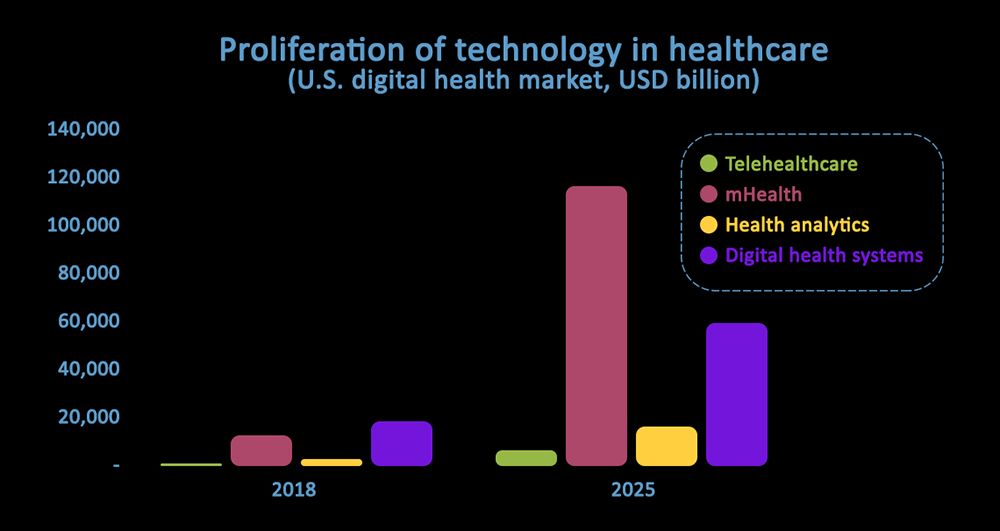

There is a system that brings all the aspects of the working of hospitals and nursing homes under one roof. We call this system the **healthcare project management system**. With the number of patients coming in and going out every day and healthcare professionals moving on in their careers from one level to another, imagine what a hospital would look like without a project management system. Chaotic, in one word.

When implemented right, hospital management software brings up <a href="https://www.goodfirms.co/blog/top-free-open-source-hospital-management-software" target="_blank">significant benefits</a> for the healthcare providers:

From proprietary enterprise software to cloud-based or open source hospital management systems, there is no dearth of applications to manage the workflow and operations carried out in a hospital. Applications like OpenEMR, MyNapier, Sanela, Medixcel EMR, and so many others are already providing excellent services. So, the question is do we need another custom-built software for project management in healthcare?

The IT/software landscape is ever-changing like no other industry. A technology comes, creates buzz, and can even become obsolete sooner than anticipated if it fails to accommodate reformations with the changing times and demands. Industry 4.0 and the respective emerging technologies are causing disruptions in every sector and the room for innovations is immense not just for the project management for healthcare but other sectors as well. The healthcare information software market value is expected to reach $390.7 billion by 2024, the compound annual growth rate (CAGR) being <a href="https://www.marketsandmarkets.com/Market-Reports/healthcare-it-252.html" target="_blank">15.8% from 2019 to 2024</a>.

## Emerging IT or software technologies in the healthcare sector

The healthcare sector has been a slow adopter of technologies. There are two reasons for this:
* first, there is an inherent risk involved for a patient’s life that the failure of technology can cause;
* second, there is an innate distaste towards technologies among some healthcare professionals.

There might be pieces of evidence enough for the previous statement. The second statement, however, might be a result of prejudice. So, readers’ discretion is requested. Going forward whatever may be the reason for the sluggishness, the fact is emerging technologies accompanied by the fourth industrial revolution will sooner or later extend completely over the healthcare sector.

Digitalization is already an essential part of healthcare, and almost the whole healthcare industry is on the track of digital transformation. The future will perceive the <a href="https://gminsights.wordpress.com/tag/video-consultation/" target="_blank">proliferation of telehealthcare, mHealth, health analytics, and digital health systems</a> based on emerging technologies being an integral part of the entire socio-economic landscape.

Related read: [Digital Healthcare: A New Approach to Care Coordination](https://anadea.info/blog/digital-healthcare-a-new-approach-to-care-coordination)

### Leveraging project management software enhances the productivity of healthcare facilities

A project management software bolstered with emerging technologies and automation will not only bring orderliness in healthcare-related activities and operations but will also increase the productivity of the people who are an integral part of the healthcare industry. Let us enumerate the ways in which project management software will have a positive impact on the working and progress of healthcare facilities:

#### 1. Managing various departments in a hassle-free manner

A healthcare facility is a conglomeration of departments—medical, administration, payroll, pharmacy, etc. Apart from doctors and nurses, there are individuals working diligently in several other departments whose intangible contribution is conducive to patient care and recuperation.

A project management software brings all these departments at a single point from where the project manager is able to control them by assigning projects to the respective departments. Powered with AI, many of the tasks in the project management healthcare software can be automated thus enhancing the workflow and eliminating the probability of human error.

#### 2. Enhancing task management to complete daily activities without a delay or miss

Every project management software is enabled with task management tools or features. Each patient in a healthcare facility requires care specific to their condition. Creating custom roles, therefore, based on expertise allows healthcare professionals to focus on their roles without getting flooded with irrelevant information.

The task management feature can leverage AI to create automated reminders for patients to take their medications on time. It also helps in identifying patients requiring prompt medical intervention and alerting the healthcare personnel to create a new medical plan or alter an existing one. In short, a project management software is capable of delivering customized medical services to patients according to their physical, medical, social, and environmental aspects.

Related read: [How ML and Big Data Add Value to Healthcare](https://anadea.info/blog/machine-learning-in-healthcare)

#### 3. Scheduling all the important works of a healthcare professional

From the perspective of a doctor, visiting and treating patients is not the only aspect of their professional life. Research work, teaching, consultation with fellow doctors; there are so many tasks that are difficult to manage without a formidable scheduler application. A project management software comprises calendars, events, reminders, and so many other features to plan the daily activities of several doctors and other professionals who have to work in sync.

With the advent of emerging technologies, telehealthcare and on-demand healthcare are on the rise adding to the overhead of remembering all these appointments and schedules. Thus, a project management software that automates most of the meeting and scheduling tasks becomes a requisite for the healthcare industry.

#### 4. Error-free storing and maintaining patient information

How are you supposed to feel when you visit your doctor for the fifth time and all you have to do is start telling her all over again what you had already told her on the first and subsequent visits. No doctor will go to the extent of being clueless to such an extent even if there is no project management system at all. However, with the rise of technological innovation, storing and maintaining patient information has become indispensable.

Technology can take the storing and maintaining steps ahead with real-time tracking of patients. Most of the patients are inclined towards not following their healthcare plan suggested by the physician. These people ultimately are destined to end up spending more time and money in the hospitals than what was required.

An example of an innovative feature comes from the partnership between Austin-based LeadingReach and Texas-based Catalyst both set to make real-time patient tracking as feasible as possible. A setup of 650 independent providers of primary care along with 85 members of the care team, <a href="https://www.mytechmag.com/news/leadingreach-catalyst-enhance-patient-care-to-the-tune-of-50-million-in-three-years-1550.html" target="_blank">Catalyst is leveraging LeadingReach’s communication network</a> to keep track of the patients. A custom-developed project management healthcare application can accommodate such an innovative feature to not only enhance the healthcare workflow but also the lives of the people.

Related read: [How Much Does It Cost to Develop an App for Healthcare?](https://anadea.info/guides/healthcare-app-development-cost)

#### 5. Real-time collaboration and discussion

It will be a sublime misfortune to live without real-time collaboration and communication in the world of healthcare that is moving towards real-time patient tracking. Project management software accommodates a single platform where the whole healthcare facility can communicate with one another in real time. Whether the discussion is on infrastructural issues or regarding patient care, your ideas and suggestions are just a tap away.

For instance, patients with genetic disorders exhibiting diseases in several organs do not have to wait for getting their report from say, the ophthalmologist and show it to the rheumatologist. Moreover, both the rheumatologist and the ophthalmologist can discuss, at length, a complicated case and come to a conclusion in minutes which would take days sans project development software.

The aforementioned list, although not all-inclusive, is conducive and conclusive enough to support the fact that healthcare IT software, project management software in particular, has positive implications for the growth and seamless functioning of the <a href="https://rubygarage.org/blog/types-of-healthcare-software" rel="nofollow" target="_blank">healthcare industry in every region</a>.

## Conclusion

The healthcare sector is a serious ground because it deals with people’s lives. If the activities and tasks are not carried out carefully and in order, it might have frenzied implications for the populace. Healthcare professionals, therefore, do a great job in ensuring quality healthcare services are offered to the patients. Emerging technologies are rapidly transforming every sector, healthcare included. Management necessary, technology intruding, the best thing to do is procure a project management software or build a custom-made one to enhance your processes, activities, and workflow and better serve patients and humanity.
