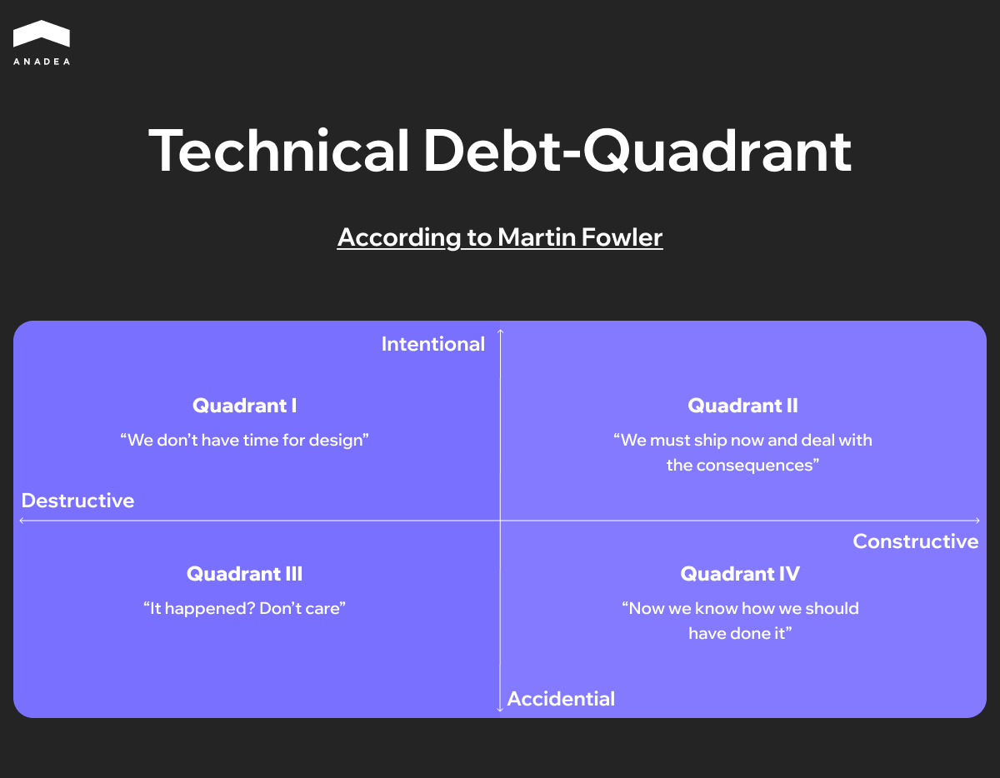
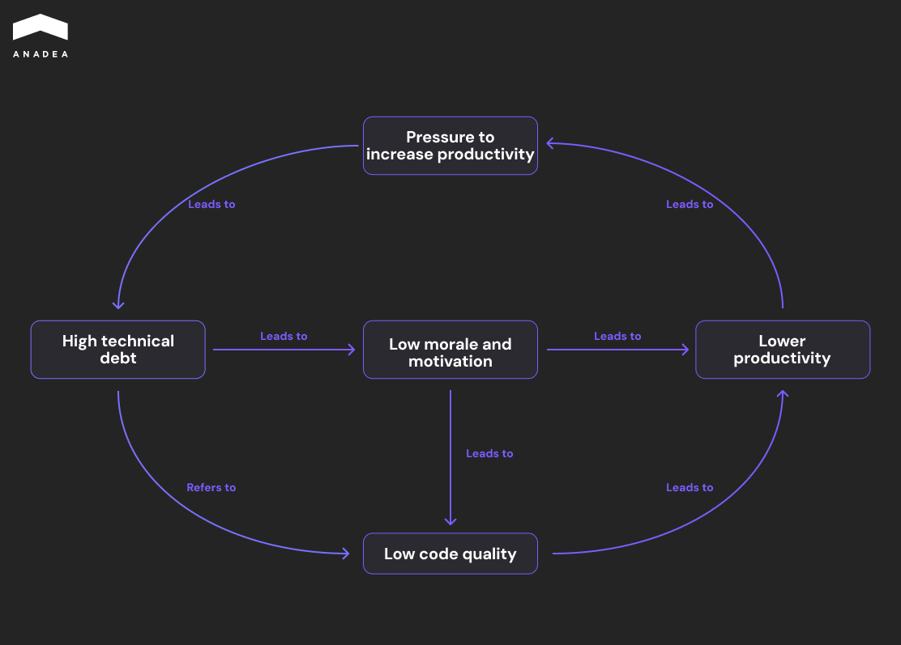
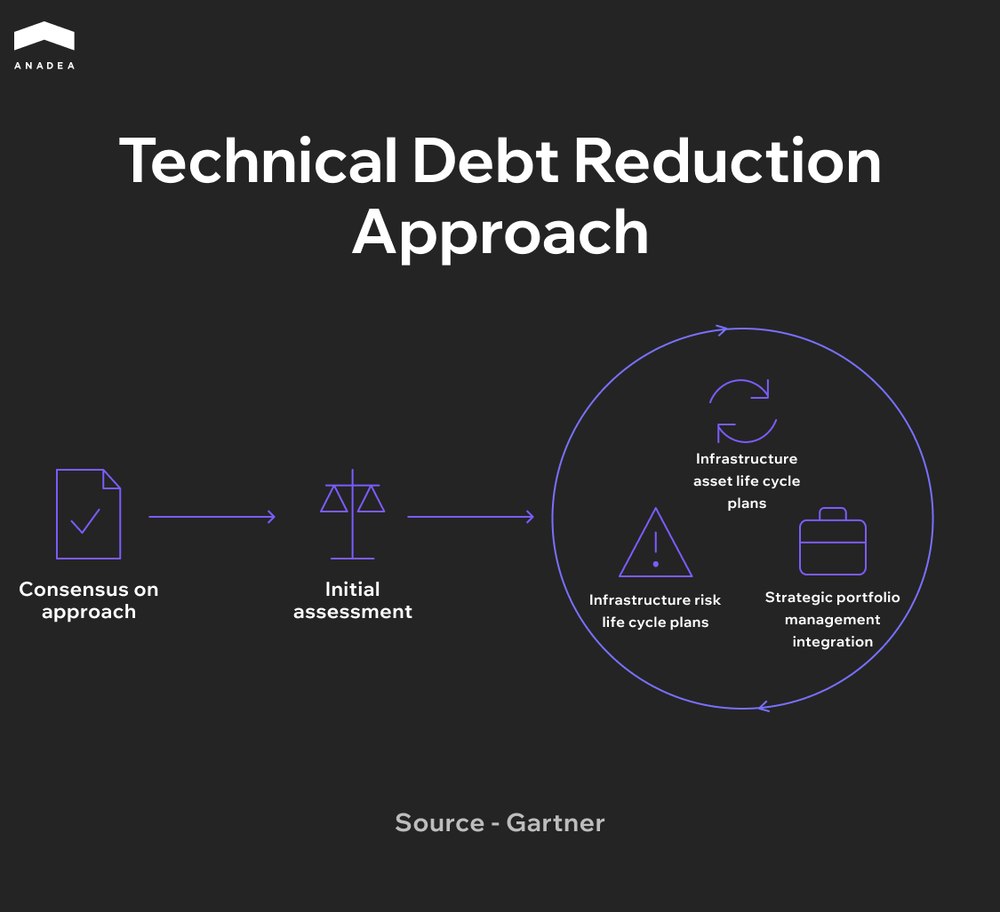
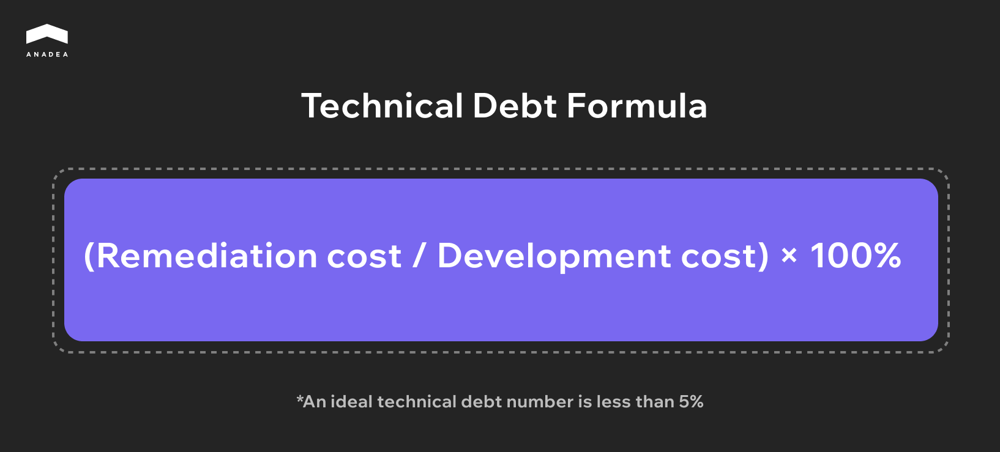

Technical debt is the accumulated cost of quick fixes, postponed upgrades, and architectural compromises, each of which made sense at the moment it was made, but together they drive up the cost of every subsequent change to the product.

[JetBrains' 2025 annual report](https://devecosystem-2025.jetbrains.com/productivity) shows that engineering managers want close to twice the resources for technical debt reduction that their companies actually allocate.

Engineering leadership sees the problem. Finance, for now, doesn't.

This article is for the readers caught in that gap, where debt hasn't blocked a release yet but has already started shaping the roadmap, and you have to figure out how to reduce technical debt without slowing delivery down.

## What Technical Debt Really Is

Technical debt is the accumulated cost of every compromise the team has made in code, architecture, infrastructure, and documentation while moving the product forward. Each individual compromise looks minor on its own, but over time, the sum of them starts to dictate how much every subsequent change costs.

In different sources, the technical debt meaning shifts depending on which layer of the system is in focus. It goes by code debt when the conversation is about the quality of the code itself, or design debt when it moves to architectural decisions. The economics are the same. What changes is the layer of the system that accumulates the problem.

### Where the Metaphor Came From

The term was coined by Ward Cunningham, the same engineer who later built the first wiki. In 1992, he described a situation he'd run into during financial software development. The team shipped a working version of the product knowing that some of the decisions were suboptimal, but consciously chose speed now and a promise to come back later. Cunningham explained to his non-technical stakeholders that this works like a loan. You get the resource today and pay it back with interest tomorrow, and as long as the principal isn't repaid, the interest keeps compounding.

There's an important nuance that often gets lost in retellings, and it changes the technical debt meaning in a meaningful way. Cunningham wasn't saying that debt equals bad code. Bad code is bad code, and it becomes a burden right away. In his framing, debt is a deliberate decision to ship a less-than-ideal but working version with a plan to improve it.

### Why the Impact of Technical Debt Is Back on the Agenda

Technical debt isn't a new topic, but the past couple of years have made the impact of technical debt sharper for a few reasons at once.

1. The first one is AI as an integration vector. Most companies are trying to plug AI into their product or internal processes somewhere, and that's exactly the point where it becomes obvious the architecture isn't ready for it. What used to be theoretical debt turns into a concrete blocker for the AI initiative.
2. The second is AI itself as a new source of debt. Heavy use of Copilot, Cursor, and similar tools without rigorous code review produces a predictable outcome. More code, more duplication, less consistency. LLMs are good at writing locally correct snippets but bad at keeping in mind that a similar function already exists in three other places in the repo. Teams that measure productivity by commit count end up with the illusion of acceleration.
3. The third is the economic context. Investors and boards have started looking harder at capital efficiency, and transparency around how the engineering budget is spent has become a separate requirement. In that context, technical debt stops being an internal engineering problem and starts to affect how the company is valued.



## Types of Technical Debt

Technical debt shows up at different layers of the system, and it has to be fixed differently in each one. The best-known classification belongs to Martin Fowler. His Technical Debt Quadrant maps debt across two axes, whether it was deliberate or inadvertent and whether it was taken on prudently or recklessly. It's a useful frame for the conversation about why the debt appeared. But for the conversation about where it lives, it's more practical to look at it by layers.

* *Architectural debt* is the most expensive kind. It shows up when the original architectural decisions no longer match how the product is actually used today. 
* *Code debt* is the most visible kind, and it usually shows up first as code quality issues flagged by static analyzers. It gets worked off through regular refactoring. The danger is that it accumulates quietly until every new feature starts touching three or four of those spots at once. For[ mobile products specifically](https://anadea.info/blog/how-to-manage-technical-debt-in-mobile-apps/), the dynamics shift further because of release cycles and OS deprecations.
* *Infrastructure and DevOps debt* covers pipelines that should have been rewritten ages ago, monitoring that covers half of the services, and deploying procedures that only one person on the team knows.
* *Dependency debt* is the dependencies you've been meaning to update for a while. Deprecated libraries, open vulnerabilities, incompatibility with a new runtime version.
* *Process debt* is manual testing where automation should be, releases that need half a day of coordination, code reviews that drag on for a week.
* *Knowledge debt* is the least talked about and one of the most expensive. Documentation that hasn't been updated in two years. Architectural decisions whose reasoning lives only in the memory of one person who has since left the company. 

Most products accumulate all six types of technical debt in software development at once, in different proportions. Modernization should start with the one that's slowing delivery down the most right now, not the one that's most visible.

## Where Technical Debt in Software Development Comes From

Technical debt rarely shows up because of bad engineers. More often, it's a side effect of business decisions that nobody revisited in time.

In the early stages, compromises are normal. The team consciously postpones the right architecture in order to validate a hypothesis faster. The problem is that temporary solutions almost never come back into the backlog. After a few releases, the short-term hack becomes part of the system's core, and every new feature ends up relying on that temporary layer.

There's also a reverse mechanism at work, local optimization. Duplicated logic instead of a refactor, a quick fix instead of removing the architectural constraint. None of these decisions is critical on its own, but together they create complexity that directly affects software development speed, and the technical debt impact compounds with every release that doesn't address it.

The cycle in the diagram is self-reinforcing. Debt makes changes harder, complexity drags productivity down, lower productivity generates pressure to move faster, and that pressure pushes the team toward even simpler solutions. Without outside intervention, the loop doesn't stabilize.

The question isn't how to avoid debt, because that isn't possible. The question is whether the team has a mechanism that forces it to come back to the compromises it made before those compromises start dictating what the product can do next.



## How to Identify Technical Debt

Seeing the impact of technical debt directly is difficult, because it isn't one single problem but a cluster of small decisions that start to affect speed and predictability.

### Tasks Get Harder Without Getting Bigger

One of the first signals is the growing effort it takes to deliver routine tasks. Functionally, they stay the same, but they take more time to understand, more checks to validate, and more dependencies to account for. 

### Indirect Work Starts Eating More Time

The share of time the team spends not on building new functionality but on supporting existing logic starts to climb. This includes:

* fixing side effects from changes,
* redoing parts of the system that have already been implemented,
* adding extra checks because the code can't be trusted at face value.

This is one of the most practical manifestations of the impact of technical debt.

### Dependencies and Constraints Pile Up

Over time, any change requires accounting for an increasing amount of context. The system becomes less flexible, even if no formal metric captures it. Complexity moves from the code level to the architecture level, which is a typical consequence of technical debt in software development and the most expensive one to address later.

### Predictability Drops

The gap between planned and actual delivery times gradually widens. Even well-estimated tasks start running past expectations because of non-obvious dependencies or system behavior. When this becomes systemic, the debt is no longer affecting individual releases but the development process as a whole.

### The Cost of Change Goes Up

Every modification takes more effort than it used to, with extra tests, workarounds, and changes in adjacent parts of the system. Over the long run, this directly increases software maintenance cost.

The table below works well as a starting diagnostic. Walk through the signals and tick off the ones your team is seeing right now.

<table>

<thead>

<tr>

<th>

<strong>Signal</strong>

</th>

<th>

<strong>What It Might Mean</strong>

</th>

<th>

<strong>Where to Look</strong>

</th>

</tr>

</thead>

<tbody>

<tr>

<td>

Estimates for simple features keep climbing sprint over sprint

</td>

<td>

Accumulated code or architectural debt

</td>

<td>

Velocity reports, estimate history

</td>

</tr>

<tr>

<td>

The same module breaks repeatedly whenever it's touched

</td>

<td>

Lack of tests or tight coupling

</td>

<td>

Bug tracker, CI statistics

</td>

</tr>

<tr>

<td>

Engineers avoid specific parts of the codebase

</td>

<td>

Knowledge debt or toxic complexity

</td>

<td>

Code review data, retro sessions

</td>

</tr>

<tr>

<td>

Time from commit to production keeps growing

</td>

<td>

Infrastructure or DevOps debt

</td>

<td>

CI/CD metrics, deploy frequency

</td>

</tr>

<tr>

<td>

Onboarding a new engineer takes more than a month

</td>

<td>

Knowledge debt, missing documentation

</td>

<td>

HR metrics, feedback from new hires

</td>

</tr>

<tr>

<td>

Performance degrades under the same load

</td>

<td>

Architectural debt, data-layer issues

</td>

<td>

APM tools, monitoring

</td>

</tr>

<tr>

<td>

Security patches take weeks instead of hours

</td>

<td>

Dependency debt

</td>

<td>

SCA scanners, audit reports

</td>

</tr>

</tbody>

</table>

## Strategies for Managing Technical Debt and Reducing It

Trying to reduce technical debt with one big rewrite almost always ends badly. The budget runs out before the work is done, or the work gets done but the product has fallen behind the market in the meantime. Sustainable technical debt management is built around daily coexistence with the debt, not a single large operation.

Gartner's framework describes this approach as three phases. First, the team and leadership arrive at a shared understanding of the problem. Then comes an initial assessment of the system. Only after that does the ongoing governance loop start. The first two phases happen once. The third runs in parallel with the product for as long as the product is alive.

### Make the Debt Visible

Managing technical debt starts with making it visible. You can't prioritize something that officially doesn't exist. The registry doesn't have to be complicated. Surfacing debt works from both sides at once. Static analyzers like SonarQube catch duplication and complexity, while engineers add architectural compromises during design review that automation can't pick up on.

It also helps to have one number for the overall debt level. The most common metric is the technical debt ratio, the cost of remediation divided by the cost of developing the system. A healthy benchmark is below 5%. Anything above that means a meaningful share of engineering capacity is already going toward maintaining past decisions.

### Build Debt into the Sprint Budget

Most teams try to chip away at debt in the gaps between features. There are no gaps. What works is a fixed share of each sprint's capacity reserved for debt work, somewhere in the 15 to 25% range depending on the state of the system. 

This is the most reliable answer to the how to reduce technical debt question over the long run (small, consistent payments rather than one large transfer). Protecting that share from business pressure matters more than the exact percentage. If it can be easily redirected toward an urgent release, it'll be gone within a quarter.

### Avoid Big-Bang Rewrites

When architectural debt becomes unavoidable, there's a temptation to rewrite the whole system. Nine times out of ten, the new version is late, the old one keeps running, and the team supports two systems instead of one for a stretch and software development speed drops across both. The strangler pattern works more reliably. New code is written alongside the old, gradually takes over functionality, the product stays in production the whole time, and the modernization can be paused at any point without losing what's already been done.

### Prevent New Debt from Building Up

The cheapest debt is the debt that never appeared. A basic level of hygiene closes off most of the common sources and quietly does more to reduce technical debt than any dedicated initiative. Code review with explicit conversations about trade-offs. Tests as a required part of the merge. Static analysis in CI. ADRs for architectural decisions. None of these rules are new. The teams that complain about debt usually aren't following at least half of them.

### Bring in Outside Engineers for Modernization

The internal team knows the system best, but it's also tied up in current delivery. There's another factor too. The people who wrote the original architecture are often attached to its decisions, which slows down honest reassessment. [External engineers](https://anadea.info/blog/software-development-team-extension-guide/) who have already modernized similar systems work in parallel with the main team and don't pull capacity out of the roadmap.



## How This Looks in Practice: Modernizing StreetEasy

One of our longest-running projects is StreetEasy, New York City's largest real estate marketplace and part of Zillow Group. The platform handles around 180 million visits a year. Anadea has been working with the team for over a decade, and a significant part of that time has gone into gradually modernizing the system without ever taking the product offline.

When we started, the stack was typical for its time, a large PHP monolith. As traffic and functionality grew, it turned into a classic architectural problem. Deploying one feature required releasing the entire system, a change in one module touched three others, and every new feature came in more expensive than the last.

A big-bang rewrite was never on the table. We worked through the strangler pattern. New code was written alongside the old, gradually taking over functionality, services were pulled out separately, and data migrated in small steps. Every release was small enough to be safely rolled back.

The speed of critical flows grew roughly 33 times compared to the original version over the course of the engagement. Services could be deployed independently, and new features started shipping more often. Throughout the entire modernization, the platform was never offline longer than its scheduled maintenance windows.



## Conclusion

Technical debt can't be cleared entirely, and that isn't the goal anyway. The point of technical debt management is to keep it at a level where architecture doesn't start limiting what the product can do. If the team is slowing down and the architecture is blocking new directions, it's worth taking an outside look at the system. Anadea runs a technical audit that shows where the most expensive debt lives and what to reduce technical debt in first. [Get in touch](https://anadea.info/contact-us) and we can talk through your specific case.
