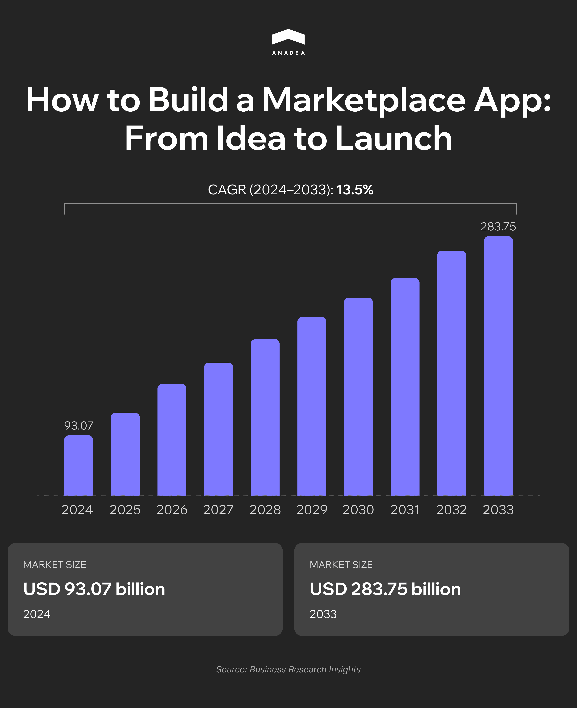

Some decades ago, to make a purchase, people had to find the nearest store, check its business hours, and go there. Now, to buy a desired item or to order a service, we don’t even need to leave home. Everything that is required is a computer or a mobile device with access to online marketplaces.

According to the data published by [Business Research Insights](https://www.businessresearchinsights.com/market-reports/marketplace-apps-market-113486), in 2024, the size of the global marketplace apps market hit $93.07 billion. By 2033, it is projected to reach [$283.75 billion](https://www.businessresearchinsights.com/market-reports/marketplace-apps-market-113486). It means that the CAGR for the period from 2025 to 2033 will be over 13.5%. 

This growth is mainly driven by the increased mobile internet penetration and expanding adoption of e-commerce. As it is reported by [Statista](https://www.statista.com/topics/871/online-shopping/#topicOverview), in 2025, retail e-commerce sales are expected to exceed $4.3 trillion. According to [eMarketer](https://www.emarketer.com/content/worldwide-retail-ecommerce-forecast-2025), the share of e-commerce transactions in total retail sales is around 20.5%. Experts anticipate that it will continue growing and, in just a couple of years, it will be 22.5%.

The changes in consumer shopping habits result in increased demand for marketplaces among both buyers and sellers. For consumers, it is a convenient way to shop from stores all over the world, while for businesses, it is an opportunity to reach a wide audience.

In this article, we will talk about such platforms and share our expert tips on how to create a marketplace app.

## What Is a Marketplace App?

A marketplace app is a digital platform that connects buyers and sellers. It serves as an intermediary and enables users to list, discover, and purchase products or services. Marketplace apps traditionally include tools for product search, online payments, in-app messaging, and order tracking. All this helps buyers to find what they need, while sellers can expand their audience.

These platforms can be categorized based on their target audiences and the types of items that can be offered on the platform.

<table>

<thead>

<tr>

<th>

<strong>Type</strong>

</th>

<th>

<strong>Description</strong>

</th>

<th>

<strong>Examples</strong>

</th>

</tr>

</thead>

<tbody>

<tr>

<td>

Product-based marketplaces

</td>

<td>

Such platforms focus on physical or digital goods.

</td>

<td>

Amazon, Etsy

</td>

</tr>

<tr>

<td>

Service-based marketplaces

</td>

<td>

These marketplaces help customers find service providers.

</td>

<td>

Fiverr, TaskRabbit

</td>

</tr>

<tr>

<td>

B2B marketplaces

</td>

<td>

Business-to-business platforms facilitate transactions between organizations.

</td>

<td>

Amazon Business, Alibaba

</td>

</tr>

<tr>

<td>

P2P marketplaces

</td>

<td>

Peer-to-peer apps allow individuals to buy, sell, or rent directly from each other.

</td>

<td>

Airbnb, eBay

</td>

</tr>

<tr>

<td>

Vertical marketplaces

</td>

<td>

These marketplaces have a specific niche that they work with.

</td>

<td>

StockX (for sneakers), Etsy (for handmade and vintage goods)

</td>

</tr>

<tr>

<td>

Horizontal marketplaces

</td>

<td>

These platforms don&rsquo;t have specialization as they offer a wide variety of products or services from different categories.

</td>

<td>

eBay, Amazon

</td>

</tr>

</tbody>

</table>

## Marketplace App Development: Step-by-Step Guide

Our company has been working in the software development industry for more than 25 years. And since the moment of its foundation, our team has successfully delivered over 600 custom solutions of different types and complexity, including marketplaces.

This allowed us to develop a highly efficient approach to building scalable platforms with the needs of buyers and sellers in mind.



Below you can find the explanation of the key project stages and the core decisions that should be made in each of them.

### Step 1. Define Your Niche and Value Proposition

“What will make my marketplace unique? And why will users choose my app?” These are the first questions that you should ask yourself. If you can’t find the answers to them, it’s highly unlikely that your potential buyers and sellers will be able to do it.

We recommend that you don’t try to cover all possible audiences and categories of goods at once. Instead, you can focus on a niche so that you will face less competition in a well-defined niche compared to the broader market. 

One of the most successful niche marketplaces is [StockX](https://stockx.com/about/company/). It was launched in 2016 and is currently used by millions of people from more than 200 countries. It functions as a P2P resale platform and allows buyers to find unique sneakers, electronics, trading cards, collectibles, and accessories.

In 2019, the platform’s gross merchandise value (GMV is a critical performance metric that is closely tracked by investors) surpassed [$1 billion](https://stockx.com/about/en-us/stockx-reveals-resale-market-insights-and-company-momentum-surpasses-1-billion-in-gross-merchandise-value-in-2019/). Though the recent figures haven't been officially revealed, according to [Digital Commerce 360](https://www.digitalcommerce360.com/2024/11/12/stockx-selects-co-founder-as-its-new-ceo/), StockX’s GMV could have hit $8.04 billion in 2024.

#### What are buyers and sellers looking for?

When you are just preparing to build a marketplace app, you should clearly understand what is valued by the potential users.

Buyers benefit from a wide variety of products, competitive pricing, and convenient features such as easy search, ordering, delivery, and payment options. They also pay attention to the transparency of the processes and the availability of exclusive deals and promotions.

At the same time, sellers appreciate low barriers to entry, the possibility of enhancing brand visibility, and efficient transaction processing. Additionally, they want to have advanced analytics on customer behavior, sales trends, and marketing performance as it can help them optimize their business growth.

### Step 2. Choose the Right Monetization Model

The revenue model is the foundation of the financial sustainability of your platform. That’s why, even before starting to design and code your online marketplace app, you should clearly understand how you will earn money on it.

In the table below, you can find a comparison of the most popular options among the companies that create marketplace apps.

<table>

<thead>

<tr>

<th>

<strong>Aspects&nbsp;</strong>

</th>

<th>

<strong>Commissions</strong>

</th>

<th>

<strong>Subscription</strong>

</th>

<th>

<strong>Listing fee</strong>

</th>

<th>

<strong>Freemium</strong>

</th>

</tr>

</thead>

<tbody>

<tr>

<td>

How it works

</td>

<td>

You take a percentage of each transaction between buyer and seller.

</td>

<td>

Sellers pay a recurring fee for access to the platform.

</td>

<td>

Sellers pay a fee to list each product or service.

</td>

<td>

Core features are free, but advanced tools are paid.

</td>

</tr>

<tr>

<td>

Strengths

</td>

<td>

Revenue grows with marketplace activity;

no upfront costs for sellers.

</td>

<td>

Predictable recurring revenue;

Stable cash flow.

</td>

<td>

Revenue generation even without sales;

encouragement for quality listings.

</td>

<td>

Easy seller onboarding; large user base potential.

</td>

</tr>

<tr>

<td>

Weaknesses

</td>

<td>

High commission rates may become an entry barrier for sellers.

</td>

<td>

Risk of churn if the value proposition and ROI are not clear.

</td>

<td>

Difficulties in attracting new sellers;

sellers may prefer not to post multiple items.

</td>

<td>

Requires clear upsell path to convert free users into paying ones.

</td>

</tr>

<tr>

<td>

Best for

</td>

<td>

High-volume marketplaces

</td>

<td>

Established platforms with proven value for sellers

</td>

<td>

Niche or high-value markets

</td>

<td>

Platforms seeking rapid user growth before monetization

</td>

</tr>

</tbody>

</table>

### Step 3. Plan the Core Features

When you are planning to create your own marketplace, you should define what features it will have. There are three groups of users who will interact with your application. They are buyers, sellers, and admins. All these groups have unique needs that should be met with specific functionality.

#### Features for buyers

* **Search and filters**. You should enable users to find relevant products or services by category, price, location, or other parameters.
* **Product/service pages**. This section should include high-quality images, detailed descriptions, and clear pricing. 
* **Reviews and ratings**. Reviews can be accompanied by photos and videos recorded by buyers.
* **Secure payments**. Payments can be made with the help of credit/debit cards, PayPal, and Apple/Google Pay. Given the growing adoption of cryptocurrencies, you can also add support for such assets.
* **Wishlist or favorites**. You can provide users with the possibility to save items for later consideration.
* **Order tracking**. Real-time updates on the order status will allow users to stay informed at every stage of the purchase process.
* **Personalized recommendations**. You can use AI to suggest products or services based on user behavior and interests.
* **Virtual try-on**. VR/AR tools will let users preview clothing or cosmetics on themselves before buying.
* **3D product visualization**. This tool provides interactive 360-degree views for a realistic look at items.

#### Features for sellers

* **Listing creation and management**. Sellers should have tools to upload images, set prices, add descriptions, and update stock.
* **Profile management**. Sellers need to create their public pages with bio, ratings, and contact info.
* **AI-driven analytics**. A dashboard should contain insights on best-selling items, traffic, and revenue.
* **Predictive analytics**. Artificial intelligence can forecast sales trends and inventory needs.
* **Communication tools**. In-app messaging will enable sellers to communicate with buyers and answer their questions.
* **Promotion tools**. Online marketplace apps traditionally have features for introducing discounts, coupons, and featured listings.

#### Features for admins

* **User management**. Admins should have relevant tools to approve, suspend, and verify both buyers and sellers.
* **Listing moderation**. You should provide admins with the rights to remove listings that violate rules.
* **Payout management**. Admins need to have tools for handling seller payments and resolving disputes. 
* **Platform analytics**. Administrators need to track the performance of the platform, including GMV, user growth, and engagement metrics.
* **Fraud detection**. AI can detect suspicious transactions to protect buyers and sellers. It can block such operations and/or immediately notify admins.



### Step 4. Design UX/UI for Two-Sided Interaction

Your online marketplace app should not only have visually appealing interfaces. It should also allow users to easily complete their goals. That’s why, in the design stage, a smooth user experience should become your priority.

Before moving into marketplace app development, create wireframes for user journeys. As you have buyers and sellers, you should think about two separate flows.

<table>

<thead>

<tr>

<th>

<strong>Buyer&rsquo;s journey</strong>

</th>

<th>

<strong>Seller&rsquo;s journey</strong>

</th>

</tr>

</thead>

<tbody>

<tr>

<td>

<ol>

<li style="font-weight: 400;">Browsing</li>

<li style="font-weight: 400;">Filtering and search</li>

<li style="font-weight: 400;">Viewing product/service details</li>

<li style="font-weight: 400;">Checkout</li>

<li style="font-weight: 400;">Order tracking</li>

</ol>

</td>

<td>

<ol>

<li style="font-weight: 400;">Profile creation</li>

<li style="font-weight: 400;">Listing creation</li>

<li style="font-weight: 400;">Order management</li>

<li style="font-weight: 400;">Viewing analytics</li>

<li style="font-weight: 400;">Withdrawing earnings</li>

</ol>

</td>

</tr>

</tbody>

</table>

If you visualize each step, you will be able to detect and optimize friction points before your team starts coding.

#### UX/UI Design Best Practices

These tips will help you build a marketplace app that will meet the expectations of modern users.

* Use the same design patterns, icons, and navigation styles across the entire app, including buyer and seller areas.
* Minimize the number of on-screen elements that a user can see at once. Limit them to only what’s needed for the current action.
* Make sure that layouts can adapt smoothly to different devices.
* Optimize images and code to reduce delays. According to Google, the probability of bounce is [32% higher](https://www.thinkwithgoogle.com/marketing-strategies/app-and-mobile/page-load-time-statistics/) if page load time increases from 1 to 3 seconds.
* Think about the accessibility of your app. It should be easily and effectively used by as many individuals as possible, including people with disabilities. 

### Step 5: Choose the Tech Stack for Marketplace App Development

The right choice of the tech stack is an important factor in the success of your future app. It affects development speed, scalability, maintenance costs, and user experience. It may be challenging for non-technical specialists to make any decisions regarding the tools and frameworks to be used. That’s why you should discuss the tech stack choice with your development team or, if you don’t have in-house experts, with a marketplace app development company, like Anadea.



#### Native vs Cross-Platform Development

The first thing to consider before building a marketplace is whether you will build native apps (those that are developed separately for each mobile platform) or a cross-platform solution (in this case, code will be written just once and the same codebase will run on several platforms). Both approaches have their pluses and minuses.

<table>

<thead>

<tr>

<th>

<strong>Characteristics</strong>

</th>

<th>

<strong>Native development</strong>

</th>

<th>

<strong>Cross-platform development</strong>

</th>

</tr>

</thead>

<tbody>

<tr>

<td>

Pros

</td>

<td>

Best performance;

Full access to device features;

Highly optimized user experience

</td>

<td>

Single codebase for iOS and Android;

Faster development;&nbsp;

Lower cost

</td>

</tr>

<tr>

<td>

Cons

</td>

<td>

Increased cost and development time

</td>

<td>

Such apps may require native modules for advanced features

</td>

</tr>

<tr>

<td>

Best for

</td>

<td>

High-performance apps with complex interactions or heavy graphics

</td>

<td>

MVPs and apps that prioritize faster time-to-market&nbsp;

</td>

</tr>

<tr>

<td>

Technologies

</td>

<td>

Swift for iOS, Kotlin/Java for Android

</td>

<td>

React Native, Flutter

</td>

</tr>

</tbody>

</table>

Once the key technology for your app is chosen, it’s time to consider the other tools developers will use to create the desired functionality.

#### Backend Technologies

The backend is responsible for business logic and transaction execution. Online marketplace apps are often built with:

* **Ruby on Rails**. It allows teams to build apps fast. It includes a rich library ecosystem and is great for projects that require quick iterations. At Anadea, we have solid expertise in working with [Ruby on Rails ](https://anadea.info/services/web-development/ruby-on-rails-development)and know how to solve even the most challenging tasks with its help.
* **Node.js**. It is excellent for real-time features like live notifications and order tracking. Its architecture can support thousands of simultaneous connections.
* **Django**. It’s highly secure and well-suited for scalable apps that need strong data protection 

#### Database Options

Your database choice should depend on how structured your data is. Apart from that, you should also analyze the complexity of queries and the need for scalability.

* Relational (SQL) databases like PostgreSQL and MySQL are well-suited for structured data, complex relationships, and transactions. 
* Non-Relational (NoSQL) databases such as MongoDB and Redis are good for frequently changing data structures.

#### Cloud Hosting and Infrastructure

The correctly chosen hosting determines the performance and scalability of your platform. That’s why you should carefully consider different available options and compare such parameters as speed, reliability, security, and cost structure.

We recommend you consider industry leaders like AWS (Amazon Web Services), Google Cloud Platform, and Microsoft Azure. 

#### Third-Party APIs and Services

Here are the examples of services that are often used for building marketplace apps.

* **Payments**: Stripe Connect, PayPal, MangoPay;
* **Communication**: Twilio for SMS, SendGrid for email, CometChat for in-app communication;
* **Maps and geolocation**: Google Maps, Mapbox;
* **Analytics**: Google Analytics, Mixpanel, Amplitude.

#### No-Code/Low-Code Options

The development from scratch can be time-consuming, so some businesses use no-code or low-code platforms (like Bubble, Retool, or Adalo). Such platforms provide ready-to-use templates, components, and integrations. It means that even non-tech users can build basic solutions with zero or minimal coding.

However, apps built on such platforms have a range of limitations in terms of scalability and customization. That’s why if you do not have in-house programmers, it’s better to partner with a professional development company, instead of relying on low-code tools.

### Step 6. Integrate Payments and Payouts

Payments and payouts are among the key features of any marketplace. But they come with increased requirements for reliability and security. Users must be confident that making payments on your platform carries no risks and that their funds are safe. To ensure this, you should integrate trusted, reputable services and follow certain precautionary measures.

#### Key Challenges

These are the most important points that you should remember when building payment functionality.

* **Split payments**. Funds need to be automatically divided between the seller and the platform’s commission.
* **Escrow**. Your platform needs to hold funds until the product is delivered or the service is completed. This is essential to protect both parties.
* **Multi-currency support**. If you want to work with an international audience, you need to include conversions and local payment methods.

#### Popular Payment Solutions

Today, the majority of companies that build their own marketplaces choose some of the following options:

* **Stripe Connect**. This service was specially designed for marketplaces. It supports split payments, escrow, KYC, and multi-currency.
* **PayPal for Marketplaces**. PayPal will ensure global reach and easy integration. However, it is known for high transaction fees.
* **MangoPay**. It is very popular in the European market. This service helps businesses meet compliance requirements in the region.

#### Security and Compliance: Key Tips

* Use SSL/TLS encryption for all transactions.
* Implement PCI DSS compliance. This will help protect cardholder data.
* Introduce KYC verification. Pay attention to the fact that different regions may have different KYC requirements. While preparing your online marketplace app for expansion, check the regulations in the chosen jurisdictions.

### Step 7: Build and Test the MVP

When you have defined the features for your app, it’s time to develop the minimum viable product (MVP). It should be a working version of your online marketplace app with only the core functionalities. These features should be sufficient to validate your idea and gather user feedback.

In the case of a marketplace, such functionality can be product listings, search, basic payments, and messaging. If you need help in choosing the right features for your MVP, you can turn to our [seasoned business analysts](https://anadea.info/services/business-analysis).

You need to carefully test your MVP before the release. Our team usually conducts functional, performance, and usability testing, along with other test types.

This first version of your app should be launched for a small group of real users, including buyers and sellers. They will test your app in real conditions. You should gather their feedback (you can use surveys, direct interviews, and analytics) to understand what users like and what should be improved.

Based on their feedback, you can refine a full-scale version of your marketplace.



### Step 8: Define Your Launch Strategy

When you want to build a successful business, you need to focus not only on the technical part of the marketplace app development, but also on the right launch strategy.

Here, you will have a rather challenging task. You need to attract both buyers and sellers simultaneously.

#### How You Can Attract Users

* Reach out to potential buyers and sellers in your target groups through online communities, forums, social media groups, and email lists.
* Offer early access to build a sense of exclusivity. It’s also recommended to introduce promotions for early sellers, like fee discounts or enhanced visibility for free.
* Collaborate with brands, influencers, or complementary platforms. This will help you gain initial traction on both sides of the marketplace.
* Introduce a referral program. Encourage early users to invite friends. You can offer rewards, discounts, or premium features.

#### How You Can Track Your App’s Growth

Below you can find the key metrics that will help you monitor how your app is performing.

* **Gross merchandise value (GMV)**. It shows the total value of all transactions on the platform.
* **User retention**. It is the percentage of users returning after their first visit.
* **Customer acquisition cost (CAC) and lifetime value (LTV)**. This metric will demonstrate profitability. It compares what it costs to acquire a user with the revenue they generate over time.
* **Engagement metrics**. Such metrics track active users, listings posted, and transaction frequency. With their help, you can identify areas for improvement.

### Step 9: Scale and Iterate

While the majority of startup founders want to know how to build a marketplace platform, it’s also crucial to discover how to expand it.	

When the first fully functional version of your app is successfully working and is bringing in profits, you can start thinking about its scaling.

There can be different approaches to this task.

#### Cross-Platform Expansion

If you opted for native development and started only with one app, you can introduce new versions (web, Android, or iOS) of your platform later.

We strongly recommend that you ensure consistent UX/UI across devices, but leverage native capabilities where it can be beneficial.

#### International Expansion

If you began your journey only with one market or region, you can expand your app to buyers and sellers in new countries.

Points to remember:

* Introduction of multi-currency support;
* Language localization;
* Regional compliance.

#### Functionality Expansion

It’s very important to monitor reviews and support tickets to identify areas for improvement. The introduction of advanced features demanded by users can significantly enhance their experience and increase engagement.

For example, you can enrich your platform with:

* AI-driven dynamic pricing;
* Loyalty programs and gamification;
* Social sharing.

It’s vital to continuously enhance your app, optimize its performance, and equip it with new possibilities based on the ongoing industry trends. If you already have a solution built by another team, our specialists can help you modernize and upgrade it with new features. At Anadea, we have exclusive expertise in [AI development](https://anadea.info/services/ai-software-development) and can implement tools of any complexity.

## Wrapping Up

When you want to build a marketplace app that will succeed, you should be ready for careful planning and continuous iteration. From identifying a clear niche to post-launch performance tracking and software enhancement, each step plays a critical role.

The key to success lies in balancing value for both sides of the marketplace. Your app should be helpful, secure, and convenient for sellers and buyers. And that’s what you should keep in mind during the entire lifecycle of your app.

Already have an idea for your future marketplace? [Share your requirements](https://anadea.info/free-project-estimate) with us and we will provide project estimates for free.
