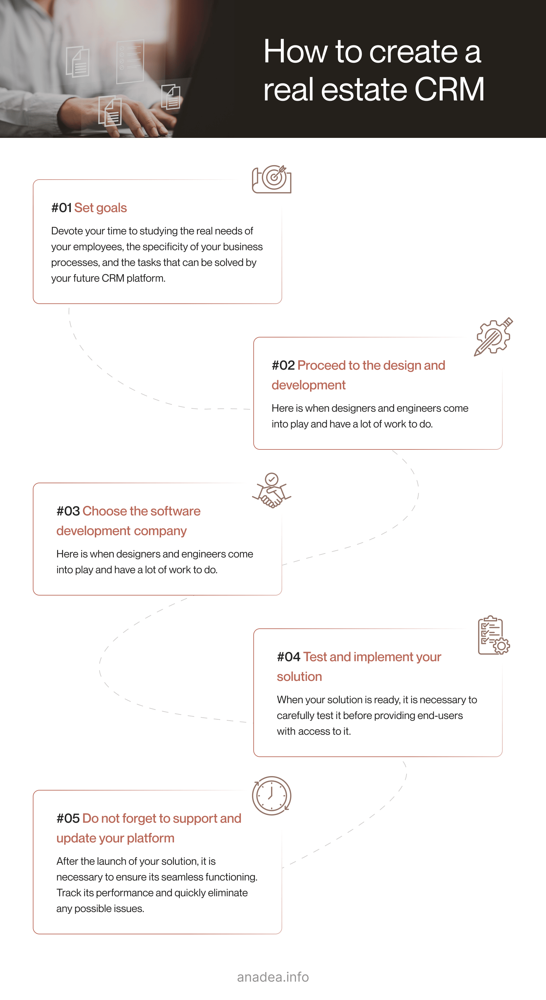
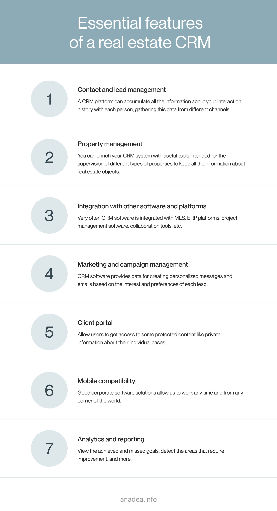

With the overall digitalization that we can observe in the business world today, it is quite difficult to imagine the work of huge volumes of customer data without a reliable software system. That's exactly what a CRM (customer relationship management) solution can be used for.

The use of CRM has become a standard for all types of companies working in absolutely different industries. And though there are multiple ready-made solutions, a lot of businesses prefer to develop their own software that will be fully tailored to their needs and will allow them to solve even the most specific tasks. In this article, we'd like to speak about custom real estate CRM software development and highlight the points that you should bear in your mind if you want to launch a solution for this market.

## What is a CRM system?

Before diving deeper into the topic of creating residential or commercial real estate CRM software, we offer you to take a look at the basic information about this type of solution and the benefits that it can bring.

In general, customer relationship management is the term used to describe practices and principles that a company applies for building interaction with their customers. CRM platforms are intended for facilitating all the related tasks, including but not limited to sales management, contact management, and lead nurturing.

It is possible thanks to accumulating all the required data for managing relationships with customers throughout all the stages of the customer lifecycle.

CRM systems are not something extraordinarily new. Though the term itself appeared not so long ago, the first principles of these practices [started](https://www.salesforce.com/ap/hub/crm/the-complete-crm-history/) their development with the first trading activities. However, CRM systems as we know them today took their roots in the 1980s when the concept of database marketing was introduced. By the mid-1990s, the market already had a rather wide choice of various tools and solutions that today could be called CRM systems.

Step-by-step this market has been growing as well as the range of offers. Mobile CRM apps and cloud systems have come to replace old-school desktop systems. But the evolution of this type of software is still going on.

According to [Statista](https://www.statista.com/outlook/tmo/software/enterprise-software/customer-relationship-management-software/worldwide), in 2023, the revenue in the CRM software market is expected to hit the mark of $79.4 billion while in 2028, the market volume may already reach $131.9 billion.

## CRM for real estate business

CRM systems are used in all industries and real estate is not an exception. CRM platform in the real estate industry helps to organize efficient and comfortable storage of information about customers and leads (actually, exactly as in any other sphere). This data typically includes personal details of potential and existing customers, results of each interaction (for example, no response is also a result of an interaction that can be used for understanding customers' needs), and purchase history. This information can be transformed into valuable insights that will help real estate agents ensure the best possible outcomes of their communication with customers and leads.

**Why do companies use residential or commercial real estate CRM software?**

1. **A good CRM solution provides valuable insight into the source of each lead.** In other words, agents can certainly understand where leads come from, for example, from a website, online ads, or social media platforms. Thanks to such information, specialists will have the possibility to better build their multichannel strategy.

2. **With CRM software, it is possible to set the right priority for each lead.** All leads are not just the same. And a company needs to qualify them before allocating resources for nurturing them. Let's put it simply. Not all people who have expressed their interest in some real estate offers are fully ready to buy some properties in the nearest future. That's why it is highly recommended to track the interaction with each lead to select high-grade leads and focus on them.

3. **Thanks to using CRM tools, the quality of lead nurturing is growing.** With visualized sales pipelines that help users to track each customer journey, it is easier to make the approach to each potential buyer much more personalized. As a result, the chances to move each customer further down the sales funnel will be higher.

4. **You get excellent tools for better centralizing and organizing customer data.** Today to stay ahead of the competition, real estate agents need to use different approaches and channels for building communication with their existing and potential clients. Very often this interaction involves multiple platforms and means of communication. They may use phone calls, social media apps, emails, messengers, personal meetings, and even traditional paper letters. Without any doubt, it is impossible to track all the information manually. But a CRM system can solve this issue.

5. **Sales and marketing processes can be efficiently automated.** Process automation is a must for many spheres. Let's admit that a very small percentage of people are ready to buy or sell real estate immediately. According to the study conducted by [Zillow](https://www.zillow.com/agent-resources/agent-toolkit/real-estate-follow-up-email-templates/#:~:text=For%20example%2C%20according%20to%20Zillow,time%20to%20decide%20to%20sell.), people spend nearly 4.5 months before buying a house or flat and sellers think for around half a year about listing their home. Good real estate agents know that it is far not the best idea to try to push a person to make a decision immediately. It's better to build this interaction on a series of follow-ups. Though it is impossible to implement this strategy without a good software tool, a CRM system can be exactly what is required in this case. A platform can automatically send emails with some information and reminders to a person. A real estate agent will just need to choose an appropriate scenario by indicating the periodicity of these follow-ups and their content.

Request a CRM development quote

The real estate market is highly competitive. And to win your market share and leave your rivals behind you, you need to make sure that you will get a higher number of successfully completed deals than anybody else. And reliable and feature-rich CRM software may be exactly what you need.

Without any doubt, the services of a real estate CRM software development company as well as the use of a ready-made solution require some expenses from the side of businesses. But given the benefits that this solution brings and the results of its implementation (the increased number of customers and successful deals, the growing profits, etc.), this investment will definitely pay off already in the nearest future. Moreover, by automating numerous marketing and sales-related tasks, companies can optimize their staff as well as labor costs, avoid some part of mistakes caused by a human factor and maximize the efficiency of interaction with each customer.

## Custom real estate CRM software development: Do you need it?

When it comes to residential or commercial real estate CRM software, there are always two separate camps. Some companies insist on the feasibility of ready-made solutions that are available in the market today. Others believe that only thanks to the work with a real estate CRM software development company, it is possible to ensure the highest efficiency of the implementation of such a solution.

**The supporters of off-the-shelf CRM systems name the following benefits:**

1. You do not need to waste your time and spend resources on looking for developers, discussing software requirements, creating software, and its testing.
2. You can choose one of the most popular solutions that are already widely used by many companies which means that its efficiency and the correctness of functioning are proven.
3. You can start using such a platform comparatively quickly after making a decision on the necessity to do it.
4. You have access to the tech support team,

**Of course, these arguments may sound weighty, but there is a row of disadvantages as well.**

1. You can't choose the required functionality which means that you may pay for the tools that you will never use but at the same time, you won't be able to add new features.
2. If a vendor decides to stop the support and development of this solution, your opportunities will be significantly restricted.
3. Customization and integration options are limited.
4. If you carefully calculate the expenses required for using an off-the-shelf CRM and the development cost, you may see that quite often custom development is a better option.
5. There can be serious limitations to the number of users who can get access to the system.
6. Scalability opportunities are restricted as well.

To overcome all these issues, a lot of companies prefer to build their own software that will be built in accordance with their ongoing needs and will ensure enough space for further flexibility and scalability.

### What are the advantages of custom real estate CRM software development?

1. You can build any advanced and absolutely unique features that will help you to deal with your specific business tasks.
2. Your custom solution can be available to an unlimited number of users.
3. You can ensure enough space and resources for the scalability of your CRM platform.
4. Development costs vary depending on numerous factors. It means that you have the possibility to control and manage your budget.
5. You can find a professional software development company with rich expertise that will be able to offer the best solution in your case.
6. It is possible to add practically any desired integrations and support for third-party components. You can also seamlessly integrate such a solution with other systems that you use in your work.
7. As a rule, a good company that will help you to create your CRM system will also provide you with support and maintenance services, if it is required, Moreover, if you have plans for [real estate website development](https://anadea.info/blog/how-to-create-a-real-estate-web-platform), your IT partner will be also able to do it. For example, at Anadea we offer a wide range of software-related services and if you turn to us with such requests, we will be always at your disposal.

The main conclusion that is necessary to make now is that thanks to building your own real estate developer CRM or a platform for a company that only sells properties you have much more freedom and flexibility. Though one of the arguments that are provided in support of ready-made solutions is related to high development costs, it is not fully true. With the right approach to development, smart planning, and efficient budget allocation, it is possible to optimize expenses and avoid huge costs.



## How to build a real estate CRM: Steps to follow

If you consider the possibility to hire a development team to build a custom solution, the following information will be extremely useful for you and will help you to understand the right sequence of actions.

### Step 1. Set your goals

Any project starts with an idea. That's why after detecting the need to build a CRM solution, we recommend you devote your time to studying the real needs of your employees, the specificity of your business processes, and the tasks that can be solved by your future CRM platform. You need to think about the desired features and tools. For getting some inspiration and a better understanding of what can be built, you can analyze the existing CRM systems (and here off-the-shelf solutions can be of great help).

### Step 2. Choose the right real estate CRM software development company

When you have some general requirements for your future solution, you can start looking for a reliable development team. Today the number of companies that provide software development services is really high. But unfortunately, not of them can demonstrate the same quality of solutions. Given this fact, you should be very careful while choosing the team that you are going to work with.

It is highly recommended to pay attention to such factors and parameters as the expertise of the team, its portfolio, and the available business models that can be offered to you by the team. It is always good when the team has experience in building solutions for your business domain. At Anadea, our portfolio already includes a row of solutions developed for the real estate industry and you can get familiarized with it by [following the link](https://anadea.info/solutions/real-estate-software).

We also recommend you read the reviews written by the company's clients in order to find out whether there are any issues that you can face while cooperating with the team.

### Step 3. Proceed to the design and development

This step is the core one. Here is when designers and engineers come into play and have a lot of work to do. There are different methodologies used in software development, they may presuppose a different level of client involvement in the process of project realization.

A lot of software development companies today, and Anadea as well, follow the principles of the Agile methodology which includes close collaboration between the team and stakeholders. According to the principles of this methodology, the whole process of development is broken down into sprints that are time-boxed periods. Each sprint is aimed at the development of a particular part of solutions, its testing, and gathering feedback from a client. If any improvements are required, they can be easily introduced. With this iteration-based approach, it is very simple to make any changes and update requirements even after the start of the development process.

### Step 4. Test and implement your solution

When your solution is ready, it is necessary to carefully test it before providing end-users with access to it. As a rule, companies combine manual and automated test types. Moreover, some tests are conducted alongside development and ensure the possibility to timely fix all issues. But at the end of the development, it is necessary to perform regression testing which will allow the team to check whether all the features and tools function as they are supposed to after all the improvements and debugging procedures.

Then it is necessary to prepare the environment and implement the newly built platform. As for the software adoption at your company, you can choose one of the popular strategies: Big Bang, parallel, or phased adoption. They all differ based on the time that is devoted to implementing a new solution at a workplace: from an instant switch to a gradual transition that can last for weeks or even years.

### Step 5. Do not forget to support and update your platform

After the launch of your solution, it is necessary to ensure its seamless functioning. For doing that, you need to track its performance and quickly eliminate any possible issues that may deteriorate the productivity of your system. Moreover, you should have specialists who will be ready to react to any unpredictable problems to avoid technical glitches and downtimes.

Another point that you should bear in mind is the necessity to regularly update your solution and enrich it with new features if it is required amid constantly changing business conditions.

Actually, the process of building a CRM solution doesn't seriously differ from the creation of other applications, however, there are always some peculiarities related to each type of product and its specificity. You can also read about [how to build a real estate app](https://anadea.info/blog/how-to-embrace-the-power-of-mobile-apps-for-your-real-estate-business) in one of our previously published posts.

## Key features of custom real estate CRM software

A real estate developer CRM or a CRM platform for a real estate agency is always a core software system for such a company. That's why it should fully reflect the company's business activities and processes. Below you can find a list of the most commonly used features in this type of software. But if you see that they will be not enough to address all your business needs, you can always ask your real estate CRM software development company to create for you additional functionality.

### Contact and lead management

A CRM platform can accumulate all the information about your interaction history with each person. It can gather this data from different channels which is a very comfortable option. AI-powered solutions can even provide users with recommendations regarding the most promising techniques and channels for communication with each client. CRM software can also store and track all the information about each lead and advanced features can prioritize leads in accordance with their value for the company.

### Property management

You can enrich your CRM system with useful tools intended for the supervision of different types of properties. Your software can keep all the information about real estate objects and those companies or individuals that rent them. You can also automate a lot of routine tasks like sending out different documents or reminders.

### Integration with other software and platforms

It's highly unlikely that your CRM platform will be the only software used by your real estate company. That's why for more efficient work with it, we recommend you connect it with other systems that you have. Very often CRM software is integrated with MLS (multiple listing service) software, ERP platforms, project management software, collaboration tools, email marketing apps, and social media platforms.

### Client portal

A client portal is a term that is used to describe web apps that are created to allow users to get access to some protected content like private information about their individual cases. As a rule, to open and view this info, a person needs to enter a login and password. Such a portal can be an extension of your CRM platform. It will let you define what content can be shown to whom, including your customers or partners.

### Marketing and campaign management

As CRM systems work with all the information about clients which is essential for building successful marketing campaigns. CRM software provides data for creating personalized messages and emails based on the interest and preferences of each lead.

### Analytics and reporting

Your software can be enriched with functionality for processing the gathered information, transforming it into valuable insights, and preparing reports. Thanks to getting such reports, your company can understand a full picture of the achieved and missed goals, detect the areas that require improvement, and get huge volumes of critical information for making the right business decisions.

### Mobile compatibility

Mobility is one of the principles that our life is based on today. We spend less time at our desks but it doesn't mean that we have started to work less. Good corporate software solutions allow us to work from any corner of the world and we can do it even on the go if these solutions are available from mobile devices. This feature is highly valuable for real estate agents who can't spend 8 hours in their offices as they need to visit properties and show them to their potential clients. That's why when you are thinking about how to build a real estate CRM solution, it will be a good idea to ensure the possibility for your employees to interact with such a system using their mobile devices.

## Our experience in custom real estate CRM software development

At Anadea, we work with clients from absolutely different industries and real estate is one of the spheres where we have the strongest expertise. Among a wide range of solutions such as a [real estate marketplace](https://anadea.info/projects/streeteasy) or a [SaaS app](https://anadea.info/projects/listingdoor) with different tools for selling properties, there are also CRM platforms for real estate companies.

One of our clients was a real estate agency that deals with commercial properties and helps clients in buying, selling, and renting them. The company was actively growing that's why the team needed to implement a tool for centralized data management.

The key peculiarity of that task for us was the necessity to organize an efficient data flow from different channels and easy access to the required information for each client, object, or deal. By the time when the company contacted us, all the data was stored in **Google Spreadsheets** , some **Microsoft Word** and **Excel** documents, as well as in an obsolete CRM platform that already didn't satisfy the needs of the company and couldn't work with the growing volumes of data.

After the analysis of the case, we understood that it was useless to try to update the existing solution as it didn't provide any possibility for scaling it and enriching it with new features due to the incompatibility of the used technologies with modern tools.

We decided to build a solution fully from scratch. We created user-friendly dashboards for getting easy access to all the required data, ensured secure cloud data storage, added a communication page for interacting with customers without the need to turn to other tools, added pipelines, and enriched the app with tools for automating a row of everyday tasks.

After the implementation of this platform, the client started to notice a stable growth in the number of successful deals.

This case brightly demonstrates the necessity to always think about scalability in advance. It's obvious that with the time flow, your company will need to process bigger volumes of data and to efficiently work with them. And if your software is not able to provide you with such a possibility, you will need to return to manual data processing which is definitely the worst way out.

## Challenges associated with custom CRM development

The majority of challenges that developers can face are related directly to the complexity of integrations or features that are expected to be built. From the perspective of customers, such issues can be solved by hiring the right development team. And from the side of a development company, such problems are typically addressed by choosing the right specialists with the required qualifications to deal with particular tasks.

However, there are a couple of challenges that you should be aware of already at the stage of project planning in order to be ready for them.

### Scaling of a custom CRM platform

It is very important to foresee the necessity for scaling. Otherwise, it can happen that the developed platform won't have enough capabilities to process the required volumes of data.

### Implementation of a CRM solution

A development team together with a client needs to think about the best approach to making the platform available to the company's employees. The approach should be chosen depending on such factors as the complexity of the newly built solutions, the number of departments and employees who will get access to the platform, as well the type and complexity of software solutions that are already known to users.

### Security of data

Real estate marketing and sales greatly depend on customer data which can be viewed as one of the most valuable assets for this business. That's why it is vital to find the best way to deal with it. It is necessary to ensure that the custom software architecture is well compatible with the used data format. Moreover, if it is planned to migrate data from local servers to the cloud, developers should check what practices for protecting data are applied by the cloud provider.

## Instead of a final word

Today the use of CRM systems is not just a modern trend among companies that work in the real estate industry. Given the volumes of data and the number of potential customers that companies have to deal with, reliable software solutions have already become a must for building efficient businesses. Manual processing of huge volumes as well as their accumulation has become impossible. That's why to keep their positions in the market, companies have to use such platforms in their work.

Moreover, as each company is unique and may have very specific business processes, custom real estate CRM software development is gaining popularity these days. There are no "one-size-fits-all" solutions and only a custom platform can ensure the required flexibility for businesses. If you are also considering the possibility to launch such a platform for the needs of your business, you can always contact us.

At Anadea, we deeply understand the needs of real estate companies and know how to deal with their set tasks with the help of a reliable software solution. If you want to know more about our offers, do not hesitate to contact us! We are ready to answer all your questions.

Get in touch
