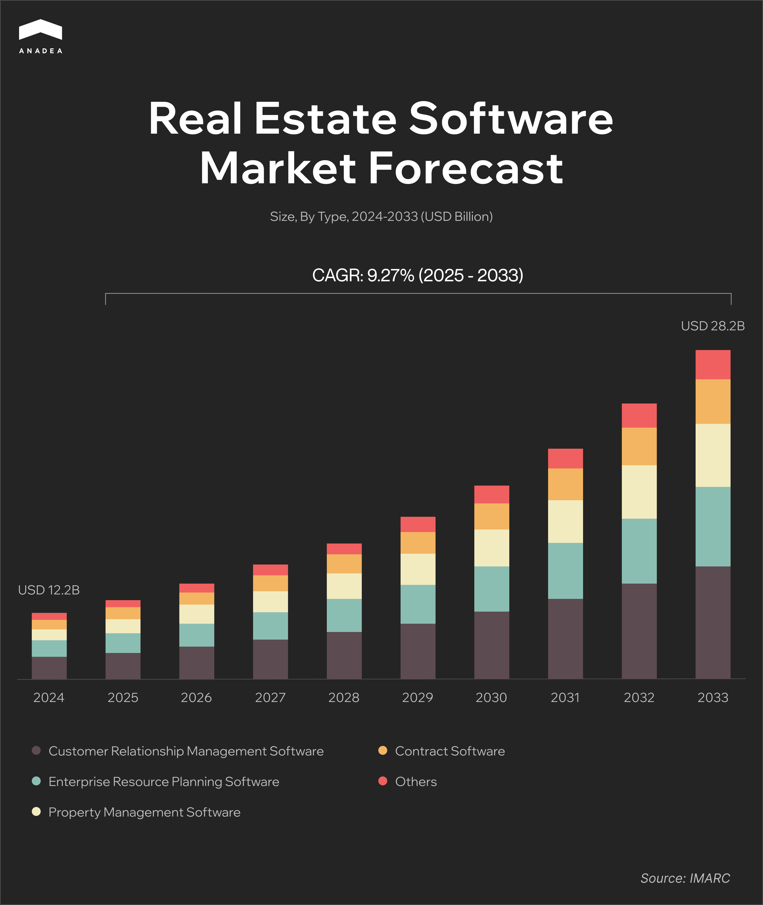
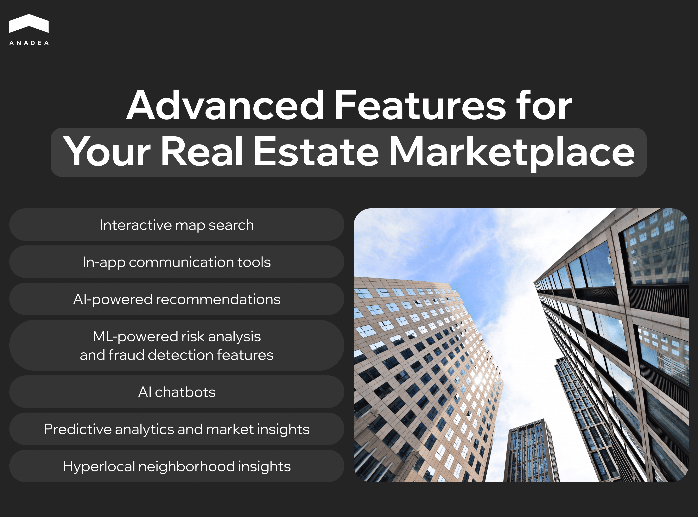

The real estate industry has seen a significant shift toward digitalization in recent years and an online real estate marketplace has become a go-to resource for property buyers, sellers, and renters. The demand for such solutions is growing amid the overall expansion of the[ real estate software](https://anadea.info/solutions/real-estate-software) market, which was valued at $12.2 billion in 2024. By 2033, the market volume is expected to hit the level of $28.2 billion. It means that the CAGR  for the forecast period from 2025 to 2033 will be over 9%.

The progress in the tech industry and general trends for the personalization of services drive the interest of all market participants, including sellers and buyers, in platforms with advanced features like AI recommendations and predictive analytics.

In this article, we are going to share our recommendations on how to build a successful real estate marketplace and highlight features that can provide you with a competitive advantage.

## Core Features of a Marketplace for Real Estate

To stand out from the crowd, your platform should bring unique value to its potential users. Nevertheless, before thinking about advanced features and offers, you need to get a good understanding of the functionality that will be the backbone of your solution. Here are the basic features that your real estate marketplace software should have.

### Property Listings

This feature allows users to add and manage descriptions of their properties, including such details as price, size, location, and amenities. Your platform should make it possible to upload high-quality image and video files. Moreover, map integration will greatly facilitate location viewing for potential buyers or tenants.

### Virtual Tours

To make the user experience more engaging, you can integrate 3D virtual tours for viewing property remotely. This feature can be powered by AR/VR technology.

It would be a good idea to add floor plans so that users could get a better understanding of how different rooms are located without visiting properties physically.

### Advanced Search

When building a marketplace, you always need to think about the convenience of users. That’s why a well-thought-out filter-based search by location, price range, property type, size, and amenities is a must. We also recommend you introduce such possibilities as sorting and saving the results of the search.

### Reviews and Ratings

To increase credibility, people should be provided with the possibility to read reviews written by other users. This is especially important in the case of real estate renting. You can add the possibility to share comments on properties, landlords, and agencies.

### Payments

It’s crucial to think about the security of transactions that can be facilitated through your platform. Depending on the precise purposes and functionality of your real estate marketplace, the introduced payment system can:

* allow users to pay deposits for securing properties;
* send automated reminders and conduct rent collection on a monthly basis;
* process large transactions associated with property purchases (such transactions are usually performed via escrow services);
* collect service fees and commissions from sellers and agents.

To simplify and secure transactions, you can integrate your platform with a reliable payment service like PayPal, Stripe, or Adyen. Moreover, given the growing adoption of cryptocurrency, you can also introduce crypto payments. This will provide users with more flexibility.

## Advanced Features for Your Real Estate Marketplace

If you want to wow the market with a cutting-edge solution, it’s worth considering the introduction of trendy functionality that will provide you with a competitive edge. Here are a couple of ideas for you.

* **Interactive map search**. With this functionality, users can search properties directly on a map instead of scrolling through lists. You can also add heat maps that will demonstrate pricing trends or popularity among buyers or tenants.
* **In-app communication tools**. Online chat and video calls will facilitate communication between users of your marketplace (real estate agents, sellers, and buyers).
* **AI-powered recommendations**. Personalization is one of the major trends in software development. Users are already accustomed to getting offers that are tailored to their needs. And your solution should meet their expectations. AI recommendation engines can provide property suggestions based on user behavior, preferences, and indicated budget.
* **ML-powered risk analysis and fraud detection features**. With ML-powered tools on a marketplace real estate businesses can greatly enhance the security of their platforms. Machine learning is good at detecting trends and identifying anomalies. That’s why this technology can be applied to eliminate fake listings and duplicate properties. Moreover, ML can indicate signs of suspicious activity on the platform, which helps to minimize the risk of fraud.
* **AI chatbots**. It’s quite challenging to create a traditional support team that will instantly process a large number of queries around the clock. As a result, a lot of users can leave the platform without getting a response. AI-powered chatbots can help to address this issue. This functionality can provide 24/7 instant customer support and process the majority of common queries about listings, financing, and legal processes. Apart from this, chatbots can greatly contribute to automated lead qualification.
* **Predictive analytics and market insights**. Such features are designed to forecast real estate market trends. They analyze historical and real-time market data to offer buyers and investors access to actionable insights for data-driven decisions.
* **Hyperlocal neighborhood insights**. These insights provide users with detailed, real-time data about specific locations. This info goes much beyond basic property listings as it helps buyers get a better understanding of the location’s livability, safety, convenience, and lifestyle compatibility.

## Real Estate Marketplace Software Development Process

It doesn’t matter whether you are going to build a marketplace (real estate, retail, etc.) or any other software solution, the first thing that you need to do is always the same. You need to get a clear vision of the process. You should know what steps should be included in the realization of your project and how you need to allocate your resources. 

Here’s what a traditional software development project roadmap looks like.

### Research and Planning

Before you proceed to any active steps, you should clearly define your objectives and formulate a concept for your future product. We recommend you start with an analysis of your competitors, including major platforms like Zillow and smaller ones that can be popular in your local market. You should understand what is done well and what can be improved. Users’ reviews will be of great help.

Based on the results of your research, you can try to define the key features of your future platform and its unique selling proposition. 

Probably you should pay attention not only to traditional platforms but to some innovative concepts as well. For example, an NFT real estate marketplace enables users to buy and sell virtual and physical properties as non-fungible tokens. Such NFTs represent ownership or shares of a specific property or land that can be traded in a decentralized way using blockchain technology.

Don’t forget to think about your monetization strategy. How will you earn money? You can introduce subscription plans and service fees, or place ads among other options.

Already at this stage, you will need to decide who will build this software for you. If you do not have in-house developers, you can establish cooperation with an outsourcing company like Anadea. Together with developers, you will need to select the tech stack and prepare a roadmap with milestones and timelines for your project.

### MVP Development

When everything is ready, it’s time to initiate development. It is sensible not to invest in the creation of a full-scale platform just at once but to build a minimum viable product with only core features first.

The MVP development presupposes the creation of simple interfaces and functionality that will allow users to understand the key idea of your platform. 

Based on their feedback you will be able to understand whether you can enhance something before starting the development of a full version of your real estate marketplace and its advanced functionality.

Before the beta launch, it will be vital to test your product and fix bugs.

### Full-Scale Development and Launch

The key goal of this stage is to enhance your platform’s functionality and expand your market reach.

After adding all the advanced features, your development team should conduct regression testing. This will help to ensure nothing is broken following the introduction of changes in the code.

### Post-Launch Support and Continuous Growth

To achieve long-term success, you need to continuously monitor your platform’s performance and timely address all the detected issues.

Moreover, it is very important to regularly enrich your marketplace with new possibilities and features in accordance with users’ needs. The better you listen to users, the higher the retention rates will be.

Are you thinking about the launch of another solution for the real estate industry, such as a CRM platform, for example? On our blog, you can find [practical tips](https://anadea.info/blog/how-to-build-a-real-estate-crm/) as well!



## Our Experience in Real Estate Marketplace Software Development

Our software development team works with customers from different industries and real estate is one of those that we focus on. Our portfolio includes a range of successfully delivered projects for this market. One of the built platforms is [StreetEasy](https://anadea.info/projects/streeteasy), a New York City real estate marketplace that has both web and mobile versions.

The idea behind the project was to offer users a new way to search properties. With StreetEasy, they can rely not only on familiar criteria like price, number of bedrooms, and amenities but also on the information about neighborhoods. To ensure the accuracy and relevance of this data, the platform was integrated with nyc.gov sources to get the most up-to-date information on different locations in New York.

Thanks to its advanced functionality the platform managed to occupy leading positions in the NYC real estate sector. Today the marketplace is being continuously updated and enhanced, which allows it to stay ahead of competitors.

## Final Word

The [development of successful real estate software](https://anadea.info/blog/how-to-create-a-real-estate-web-platform/) requires a deep understanding of both the core and advanced features that users expect to get, as well as of the key steps of the project realization process. But apart from all this, it’s also crucial to have a professional team by your side. 

At Anadea, we are always open to cooperation. We have robust expertise in both mobile and [web development](https://anadea.info/services/web-development) as well as deep knowledge of the current needs of the real estate market. Whether you are already ready to develop a full-scale platform or want to test your idea with an MVP, we can guide you through every phase of the project. We are here to help your business thrive being driven by the power of cutting-edge technologies.
