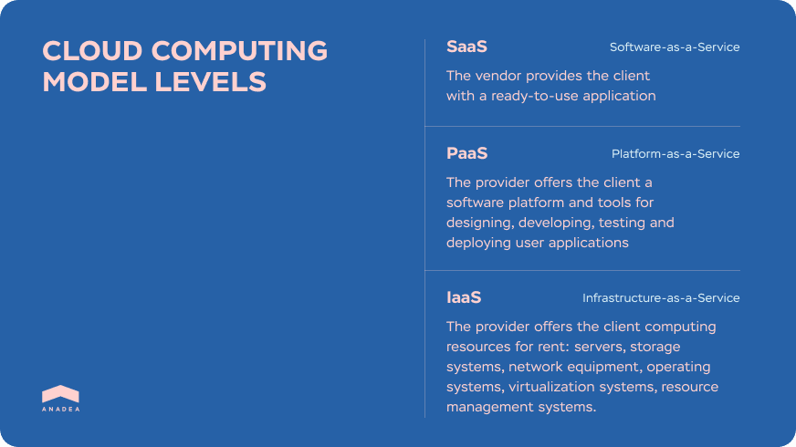
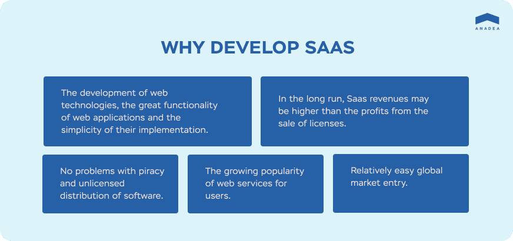

Software as a service (SaaS) has long been around. Both businesses and individuals got used to SaaS and use it daily. That’s what Netflix, Google Apps and Slack have in common: business models of all end with the -aaS suffix.

The convenience, simplicity and cost-effectiveness of cloud-based SaaS technology conquer the hearts of consumers without them diving deep into its complexities and technical nuances. Same with IT entrepreneurs who opt for <a href="https://anadea.info/services/saas-development" target="_blank">SaaS development services</a> due to the predictable revenue and scalability of solutions of this type.

If you are wondering how to build a SaaS product that people will love, you need to better understand the SaaS business model, be able to get a perspective on how to position and sell the product, and, if you are already working in the SaaS business, be able to assess the state of the company and improve the key business metrics.

## SaaS market state
The already huge market of cloud-based SaaS services keeps growing. According to the report by Technavio, the worldwide SaaS market is anticipated to be valued at $60.36 billion by 2023 with a 9% CAGR over the current level. This wasn’t the case years ago when the business models of IT products were focused on eCommerce and entertainment.

With the market shift from the classical software licensing scheme towards SaaS-based technology, we entered a different product era. There is no need to purchase software and a hardware platform for its deployment and then maintain it manually. This, in turn, determines the pricing of SaaS solutions: a monthly subscription fee is charged for using the software, which includes the software license, all maintenance activities, updates and support of the infrastructure on which the application is running.

## Where to start building a SaaS
At the heart of the business is a transaction. You can't get what you want without giving something in return. You want signups every day and there's no way to achieve that except by giving customers something that will fulfill their unmet needs. You want your SaaS product to grow and you have to figure out what SaaS metrics mean for your business. Achieving a breakthrough is real if you subdivide it into components. Your journey starts with following these steps to building a SaaS product.

### Validate the SaaS idea
You definitely don't want to find out after six months of hard work and thousands of dollars invested that no one is excited about your startup. There's a few steps to decide whether building a SaaS product is worth it. One of the important things is to find out what in your SaaS will make a user take off their credit card and fill in the form online to buy your service.

Get started with the problem and what solution are you bringing to the world. Is your solution a must have, or just a nice to have? Our suggestion on how to build a SaaS business is always start by finding pain points of your potential audience, by solving a problem you have, or someone in your industry has. If you really do isolate an acute problem in the market, you can grow extraordinarily fast. That's where we started all our projects whether it is a real estate service that helps to sell homes without a broker like <a href="https://anadea.info/projects/listingdoor" target="_blank">ListingDoor</a> or EHR for nursing facilities like <a href="https://anadea.info/projects/on-trac" target="_blank">OnTrac</a>.

In order to understand the pain points of the audience, you should talk to them, i.e. establish contact with a potential customer, then tell a bit about what you do, tell that you communicate a lot with people like this person, list several options of problems and ask whether they face the same challenges. It works really well. What doesn't work is when you say: "Hi! I have a product. Go and buy it!"

Only when you get the idea of what problem your SaaS can crack, move on to putting together a <a href="https://anadea.info/blog/saas-business-plan-guide" target="_blank">SaaS business plan</a>.

### Choose a SaaS development company
First things first. The case is not about whether you should build it yourself or not; it is about how to find the right developers to build a SaaS for you. It's not like you have a business and you want to build a website or an app in order to grow your business. __Your SaaS is your business.__

Outsource web development to save you time. You will launch faster, you will get feedback faster, you will be able to improve your SaaS faster and start generating revenue faster.

Google shows over 70 000 000 results on the request of "best SaaS development companies." This is exciting. The choice is ocean wide. There are just so many to choose from and so as not to drown in this diversity, let's develop clear criteria. Decide in favor of the SaaS developers if they:

* __Can make the SaaS development process transparent for you.__ They stay in contact with you and can speak in a language that you understand. They send you daily reports and discuss issues and solutions.

* __Understand the SaaS architecture.__ SaaS is a specific IT product. The logic can be the same for all users but the data is different, or the logic can be different for each user.

* __Are experienced in data management systems.__ SaaS separately serves users from different organizations within a single version of the application with a single configuration for all users. It requires a team that knows how to observe the isolation of subscribers from each other.

* __Are skilled at online payment processes and systems.__ Software as a Service involves a number of users, different pricing plans, tracking resources spent on each client. You need a team that has experience in that.

* __Can deliver frequent updates.__ Once you launch your cloud-based application and get the first feedback from users, it's critical to provide changes based on the feedback to the SaaS product without any impact to the continuity of the service. SaaS developers must know how to plan and deliver these frequent updates.



### Know your figures
Once you've found a perfect market fit, and had your MVP developed, SaaS success metrics become important. Don't think that metrics are for huge SaaS only. Start using tools showing data like conversion rate and annual revenue per customer. Let’s speed through the main metrics.

* __Monthly recurring revenue (MRR).__ This is the metric you want to be improving all over. It changes from month to month based on churn, your existing and new customers.
* __Churn.__ It’s lost customers.
* __Average revenue per customer (ARPU).__ How much a customer brings you revenue over his life span using your saas based software solution.
* __Customer acquisition cost.__ This indicates how much you spend on sales and marketing to acquire a new customer.

Firstly, using the combination of the SaaS metrics, you can find out whether the time has come to scale your business in its current state or not. It's when the customer has brought you more money during the time that they are with you than you spent on attracting them.

Secondly, understanding your metrics will help your team to realize the importance of those numbers and start to improve them. Metrics are a powerful way to align your team around a direction you want to head in.

### Don't ignore the business side
Just having a product built won’t make your customers use it. You need to bear in mind the idea of SaaS being a business. Just because your SaaS is technically impeccable, this does not automatically mean the business part will go smoothly. Its smoothness is always due to wise budgeting, marketing, sales and analytics.

What makes a good SaaS product is a logical and predictable business model. You need to know how your SaaS revenue streams work and how these revenues can grow and change over time. You need to learn how to market your SaaS, where the user's journey starts and who is your <a href="https://anadea.info/guides/user-persona-for-startups" target="_blank">ideal customer</a>. All this requires your attention, time for planning and analysis.

### Stay customer-focused
When you work alone, it's easy to focus on your point of view of how the product should be developed, which may be unsuccessful. Instead of evaluating further development from the perspective of customers, ask them directly. Let them send you feedback. Then collect it, sort it and make sense of it.

It doesn't mean that you should have a free beta version of your product to get the first feedback. The best feedback is the one you will get from your paid customers—those who have already spend their money thus have a certain level of expectations from the product. It’s the question whether their expectations will be justified and whether the product will live up to marketing promises.

### Think SaaS pricing strategy ahead
The impact of SaaS pricing is huge. New customers are sensitive about pricing. Make it easy to up and downgrade. There is nothing worse than a customer who doesn’t have the right plan for them because they going to want to prefer another, a more suitable product. It is always great to have a customer who downgrades than a churning customer.

There is also your customer base, your existing customers. You can always launch new products, but there is a way to increase your revenue. Don’t be afraid to change your pricing. When Netflix increased its prices by $1, what did it change for customers? Such not big of a deal didn’t change much for customers but gave Netflix a 3% increase in value.

## Bottom line
SaaS business model gains popularity quickly because of the advantages it offers for both users and developers. We know that there is a lot to think about if you are developing a SaaS product and hope this article has shed some light on the essence of SaaS.

Just a few more things:
Make sure to have the best product for a given need.
Find seasoned SaaS developers.
Use SaaS metrics.
Treat your SaaS as a business.
Make use of customer feedback.
Think pricing ahead.

We would be happy to use our skills and experience to help you advance your business.

Let’s discuss your project{{< /ctabutton >}]
