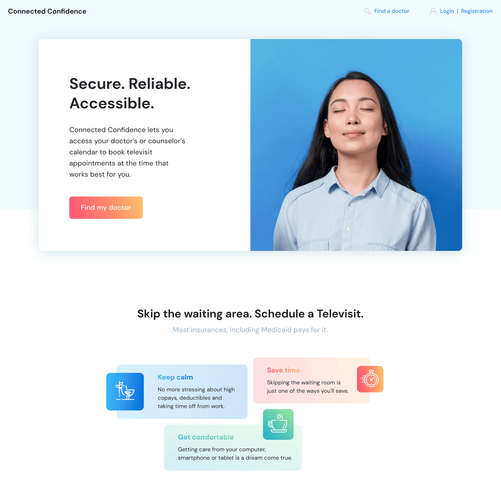
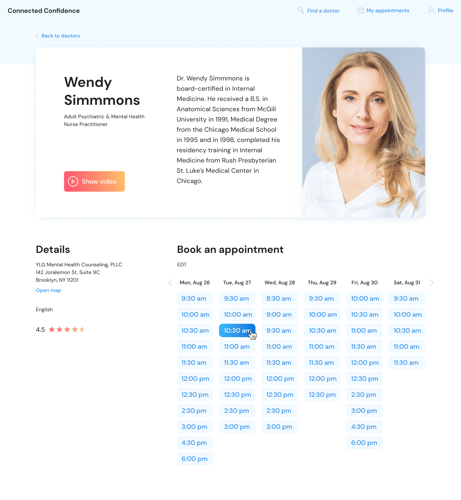

Are you committed to starting a private practice in counseling psychology? Or have you been a private practitioner for a while now? Either way, you can consider building a website to promote your services. As soon as you have developed your psychology private practice business plan and decided to take the plunge, creating a website is a logical next step.

This is not an article about how to start a psychotherapy private practice but about adding value to your business through online presence. Let’s dive in.

## First steps to creating a private practice website
Building a website for your therapy practice, be it private counseling, group therapy, or marriage and family therapy, has many benefits:
* Your practice appears more legitimate which is important when you look for your office and start networking.
* You develop your unique brand and vision thanks to the content you create for your website.
* The process of building a website for your psychological practice helps you clarify other important aspects of your budding business, such as setting up contact information, social media presence, and your rates.

The first thing about building a website is not starting with technical aspects. You need to take care of a few essential things:

* Which pages will make the most significant impact? How do you create content that turns first-time visitors into clients?
* What is your monthly budget for making a website?
* How much work do you want to put into learning and creating a website?
* How elaborate do you want it to be?

When you answer these questions, you will have a clear understanding of what elements to include on your site.

## What makes a good therapist website?
There are no uniform practices for building and structuring the content of private therapists’ sites, but there are certain things your potential clients may want to know.

### Must-have blocks
Psychotherapy is client-centered in essence, so a therapist website has to leave no questions to visitors about who you are, what your approach to counseling is, and how to contact you.

#### Front page
Also known as the Home page, this is where you have a menu linking to a few of the most relevant and helpful pages on your site. You can list your services and problems you can help with, how much you charge, the possibility of online sessions, link to frequently asked questions (FAQ), and share your social media profiles.

#### About page
This is an important page when you build your mental health private practice website. Your potential clients will want to get to know you before deciding if you’re the right person to entrust their insecurities to.

Don’t create an exhaustive biography but do share your passion, experience, and education. It’s also a good idea to discuss a little bit about your approach in therapy.

This is a good place to include your contact information and office hours. This is especially helpful if you have several therapists in your practice with their own office hours.

Summing up, here’s what the About page of a psychologist's website must include:

* __A picture of you__ A therapist’s appearance is important for most people. They feel more comfortable during sessions if they find you appealing and non-judgmental. Look relaxed and friendly in photos.
* __Your brief biography.__ A couple of sentences about your background and who you are is enough.
* __Problems__ you do and do not work with. For example, you can work with low self-esteem and child-parent relationships and can’t help with addiction management.
* __Your licence and certificates.__ Attach photos of documents that proof your education as a mental health provider.
* All methods to __contact__ you: phone number, email, messengers.

#### Contact page
After self-presentation goes the Contact page, which is an absolute requirement for any website of service providers. Even though you’ll include your name, address, and phone number on each page (more on this later), you should also have a dedicated contact page for your visitors. You may want it to include the following:

* A contact form;
* Your email address (for those who don’t want to use the contact form);
* Phone number and your general office hours;
* A map, preferably an embedded Google map, and directions;
* Links to your social media profiles;
* An appointment scheduler. Note that you may need to purchase a subscription separately.

### Nice-to-have blocks
While some businesses close their need for an online presence with a landing page, others may want a whole complex website. If that’s your case, see what other sections a website for a psychotherapist may include.

#### Services page
As you build a website for psychological therapy practice, make sure to cover what services you offer and which rates you charge. But don’t just list your services (you did that on the Front page)—explain to them. Take this opportunity to go into detail about your practice’s philosophy and the methods you use.

Don’t make a secret of your rates. Put them on the website and make it easier for the prospective client. Along with a list of your rates, including the information on the payment methods you accept and whether you accept insurance.

#### Frequently Asked Questions page
When you plan to build a therapy website, then you should put yourself into the prospective client’s shoes. Consider which questions your client may be asking and answer them ahead of time. This will save you and your clients the stress and effort while considering your services. Consider linking to this page from your contact page.

#### Blog
This is a great addition to your website, as it gives your visitors the scope of issues you help them with. Educate your potential clients and speak to them in an approachable way. If you’re linking to third-party resources, make sure to choose authoritative experts.

Very likely that you will need contributors and copywriters to create themed content on a regular basis (as you will be busy working with clients). This will cause additional expenses since content marketing is a time-consuming process. But in the long run, a blog regularly updated with quality entries is a great proof of your competence as a psychologist and can convert visitors into clients.

Of course, don’t forget to double-check the materials after the writers.



## More things to consider
Your website should indicate that you are the right therapist for a specific type of client, but remember that your website isn’t about you. It’s about a visitor. Your prospective client is searching for reassurance that you’ll be the right therapist for their needs. That’s why you should evaluate your site through the eyes of the prospective client and follow these best practices for building a website for psychological therapy practice.

### Don’t underestimate images
Images are a great addition to your psychological therapy practice website. Images help break large paragraphs of text which makes the page more readable. They also help add context to your content. Your photos may provoke the feelings of happiness or thoughtfulness. Remember, a picture is worth a thousand words.

### Ensure mobile responsiveness
Build your website for psychological therapy practice in a mobile-first, responsive way. 50% of any website visitors come from mobile devices. This will ensure that your site looks good on mobile devices, including smartphones or tablets. The font should be large enough so that your visitor won’t need to zoom your page or rotate the gadget in order to read the text.

### Optimize your website
It’s worth remembering that mobile responsive sites better rank on Google. Search engine optimization (SEO) is a digital marketing technique aimed at improving your website’s ranking. When you look for help to build a website for psychological therapy practice, keep search optimization as your priority. People looking for mental health therapists in your area should find your listing easily. Google depresses non-mobile responsive sites in search results, so that’s what you want to avoid.

## Tech secrets
Best therapy websites have an outstanding design, a responsive front-end and a solid back-end.

At first glance, it seems that you can do it all yourself—build your future website using a template. But in that case, you won’t be able to use extra features.

You also may want to outsource your UX/UI to one specialist, and front-end or back-end to another, but practice shows that a lot of impediments occur in this case because of poor communication and asynchronous actions.

The best solution is to outsource the project as a whole to dedicated <a href="https://anadea.info/solutions/medical-app-development" target="_blank">healthcare software developers</a>. They will be able to adjust to your budget, suggest variants of design, test the system, and deliver a solution that fits your business perfectly.

## Advanced features for a therapy website
Now that we have determined the business goals and defined necessary website sections, talked about website development process in general, let’s concentrate on the features that may give you an advantage over competitors if you add them to your website. For a psychologist conducting their practice individually, these may be redundant. However, clinics and group therapists can make a great use out of them.

### Patient’s account
Your patients can create their own accounts where they can track appointments, view appointment history, and review the payments made. Research shows that people appreciate being able to manage their accounts while staying informed and engaged.

### Questionnaires
A questionnaire builder provides an effective and fast way of psychological testing. Build tests with ease by creating helpful and informative forms and questionnaires. Patients are undoubtedly interested in their own health care and appreciate the integration of new technologies into their treatment process.

### Stats and patient’s progress (in the personal account)
It’s officially legal: all patients have the right to access their health records and obtain a copy of those records. Stay compliant with the legislation and make your patient’s life easier by providing a straightforward view of their treatment progress.

### Appointment scheduling
Your site visitors can make an appointment and see your availability. If more than one practitioner operates in your practice, you can make your appointment scheduling system even more helpful and convenient for your patients.

### Telemedicine and telehealth
Telemedicine makes it easier and more convenient for your patients to become engaged in their own mental health care. Patients love the convenience, flexibility, and real-time connection with you as a therapist, especially since now online visits have become a new standard. A video call functionality can be integrated into your website for this purpose. Learn more in our article on <a href="https://anadea.info/blog/telehealth-solutions-paving-new-ways-for-medical-communication" target="_blank">telehealth app development</a>.

### Medical billing and payments
You can make one more step ahead of the competition and process payments for the consultations right on the website. The online payment procedure is fast, smooth, and compliant with security standards. It’s definitely a competitive advantage!

## Final thoughts
Do you feel overwhelmed by tech-related components of psychological therapy practice website building? If you do, then it might be better to outsource website design to a team of professionals. We are developers that specialize in building websites for private psychologists. Feel free to contact us and get your project estimate.

Get in touch
